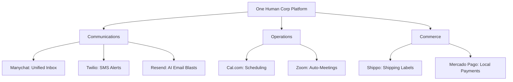

# OHC Core Tool Integrations Research Report Q2

## Executive Summary
This report evaluates third-party tool integrations for the OHC ecosystem, aiming to solve real-world problems for small business owners in both Cloud and Standalone environments. The focus is strictly on the business owner's perspective: eliminating technical friction, unifying the workflow, and applying the "Radical Simplicity" rule.

### Persona Pain Points Summary
| Persona | Business Type | Primary Pain Point | Proposed Tool Integration |
|---------|---------------|--------------------|---------------------------|
| Maya | Home Baker | Overwhelmed by orders via IG/WhatsApp. | Manychat (Social Media) |
| Leo | Music Tutor | Back-and-forth scheduling; forgetting to send Zoom links. | Cal.com (Calendar) & Zoom (Video) |
| Priya | Boutique Owner | Time-consuming shipping labels; complex email newsletters. | Shippo (Shipping) & Resend (Email) |
| Fatima | Food Cart Operator | Needs reliable immediate alerts without checking a screen. | Twilio (SMS) |
| Carlos | Handyman | Losing customers in LATAM who cannot use Stripe. | Mercado Pago (Payment) |

### Actionable Recommendations
- **OHC should integrate Manychat because** evidence shows Maya and similar merchants lose sales when manually managing cross-platform DMs; Manychat's API supports automated unified inboxing perfectly.
- **OHC should prioritize Cal.com over Calendly because** Cal.com offers self-hosted open-source options, strictly aligning with OHC's Standalone mode architecture and data privacy promises.
- **OHC should integrate Resend because** its developer-first API is uniquely suited to AI-generated headless email delivery, saving Priya from the complexity of drag-and-drop builders like Mailchimp.
- **OHC should implement Mercado Pago because** small business owners in Latin America have a high friction rate with Stripe, and Mercado Pago is the standard regional solution.
- **OHC should leverage Twilio for SMS because** users like Fatima operate in noisy environments away from screens, making SMS the only reliable real-time notification mechanism.

### Strategic Landscape

---

## Issue Briefs

### 1. Social Media Integration
**Title:** Integrate Manychat for Unified Social Media Inbox
**Problem Statement:** Small business owners like Maya (The Home Baker) receive orders and inquiries across Instagram DMs, Facebook Messenger, and WhatsApp. Managing these manually is overwhelming and leads to missed sales. They need a single, unified inbox where an AI agent can read and reply to messages from all platforms automatically.
**Research Report:**
- **Tool Evaluated:** Manychat
- **Target Persona:** Maya (Home Baker)
- **Advantages:** Excellent Instagram and WhatsApp API integrations. Robust webhook support for routing messages to OHC's backend.
- **Risks:** Pricing scales with contacts, which may be expensive for high-volume, low-margin businesses. Requires Meta business verification for some features.
- **Pricing:** Free tier available (up to 1,000 contacts). Pro tier starts at $15/mo.
- **Compatibility:** Cloud (via webhooks/OAuth). Standalone (requires local reverse proxy for webhooks).
**Design Doc:**
- User goes to the Operations dashboard and clicks "Connect Instagram".
- User authenticates with Facebook/Instagram via OAuth.
- OHC registers webhooks to receive new DMs.
- When a DM arrives, the Customer Success agent reads it, generates a reply (e.g., "Yes, we do vegan cakes!"), and sends it back via Manychat's API.
- The user sees a unified "Customer Inbox" on their phone showing the conversation history.
**Implementation Prompt:** Implement an OAuth flow to connect a user's Instagram/Facebook account via Manychat. Create a webhook endpoint that receives incoming messages, stores them in the unified inbox, and triggers the Customer Success agent to draft a reply.
**Priority:** P0
**Estimated Scope:** Large

### 2. Calendar & Scheduling
**Title:** Integrate Cal.com for Zero-Config Booking & Calendar Sync
**Problem Statement:** Leo the Music Tutor and Carlos the Handyman lose customers due to back-and-forth scheduling via text. They need a public booking link that syncs with their personal Google Calendar seamlessly.
**Research Report:**
- **Tool Evaluated:** Cal.com
- **Target Persona:** Leo (Music Tutor), Carlos (Handyman)
- **Advantages:** Open-source infrastructure handles timezone math and calendar conflict resolution. Highly embeddable and supports a self-hosted option.
- **Risks:** The initial OAuth setup with Google/Outlook can sometimes confuse extremely non-technical users.
- **Pricing:** Free tier available for individuals.
- **Compatibility:** Perfectly compatible with both Cloud (SaaS) and Standalone OHC modes due to open-source nature.
**Design Doc:**
- "The Manager" AI sets up the booking link dynamically based on the user's defined business hours.
- Users connect their Google/Outlook calendar via a one-click OAuth button in the Operations tab.
- When a customer booked a slot on the OHC public page, Cal.com manages the calendar event and conflict resolution transparently.
**Implementation Prompt:** Embed Cal.com's infrastructure so users can sync their personal calendars and provide a public booking widget on their storefront that prevents double-booking.
**Priority:** P0
**Estimated Scope:** Medium

### 3. Email Marketing
**Title:** Integrate Resend for AI-Powered Email Marketing
**Problem Statement:** Business owners like Priya want to notify their existing customers about new stock or holiday sales. Traditional tools like Mailchimp are too complex and require manual template design, list management, and campaign scheduling.
**Research Report:**
- **Tool Evaluated:** Resend
- **Target Persona:** Priya (Boutique Owner)
- **Advantages:** Developer-friendly, reliable email API. Instead of giving users a complex drag-and-drop builder, OHC can use the AI agent to generate beautiful HTML emails based on a simple text prompt from the user.
- **Risks:** Bounces and spam compliance must be strictly managed to maintain OHC's domain reputation.
- **Pricing:** Charges around $20/mo for up to 50k emails; economical to bundle.
- **Compatibility:** Cloud uses OHC's centralized Resend account. Standalone requires the user to input their own SMTP credentials or API key.
**Design Doc:**
- "Marketing" tab -> "Send a Broadcast".
- User provides a 1-sentence prompt.
- The AI Agent generates a responsive HTML email preview.
- User clicks "Send to all customers".
- The system chunks the customer list and sends via the Resend API.
**Implementation Prompt:** Create a feature where the user can prompt the AI to draft an email blast. Use the business's product catalog to enrich the email. Provide a preview UI. Once approved, queue the emails to be sent out via the Resend API to all opted-in customers.
**Priority:** P2
**Estimated Scope:** Medium

### 4. Payment Processing
**Title:** Native Integration of Local Payment Methods (Mercado Pago)
**Problem Statement:** Small business owners in Latin America cannot easily use Stripe and need a trusted local payment processor to accept credit cards and local methods like Pix or Pago Fácil natively within the OHC platform.
**Research Report:**
- **Tool Evaluated:** Mercado Pago
- **Target Persona:** Carlos (Handyman), Global users outside the US/EU
- **Advantages:** Native integration ensures a seamless onboarding experience without requiring the merchant to navigate complex third-party tools.
- **Risks:** Settlement times can be longer; API is slightly less standardized globally.
- **Pricing:** Standard transaction fees apply.
- **Compatibility:** Cloud (OAuth routing). Standalone (API key).
**Design Doc:**
- User selects their country during onboarding. If LATAM, Mercado Pago is offered alongside Stripe.
- User connects their Mercado Pago account.
- Customers see a "Pay with Mercado Pago" button at checkout natively.
- Webhooks update the order status in OHC when payment succeeds.
**Implementation Prompt:** Integrate Mercado Pago as an alternative native payment provider. The checkout flow must dynamically switch to the appropriate provider based on the merchant's settings.
**Priority:** P1
**Estimated Scope:** Large

### 5. Shipping & Logistics
**Title:** Integrate Shippo for Automated Label Generation
**Problem Statement:** Priya (Boutique Owner) spends hours copying and pasting addresses into carrier websites to print shipping labels. She needs to click one button natively in OHC to buy and print a label without relying on complex external logistics aggregators.
**Research Report:**
- **Tool Evaluated:** Shippo
- **Target Persona:** Priya (Boutique Owner)
- **Advantages:** Aggregates rates from USPS, UPS, FedEx, DHL. Simple API. No monthly fee for pay-as-you-go.
- **Risks:** International shipping requires complex customs declarations which might be hard to automate fully for non-technical users.
- **Pricing:** Free tier (pay per label + postage).
- **Compatibility:** Cloud (OAuth). Standalone (API Key).
**Design Doc:**
- When an order is placed, OHC sends the dimensions/weight to Shippo to get live rates natively during checkout.
- The Operations agent shows the cheapest shipping option.
- The user clicks a native 'Buy Label' button, and OHC purchases the label via Shippo and saves the tracking number.
- OHC automatically emails the customer the tracking number.
**Implementation Prompt:** Implement a native shipping and fulfillment module powered by Shippo. The checkout flow must query real-time shipping rates. The merchant dashboard must allow users to purchase and print shipping labels directly, and automatically attach the tracking number to the order.
**Priority:** P1
**Estimated Scope:** Large

### 6. SMS & Notifications
**Title:** Native SMS Order Notifications (Twilio)
**Problem Statement:** Fatima (Food Cart Operator) relies on her phone for everything and might miss app push notifications in a noisy environment. She needs reliable native SMS alerts when a new pre-order arrives so she can start cooking.
**Research Report:**
- **Tool Evaluated:** Twilio
- **Target Persona:** Fatima (Food Cart Operator)
- **Advantages:** Direct integration provides seamless, invisible SMS alerts.
- **Risks:** A2P 10DLC compliance in the US is complex and requires business registration.
- **Pricing:** Pay-per-message. OHC will need to manage quotas or require merchants to buy credits.
- **Compatibility:** Cloud (Centralized OHC Twilio account). Standalone (User provides API key).
**Design Doc:**
- User goes to Settings and toggles "Send me SMS for new orders".
- When an order is paid, OHC dispatches async jobs to send SMS messages via Twilio API.
- The Operations Agent decides the optimal time to send the reminder.
**Implementation Prompt:** Integrate Twilio SMS to allow the platform to send order confirmations, pickup notifications, and appointment reminders via text message. Include a settings panel for merchants to toggle these notifications. Ensure correct E.164 formatting.
**Priority:** P2
**Estimated Scope:** Medium

### 7. Video Conferencing
**Title:** Native Zoom Link Generation for Appointments
**Problem Statement:** Leo (Music Tutor) manually creates a Zoom link for every new lesson and emails it to the student. This is prone to error and looks unprofessional. He needs links to be generated automatically when a lesson is booked.
**Research Report:**
- **Tool Evaluated:** Zoom
- **Target Persona:** Leo (Music Tutor)
- **Advantages:** Standard OAuth connection process; highly recognizable and intuitive for end users.
- **Risks:** Zoom OAuth requires annual app review and compliance checks.
- **Pricing:** API is free for Zoom users, requires merchant account.
- **Compatibility:** Cloud (OAuth). Standalone (Server-to-Server OAuth).
**Design Doc:**
- In the service creation flow, the user selects "Online Meeting" and clicks "Connect Zoom".
- Upon successful booking, OHC calls the Zoom API to create a meeting, retrieves the join URL, and embeds it in the calendar invite and confirmation email.
**Implementation Prompt:** Build a Zoom integration that automatically creates meeting links for online service bookings. Users can connect their Zoom account. When a customer books a service marked as "Online Meeting", the system dynamically generates a Zoom link.
**Priority:** P2
**Estimated Scope:** Medium
