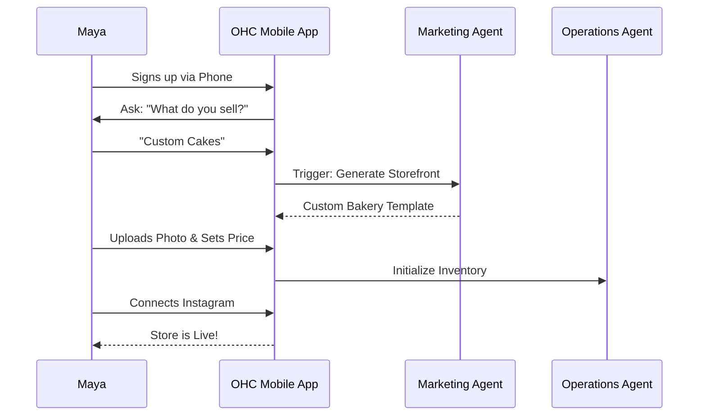
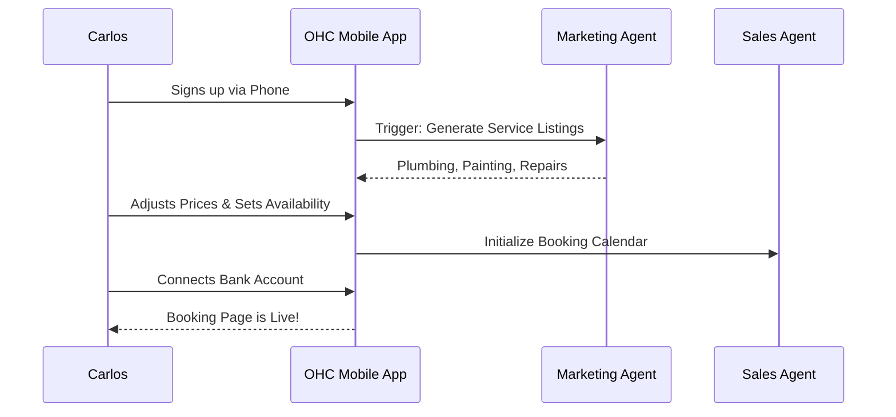
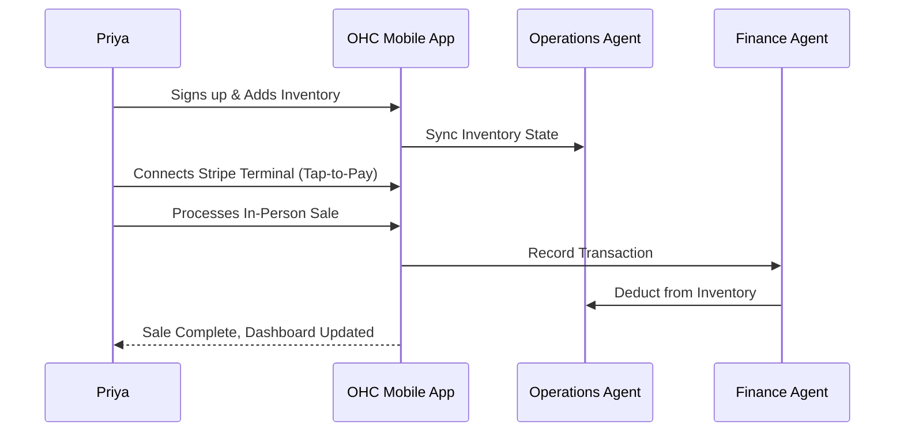
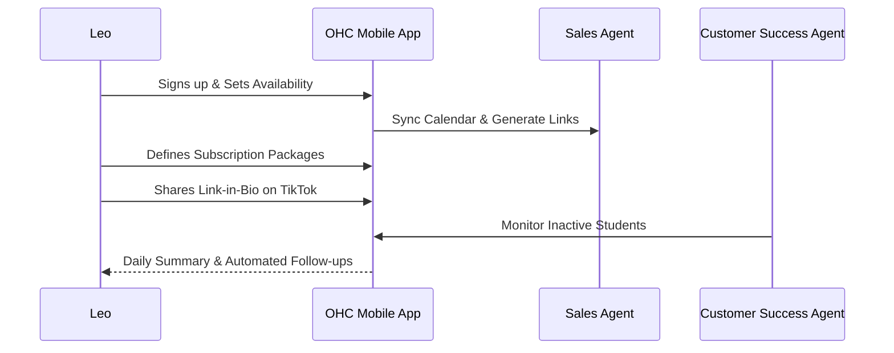
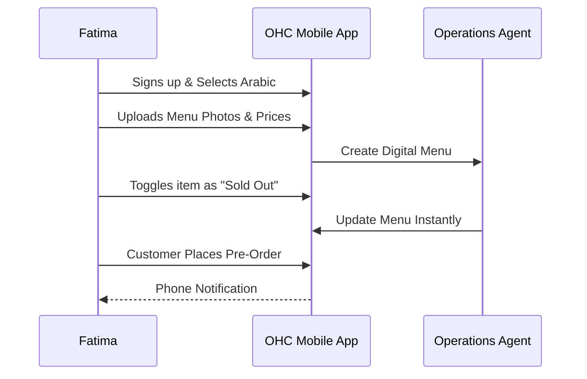

# Issue Brief: Business Journey Architecture

## Problem Statement
Small business owners—from bakers to handymen—often abandon onboarding flows on traditional platforms (like Shopify or Wix) due to overwhelming technical jargon, complex setup wizards, and too many choices. For OneHumanCorp (OHC) to fulfill its promise of taking a non-technical user from "idea to live business in under 10 minutes," the end-to-end user journey must be radically simplified, entirely mobile-first, and heavily assisted by AI agents operating invisibly in the background.

## Research Report
Based on an analysis of competitor platforms (Shopify, Wix, Squarespace, GoDaddy):
- **Shopify & Wix** have onboarding flows taking 30-60 minutes, asking users for technical details (DNS, shipping zones, tax rules).
- **Squarespace** focuses heavily on template selection, causing choice paralysis.
- **GoDaddy** is faster but limits functionality, lacking integrated booking or AI background operations.
- **Opportunity:** OHC eliminates technical setup by leveraging AI to generate the initial site, catalog, and settings from simple, plain-language inputs (e.g., "I sell custom cakes"). The mobile-first design ensures accessibility for users who run their businesses entirely from their phones. Friction points like domain setup or payment gateway integration are handled automatically or deferred until post-activation.

## Design Doc

### High-Level Architecture
- **Mobile-First Experience:** The entire journey is designed for a 375px viewport. All forms use native mobile keyboards and large touch targets (≥ 44x44px).
- **Progressive Profiling:** Only ask for essential information during initial onboarding. Defer complex setup (custom domains, complex taxes) until the user is invested.
- **AI-Driven Setup:** Use the "Marketing & Advertising" agent to generate the initial website and "Operations" agent to set up default booking or inventory rules based on the business type.

### Key Personas & Journeys

#### 1. Maya — The Home Baker (Physical Products)
- **Acquisition:** Clicks an Instagram ad showcasing a baker managing orders on their phone.
- **Onboarding:** Answers 3 simple questions (Name, Business Type, Location). AI generates a cake catalog template.
- **Activation:** Uploads a photo of a cake, sets a price, and publishes the store.
- **Retention:** Receives daily notifications of new Instagram DM inquiries handled by the "Customer Success" agent.
- **Revenue:** Upgrades to the Starter tier when her order volume exceeds 10 per month.
- **Referral:** Shares her beautiful OHC storefront link in her Instagram bio.

#### 2. Carlos — The Freelance Handyman (Services & Bookings)
- **Acquisition:** Word-of-mouth referral from another tradesperson.
- **Onboarding:** Selects "Services". AI pre-fills a list of common handyman services.
- **Activation:** Sets his availability and connects his bank account.
- **Retention:** Receives daily booking summaries.
- **Revenue:** Subscribes to the Pro tier for custom domain and unlimited bookings.
- **Referral:** Sends automated review requests to satisfied customers, linking back to his OHC profile.

#### 3. Priya — The Boutique Owner (Physical Products + In-Person)
- **Acquisition:** Searches Google for "mobile POS and inventory sync".
- **Onboarding:** Connects existing product spreadsheet or types in key items.
- **Activation:** Completes her first in-person sale using Tap-to-Pay on her phone.
- **Retention:** Checks daily analytics dashboard for trending items.
- **Revenue:** Upgrades to Pro for unlimited variants and detailed analytics.
- **Referral:** Recommends OHC to other local business owners.

#### 4. Leo — The Music Tutor (Subscriptions)
- **Acquisition:** TikTok link-in-bio template ad.
- **Onboarding:** Sets up monthly lesson packages and connects Google Calendar.
- **Activation:** First student books a recurring lesson and pays the deposit.
- **Retention:** AI agent follows up with students who miss lessons.
- **Revenue:** Upgrades to Business tier for unlimited automated follow-ups.
- **Referral:** Adds his OHC booking link to his TikTok profile.

#### 5. Fatima — The Food Cart Operator (Food & Beverage)
- **Acquisition:** Community flyer translated into Arabic.
- **Onboarding:** Selects language (Arabic). Takes photos of her menu items.
- **Activation:** Toggles "Sold Out" on an item; sees immediate UI update.
- **Retention:** Prints daily order list from her phone.
- **Revenue:** Uses the Free tier but pays standard transaction fees.
- **Referral:** Tells other cart owners at the commissary kitchen.

### Friction Points & Solutions
1. **Writing Content:** Users struggle to describe their business.
   *Solution:* The "Marketing Agent" drafts initial copy based on minimal input (e.g., "Handyman in Chicago").
2. **Payment Setup:** Connecting bank accounts can be intimidating.
   *Solution:* Defer payment setup until the user receives their first order or inquiry. Provide a plain-language explanation of why it's needed.
3. **Domain Configuration:** DNS settings are too technical.
   *Solution:* Provide an OHC subdomain by default. For custom domains, handle the DNS provisioning invisibly on upgraded tiers.
4. **Platform Overload:** Too many features upfront.
   *Solution:* Gradually introduce AI departments. Start with Operations and Marketing; introduce Customer Success and Advisory later.

## Implementation Prompt
Implement the progressively profiled onboarding flow in the mobile application (Flutter). Ensure the UI is strictly mobile-first (optimized for 375px width), utilizing native keyboards and large touch targets. Integrate the Marketing and Operations AI agents to automatically generate the initial storefront and business settings based on the user's selected business type. Defer complex setup (like payment gateways and custom domains) until post-activation to minimize initial friction.

## Priority
P0

## Estimated Scope
Large
