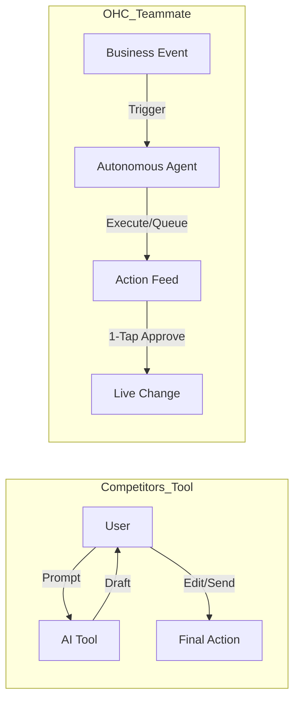
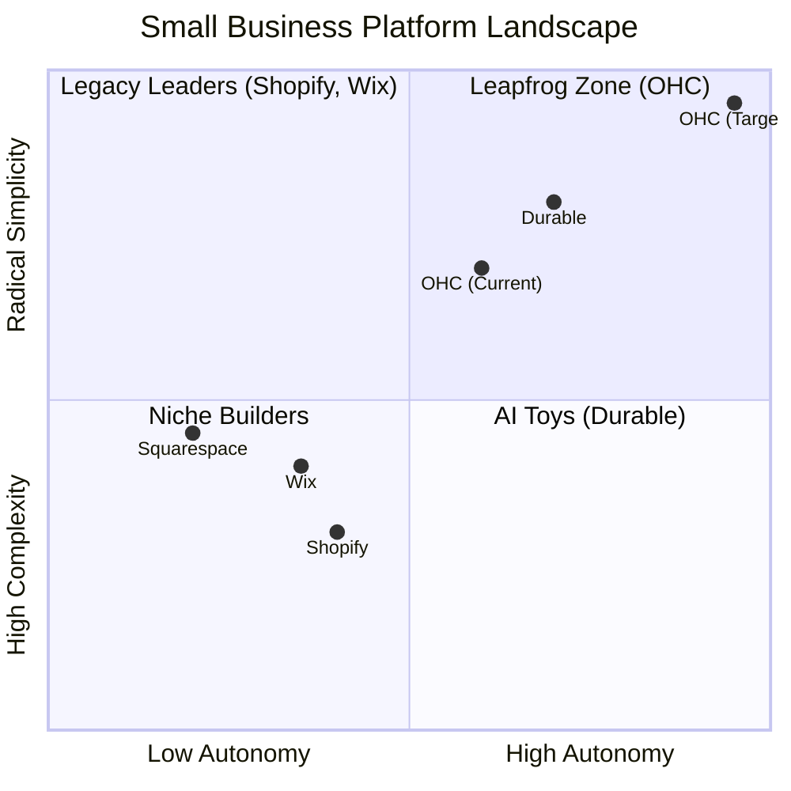

# OneHumanCorp (OHC) Product Research Report

## Executive Summary
This report synthesizes extensive market research across the small business platform landscape, focusing on non-technical users. Our findings contrast OHC's proactive AI architecture against legacy reactive tools (Shopify, Wix) and simple generators (Durable). The report includes the OHC AI Differentiation Manifesto, the Top 10 SMB Pain Points, the Market Feature Gap Matrix, and links to actionable issue briefs for our swarm.

---

## OHC AI Differentiation Manifesto: From Tools to Teammates

### Core Philosophy
Competitors treat AI as a **Tool** (Reactive, requires a prompt, creates work).
OHC treats AI as a **Teammate** (Proactive, event-driven, reduces work).

### The 5 Pillar Automations
1. **The Silent Ambassador (Customer Success):** Watches the event mesh, drafts replies to DMs based on business memory, and queues for 1-tap approval.
2. **The Vigilant Manager (Operations):** Proactively scans sales velocity and flags low stock risks with pre-filled restock tasks.
3. **The Generative Promoter (Marketing):** Automatically creates a 7-day social media calendar when new products are added.
4. **The AI Discovery Agent (GEO):** Optimizes structured data for LLM crawlers (ChatGPT, Gemini) to drive AI search traffic.
5. **The Business Advisor (Advisory):** Provides a plain-language daily briefing instead of complex analytic charts.

---

## Top 10 SMB Pain Points (2024-2025 Audit)

Based on a synthesis of Reddit, Trustpilot, and App Store reviews for Shopify, Wix, and Squarespace.

| Rank | Pain Point | Description | OHC Mapping |
| :--- | :--- | :--- | :--- |
| 1 | **Setup Complexity** | Users feel overwhelmed by DNS, liquid templates, etc. | **SetupWizard (Conversational)** |
| 2 | **Operational Fatigue** | The "never-ending inbox" and repetitive tasks. | **Proactive Agents** |
| 3 | **Marketing Dread** | Creating content is the #1 reason stores go "dark". | **The Promoter** |
| 4 | **Invisible Discovery** | SEO is seen as a "black art." | **AI Discovery Agent (GEO)** |
| 5 | **Technical Jargon** | Alienation due to dev-speak (SKU, API, Webhook). | **Radical Simplicity** |
| 6 | **Cost Creep** | "Subscription hell" from app stores. | **Built-in Swarm** |
| 7 | **Mobile Gaps** | Dashboards that require a laptop for basic edits. | **375px Native UX** |
| 8 | **Communication Lag** | Losing sales because DMs aren't answered quickly. | **Background Draft & Approve** |
| 9 | **Financial Fog** | Inability to see real profit vs. revenue easily. | **The Accountant** |
| 10 | **Support Deserts** | Waiting 24h for a generic bot response. | **Interactive Help** |

---

## Persona Mappings

Our research directly supports our core personas:
*   **Maya (The Home Baker):** Benefits immensely from *The Ambassador* auto-replying to Instagram DMs and *The Vigilant Manager* tracking her ingredient supplies.
*   **Carlos (The Freelance Handyman):** The new Native Service Booking issue brief directly addresses his need for a simple quoting and booking flow.
*   **Priya (The Boutique Owner):** Needs the *Proactive Low Stock Alerts* to handle inventory sync issues and operational fatigue.
*   **Leo (The Music Tutor):** Requires automated Zoom links and simple calendar synchronization to avoid booking chaos.
*   **Fatima (The Food Cart Operator):** Benefits from the plain-language SMS notifications and a mobile-first UI on lower-end devices.

---

## Market Feature Gap Matrix (2024-2025)

| Feature | **Shopify** | **Wix** | **Durable** | **OHC (Target)** |
| :--- | :--- | :--- | :--- | :--- |
| **Agent Autonomy** | Reactive (Sidekick) | None | Limited | **Autonomous Depts** |
| **Onboarding** | 30m+ (High friction) | 20m+ (Moderate) | < 1m (Instant) | **< 1m (Instant Build)** |
| **UX Target** | Desktop-First | Hybrid | Mobile-First | **Mobile-Only Optimized** |
| **Design** | Template-Heavy | AI-Assisted | Generative | **Vibe-Based (Instant)** |
| **Discovery** | Legacy SEO | Standard SEO | AI Visibility | **Proactive GEO Agent** |
| **Operations** | App-Store Dependent | Built-in | CRM-centric | **Event-Mesh Integrated** |

### Strategic Action Items
1. **Match Durable's Speed:** We must implement the "Instant Build" storefront generation (< 60 seconds) to win the initial adoption wedge.
2. **Win on Operations:** Wix and Shopify are design/commerce heavy. We will differentiate by automating *operations* (bookings, low stock, customer service drafts).

---

## Next Steps: Actionable Issue Briefs
Based on this research, the following issue briefs have been drafted and added to the engineering queue:
1.  **[Native Service Booking System](docs/research/[booking]_native_service_booking.md)** (Addresses Operational Fatigue & Carlos's Pain Points)
2.  **[Proactive Low Stock Alerts](docs/research/[inventory]_proactive_low_stock_alerts.md)** (Addresses Operational Fatigue & Priya's Pain Points)
