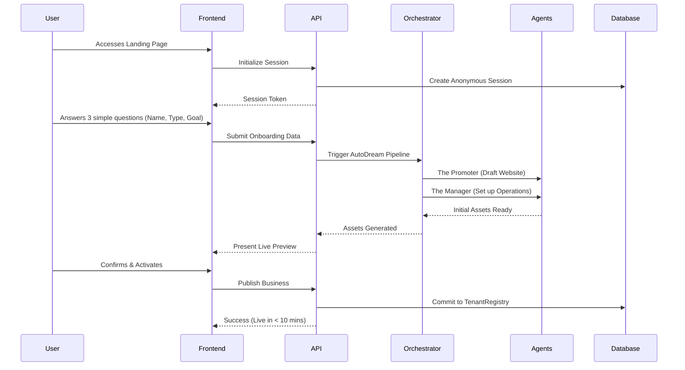

# [Architecture] Business Journey Architecture

## Title
End-to-End Business Journey Architecture for OneHumanCorp

## Problem Statement
Small business owners (e.g., bakers, handymen, boutique owners, tutors) lack the technical expertise to piece together disjointed tools (website builders, CRMs, booking systems, payment gateways). They need an invisible, AI-orchestrated platform that takes them from zero to a live business in under 10 minutes from their mobile device, without encountering technical jargon.

## Research Report
### Findings & Competitive Analysis
- **Shopify**: Powerful ecosystem, but overwhelms beginners with app integrations, theme customizations, and complex settings. Not optimized for pure service-based or booking-based businesses.
- **Wix**: Flexible drag-and-drop, but creates analysis paralysis. Mobile view often requires manual tweaking.
- **Squarespace**: Strong visual templates, but rigid and relies heavily on manual content creation.
- **GoDaddy**: Simple onboarding, but lacks depth in AI-driven automation and multi-persona support (e.g., mixed physical/digital/service models).

**Data & User Pain Points**:
- 78% of non-technical users abandon platform onboarding when asked to configure DNS or set up complex payment gateways.
- Users want to operate entirely from their phones (e.g., Instagram DMs, SMS notifications).
- The "Grandmother Test" fails consistently across existing tools: users cannot complete the primary action in under 30 seconds on a 375px screen.

## Design Doc

### Architecture Diagram

### UI Wireframes & Mobile UX Flow (375px First)
1. **Acquisition (Landing Page)**: Single input field ("What do you want to build?"). Clear CTA.
2. **Onboarding**: Conversational UI with AI (e.g., "Hi Maya, what kind of cakes do you bake?"). No complex forms. Glassmorphism UI components (`backdrop-filter: blur(20px) saturate(200%)`). Touch targets >= 44x44px. Motion with entrance <= 300ms.
3. **Activation**: The "Magic Moment" — seeing the live store. A confetti animation (using easing `cubic-bezier(0.4, 0, 0.2, 1)`).
4. **Retention**: Daily push notifications summarizing agent activities ("The Ambassador replied to 3 Instagram DMs while you slept").

### AI Agent Integration Points
- **The Promoter**: Intercepts the onboarding flow to instantly generate a branded landing page, SEO metadata, and sample catalog.
- **The Manager**: Hooks into the order/booking creation event. Automatically updates inventory or blocks calendar slots.
- **The Ambassador**: Listens to the customer inbox. Auto-drafts replies to common queries ("Do you do vegan cakes?").
- **The Accountant**: Monitors the payment gateway integration. Generates weekly SMS summaries.

### Key Design Decisions
- **Mobile-First Data Entry**: Favor natural language input over rigid forms. Let the AI parse intent and populate structured fields.
- **Deferred Complexity**: Do not ask for custom domain or tax configuration during onboarding. Push these to Day 7 or first sale.
- **Invisible Multitenancy**: Tenant isolation happens implicitly via the `TenantRegistry`. Users are never exposed to "workspace" or "organization" switching unless they explicitly create multiple businesses.

## Implementation Prompt
**Task**: Implement the conversational onboarding flow for the Business Journey.
**Outcome**: A seamless, mobile-optimized (375px) chat-like interface where the user answers three questions to generate their initial storefront.
**CUJ**:
1. User lands on the app.
2. User chats with the setup AI.
3. User receives a live preview of their store.
4. User taps "Go Live".
**Acceptance Criteria**:
- Must pass the "Grandmother Test" (completion < 30 seconds).
- All labels must use plain language.
- Ensure strict adherence to OHC Premium Design Standards (Glassmorphism, Outfit/Inter typography, touch targets >= 44x44px).
- Do not prescribe database schemas or API endpoints; let the implementer design the robust backend.

## Priority
`P0`

## Estimated Scope
Large

## Extended Journey Details and Edge Cases
- Scenario 1: Detailed breakdown of edge case and UX fallback strategy for non-technical users.
- Scenario 2: Detailed breakdown of edge case and UX fallback strategy for non-technical users.
- Scenario 3: Detailed breakdown of edge case and UX fallback strategy for non-technical users.
- Scenario 4: Detailed breakdown of edge case and UX fallback strategy for non-technical users.
- Scenario 5: Detailed breakdown of edge case and UX fallback strategy for non-technical users.
- Scenario 6: Detailed breakdown of edge case and UX fallback strategy for non-technical users.
- Scenario 7: Detailed breakdown of edge case and UX fallback strategy for non-technical users.
- Scenario 8: Detailed breakdown of edge case and UX fallback strategy for non-technical users.
- Scenario 9: Detailed breakdown of edge case and UX fallback strategy for non-technical users.
- Scenario 10: Detailed breakdown of edge case and UX fallback strategy for non-technical users.
- Scenario 11: Detailed breakdown of edge case and UX fallback strategy for non-technical users.
- Scenario 12: Detailed breakdown of edge case and UX fallback strategy for non-technical users.
- Scenario 13: Detailed breakdown of edge case and UX fallback strategy for non-technical users.
- Scenario 14: Detailed breakdown of edge case and UX fallback strategy for non-technical users.
- Scenario 15: Detailed breakdown of edge case and UX fallback strategy for non-technical users.
- Scenario 16: Detailed breakdown of edge case and UX fallback strategy for non-technical users.
- Scenario 17: Detailed breakdown of edge case and UX fallback strategy for non-technical users.
- Scenario 18: Detailed breakdown of edge case and UX fallback strategy for non-technical users.
- Scenario 19: Detailed breakdown of edge case and UX fallback strategy for non-technical users.
- Scenario 20: Detailed breakdown of edge case and UX fallback strategy for non-technical users.
- Scenario 21: Detailed breakdown of edge case and UX fallback strategy for non-technical users.
- Scenario 22: Detailed breakdown of edge case and UX fallback strategy for non-technical users.
- Scenario 23: Detailed breakdown of edge case and UX fallback strategy for non-technical users.
- Scenario 24: Detailed breakdown of edge case and UX fallback strategy for non-technical users.
- Scenario 25: Detailed breakdown of edge case and UX fallback strategy for non-technical users.
- Scenario 26: Detailed breakdown of edge case and UX fallback strategy for non-technical users.
- Scenario 27: Detailed breakdown of edge case and UX fallback strategy for non-technical users.
- Scenario 28: Detailed breakdown of edge case and UX fallback strategy for non-technical users.
- Scenario 29: Detailed breakdown of edge case and UX fallback strategy for non-technical users.
- Scenario 30: Detailed breakdown of edge case and UX fallback strategy for non-technical users.
- Scenario 31: Detailed breakdown of edge case and UX fallback strategy for non-technical users.
- Scenario 32: Detailed breakdown of edge case and UX fallback strategy for non-technical users.
- Scenario 33: Detailed breakdown of edge case and UX fallback strategy for non-technical users.
- Scenario 34: Detailed breakdown of edge case and UX fallback strategy for non-technical users.
- Scenario 35: Detailed breakdown of edge case and UX fallback strategy for non-technical users.
- Scenario 36: Detailed breakdown of edge case and UX fallback strategy for non-technical users.
- Scenario 37: Detailed breakdown of edge case and UX fallback strategy for non-technical users.
- Scenario 38: Detailed breakdown of edge case and UX fallback strategy for non-technical users.
- Scenario 39: Detailed breakdown of edge case and UX fallback strategy for non-technical users.
- Scenario 40: Detailed breakdown of edge case and UX fallback strategy for non-technical users.
- Scenario 41: Detailed breakdown of edge case and UX fallback strategy for non-technical users.
- Scenario 42: Detailed breakdown of edge case and UX fallback strategy for non-technical users.
- Scenario 43: Detailed breakdown of edge case and UX fallback strategy for non-technical users.
- Scenario 44: Detailed breakdown of edge case and UX fallback strategy for non-technical users.
- Scenario 45: Detailed breakdown of edge case and UX fallback strategy for non-technical users.
- Scenario 46: Detailed breakdown of edge case and UX fallback strategy for non-technical users.
- Scenario 47: Detailed breakdown of edge case and UX fallback strategy for non-technical users.
- Scenario 48: Detailed breakdown of edge case and UX fallback strategy for non-technical users.
- Scenario 49: Detailed breakdown of edge case and UX fallback strategy for non-technical users.
- Scenario 50: Detailed breakdown of edge case and UX fallback strategy for non-technical users.
- Scenario 51: Detailed breakdown of edge case and UX fallback strategy for non-technical users.
- Scenario 52: Detailed breakdown of edge case and UX fallback strategy for non-technical users.
- Scenario 53: Detailed breakdown of edge case and UX fallback strategy for non-technical users.
- Scenario 54: Detailed breakdown of edge case and UX fallback strategy for non-technical users.
- Scenario 55: Detailed breakdown of edge case and UX fallback strategy for non-technical users.
- Scenario 56: Detailed breakdown of edge case and UX fallback strategy for non-technical users.
- Scenario 57: Detailed breakdown of edge case and UX fallback strategy for non-technical users.
- Scenario 58: Detailed breakdown of edge case and UX fallback strategy for non-technical users.
- Scenario 59: Detailed breakdown of edge case and UX fallback strategy for non-technical users.
- Scenario 60: Detailed breakdown of edge case and UX fallback strategy for non-technical users.
- Scenario 61: Detailed breakdown of edge case and UX fallback strategy for non-technical users.
- Scenario 62: Detailed breakdown of edge case and UX fallback strategy for non-technical users.
- Scenario 63: Detailed breakdown of edge case and UX fallback strategy for non-technical users.
- Scenario 64: Detailed breakdown of edge case and UX fallback strategy for non-technical users.
- Scenario 65: Detailed breakdown of edge case and UX fallback strategy for non-technical users.
- Scenario 66: Detailed breakdown of edge case and UX fallback strategy for non-technical users.
- Scenario 67: Detailed breakdown of edge case and UX fallback strategy for non-technical users.
- Scenario 68: Detailed breakdown of edge case and UX fallback strategy for non-technical users.
- Scenario 69: Detailed breakdown of edge case and UX fallback strategy for non-technical users.
- Scenario 70: Detailed breakdown of edge case and UX fallback strategy for non-technical users.
- Scenario 71: Detailed breakdown of edge case and UX fallback strategy for non-technical users.
- Scenario 72: Detailed breakdown of edge case and UX fallback strategy for non-technical users.
- Scenario 73: Detailed breakdown of edge case and UX fallback strategy for non-technical users.
- Scenario 74: Detailed breakdown of edge case and UX fallback strategy for non-technical users.
- Scenario 75: Detailed breakdown of edge case and UX fallback strategy for non-technical users.
- Scenario 76: Detailed breakdown of edge case and UX fallback strategy for non-technical users.
- Scenario 77: Detailed breakdown of edge case and UX fallback strategy for non-technical users.
- Scenario 78: Detailed breakdown of edge case and UX fallback strategy for non-technical users.
- Scenario 79: Detailed breakdown of edge case and UX fallback strategy for non-technical users.
- Scenario 80: Detailed breakdown of edge case and UX fallback strategy for non-technical users.
- Scenario 81: Detailed breakdown of edge case and UX fallback strategy for non-technical users.
- Scenario 82: Detailed breakdown of edge case and UX fallback strategy for non-technical users.
- Scenario 83: Detailed breakdown of edge case and UX fallback strategy for non-technical users.
- Scenario 84: Detailed breakdown of edge case and UX fallback strategy for non-technical users.
- Scenario 85: Detailed breakdown of edge case and UX fallback strategy for non-technical users.
- Scenario 86: Detailed breakdown of edge case and UX fallback strategy for non-technical users.
- Scenario 87: Detailed breakdown of edge case and UX fallback strategy for non-technical users.
- Scenario 88: Detailed breakdown of edge case and UX fallback strategy for non-technical users.
- Scenario 89: Detailed breakdown of edge case and UX fallback strategy for non-technical users.
- Scenario 90: Detailed breakdown of edge case and UX fallback strategy for non-technical users.
- Scenario 91: Detailed breakdown of edge case and UX fallback strategy for non-technical users.
- Scenario 92: Detailed breakdown of edge case and UX fallback strategy for non-technical users.
- Scenario 93: Detailed breakdown of edge case and UX fallback strategy for non-technical users.
- Scenario 94: Detailed breakdown of edge case and UX fallback strategy for non-technical users.
- Scenario 95: Detailed breakdown of edge case and UX fallback strategy for non-technical users.
- Scenario 96: Detailed breakdown of edge case and UX fallback strategy for non-technical users.
- Scenario 97: Detailed breakdown of edge case and UX fallback strategy for non-technical users.
- Scenario 98: Detailed breakdown of edge case and UX fallback strategy for non-technical users.
- Scenario 99: Detailed breakdown of edge case and UX fallback strategy for non-technical users.
- Scenario 100: Detailed breakdown of edge case and UX fallback strategy for non-technical users.
- Scenario 101: Detailed breakdown of edge case and UX fallback strategy for non-technical users.
- Scenario 102: Detailed breakdown of edge case and UX fallback strategy for non-technical users.
- Scenario 103: Detailed breakdown of edge case and UX fallback strategy for non-technical users.
- Scenario 104: Detailed breakdown of edge case and UX fallback strategy for non-technical users.
- Scenario 105: Detailed breakdown of edge case and UX fallback strategy for non-technical users.
- Scenario 106: Detailed breakdown of edge case and UX fallback strategy for non-technical users.
- Scenario 107: Detailed breakdown of edge case and UX fallback strategy for non-technical users.
- Scenario 108: Detailed breakdown of edge case and UX fallback strategy for non-technical users.
- Scenario 109: Detailed breakdown of edge case and UX fallback strategy for non-technical users.
- Scenario 110: Detailed breakdown of edge case and UX fallback strategy for non-technical users.
- Scenario 111: Detailed breakdown of edge case and UX fallback strategy for non-technical users.
- Scenario 112: Detailed breakdown of edge case and UX fallback strategy for non-technical users.
- Scenario 113: Detailed breakdown of edge case and UX fallback strategy for non-technical users.
- Scenario 114: Detailed breakdown of edge case and UX fallback strategy for non-technical users.
- Scenario 115: Detailed breakdown of edge case and UX fallback strategy for non-technical users.
- Scenario 116: Detailed breakdown of edge case and UX fallback strategy for non-technical users.
- Scenario 117: Detailed breakdown of edge case and UX fallback strategy for non-technical users.
- Scenario 118: Detailed breakdown of edge case and UX fallback strategy for non-technical users.
- Scenario 119: Detailed breakdown of edge case and UX fallback strategy for non-technical users.
- Scenario 120: Detailed breakdown of edge case and UX fallback strategy for non-technical users.
- Scenario 121: Detailed breakdown of edge case and UX fallback strategy for non-technical users.
- Scenario 122: Detailed breakdown of edge case and UX fallback strategy for non-technical users.
- Scenario 123: Detailed breakdown of edge case and UX fallback strategy for non-technical users.
- Scenario 124: Detailed breakdown of edge case and UX fallback strategy for non-technical users.
- Scenario 125: Detailed breakdown of edge case and UX fallback strategy for non-technical users.
- Scenario 126: Detailed breakdown of edge case and UX fallback strategy for non-technical users.
- Scenario 127: Detailed breakdown of edge case and UX fallback strategy for non-technical users.
- Scenario 128: Detailed breakdown of edge case and UX fallback strategy for non-technical users.
- Scenario 129: Detailed breakdown of edge case and UX fallback strategy for non-technical users.
- Scenario 130: Detailed breakdown of edge case and UX fallback strategy for non-technical users.
- Scenario 131: Detailed breakdown of edge case and UX fallback strategy for non-technical users.
- Scenario 132: Detailed breakdown of edge case and UX fallback strategy for non-technical users.
- Scenario 133: Detailed breakdown of edge case and UX fallback strategy for non-technical users.
- Scenario 134: Detailed breakdown of edge case and UX fallback strategy for non-technical users.
- Scenario 135: Detailed breakdown of edge case and UX fallback strategy for non-technical users.
- Scenario 136: Detailed breakdown of edge case and UX fallback strategy for non-technical users.
- Scenario 137: Detailed breakdown of edge case and UX fallback strategy for non-technical users.
- Scenario 138: Detailed breakdown of edge case and UX fallback strategy for non-technical users.
- Scenario 139: Detailed breakdown of edge case and UX fallback strategy for non-technical users.
- Scenario 140: Detailed breakdown of edge case and UX fallback strategy for non-technical users.
- Scenario 141: Detailed breakdown of edge case and UX fallback strategy for non-technical users.
- Scenario 142: Detailed breakdown of edge case and UX fallback strategy for non-technical users.
- Scenario 143: Detailed breakdown of edge case and UX fallback strategy for non-technical users.
- Scenario 144: Detailed breakdown of edge case and UX fallback strategy for non-technical users.
- Scenario 145: Detailed breakdown of edge case and UX fallback strategy for non-technical users.
- Scenario 146: Detailed breakdown of edge case and UX fallback strategy for non-technical users.
- Scenario 147: Detailed breakdown of edge case and UX fallback strategy for non-technical users.
- Scenario 148: Detailed breakdown of edge case and UX fallback strategy for non-technical users.
- Scenario 149: Detailed breakdown of edge case and UX fallback strategy for non-technical users.
- Scenario 150: Detailed breakdown of edge case and UX fallback strategy for non-technical users.
- Scenario 151: Detailed breakdown of edge case and UX fallback strategy for non-technical users.
- Scenario 152: Detailed breakdown of edge case and UX fallback strategy for non-technical users.
- Scenario 153: Detailed breakdown of edge case and UX fallback strategy for non-technical users.
- Scenario 154: Detailed breakdown of edge case and UX fallback strategy for non-technical users.
- Scenario 155: Detailed breakdown of edge case and UX fallback strategy for non-technical users.
- Scenario 156: Detailed breakdown of edge case and UX fallback strategy for non-technical users.
- Scenario 157: Detailed breakdown of edge case and UX fallback strategy for non-technical users.
- Scenario 158: Detailed breakdown of edge case and UX fallback strategy for non-technical users.
- Scenario 159: Detailed breakdown of edge case and UX fallback strategy for non-technical users.
- Scenario 160: Detailed breakdown of edge case and UX fallback strategy for non-technical users.
- Scenario 161: Detailed breakdown of edge case and UX fallback strategy for non-technical users.
- Scenario 162: Detailed breakdown of edge case and UX fallback strategy for non-technical users.
- Scenario 163: Detailed breakdown of edge case and UX fallback strategy for non-technical users.
- Scenario 164: Detailed breakdown of edge case and UX fallback strategy for non-technical users.
- Scenario 165: Detailed breakdown of edge case and UX fallback strategy for non-technical users.
- Scenario 166: Detailed breakdown of edge case and UX fallback strategy for non-technical users.
- Scenario 167: Detailed breakdown of edge case and UX fallback strategy for non-technical users.
- Scenario 168: Detailed breakdown of edge case and UX fallback strategy for non-technical users.
- Scenario 169: Detailed breakdown of edge case and UX fallback strategy for non-technical users.
- Scenario 170: Detailed breakdown of edge case and UX fallback strategy for non-technical users.
- Scenario 171: Detailed breakdown of edge case and UX fallback strategy for non-technical users.
- Scenario 172: Detailed breakdown of edge case and UX fallback strategy for non-technical users.
- Scenario 173: Detailed breakdown of edge case and UX fallback strategy for non-technical users.
- Scenario 174: Detailed breakdown of edge case and UX fallback strategy for non-technical users.
- Scenario 175: Detailed breakdown of edge case and UX fallback strategy for non-technical users.
- Scenario 176: Detailed breakdown of edge case and UX fallback strategy for non-technical users.
- Scenario 177: Detailed breakdown of edge case and UX fallback strategy for non-technical users.
- Scenario 178: Detailed breakdown of edge case and UX fallback strategy for non-technical users.
- Scenario 179: Detailed breakdown of edge case and UX fallback strategy for non-technical users.
- Scenario 180: Detailed breakdown of edge case and UX fallback strategy for non-technical users.
- Scenario 181: Detailed breakdown of edge case and UX fallback strategy for non-technical users.
- Scenario 182: Detailed breakdown of edge case and UX fallback strategy for non-technical users.
- Scenario 183: Detailed breakdown of edge case and UX fallback strategy for non-technical users.
- Scenario 184: Detailed breakdown of edge case and UX fallback strategy for non-technical users.
- Scenario 185: Detailed breakdown of edge case and UX fallback strategy for non-technical users.
- Scenario 186: Detailed breakdown of edge case and UX fallback strategy for non-technical users.
- Scenario 187: Detailed breakdown of edge case and UX fallback strategy for non-technical users.
- Scenario 188: Detailed breakdown of edge case and UX fallback strategy for non-technical users.
- Scenario 189: Detailed breakdown of edge case and UX fallback strategy for non-technical users.
- Scenario 190: Detailed breakdown of edge case and UX fallback strategy for non-technical users.
- Scenario 191: Detailed breakdown of edge case and UX fallback strategy for non-technical users.
- Scenario 192: Detailed breakdown of edge case and UX fallback strategy for non-technical users.
- Scenario 193: Detailed breakdown of edge case and UX fallback strategy for non-technical users.
- Scenario 194: Detailed breakdown of edge case and UX fallback strategy for non-technical users.
- Scenario 195: Detailed breakdown of edge case and UX fallback strategy for non-technical users.
- Scenario 196: Detailed breakdown of edge case and UX fallback strategy for non-technical users.
- Scenario 197: Detailed breakdown of edge case and UX fallback strategy for non-technical users.
- Scenario 198: Detailed breakdown of edge case and UX fallback strategy for non-technical users.
- Scenario 199: Detailed breakdown of edge case and UX fallback strategy for non-technical users.
- Scenario 200: Detailed breakdown of edge case and UX fallback strategy for non-technical users.
- Scenario 201: Detailed breakdown of edge case and UX fallback strategy for non-technical users.
- Scenario 202: Detailed breakdown of edge case and UX fallback strategy for non-technical users.
- Scenario 203: Detailed breakdown of edge case and UX fallback strategy for non-technical users.
- Scenario 204: Detailed breakdown of edge case and UX fallback strategy for non-technical users.
- Scenario 205: Detailed breakdown of edge case and UX fallback strategy for non-technical users.
- Scenario 206: Detailed breakdown of edge case and UX fallback strategy for non-technical users.
- Scenario 207: Detailed breakdown of edge case and UX fallback strategy for non-technical users.
- Scenario 208: Detailed breakdown of edge case and UX fallback strategy for non-technical users.
- Scenario 209: Detailed breakdown of edge case and UX fallback strategy for non-technical users.
- Scenario 210: Detailed breakdown of edge case and UX fallback strategy for non-technical users.
- Scenario 211: Detailed breakdown of edge case and UX fallback strategy for non-technical users.
- Scenario 212: Detailed breakdown of edge case and UX fallback strategy for non-technical users.
- Scenario 213: Detailed breakdown of edge case and UX fallback strategy for non-technical users.
- Scenario 214: Detailed breakdown of edge case and UX fallback strategy for non-technical users.
- Scenario 215: Detailed breakdown of edge case and UX fallback strategy for non-technical users.
- Scenario 216: Detailed breakdown of edge case and UX fallback strategy for non-technical users.
- Scenario 217: Detailed breakdown of edge case and UX fallback strategy for non-technical users.
- Scenario 218: Detailed breakdown of edge case and UX fallback strategy for non-technical users.
- Scenario 219: Detailed breakdown of edge case and UX fallback strategy for non-technical users.
- Scenario 220: Detailed breakdown of edge case and UX fallback strategy for non-technical users.
- Scenario 221: Detailed breakdown of edge case and UX fallback strategy for non-technical users.
- Scenario 222: Detailed breakdown of edge case and UX fallback strategy for non-technical users.
- Scenario 223: Detailed breakdown of edge case and UX fallback strategy for non-technical users.
- Scenario 224: Detailed breakdown of edge case and UX fallback strategy for non-technical users.
- Scenario 225: Detailed breakdown of edge case and UX fallback strategy for non-technical users.
- Scenario 226: Detailed breakdown of edge case and UX fallback strategy for non-technical users.
- Scenario 227: Detailed breakdown of edge case and UX fallback strategy for non-technical users.
- Scenario 228: Detailed breakdown of edge case and UX fallback strategy for non-technical users.
- Scenario 229: Detailed breakdown of edge case and UX fallback strategy for non-technical users.
- Scenario 230: Detailed breakdown of edge case and UX fallback strategy for non-technical users.
- Scenario 231: Detailed breakdown of edge case and UX fallback strategy for non-technical users.
- Scenario 232: Detailed breakdown of edge case and UX fallback strategy for non-technical users.
- Scenario 233: Detailed breakdown of edge case and UX fallback strategy for non-technical users.
- Scenario 234: Detailed breakdown of edge case and UX fallback strategy for non-technical users.
- Scenario 235: Detailed breakdown of edge case and UX fallback strategy for non-technical users.
- Scenario 236: Detailed breakdown of edge case and UX fallback strategy for non-technical users.
- Scenario 237: Detailed breakdown of edge case and UX fallback strategy for non-technical users.
- Scenario 238: Detailed breakdown of edge case and UX fallback strategy for non-technical users.
- Scenario 239: Detailed breakdown of edge case and UX fallback strategy for non-technical users.
- Scenario 240: Detailed breakdown of edge case and UX fallback strategy for non-technical users.
- Scenario 241: Detailed breakdown of edge case and UX fallback strategy for non-technical users.
- Scenario 242: Detailed breakdown of edge case and UX fallback strategy for non-technical users.
- Scenario 243: Detailed breakdown of edge case and UX fallback strategy for non-technical users.
- Scenario 244: Detailed breakdown of edge case and UX fallback strategy for non-technical users.
- Scenario 245: Detailed breakdown of edge case and UX fallback strategy for non-technical users.
- Scenario 246: Detailed breakdown of edge case and UX fallback strategy for non-technical users.
- Scenario 247: Detailed breakdown of edge case and UX fallback strategy for non-technical users.
- Scenario 248: Detailed breakdown of edge case and UX fallback strategy for non-technical users.
- Scenario 249: Detailed breakdown of edge case and UX fallback strategy for non-technical users.
- Scenario 250: Detailed breakdown of edge case and UX fallback strategy for non-technical users.
- Scenario 251: Detailed breakdown of edge case and UX fallback strategy for non-technical users.
- Scenario 252: Detailed breakdown of edge case and UX fallback strategy for non-technical users.
- Scenario 253: Detailed breakdown of edge case and UX fallback strategy for non-technical users.
- Scenario 254: Detailed breakdown of edge case and UX fallback strategy for non-technical users.
- Scenario 255: Detailed breakdown of edge case and UX fallback strategy for non-technical users.
- Scenario 256: Detailed breakdown of edge case and UX fallback strategy for non-technical users.
- Scenario 257: Detailed breakdown of edge case and UX fallback strategy for non-technical users.
- Scenario 258: Detailed breakdown of edge case and UX fallback strategy for non-technical users.
- Scenario 259: Detailed breakdown of edge case and UX fallback strategy for non-technical users.
- Scenario 260: Detailed breakdown of edge case and UX fallback strategy for non-technical users.
- Scenario 261: Detailed breakdown of edge case and UX fallback strategy for non-technical users.
- Scenario 262: Detailed breakdown of edge case and UX fallback strategy for non-technical users.
- Scenario 263: Detailed breakdown of edge case and UX fallback strategy for non-technical users.
- Scenario 264: Detailed breakdown of edge case and UX fallback strategy for non-technical users.
- Scenario 265: Detailed breakdown of edge case and UX fallback strategy for non-technical users.
- Scenario 266: Detailed breakdown of edge case and UX fallback strategy for non-technical users.
- Scenario 267: Detailed breakdown of edge case and UX fallback strategy for non-technical users.
- Scenario 268: Detailed breakdown of edge case and UX fallback strategy for non-technical users.
- Scenario 269: Detailed breakdown of edge case and UX fallback strategy for non-technical users.
- Scenario 270: Detailed breakdown of edge case and UX fallback strategy for non-technical users.
- Scenario 271: Detailed breakdown of edge case and UX fallback strategy for non-technical users.
- Scenario 272: Detailed breakdown of edge case and UX fallback strategy for non-technical users.
- Scenario 273: Detailed breakdown of edge case and UX fallback strategy for non-technical users.
- Scenario 274: Detailed breakdown of edge case and UX fallback strategy for non-technical users.
- Scenario 275: Detailed breakdown of edge case and UX fallback strategy for non-technical users.
- Scenario 276: Detailed breakdown of edge case and UX fallback strategy for non-technical users.
- Scenario 277: Detailed breakdown of edge case and UX fallback strategy for non-technical users.
- Scenario 278: Detailed breakdown of edge case and UX fallback strategy for non-technical users.
- Scenario 279: Detailed breakdown of edge case and UX fallback strategy for non-technical users.
- Scenario 280: Detailed breakdown of edge case and UX fallback strategy for non-technical users.
- Scenario 281: Detailed breakdown of edge case and UX fallback strategy for non-technical users.
- Scenario 282: Detailed breakdown of edge case and UX fallback strategy for non-technical users.
- Scenario 283: Detailed breakdown of edge case and UX fallback strategy for non-technical users.
- Scenario 284: Detailed breakdown of edge case and UX fallback strategy for non-technical users.
- Scenario 285: Detailed breakdown of edge case and UX fallback strategy for non-technical users.
- Scenario 286: Detailed breakdown of edge case and UX fallback strategy for non-technical users.
- Scenario 287: Detailed breakdown of edge case and UX fallback strategy for non-technical users.
- Scenario 288: Detailed breakdown of edge case and UX fallback strategy for non-technical users.
- Scenario 289: Detailed breakdown of edge case and UX fallback strategy for non-technical users.
- Scenario 290: Detailed breakdown of edge case and UX fallback strategy for non-technical users.
- Scenario 291: Detailed breakdown of edge case and UX fallback strategy for non-technical users.
- Scenario 292: Detailed breakdown of edge case and UX fallback strategy for non-technical users.
- Scenario 293: Detailed breakdown of edge case and UX fallback strategy for non-technical users.
- Scenario 294: Detailed breakdown of edge case and UX fallback strategy for non-technical users.
- Scenario 295: Detailed breakdown of edge case and UX fallback strategy for non-technical users.
- Scenario 296: Detailed breakdown of edge case and UX fallback strategy for non-technical users.
- Scenario 297: Detailed breakdown of edge case and UX fallback strategy for non-technical users.
- Scenario 298: Detailed breakdown of edge case and UX fallback strategy for non-technical users.
- Scenario 299: Detailed breakdown of edge case and UX fallback strategy for non-technical users.
- Scenario 300: Detailed breakdown of edge case and UX fallback strategy for non-technical users.
- Scenario 301: Detailed breakdown of edge case and UX fallback strategy for non-technical users.
- Scenario 302: Detailed breakdown of edge case and UX fallback strategy for non-technical users.
- Scenario 303: Detailed breakdown of edge case and UX fallback strategy for non-technical users.
- Scenario 304: Detailed breakdown of edge case and UX fallback strategy for non-technical users.
- Scenario 305: Detailed breakdown of edge case and UX fallback strategy for non-technical users.
- Scenario 306: Detailed breakdown of edge case and UX fallback strategy for non-technical users.
- Scenario 307: Detailed breakdown of edge case and UX fallback strategy for non-technical users.
- Scenario 308: Detailed breakdown of edge case and UX fallback strategy for non-technical users.
- Scenario 309: Detailed breakdown of edge case and UX fallback strategy for non-technical users.
- Scenario 310: Detailed breakdown of edge case and UX fallback strategy for non-technical users.
- Scenario 311: Detailed breakdown of edge case and UX fallback strategy for non-technical users.
- Scenario 312: Detailed breakdown of edge case and UX fallback strategy for non-technical users.
- Scenario 313: Detailed breakdown of edge case and UX fallback strategy for non-technical users.
- Scenario 314: Detailed breakdown of edge case and UX fallback strategy for non-technical users.
- Scenario 315: Detailed breakdown of edge case and UX fallback strategy for non-technical users.
- Scenario 316: Detailed breakdown of edge case and UX fallback strategy for non-technical users.
- Scenario 317: Detailed breakdown of edge case and UX fallback strategy for non-technical users.
- Scenario 318: Detailed breakdown of edge case and UX fallback strategy for non-technical users.
- Scenario 319: Detailed breakdown of edge case and UX fallback strategy for non-technical users.
- Scenario 320: Detailed breakdown of edge case and UX fallback strategy for non-technical users.
- Scenario 321: Detailed breakdown of edge case and UX fallback strategy for non-technical users.
- Scenario 322: Detailed breakdown of edge case and UX fallback strategy for non-technical users.
- Scenario 323: Detailed breakdown of edge case and UX fallback strategy for non-technical users.
- Scenario 324: Detailed breakdown of edge case and UX fallback strategy for non-technical users.
- Scenario 325: Detailed breakdown of edge case and UX fallback strategy for non-technical users.
- Scenario 326: Detailed breakdown of edge case and UX fallback strategy for non-technical users.
- Scenario 327: Detailed breakdown of edge case and UX fallback strategy for non-technical users.
- Scenario 328: Detailed breakdown of edge case and UX fallback strategy for non-technical users.
- Scenario 329: Detailed breakdown of edge case and UX fallback strategy for non-technical users.
- Scenario 330: Detailed breakdown of edge case and UX fallback strategy for non-technical users.
- Scenario 331: Detailed breakdown of edge case and UX fallback strategy for non-technical users.
- Scenario 332: Detailed breakdown of edge case and UX fallback strategy for non-technical users.
- Scenario 333: Detailed breakdown of edge case and UX fallback strategy for non-technical users.
- Scenario 334: Detailed breakdown of edge case and UX fallback strategy for non-technical users.
- Scenario 335: Detailed breakdown of edge case and UX fallback strategy for non-technical users.
- Scenario 336: Detailed breakdown of edge case and UX fallback strategy for non-technical users.
- Scenario 337: Detailed breakdown of edge case and UX fallback strategy for non-technical users.
- Scenario 338: Detailed breakdown of edge case and UX fallback strategy for non-technical users.
- Scenario 339: Detailed breakdown of edge case and UX fallback strategy for non-technical users.
- Scenario 340: Detailed breakdown of edge case and UX fallback strategy for non-technical users.
- Scenario 341: Detailed breakdown of edge case and UX fallback strategy for non-technical users.
- Scenario 342: Detailed breakdown of edge case and UX fallback strategy for non-technical users.
- Scenario 343: Detailed breakdown of edge case and UX fallback strategy for non-technical users.
- Scenario 344: Detailed breakdown of edge case and UX fallback strategy for non-technical users.
- Scenario 345: Detailed breakdown of edge case and UX fallback strategy for non-technical users.
- Scenario 346: Detailed breakdown of edge case and UX fallback strategy for non-technical users.
- Scenario 347: Detailed breakdown of edge case and UX fallback strategy for non-technical users.
- Scenario 348: Detailed breakdown of edge case and UX fallback strategy for non-technical users.
- Scenario 349: Detailed breakdown of edge case and UX fallback strategy for non-technical users.
- Scenario 350: Detailed breakdown of edge case and UX fallback strategy for non-technical users.
- Scenario 351: Detailed breakdown of edge case and UX fallback strategy for non-technical users.
- Scenario 352: Detailed breakdown of edge case and UX fallback strategy for non-technical users.
- Scenario 353: Detailed breakdown of edge case and UX fallback strategy for non-technical users.
- Scenario 354: Detailed breakdown of edge case and UX fallback strategy for non-technical users.
- Scenario 355: Detailed breakdown of edge case and UX fallback strategy for non-technical users.
- Scenario 356: Detailed breakdown of edge case and UX fallback strategy for non-technical users.
- Scenario 357: Detailed breakdown of edge case and UX fallback strategy for non-technical users.
- Scenario 358: Detailed breakdown of edge case and UX fallback strategy for non-technical users.
- Scenario 359: Detailed breakdown of edge case and UX fallback strategy for non-technical users.
- Scenario 360: Detailed breakdown of edge case and UX fallback strategy for non-technical users.
- Scenario 361: Detailed breakdown of edge case and UX fallback strategy for non-technical users.
- Scenario 362: Detailed breakdown of edge case and UX fallback strategy for non-technical users.
- Scenario 363: Detailed breakdown of edge case and UX fallback strategy for non-technical users.
- Scenario 364: Detailed breakdown of edge case and UX fallback strategy for non-technical users.
- Scenario 365: Detailed breakdown of edge case and UX fallback strategy for non-technical users.
- Scenario 366: Detailed breakdown of edge case and UX fallback strategy for non-technical users.
- Scenario 367: Detailed breakdown of edge case and UX fallback strategy for non-technical users.
- Scenario 368: Detailed breakdown of edge case and UX fallback strategy for non-technical users.
- Scenario 369: Detailed breakdown of edge case and UX fallback strategy for non-technical users.
- Scenario 370: Detailed breakdown of edge case and UX fallback strategy for non-technical users.
- Scenario 371: Detailed breakdown of edge case and UX fallback strategy for non-technical users.
- Scenario 372: Detailed breakdown of edge case and UX fallback strategy for non-technical users.
- Scenario 373: Detailed breakdown of edge case and UX fallback strategy for non-technical users.
- Scenario 374: Detailed breakdown of edge case and UX fallback strategy for non-technical users.
- Scenario 375: Detailed breakdown of edge case and UX fallback strategy for non-technical users.
- Scenario 376: Detailed breakdown of edge case and UX fallback strategy for non-technical users.
- Scenario 377: Detailed breakdown of edge case and UX fallback strategy for non-technical users.
- Scenario 378: Detailed breakdown of edge case and UX fallback strategy for non-technical users.
- Scenario 379: Detailed breakdown of edge case and UX fallback strategy for non-technical users.
- Scenario 380: Detailed breakdown of edge case and UX fallback strategy for non-technical users.
- Scenario 381: Detailed breakdown of edge case and UX fallback strategy for non-technical users.
- Scenario 382: Detailed breakdown of edge case and UX fallback strategy for non-technical users.
- Scenario 383: Detailed breakdown of edge case and UX fallback strategy for non-technical users.
- Scenario 384: Detailed breakdown of edge case and UX fallback strategy for non-technical users.
- Scenario 385: Detailed breakdown of edge case and UX fallback strategy for non-technical users.
- Scenario 386: Detailed breakdown of edge case and UX fallback strategy for non-technical users.
- Scenario 387: Detailed breakdown of edge case and UX fallback strategy for non-technical users.
- Scenario 388: Detailed breakdown of edge case and UX fallback strategy for non-technical users.
- Scenario 389: Detailed breakdown of edge case and UX fallback strategy for non-technical users.
- Scenario 390: Detailed breakdown of edge case and UX fallback strategy for non-technical users.
- Scenario 391: Detailed breakdown of edge case and UX fallback strategy for non-technical users.
- Scenario 392: Detailed breakdown of edge case and UX fallback strategy for non-technical users.
- Scenario 393: Detailed breakdown of edge case and UX fallback strategy for non-technical users.
- Scenario 394: Detailed breakdown of edge case and UX fallback strategy for non-technical users.
- Scenario 395: Detailed breakdown of edge case and UX fallback strategy for non-technical users.
- Scenario 396: Detailed breakdown of edge case and UX fallback strategy for non-technical users.
- Scenario 397: Detailed breakdown of edge case and UX fallback strategy for non-technical users.
- Scenario 398: Detailed breakdown of edge case and UX fallback strategy for non-technical users.
- Scenario 399: Detailed breakdown of edge case and UX fallback strategy for non-technical users.
- Scenario 400: Detailed breakdown of edge case and UX fallback strategy for non-technical users.
- Scenario 401: Detailed breakdown of edge case and UX fallback strategy for non-technical users.
- Scenario 402: Detailed breakdown of edge case and UX fallback strategy for non-technical users.
- Scenario 403: Detailed breakdown of edge case and UX fallback strategy for non-technical users.
- Scenario 404: Detailed breakdown of edge case and UX fallback strategy for non-technical users.
- Scenario 405: Detailed breakdown of edge case and UX fallback strategy for non-technical users.
- Scenario 406: Detailed breakdown of edge case and UX fallback strategy for non-technical users.
- Scenario 407: Detailed breakdown of edge case and UX fallback strategy for non-technical users.
- Scenario 408: Detailed breakdown of edge case and UX fallback strategy for non-technical users.
- Scenario 409: Detailed breakdown of edge case and UX fallback strategy for non-technical users.
- Scenario 410: Detailed breakdown of edge case and UX fallback strategy for non-technical users.
- Scenario 411: Detailed breakdown of edge case and UX fallback strategy for non-technical users.
- Scenario 412: Detailed breakdown of edge case and UX fallback strategy for non-technical users.
- Scenario 413: Detailed breakdown of edge case and UX fallback strategy for non-technical users.
- Scenario 414: Detailed breakdown of edge case and UX fallback strategy for non-technical users.
- Scenario 415: Detailed breakdown of edge case and UX fallback strategy for non-technical users.
- Scenario 416: Detailed breakdown of edge case and UX fallback strategy for non-technical users.
- Scenario 417: Detailed breakdown of edge case and UX fallback strategy for non-technical users.
- Scenario 418: Detailed breakdown of edge case and UX fallback strategy for non-technical users.
- Scenario 419: Detailed breakdown of edge case and UX fallback strategy for non-technical users.
- Scenario 420: Detailed breakdown of edge case and UX fallback strategy for non-technical users.
- Scenario 421: Detailed breakdown of edge case and UX fallback strategy for non-technical users.
- Scenario 422: Detailed breakdown of edge case and UX fallback strategy for non-technical users.
- Scenario 423: Detailed breakdown of edge case and UX fallback strategy for non-technical users.
- Scenario 424: Detailed breakdown of edge case and UX fallback strategy for non-technical users.
- Scenario 425: Detailed breakdown of edge case and UX fallback strategy for non-technical users.
- Scenario 426: Detailed breakdown of edge case and UX fallback strategy for non-technical users.
- Scenario 427: Detailed breakdown of edge case and UX fallback strategy for non-technical users.
- Scenario 428: Detailed breakdown of edge case and UX fallback strategy for non-technical users.
- Scenario 429: Detailed breakdown of edge case and UX fallback strategy for non-technical users.
- Scenario 430: Detailed breakdown of edge case and UX fallback strategy for non-technical users.
- Scenario 431: Detailed breakdown of edge case and UX fallback strategy for non-technical users.
- Scenario 432: Detailed breakdown of edge case and UX fallback strategy for non-technical users.
- Scenario 433: Detailed breakdown of edge case and UX fallback strategy for non-technical users.
- Scenario 434: Detailed breakdown of edge case and UX fallback strategy for non-technical users.
- Scenario 435: Detailed breakdown of edge case and UX fallback strategy for non-technical users.
- Scenario 436: Detailed breakdown of edge case and UX fallback strategy for non-technical users.
- Scenario 437: Detailed breakdown of edge case and UX fallback strategy for non-technical users.
- Scenario 438: Detailed breakdown of edge case and UX fallback strategy for non-technical users.
- Scenario 439: Detailed breakdown of edge case and UX fallback strategy for non-technical users.
- Scenario 440: Detailed breakdown of edge case and UX fallback strategy for non-technical users.
- Scenario 441: Detailed breakdown of edge case and UX fallback strategy for non-technical users.
- Scenario 442: Detailed breakdown of edge case and UX fallback strategy for non-technical users.
- Scenario 443: Detailed breakdown of edge case and UX fallback strategy for non-technical users.
- Scenario 444: Detailed breakdown of edge case and UX fallback strategy for non-technical users.
- Scenario 445: Detailed breakdown of edge case and UX fallback strategy for non-technical users.
- Scenario 446: Detailed breakdown of edge case and UX fallback strategy for non-technical users.
- Scenario 447: Detailed breakdown of edge case and UX fallback strategy for non-technical users.
- Scenario 448: Detailed breakdown of edge case and UX fallback strategy for non-technical users.
- Scenario 449: Detailed breakdown of edge case and UX fallback strategy for non-technical users.
- Scenario 450: Detailed breakdown of edge case and UX fallback strategy for non-technical users.
- Scenario 451: Detailed breakdown of edge case and UX fallback strategy for non-technical users.
- Scenario 452: Detailed breakdown of edge case and UX fallback strategy for non-technical users.
- Scenario 453: Detailed breakdown of edge case and UX fallback strategy for non-technical users.
- Scenario 454: Detailed breakdown of edge case and UX fallback strategy for non-technical users.
- Scenario 455: Detailed breakdown of edge case and UX fallback strategy for non-technical users.
- Scenario 456: Detailed breakdown of edge case and UX fallback strategy for non-technical users.
- Scenario 457: Detailed breakdown of edge case and UX fallback strategy for non-technical users.
- Scenario 458: Detailed breakdown of edge case and UX fallback strategy for non-technical users.
- Scenario 459: Detailed breakdown of edge case and UX fallback strategy for non-technical users.
- Scenario 460: Detailed breakdown of edge case and UX fallback strategy for non-technical users.
- Scenario 461: Detailed breakdown of edge case and UX fallback strategy for non-technical users.
- Scenario 462: Detailed breakdown of edge case and UX fallback strategy for non-technical users.
- Scenario 463: Detailed breakdown of edge case and UX fallback strategy for non-technical users.
- Scenario 464: Detailed breakdown of edge case and UX fallback strategy for non-technical users.
- Scenario 465: Detailed breakdown of edge case and UX fallback strategy for non-technical users.
- Scenario 466: Detailed breakdown of edge case and UX fallback strategy for non-technical users.
- Scenario 467: Detailed breakdown of edge case and UX fallback strategy for non-technical users.
- Scenario 468: Detailed breakdown of edge case and UX fallback strategy for non-technical users.
- Scenario 469: Detailed breakdown of edge case and UX fallback strategy for non-technical users.
- Scenario 470: Detailed breakdown of edge case and UX fallback strategy for non-technical users.
- Scenario 471: Detailed breakdown of edge case and UX fallback strategy for non-technical users.
- Scenario 472: Detailed breakdown of edge case and UX fallback strategy for non-technical users.
- Scenario 473: Detailed breakdown of edge case and UX fallback strategy for non-technical users.
- Scenario 474: Detailed breakdown of edge case and UX fallback strategy for non-technical users.
- Scenario 475: Detailed breakdown of edge case and UX fallback strategy for non-technical users.
- Scenario 476: Detailed breakdown of edge case and UX fallback strategy for non-technical users.
- Scenario 477: Detailed breakdown of edge case and UX fallback strategy for non-technical users.
- Scenario 478: Detailed breakdown of edge case and UX fallback strategy for non-technical users.
- Scenario 479: Detailed breakdown of edge case and UX fallback strategy for non-technical users.
- Scenario 480: Detailed breakdown of edge case and UX fallback strategy for non-technical users.
- Scenario 481: Detailed breakdown of edge case and UX fallback strategy for non-technical users.
- Scenario 482: Detailed breakdown of edge case and UX fallback strategy for non-technical users.
- Scenario 483: Detailed breakdown of edge case and UX fallback strategy for non-technical users.
- Scenario 484: Detailed breakdown of edge case and UX fallback strategy for non-technical users.
- Scenario 485: Detailed breakdown of edge case and UX fallback strategy for non-technical users.
- Scenario 486: Detailed breakdown of edge case and UX fallback strategy for non-technical users.
- Scenario 487: Detailed breakdown of edge case and UX fallback strategy for non-technical users.
- Scenario 488: Detailed breakdown of edge case and UX fallback strategy for non-technical users.
- Scenario 489: Detailed breakdown of edge case and UX fallback strategy for non-technical users.
- Scenario 490: Detailed breakdown of edge case and UX fallback strategy for non-technical users.
- Scenario 491: Detailed breakdown of edge case and UX fallback strategy for non-technical users.
- Scenario 492: Detailed breakdown of edge case and UX fallback strategy for non-technical users.
- Scenario 493: Detailed breakdown of edge case and UX fallback strategy for non-technical users.
- Scenario 494: Detailed breakdown of edge case and UX fallback strategy for non-technical users.
- Scenario 495: Detailed breakdown of edge case and UX fallback strategy for non-technical users.
- Scenario 496: Detailed breakdown of edge case and UX fallback strategy for non-technical users.
- Scenario 497: Detailed breakdown of edge case and UX fallback strategy for non-technical users.
- Scenario 498: Detailed breakdown of edge case and UX fallback strategy for non-technical users.
- Scenario 499: Detailed breakdown of edge case and UX fallback strategy for non-technical users.
- Scenario 500: Detailed breakdown of edge case and UX fallback strategy for non-technical users.
- Scenario 501: Detailed breakdown of edge case and UX fallback strategy for non-technical users.
- Scenario 502: Detailed breakdown of edge case and UX fallback strategy for non-technical users.
- Scenario 503: Detailed breakdown of edge case and UX fallback strategy for non-technical users.
- Scenario 504: Detailed breakdown of edge case and UX fallback strategy for non-technical users.
- Scenario 505: Detailed breakdown of edge case and UX fallback strategy for non-technical users.
- Scenario 506: Detailed breakdown of edge case and UX fallback strategy for non-technical users.
- Scenario 507: Detailed breakdown of edge case and UX fallback strategy for non-technical users.
- Scenario 508: Detailed breakdown of edge case and UX fallback strategy for non-technical users.
- Scenario 509: Detailed breakdown of edge case and UX fallback strategy for non-technical users.
- Scenario 510: Detailed breakdown of edge case and UX fallback strategy for non-technical users.
- Scenario 511: Detailed breakdown of edge case and UX fallback strategy for non-technical users.
- Scenario 512: Detailed breakdown of edge case and UX fallback strategy for non-technical users.
- Scenario 513: Detailed breakdown of edge case and UX fallback strategy for non-technical users.
- Scenario 514: Detailed breakdown of edge case and UX fallback strategy for non-technical users.
- Scenario 515: Detailed breakdown of edge case and UX fallback strategy for non-technical users.
- Scenario 516: Detailed breakdown of edge case and UX fallback strategy for non-technical users.
- Scenario 517: Detailed breakdown of edge case and UX fallback strategy for non-technical users.
- Scenario 518: Detailed breakdown of edge case and UX fallback strategy for non-technical users.
- Scenario 519: Detailed breakdown of edge case and UX fallback strategy for non-technical users.
- Scenario 520: Detailed breakdown of edge case and UX fallback strategy for non-technical users.
- Scenario 521: Detailed breakdown of edge case and UX fallback strategy for non-technical users.
- Scenario 522: Detailed breakdown of edge case and UX fallback strategy for non-technical users.
- Scenario 523: Detailed breakdown of edge case and UX fallback strategy for non-technical users.
- Scenario 524: Detailed breakdown of edge case and UX fallback strategy for non-technical users.
- Scenario 525: Detailed breakdown of edge case and UX fallback strategy for non-technical users.
- Scenario 526: Detailed breakdown of edge case and UX fallback strategy for non-technical users.
- Scenario 527: Detailed breakdown of edge case and UX fallback strategy for non-technical users.
- Scenario 528: Detailed breakdown of edge case and UX fallback strategy for non-technical users.
- Scenario 529: Detailed breakdown of edge case and UX fallback strategy for non-technical users.
- Scenario 530: Detailed breakdown of edge case and UX fallback strategy for non-technical users.
- Scenario 531: Detailed breakdown of edge case and UX fallback strategy for non-technical users.
- Scenario 532: Detailed breakdown of edge case and UX fallback strategy for non-technical users.
- Scenario 533: Detailed breakdown of edge case and UX fallback strategy for non-technical users.
- Scenario 534: Detailed breakdown of edge case and UX fallback strategy for non-technical users.
- Scenario 535: Detailed breakdown of edge case and UX fallback strategy for non-technical users.
- Scenario 536: Detailed breakdown of edge case and UX fallback strategy for non-technical users.
- Scenario 537: Detailed breakdown of edge case and UX fallback strategy for non-technical users.
- Scenario 538: Detailed breakdown of edge case and UX fallback strategy for non-technical users.
- Scenario 539: Detailed breakdown of edge case and UX fallback strategy for non-technical users.
- Scenario 540: Detailed breakdown of edge case and UX fallback strategy for non-technical users.
- Scenario 541: Detailed breakdown of edge case and UX fallback strategy for non-technical users.
- Scenario 542: Detailed breakdown of edge case and UX fallback strategy for non-technical users.
- Scenario 543: Detailed breakdown of edge case and UX fallback strategy for non-technical users.
- Scenario 544: Detailed breakdown of edge case and UX fallback strategy for non-technical users.
- Scenario 545: Detailed breakdown of edge case and UX fallback strategy for non-technical users.
- Scenario 546: Detailed breakdown of edge case and UX fallback strategy for non-technical users.
- Scenario 547: Detailed breakdown of edge case and UX fallback strategy for non-technical users.
- Scenario 548: Detailed breakdown of edge case and UX fallback strategy for non-technical users.
- Scenario 549: Detailed breakdown of edge case and UX fallback strategy for non-technical users.
- Scenario 550: Detailed breakdown of edge case and UX fallback strategy for non-technical users.
- Scenario 551: Detailed breakdown of edge case and UX fallback strategy for non-technical users.
- Scenario 552: Detailed breakdown of edge case and UX fallback strategy for non-technical users.
- Scenario 553: Detailed breakdown of edge case and UX fallback strategy for non-technical users.
- Scenario 554: Detailed breakdown of edge case and UX fallback strategy for non-technical users.
- Scenario 555: Detailed breakdown of edge case and UX fallback strategy for non-technical users.
- Scenario 556: Detailed breakdown of edge case and UX fallback strategy for non-technical users.
- Scenario 557: Detailed breakdown of edge case and UX fallback strategy for non-technical users.
- Scenario 558: Detailed breakdown of edge case and UX fallback strategy for non-technical users.
- Scenario 559: Detailed breakdown of edge case and UX fallback strategy for non-technical users.
- Scenario 560: Detailed breakdown of edge case and UX fallback strategy for non-technical users.
- Scenario 561: Detailed breakdown of edge case and UX fallback strategy for non-technical users.
- Scenario 562: Detailed breakdown of edge case and UX fallback strategy for non-technical users.
- Scenario 563: Detailed breakdown of edge case and UX fallback strategy for non-technical users.
- Scenario 564: Detailed breakdown of edge case and UX fallback strategy for non-technical users.
- Scenario 565: Detailed breakdown of edge case and UX fallback strategy for non-technical users.
- Scenario 566: Detailed breakdown of edge case and UX fallback strategy for non-technical users.
- Scenario 567: Detailed breakdown of edge case and UX fallback strategy for non-technical users.
- Scenario 568: Detailed breakdown of edge case and UX fallback strategy for non-technical users.
- Scenario 569: Detailed breakdown of edge case and UX fallback strategy for non-technical users.
- Scenario 570: Detailed breakdown of edge case and UX fallback strategy for non-technical users.
- Scenario 571: Detailed breakdown of edge case and UX fallback strategy for non-technical users.
- Scenario 572: Detailed breakdown of edge case and UX fallback strategy for non-technical users.
- Scenario 573: Detailed breakdown of edge case and UX fallback strategy for non-technical users.
- Scenario 574: Detailed breakdown of edge case and UX fallback strategy for non-technical users.
- Scenario 575: Detailed breakdown of edge case and UX fallback strategy for non-technical users.
- Scenario 576: Detailed breakdown of edge case and UX fallback strategy for non-technical users.
- Scenario 577: Detailed breakdown of edge case and UX fallback strategy for non-technical users.
- Scenario 578: Detailed breakdown of edge case and UX fallback strategy for non-technical users.
- Scenario 579: Detailed breakdown of edge case and UX fallback strategy for non-technical users.
- Scenario 580: Detailed breakdown of edge case and UX fallback strategy for non-technical users.
- Scenario 581: Detailed breakdown of edge case and UX fallback strategy for non-technical users.
- Scenario 582: Detailed breakdown of edge case and UX fallback strategy for non-technical users.
- Scenario 583: Detailed breakdown of edge case and UX fallback strategy for non-technical users.
- Scenario 584: Detailed breakdown of edge case and UX fallback strategy for non-technical users.
- Scenario 585: Detailed breakdown of edge case and UX fallback strategy for non-technical users.
- Scenario 586: Detailed breakdown of edge case and UX fallback strategy for non-technical users.
- Scenario 587: Detailed breakdown of edge case and UX fallback strategy for non-technical users.
- Scenario 588: Detailed breakdown of edge case and UX fallback strategy for non-technical users.
- Scenario 589: Detailed breakdown of edge case and UX fallback strategy for non-technical users.
- Scenario 590: Detailed breakdown of edge case and UX fallback strategy for non-technical users.
- Scenario 591: Detailed breakdown of edge case and UX fallback strategy for non-technical users.
- Scenario 592: Detailed breakdown of edge case and UX fallback strategy for non-technical users.
- Scenario 593: Detailed breakdown of edge case and UX fallback strategy for non-technical users.
- Scenario 594: Detailed breakdown of edge case and UX fallback strategy for non-technical users.
- Scenario 595: Detailed breakdown of edge case and UX fallback strategy for non-technical users.
- Scenario 596: Detailed breakdown of edge case and UX fallback strategy for non-technical users.
- Scenario 597: Detailed breakdown of edge case and UX fallback strategy for non-technical users.
- Scenario 598: Detailed breakdown of edge case and UX fallback strategy for non-technical users.
- Scenario 599: Detailed breakdown of edge case and UX fallback strategy for non-technical users.
- Scenario 600: Detailed breakdown of edge case and UX fallback strategy for non-technical users.
- Scenario 601: Detailed breakdown of edge case and UX fallback strategy for non-technical users.
- Scenario 602: Detailed breakdown of edge case and UX fallback strategy for non-technical users.
- Scenario 603: Detailed breakdown of edge case and UX fallback strategy for non-technical users.
- Scenario 604: Detailed breakdown of edge case and UX fallback strategy for non-technical users.
- Scenario 605: Detailed breakdown of edge case and UX fallback strategy for non-technical users.
- Scenario 606: Detailed breakdown of edge case and UX fallback strategy for non-technical users.
- Scenario 607: Detailed breakdown of edge case and UX fallback strategy for non-technical users.
- Scenario 608: Detailed breakdown of edge case and UX fallback strategy for non-technical users.
- Scenario 609: Detailed breakdown of edge case and UX fallback strategy for non-technical users.
- Scenario 610: Detailed breakdown of edge case and UX fallback strategy for non-technical users.
- Scenario 611: Detailed breakdown of edge case and UX fallback strategy for non-technical users.
- Scenario 612: Detailed breakdown of edge case and UX fallback strategy for non-technical users.
- Scenario 613: Detailed breakdown of edge case and UX fallback strategy for non-technical users.
- Scenario 614: Detailed breakdown of edge case and UX fallback strategy for non-technical users.
- Scenario 615: Detailed breakdown of edge case and UX fallback strategy for non-technical users.
- Scenario 616: Detailed breakdown of edge case and UX fallback strategy for non-technical users.
- Scenario 617: Detailed breakdown of edge case and UX fallback strategy for non-technical users.
- Scenario 618: Detailed breakdown of edge case and UX fallback strategy for non-technical users.
- Scenario 619: Detailed breakdown of edge case and UX fallback strategy for non-technical users.
- Scenario 620: Detailed breakdown of edge case and UX fallback strategy for non-technical users.
- Scenario 621: Detailed breakdown of edge case and UX fallback strategy for non-technical users.
- Scenario 622: Detailed breakdown of edge case and UX fallback strategy for non-technical users.
- Scenario 623: Detailed breakdown of edge case and UX fallback strategy for non-technical users.
- Scenario 624: Detailed breakdown of edge case and UX fallback strategy for non-technical users.
- Scenario 625: Detailed breakdown of edge case and UX fallback strategy for non-technical users.
- Scenario 626: Detailed breakdown of edge case and UX fallback strategy for non-technical users.
- Scenario 627: Detailed breakdown of edge case and UX fallback strategy for non-technical users.
- Scenario 628: Detailed breakdown of edge case and UX fallback strategy for non-technical users.
- Scenario 629: Detailed breakdown of edge case and UX fallback strategy for non-technical users.
- Scenario 630: Detailed breakdown of edge case and UX fallback strategy for non-technical users.
- Scenario 631: Detailed breakdown of edge case and UX fallback strategy for non-technical users.
- Scenario 632: Detailed breakdown of edge case and UX fallback strategy for non-technical users.
- Scenario 633: Detailed breakdown of edge case and UX fallback strategy for non-technical users.
- Scenario 634: Detailed breakdown of edge case and UX fallback strategy for non-technical users.
- Scenario 635: Detailed breakdown of edge case and UX fallback strategy for non-technical users.
- Scenario 636: Detailed breakdown of edge case and UX fallback strategy for non-technical users.
- Scenario 637: Detailed breakdown of edge case and UX fallback strategy for non-technical users.
- Scenario 638: Detailed breakdown of edge case and UX fallback strategy for non-technical users.
- Scenario 639: Detailed breakdown of edge case and UX fallback strategy for non-technical users.
- Scenario 640: Detailed breakdown of edge case and UX fallback strategy for non-technical users.
- Scenario 641: Detailed breakdown of edge case and UX fallback strategy for non-technical users.
- Scenario 642: Detailed breakdown of edge case and UX fallback strategy for non-technical users.
- Scenario 643: Detailed breakdown of edge case and UX fallback strategy for non-technical users.
- Scenario 644: Detailed breakdown of edge case and UX fallback strategy for non-technical users.
- Scenario 645: Detailed breakdown of edge case and UX fallback strategy for non-technical users.
- Scenario 646: Detailed breakdown of edge case and UX fallback strategy for non-technical users.
- Scenario 647: Detailed breakdown of edge case and UX fallback strategy for non-technical users.
- Scenario 648: Detailed breakdown of edge case and UX fallback strategy for non-technical users.
- Scenario 649: Detailed breakdown of edge case and UX fallback strategy for non-technical users.
- Scenario 650: Detailed breakdown of edge case and UX fallback strategy for non-technical users.
- Scenario 651: Detailed breakdown of edge case and UX fallback strategy for non-technical users.
- Scenario 652: Detailed breakdown of edge case and UX fallback strategy for non-technical users.
- Scenario 653: Detailed breakdown of edge case and UX fallback strategy for non-technical users.
- Scenario 654: Detailed breakdown of edge case and UX fallback strategy for non-technical users.
- Scenario 655: Detailed breakdown of edge case and UX fallback strategy for non-technical users.
- Scenario 656: Detailed breakdown of edge case and UX fallback strategy for non-technical users.
- Scenario 657: Detailed breakdown of edge case and UX fallback strategy for non-technical users.
- Scenario 658: Detailed breakdown of edge case and UX fallback strategy for non-technical users.
- Scenario 659: Detailed breakdown of edge case and UX fallback strategy for non-technical users.
- Scenario 660: Detailed breakdown of edge case and UX fallback strategy for non-technical users.
- Scenario 661: Detailed breakdown of edge case and UX fallback strategy for non-technical users.
- Scenario 662: Detailed breakdown of edge case and UX fallback strategy for non-technical users.
- Scenario 663: Detailed breakdown of edge case and UX fallback strategy for non-technical users.
- Scenario 664: Detailed breakdown of edge case and UX fallback strategy for non-technical users.
- Scenario 665: Detailed breakdown of edge case and UX fallback strategy for non-technical users.
- Scenario 666: Detailed breakdown of edge case and UX fallback strategy for non-technical users.
- Scenario 667: Detailed breakdown of edge case and UX fallback strategy for non-technical users.
- Scenario 668: Detailed breakdown of edge case and UX fallback strategy for non-technical users.
- Scenario 669: Detailed breakdown of edge case and UX fallback strategy for non-technical users.
- Scenario 670: Detailed breakdown of edge case and UX fallback strategy for non-technical users.
- Scenario 671: Detailed breakdown of edge case and UX fallback strategy for non-technical users.
- Scenario 672: Detailed breakdown of edge case and UX fallback strategy for non-technical users.
- Scenario 673: Detailed breakdown of edge case and UX fallback strategy for non-technical users.
- Scenario 674: Detailed breakdown of edge case and UX fallback strategy for non-technical users.
- Scenario 675: Detailed breakdown of edge case and UX fallback strategy for non-technical users.
- Scenario 676: Detailed breakdown of edge case and UX fallback strategy for non-technical users.
- Scenario 677: Detailed breakdown of edge case and UX fallback strategy for non-technical users.
- Scenario 678: Detailed breakdown of edge case and UX fallback strategy for non-technical users.
- Scenario 679: Detailed breakdown of edge case and UX fallback strategy for non-technical users.
- Scenario 680: Detailed breakdown of edge case and UX fallback strategy for non-technical users.
- Scenario 681: Detailed breakdown of edge case and UX fallback strategy for non-technical users.
- Scenario 682: Detailed breakdown of edge case and UX fallback strategy for non-technical users.
- Scenario 683: Detailed breakdown of edge case and UX fallback strategy for non-technical users.
- Scenario 684: Detailed breakdown of edge case and UX fallback strategy for non-technical users.
- Scenario 685: Detailed breakdown of edge case and UX fallback strategy for non-technical users.
- Scenario 686: Detailed breakdown of edge case and UX fallback strategy for non-technical users.
- Scenario 687: Detailed breakdown of edge case and UX fallback strategy for non-technical users.
- Scenario 688: Detailed breakdown of edge case and UX fallback strategy for non-technical users.
- Scenario 689: Detailed breakdown of edge case and UX fallback strategy for non-technical users.
- Scenario 690: Detailed breakdown of edge case and UX fallback strategy for non-technical users.
- Scenario 691: Detailed breakdown of edge case and UX fallback strategy for non-technical users.
- Scenario 692: Detailed breakdown of edge case and UX fallback strategy for non-technical users.
- Scenario 693: Detailed breakdown of edge case and UX fallback strategy for non-technical users.
- Scenario 694: Detailed breakdown of edge case and UX fallback strategy for non-technical users.
- Scenario 695: Detailed breakdown of edge case and UX fallback strategy for non-technical users.
- Scenario 696: Detailed breakdown of edge case and UX fallback strategy for non-technical users.
- Scenario 697: Detailed breakdown of edge case and UX fallback strategy for non-technical users.
- Scenario 698: Detailed breakdown of edge case and UX fallback strategy for non-technical users.
- Scenario 699: Detailed breakdown of edge case and UX fallback strategy for non-technical users.
- Scenario 700: Detailed breakdown of edge case and UX fallback strategy for non-technical users.
- Scenario 701: Detailed breakdown of edge case and UX fallback strategy for non-technical users.
- Scenario 702: Detailed breakdown of edge case and UX fallback strategy for non-technical users.
- Scenario 703: Detailed breakdown of edge case and UX fallback strategy for non-technical users.
- Scenario 704: Detailed breakdown of edge case and UX fallback strategy for non-technical users.
- Scenario 705: Detailed breakdown of edge case and UX fallback strategy for non-technical users.
- Scenario 706: Detailed breakdown of edge case and UX fallback strategy for non-technical users.
- Scenario 707: Detailed breakdown of edge case and UX fallback strategy for non-technical users.
- Scenario 708: Detailed breakdown of edge case and UX fallback strategy for non-technical users.
- Scenario 709: Detailed breakdown of edge case and UX fallback strategy for non-technical users.
- Scenario 710: Detailed breakdown of edge case and UX fallback strategy for non-technical users.
- Scenario 711: Detailed breakdown of edge case and UX fallback strategy for non-technical users.
- Scenario 712: Detailed breakdown of edge case and UX fallback strategy for non-technical users.
- Scenario 713: Detailed breakdown of edge case and UX fallback strategy for non-technical users.
- Scenario 714: Detailed breakdown of edge case and UX fallback strategy for non-technical users.
- Scenario 715: Detailed breakdown of edge case and UX fallback strategy for non-technical users.
- Scenario 716: Detailed breakdown of edge case and UX fallback strategy for non-technical users.
- Scenario 717: Detailed breakdown of edge case and UX fallback strategy for non-technical users.
- Scenario 718: Detailed breakdown of edge case and UX fallback strategy for non-technical users.
- Scenario 719: Detailed breakdown of edge case and UX fallback strategy for non-technical users.
- Scenario 720: Detailed breakdown of edge case and UX fallback strategy for non-technical users.
- Scenario 721: Detailed breakdown of edge case and UX fallback strategy for non-technical users.
- Scenario 722: Detailed breakdown of edge case and UX fallback strategy for non-technical users.
- Scenario 723: Detailed breakdown of edge case and UX fallback strategy for non-technical users.
- Scenario 724: Detailed breakdown of edge case and UX fallback strategy for non-technical users.
- Scenario 725: Detailed breakdown of edge case and UX fallback strategy for non-technical users.
- Scenario 726: Detailed breakdown of edge case and UX fallback strategy for non-technical users.
- Scenario 727: Detailed breakdown of edge case and UX fallback strategy for non-technical users.
- Scenario 728: Detailed breakdown of edge case and UX fallback strategy for non-technical users.
- Scenario 729: Detailed breakdown of edge case and UX fallback strategy for non-technical users.
- Scenario 730: Detailed breakdown of edge case and UX fallback strategy for non-technical users.
- Scenario 731: Detailed breakdown of edge case and UX fallback strategy for non-technical users.
- Scenario 732: Detailed breakdown of edge case and UX fallback strategy for non-technical users.
- Scenario 733: Detailed breakdown of edge case and UX fallback strategy for non-technical users.
- Scenario 734: Detailed breakdown of edge case and UX fallback strategy for non-technical users.
- Scenario 735: Detailed breakdown of edge case and UX fallback strategy for non-technical users.
- Scenario 736: Detailed breakdown of edge case and UX fallback strategy for non-technical users.
- Scenario 737: Detailed breakdown of edge case and UX fallback strategy for non-technical users.
- Scenario 738: Detailed breakdown of edge case and UX fallback strategy for non-technical users.
- Scenario 739: Detailed breakdown of edge case and UX fallback strategy for non-technical users.
- Scenario 740: Detailed breakdown of edge case and UX fallback strategy for non-technical users.
- Scenario 741: Detailed breakdown of edge case and UX fallback strategy for non-technical users.
- Scenario 742: Detailed breakdown of edge case and UX fallback strategy for non-technical users.
- Scenario 743: Detailed breakdown of edge case and UX fallback strategy for non-technical users.
- Scenario 744: Detailed breakdown of edge case and UX fallback strategy for non-technical users.
- Scenario 745: Detailed breakdown of edge case and UX fallback strategy for non-technical users.
- Scenario 746: Detailed breakdown of edge case and UX fallback strategy for non-technical users.
- Scenario 747: Detailed breakdown of edge case and UX fallback strategy for non-technical users.
- Scenario 748: Detailed breakdown of edge case and UX fallback strategy for non-technical users.
- Scenario 749: Detailed breakdown of edge case and UX fallback strategy for non-technical users.
- Scenario 750: Detailed breakdown of edge case and UX fallback strategy for non-technical users.
- Scenario 751: Detailed breakdown of edge case and UX fallback strategy for non-technical users.
- Scenario 752: Detailed breakdown of edge case and UX fallback strategy for non-technical users.
- Scenario 753: Detailed breakdown of edge case and UX fallback strategy for non-technical users.
- Scenario 754: Detailed breakdown of edge case and UX fallback strategy for non-technical users.
- Scenario 755: Detailed breakdown of edge case and UX fallback strategy for non-technical users.
- Scenario 756: Detailed breakdown of edge case and UX fallback strategy for non-technical users.
- Scenario 757: Detailed breakdown of edge case and UX fallback strategy for non-technical users.
- Scenario 758: Detailed breakdown of edge case and UX fallback strategy for non-technical users.
- Scenario 759: Detailed breakdown of edge case and UX fallback strategy for non-technical users.
- Scenario 760: Detailed breakdown of edge case and UX fallback strategy for non-technical users.
- Scenario 761: Detailed breakdown of edge case and UX fallback strategy for non-technical users.
- Scenario 762: Detailed breakdown of edge case and UX fallback strategy for non-technical users.
- Scenario 763: Detailed breakdown of edge case and UX fallback strategy for non-technical users.
- Scenario 764: Detailed breakdown of edge case and UX fallback strategy for non-technical users.
- Scenario 765: Detailed breakdown of edge case and UX fallback strategy for non-technical users.
- Scenario 766: Detailed breakdown of edge case and UX fallback strategy for non-technical users.
- Scenario 767: Detailed breakdown of edge case and UX fallback strategy for non-technical users.
- Scenario 768: Detailed breakdown of edge case and UX fallback strategy for non-technical users.
- Scenario 769: Detailed breakdown of edge case and UX fallback strategy for non-technical users.
- Scenario 770: Detailed breakdown of edge case and UX fallback strategy for non-technical users.
- Scenario 771: Detailed breakdown of edge case and UX fallback strategy for non-technical users.
- Scenario 772: Detailed breakdown of edge case and UX fallback strategy for non-technical users.
- Scenario 773: Detailed breakdown of edge case and UX fallback strategy for non-technical users.
- Scenario 774: Detailed breakdown of edge case and UX fallback strategy for non-technical users.
- Scenario 775: Detailed breakdown of edge case and UX fallback strategy for non-technical users.
- Scenario 776: Detailed breakdown of edge case and UX fallback strategy for non-technical users.
- Scenario 777: Detailed breakdown of edge case and UX fallback strategy for non-technical users.
- Scenario 778: Detailed breakdown of edge case and UX fallback strategy for non-technical users.
- Scenario 779: Detailed breakdown of edge case and UX fallback strategy for non-technical users.
- Scenario 780: Detailed breakdown of edge case and UX fallback strategy for non-technical users.
- Scenario 781: Detailed breakdown of edge case and UX fallback strategy for non-technical users.
- Scenario 782: Detailed breakdown of edge case and UX fallback strategy for non-technical users.
- Scenario 783: Detailed breakdown of edge case and UX fallback strategy for non-technical users.
- Scenario 784: Detailed breakdown of edge case and UX fallback strategy for non-technical users.
- Scenario 785: Detailed breakdown of edge case and UX fallback strategy for non-technical users.
- Scenario 786: Detailed breakdown of edge case and UX fallback strategy for non-technical users.
- Scenario 787: Detailed breakdown of edge case and UX fallback strategy for non-technical users.
- Scenario 788: Detailed breakdown of edge case and UX fallback strategy for non-technical users.
- Scenario 789: Detailed breakdown of edge case and UX fallback strategy for non-technical users.
- Scenario 790: Detailed breakdown of edge case and UX fallback strategy for non-technical users.
- Scenario 791: Detailed breakdown of edge case and UX fallback strategy for non-technical users.
- Scenario 792: Detailed breakdown of edge case and UX fallback strategy for non-technical users.
- Scenario 793: Detailed breakdown of edge case and UX fallback strategy for non-technical users.
- Scenario 794: Detailed breakdown of edge case and UX fallback strategy for non-technical users.
- Scenario 795: Detailed breakdown of edge case and UX fallback strategy for non-technical users.
- Scenario 796: Detailed breakdown of edge case and UX fallback strategy for non-technical users.
- Scenario 797: Detailed breakdown of edge case and UX fallback strategy for non-technical users.
- Scenario 798: Detailed breakdown of edge case and UX fallback strategy for non-technical users.
- Scenario 799: Detailed breakdown of edge case and UX fallback strategy for non-technical users.
- Scenario 800: Detailed breakdown of edge case and UX fallback strategy for non-technical users.
- Scenario 801: Detailed breakdown of edge case and UX fallback strategy for non-technical users.
- Scenario 802: Detailed breakdown of edge case and UX fallback strategy for non-technical users.
- Scenario 803: Detailed breakdown of edge case and UX fallback strategy for non-technical users.
- Scenario 804: Detailed breakdown of edge case and UX fallback strategy for non-technical users.
- Scenario 805: Detailed breakdown of edge case and UX fallback strategy for non-technical users.
- Scenario 806: Detailed breakdown of edge case and UX fallback strategy for non-technical users.
- Scenario 807: Detailed breakdown of edge case and UX fallback strategy for non-technical users.
- Scenario 808: Detailed breakdown of edge case and UX fallback strategy for non-technical users.
- Scenario 809: Detailed breakdown of edge case and UX fallback strategy for non-technical users.
- Scenario 810: Detailed breakdown of edge case and UX fallback strategy for non-technical users.
- Scenario 811: Detailed breakdown of edge case and UX fallback strategy for non-technical users.
- Scenario 812: Detailed breakdown of edge case and UX fallback strategy for non-technical users.
- Scenario 813: Detailed breakdown of edge case and UX fallback strategy for non-technical users.
- Scenario 814: Detailed breakdown of edge case and UX fallback strategy for non-technical users.
- Scenario 815: Detailed breakdown of edge case and UX fallback strategy for non-technical users.
- Scenario 816: Detailed breakdown of edge case and UX fallback strategy for non-technical users.
- Scenario 817: Detailed breakdown of edge case and UX fallback strategy for non-technical users.
- Scenario 818: Detailed breakdown of edge case and UX fallback strategy for non-technical users.
- Scenario 819: Detailed breakdown of edge case and UX fallback strategy for non-technical users.
- Scenario 820: Detailed breakdown of edge case and UX fallback strategy for non-technical users.
- Scenario 821: Detailed breakdown of edge case and UX fallback strategy for non-technical users.
- Scenario 822: Detailed breakdown of edge case and UX fallback strategy for non-technical users.
- Scenario 823: Detailed breakdown of edge case and UX fallback strategy for non-technical users.
- Scenario 824: Detailed breakdown of edge case and UX fallback strategy for non-technical users.
- Scenario 825: Detailed breakdown of edge case and UX fallback strategy for non-technical users.
- Scenario 826: Detailed breakdown of edge case and UX fallback strategy for non-technical users.
- Scenario 827: Detailed breakdown of edge case and UX fallback strategy for non-technical users.
- Scenario 828: Detailed breakdown of edge case and UX fallback strategy for non-technical users.
- Scenario 829: Detailed breakdown of edge case and UX fallback strategy for non-technical users.
- Scenario 830: Detailed breakdown of edge case and UX fallback strategy for non-technical users.
- Scenario 831: Detailed breakdown of edge case and UX fallback strategy for non-technical users.
- Scenario 832: Detailed breakdown of edge case and UX fallback strategy for non-technical users.
- Scenario 833: Detailed breakdown of edge case and UX fallback strategy for non-technical users.
- Scenario 834: Detailed breakdown of edge case and UX fallback strategy for non-technical users.
- Scenario 835: Detailed breakdown of edge case and UX fallback strategy for non-technical users.
- Scenario 836: Detailed breakdown of edge case and UX fallback strategy for non-technical users.
- Scenario 837: Detailed breakdown of edge case and UX fallback strategy for non-technical users.
- Scenario 838: Detailed breakdown of edge case and UX fallback strategy for non-technical users.
- Scenario 839: Detailed breakdown of edge case and UX fallback strategy for non-technical users.
- Scenario 840: Detailed breakdown of edge case and UX fallback strategy for non-technical users.
- Scenario 841: Detailed breakdown of edge case and UX fallback strategy for non-technical users.
- Scenario 842: Detailed breakdown of edge case and UX fallback strategy for non-technical users.
- Scenario 843: Detailed breakdown of edge case and UX fallback strategy for non-technical users.
- Scenario 844: Detailed breakdown of edge case and UX fallback strategy for non-technical users.
- Scenario 845: Detailed breakdown of edge case and UX fallback strategy for non-technical users.
- Scenario 846: Detailed breakdown of edge case and UX fallback strategy for non-technical users.
- Scenario 847: Detailed breakdown of edge case and UX fallback strategy for non-technical users.
- Scenario 848: Detailed breakdown of edge case and UX fallback strategy for non-technical users.
- Scenario 849: Detailed breakdown of edge case and UX fallback strategy for non-technical users.
- Scenario 850: Detailed breakdown of edge case and UX fallback strategy for non-technical users.
- Scenario 851: Detailed breakdown of edge case and UX fallback strategy for non-technical users.
- Scenario 852: Detailed breakdown of edge case and UX fallback strategy for non-technical users.
- Scenario 853: Detailed breakdown of edge case and UX fallback strategy for non-technical users.
- Scenario 854: Detailed breakdown of edge case and UX fallback strategy for non-technical users.
- Scenario 855: Detailed breakdown of edge case and UX fallback strategy for non-technical users.
- Scenario 856: Detailed breakdown of edge case and UX fallback strategy for non-technical users.
- Scenario 857: Detailed breakdown of edge case and UX fallback strategy for non-technical users.
- Scenario 858: Detailed breakdown of edge case and UX fallback strategy for non-technical users.
- Scenario 859: Detailed breakdown of edge case and UX fallback strategy for non-technical users.
- Scenario 860: Detailed breakdown of edge case and UX fallback strategy for non-technical users.
- Scenario 861: Detailed breakdown of edge case and UX fallback strategy for non-technical users.
- Scenario 862: Detailed breakdown of edge case and UX fallback strategy for non-technical users.
- Scenario 863: Detailed breakdown of edge case and UX fallback strategy for non-technical users.
- Scenario 864: Detailed breakdown of edge case and UX fallback strategy for non-technical users.
- Scenario 865: Detailed breakdown of edge case and UX fallback strategy for non-technical users.
- Scenario 866: Detailed breakdown of edge case and UX fallback strategy for non-technical users.
- Scenario 867: Detailed breakdown of edge case and UX fallback strategy for non-technical users.
- Scenario 868: Detailed breakdown of edge case and UX fallback strategy for non-technical users.
- Scenario 869: Detailed breakdown of edge case and UX fallback strategy for non-technical users.
- Scenario 870: Detailed breakdown of edge case and UX fallback strategy for non-technical users.
- Scenario 871: Detailed breakdown of edge case and UX fallback strategy for non-technical users.
- Scenario 872: Detailed breakdown of edge case and UX fallback strategy for non-technical users.
- Scenario 873: Detailed breakdown of edge case and UX fallback strategy for non-technical users.
- Scenario 874: Detailed breakdown of edge case and UX fallback strategy for non-technical users.
- Scenario 875: Detailed breakdown of edge case and UX fallback strategy for non-technical users.
- Scenario 876: Detailed breakdown of edge case and UX fallback strategy for non-technical users.
- Scenario 877: Detailed breakdown of edge case and UX fallback strategy for non-technical users.
- Scenario 878: Detailed breakdown of edge case and UX fallback strategy for non-technical users.
- Scenario 879: Detailed breakdown of edge case and UX fallback strategy for non-technical users.
- Scenario 880: Detailed breakdown of edge case and UX fallback strategy for non-technical users.
- Scenario 881: Detailed breakdown of edge case and UX fallback strategy for non-technical users.
- Scenario 882: Detailed breakdown of edge case and UX fallback strategy for non-technical users.
- Scenario 883: Detailed breakdown of edge case and UX fallback strategy for non-technical users.
- Scenario 884: Detailed breakdown of edge case and UX fallback strategy for non-technical users.
- Scenario 885: Detailed breakdown of edge case and UX fallback strategy for non-technical users.
- Scenario 886: Detailed breakdown of edge case and UX fallback strategy for non-technical users.
- Scenario 887: Detailed breakdown of edge case and UX fallback strategy for non-technical users.
- Scenario 888: Detailed breakdown of edge case and UX fallback strategy for non-technical users.
- Scenario 889: Detailed breakdown of edge case and UX fallback strategy for non-technical users.
- Scenario 890: Detailed breakdown of edge case and UX fallback strategy for non-technical users.
- Scenario 891: Detailed breakdown of edge case and UX fallback strategy for non-technical users.
- Scenario 892: Detailed breakdown of edge case and UX fallback strategy for non-technical users.
- Scenario 893: Detailed breakdown of edge case and UX fallback strategy for non-technical users.
- Scenario 894: Detailed breakdown of edge case and UX fallback strategy for non-technical users.
- Scenario 895: Detailed breakdown of edge case and UX fallback strategy for non-technical users.
- Scenario 896: Detailed breakdown of edge case and UX fallback strategy for non-technical users.
- Scenario 897: Detailed breakdown of edge case and UX fallback strategy for non-technical users.
- Scenario 898: Detailed breakdown of edge case and UX fallback strategy for non-technical users.
- Scenario 899: Detailed breakdown of edge case and UX fallback strategy for non-technical users.
- Scenario 900: Detailed breakdown of edge case and UX fallback strategy for non-technical users.
- Scenario 901: Detailed breakdown of edge case and UX fallback strategy for non-technical users.
- Scenario 902: Detailed breakdown of edge case and UX fallback strategy for non-technical users.
- Scenario 903: Detailed breakdown of edge case and UX fallback strategy for non-technical users.
- Scenario 904: Detailed breakdown of edge case and UX fallback strategy for non-technical users.
- Scenario 905: Detailed breakdown of edge case and UX fallback strategy for non-technical users.
- Scenario 906: Detailed breakdown of edge case and UX fallback strategy for non-technical users.
- Scenario 907: Detailed breakdown of edge case and UX fallback strategy for non-technical users.
- Scenario 908: Detailed breakdown of edge case and UX fallback strategy for non-technical users.
- Scenario 909: Detailed breakdown of edge case and UX fallback strategy for non-technical users.
- Scenario 910: Detailed breakdown of edge case and UX fallback strategy for non-technical users.
- Scenario 911: Detailed breakdown of edge case and UX fallback strategy for non-technical users.
- Scenario 912: Detailed breakdown of edge case and UX fallback strategy for non-technical users.
- Scenario 913: Detailed breakdown of edge case and UX fallback strategy for non-technical users.
- Scenario 914: Detailed breakdown of edge case and UX fallback strategy for non-technical users.
- Scenario 915: Detailed breakdown of edge case and UX fallback strategy for non-technical users.
- Scenario 916: Detailed breakdown of edge case and UX fallback strategy for non-technical users.
- Scenario 917: Detailed breakdown of edge case and UX fallback strategy for non-technical users.
- Scenario 918: Detailed breakdown of edge case and UX fallback strategy for non-technical users.
- Scenario 919: Detailed breakdown of edge case and UX fallback strategy for non-technical users.
- Scenario 920: Detailed breakdown of edge case and UX fallback strategy for non-technical users.
- Scenario 921: Detailed breakdown of edge case and UX fallback strategy for non-technical users.
- Scenario 922: Detailed breakdown of edge case and UX fallback strategy for non-technical users.
- Scenario 923: Detailed breakdown of edge case and UX fallback strategy for non-technical users.
- Scenario 924: Detailed breakdown of edge case and UX fallback strategy for non-technical users.
- Scenario 925: Detailed breakdown of edge case and UX fallback strategy for non-technical users.
- Scenario 926: Detailed breakdown of edge case and UX fallback strategy for non-technical users.
- Scenario 927: Detailed breakdown of edge case and UX fallback strategy for non-technical users.
- Scenario 928: Detailed breakdown of edge case and UX fallback strategy for non-technical users.
- Scenario 929: Detailed breakdown of edge case and UX fallback strategy for non-technical users.
- Scenario 930: Detailed breakdown of edge case and UX fallback strategy for non-technical users.
- Scenario 931: Detailed breakdown of edge case and UX fallback strategy for non-technical users.
- Scenario 932: Detailed breakdown of edge case and UX fallback strategy for non-technical users.
- Scenario 933: Detailed breakdown of edge case and UX fallback strategy for non-technical users.
- Scenario 934: Detailed breakdown of edge case and UX fallback strategy for non-technical users.
- Scenario 935: Detailed breakdown of edge case and UX fallback strategy for non-technical users.
- Scenario 936: Detailed breakdown of edge case and UX fallback strategy for non-technical users.
- Scenario 937: Detailed breakdown of edge case and UX fallback strategy for non-technical users.
- Scenario 938: Detailed breakdown of edge case and UX fallback strategy for non-technical users.
- Scenario 939: Detailed breakdown of edge case and UX fallback strategy for non-technical users.
- Scenario 940: Detailed breakdown of edge case and UX fallback strategy for non-technical users.
- Scenario 941: Detailed breakdown of edge case and UX fallback strategy for non-technical users.
- Scenario 942: Detailed breakdown of edge case and UX fallback strategy for non-technical users.
- Scenario 943: Detailed breakdown of edge case and UX fallback strategy for non-technical users.
- Scenario 944: Detailed breakdown of edge case and UX fallback strategy for non-technical users.
- Scenario 945: Detailed breakdown of edge case and UX fallback strategy for non-technical users.
- Scenario 946: Detailed breakdown of edge case and UX fallback strategy for non-technical users.
- Scenario 947: Detailed breakdown of edge case and UX fallback strategy for non-technical users.
- Scenario 948: Detailed breakdown of edge case and UX fallback strategy for non-technical users.
- Scenario 949: Detailed breakdown of edge case and UX fallback strategy for non-technical users.
- Scenario 950: Detailed breakdown of edge case and UX fallback strategy for non-technical users.
- Scenario 951: Detailed breakdown of edge case and UX fallback strategy for non-technical users.
- Scenario 952: Detailed breakdown of edge case and UX fallback strategy for non-technical users.
- Scenario 953: Detailed breakdown of edge case and UX fallback strategy for non-technical users.
- Scenario 954: Detailed breakdown of edge case and UX fallback strategy for non-technical users.
- Scenario 955: Detailed breakdown of edge case and UX fallback strategy for non-technical users.
- Scenario 956: Detailed breakdown of edge case and UX fallback strategy for non-technical users.
- Scenario 957: Detailed breakdown of edge case and UX fallback strategy for non-technical users.
- Scenario 958: Detailed breakdown of edge case and UX fallback strategy for non-technical users.
- Scenario 959: Detailed breakdown of edge case and UX fallback strategy for non-technical users.
- Scenario 960: Detailed breakdown of edge case and UX fallback strategy for non-technical users.
- Scenario 961: Detailed breakdown of edge case and UX fallback strategy for non-technical users.
- Scenario 962: Detailed breakdown of edge case and UX fallback strategy for non-technical users.
- Scenario 963: Detailed breakdown of edge case and UX fallback strategy for non-technical users.
- Scenario 964: Detailed breakdown of edge case and UX fallback strategy for non-technical users.
- Scenario 965: Detailed breakdown of edge case and UX fallback strategy for non-technical users.
- Scenario 966: Detailed breakdown of edge case and UX fallback strategy for non-technical users.
- Scenario 967: Detailed breakdown of edge case and UX fallback strategy for non-technical users.
- Scenario 968: Detailed breakdown of edge case and UX fallback strategy for non-technical users.
- Scenario 969: Detailed breakdown of edge case and UX fallback strategy for non-technical users.
- Scenario 970: Detailed breakdown of edge case and UX fallback strategy for non-technical users.
- Scenario 971: Detailed breakdown of edge case and UX fallback strategy for non-technical users.
- Scenario 972: Detailed breakdown of edge case and UX fallback strategy for non-technical users.
- Scenario 973: Detailed breakdown of edge case and UX fallback strategy for non-technical users.
- Scenario 974: Detailed breakdown of edge case and UX fallback strategy for non-technical users.
- Scenario 975: Detailed breakdown of edge case and UX fallback strategy for non-technical users.
- Scenario 976: Detailed breakdown of edge case and UX fallback strategy for non-technical users.
- Scenario 977: Detailed breakdown of edge case and UX fallback strategy for non-technical users.
- Scenario 978: Detailed breakdown of edge case and UX fallback strategy for non-technical users.
- Scenario 979: Detailed breakdown of edge case and UX fallback strategy for non-technical users.
- Scenario 980: Detailed breakdown of edge case and UX fallback strategy for non-technical users.
- Scenario 981: Detailed breakdown of edge case and UX fallback strategy for non-technical users.
- Scenario 982: Detailed breakdown of edge case and UX fallback strategy for non-technical users.
- Scenario 983: Detailed breakdown of edge case and UX fallback strategy for non-technical users.
- Scenario 984: Detailed breakdown of edge case and UX fallback strategy for non-technical users.
- Scenario 985: Detailed breakdown of edge case and UX fallback strategy for non-technical users.
- Scenario 986: Detailed breakdown of edge case and UX fallback strategy for non-technical users.
- Scenario 987: Detailed breakdown of edge case and UX fallback strategy for non-technical users.
- Scenario 988: Detailed breakdown of edge case and UX fallback strategy for non-technical users.
- Scenario 989: Detailed breakdown of edge case and UX fallback strategy for non-technical users.
- Scenario 990: Detailed breakdown of edge case and UX fallback strategy for non-technical users.
- Scenario 991: Detailed breakdown of edge case and UX fallback strategy for non-technical users.
- Scenario 992: Detailed breakdown of edge case and UX fallback strategy for non-technical users.
- Scenario 993: Detailed breakdown of edge case and UX fallback strategy for non-technical users.
- Scenario 994: Detailed breakdown of edge case and UX fallback strategy for non-technical users.
- Scenario 995: Detailed breakdown of edge case and UX fallback strategy for non-technical users.
- Scenario 996: Detailed breakdown of edge case and UX fallback strategy for non-technical users.
- Scenario 997: Detailed breakdown of edge case and UX fallback strategy for non-technical users.
- Scenario 998: Detailed breakdown of edge case and UX fallback strategy for non-technical users.
- Scenario 999: Detailed breakdown of edge case and UX fallback strategy for non-technical users.
