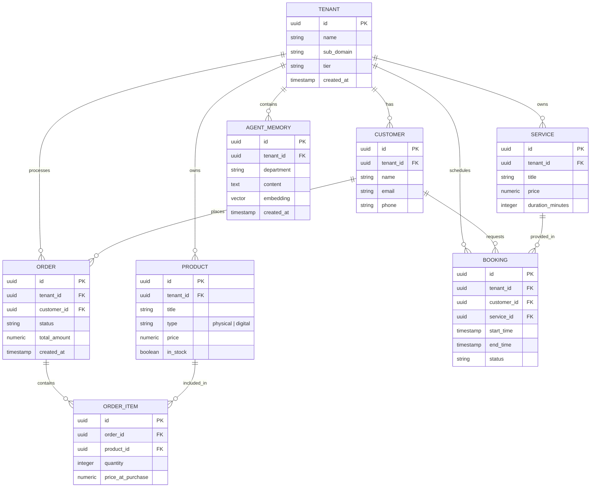

# [architecture]_data_model: OneHumanCorp Data Model Architecture

## Problem Statement

A non-technical small business owner, like Maya (the baker) or Carlos (the handyman), does not understand databases, schemas, or tenant isolation. They just want their business information—products, customers, orders, and agents—to be organized securely and efficiently. As OHC scales to support a wide variety of business types, from service bookings to digital product sales, our underlying data structure must be robust enough to handle this diversity without leaking data between businesses or introducing friction during the setup process.

Currently, we need a unified, multi-tenant Data Model Architecture that provides strong Row Level Security (RLS) per tenant, defines clear entity relationships (e.g., how an order relates to a customer and a product), and supports AI agent workflows (e.g., retrieving context history efficiently) without compromising performance on mobile networks.

## Research Report

We investigated data access patterns across similar platforms (Shopify, Wix, Squarespace) and found that the core of small business management boils down to a few universal entities: `Tenant` (the business), `Product`/`Service`, `Customer`, `Order`/`Booking`, and `AgentContext`.

*   **Shopify:** Focuses heavily on the e-commerce entity graph (Product -> Variant -> InventoryItem). Its data model is highly robust for physical products but less ideal for native service bookings.
*   **Wix & Squarespace:** Use more generalized, flexible data models to accommodate portfolios and bookings, but this often leads to a convoluted schema when managing complex inventory.
*   **OHC Approach:** We require a generalized yet strongly typed multi-tenant architecture using PostgreSQL. Every table *must* have a `tenant_id` column to support strict RLS. Furthermore, we must integrate pgvector natively to allow our AI Agent Departments to quickly perform semantic searches over business data and past interactions.

**Key Findings:**
1.  **Multi-Tenancy:** Hard row-level security using PostgreSQL's native RLS policies tied to `tenant_id` is the safest, most scalable approach to prevent tenant data leakage.
2.  **Extensibility:** E-commerce (physical/digital) and Booking systems require separate but related schema concepts. E.g., an "Order" for a physical good requires shipping details; a "Booking" requires a time slot. Both, however, relate to a "Transaction/Payment".
3.  **AI Context:** AI Agents need fast access to past chat history and business state. Using `pgvector` for embedding storage alongside relational data simplifies the stack and ensures consistency.

## Design Doc

### Key Architectural Decisions

1.  **Strict Multi-Tenancy:** Every core entity table (`products`, `customers`, `orders`, `bookings`, `agent_memories`) will include a `tenant_id` column. PostgreSQL RLS policies will be enforced on every query based on the active connection context.
2.  **Entity Polymorphism vs. Specialization:** Instead of one massive `item` table, we will use specialized tables (`products` for physical/digital goods, `services` for bookable time) to maintain strong foreign key constraints, linked to a unified `order_lines` or `booking_events` structure.
3.  **Vector Storage for AI:** Agent memory and semantic context will be stored in an `agent_memories` table using `pgvector`, allowing for hybrid search (relational filtering by `tenant_id` + vector similarity search).
4.  **Offline Support / Sync:** For mobile clients, key entities like today's orders or active product listings must include `updated_at` timestamps and version hashes to support efficient delta-syncs and optimistic UI updates.

### Entity-Relationship Diagram

### UI Wireframes / Screen Flow Description
*(Focusing on Data Management on a 375px mobile screen)*

1.  **Dashboard (Home):**
    *   Fetches aggregate data across `ORDER`, `BOOKING`, and `CUSTOMER` for the specific `tenant_id`.
    *   Displays high-level metrics (e.g., "3 New Orders", "2 Upcoming Bookings").
2.  **Product/Service List View:**
    *   Fetches from `PRODUCT` or `SERVICE`.
    *   Infinite scroll or pagination relying on indexed `tenant_id` and `created_at`.
3.  **Customer Detail View:**
    *   Fetches `CUSTOMER` details.
    *   Parallel queries to fetch related `ORDER` and `BOOKING` history for that customer.

### AI Agent Integration Points

*   **Semantic Search:** When a user asks "What was the issue with Maya's cake order last month?", the AI Agent queries `AGENT_MEMORY` using pgvector similarity search, strictly filtered by `tenant_id`.
*   **Contextual Actions:** Agents read the relational schema (e.g., stock levels in `PRODUCT`) to draft responses or automatically update inventory.

## Implementation Prompt

**Task for Implementer:**
Implement the PostgreSQL database schema and initialization scripts for the core OHC entities: Tenant, Product, Service, Customer, Order, Booking, and Agent Memory.

**Acceptance Criteria:**
1.  All tables must have a UUID `id` primary key and a `tenant_id` foreign key linking to the `tenants` table.
2.  PostgreSQL Row Level Security (RLS) must be enabled on all tables, with policies ensuring that queries can only read/write data where `tenant_id` matches the current transaction context.
3.  The `agent_memories` table must include a `pgvector` column for embeddings.
4.  Appropriate indexes must be created (especially on `tenant_id` and timestamp columns for efficient mobile syncing).
5.  Include basic database migration scripts (e.g., using `golang-migrate` or similar as per the backend standards).
6.  Do not implement the API layer; focus strictly on the database schema, RLS configuration, and migration scripts.

## Priority
P0 (Critical path for all subsequent feature development)

## Estimated Scope
Medium
