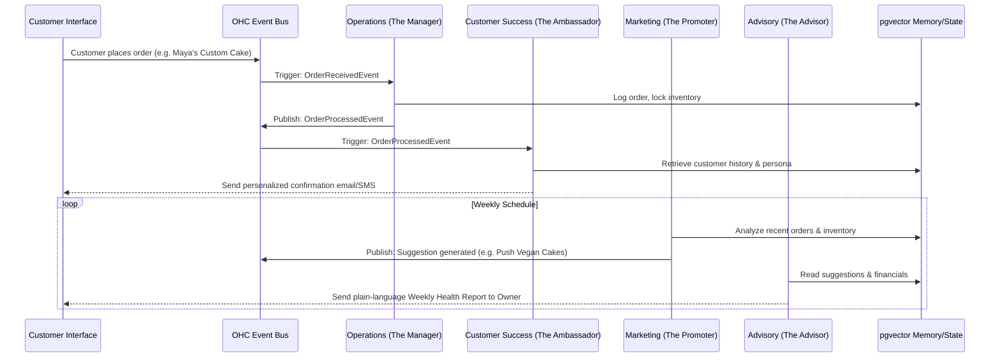

# [AI Architecture] AI Agent Department Architecture

## Title
AI Agent Department Architecture: Invisible Coordination for Non-Technical Business Owners

## Problem Statement
Small business owners (our personas like Maya the Baker or Carlos the Handyman) wear multiple hats: they are the marketer, the salesperson, the customer support rep, the accountant, and the operational manager. However, they lack the technical skills to configure complex automated workflows, connect disparate SaaS tools (like Zapier), or manage AI chatbots. They need a system that works invisibly in the background, mirroring the structure of a real business where specialized departments handle tasks autonomously and coordinate with each other.

## Research Report
Current market solutions treat AI as an add-on:
* **Shopify:** Offers "Sidekick" which acts primarily as a chat interface for the merchant. It doesn't autonomously execute complex cross-functional workflows.
* **Wix:** Wix AI assists in initial site generation and text generation but doesn't act as an ongoing autonomous employee.
* **GoDaddy/Squarespace:** AI capabilities are limited to basic copywriting and layout generation.

To fulfill the OneHumanCorp (OHC) mission ("anyone can launch, run, and grow a real small business without touching a single line of code or reading a manual"), AI must not be a chatbot. It must be infrastructure. We achieve this by organizing AI agents into functional "Departments" that mirror real business operations: Operations, Marketing & Advertising, Sales & Acquisition, Customer Success, Finance & Payments, Legal & Compliance, and Business Advisory.

## Design Doc

### Core Philosophy
AI Agent Departments run asynchronously and invisibly. They are triggered by events (e.g., an order being placed), schedules (e.g., weekly reporting), or demands (e.g., explicit user request). The departments share context via the central Vector DB memory and coordinate through a distributed state machine without requiring the business owner to manually orchestrate them.

### Architecture Diagram

### Mobile UX Flow (375px first)
1. **Dashboard (The Hub):** The user opens the OHC app and sees a clean, glassmorphic overview. There are no "Configure AI" buttons. Instead, there's a feed of actions taken by the departments (e.g., "Customer Success replied to 3 Instagram DMs", "Marketing posted your new cake to TikTok").
2. **Action Review (Approval Gate):** For sensitive actions (e.g., issuing a refund or spending ad budget), a card appears: "Finance suggests a full refund for Order #102 due to late delivery. [Approve] [Review]". Touch targets are large (≥44x44px).
3. **Department Drill-Down:** Tapping a department (e.g., "The Promoter") shows recent outputs (published sites, posts). The owner can tap a microphone icon: "Run a 10% off sale this weekend for returning customers." The Marketing department translates this natural language into a campaign, coordinates with Operations to apply the discount, and with Customer Success to email past buyers.

### AI Agent Integration Points
* **Event Sourcing:** Departments subscribe to a shared Kafka/Redis event bus or the `shared_tasks_decomposition` database queue.
* **Context Sharing:** A centralized pgvector instance stores all customer interactions, business context, and past actions. When "The Salesperson" generates a quote, it queries pgvector to ensure it matches the tone of previous communications handled by "The Ambassador".
* **Approval Workflows:** A state machine tracks agent proposals. State transitions (Draft -> Pending Approval -> Executed) govern the execution of high-risk tasks.
* **Usage Throttling:** Token usage is tracked per-tenant and per-department. The Business Advisory department dynamically adjusts the frequency of proactive tasks based on the tenant's tier limits.

## Implementation Prompt
Implement the foundational event-driven architecture for the "Operations" and "Customer Success" departments. Create the database schemas for registering asynchronous department jobs (using a `SKIP LOCKED` pattern on a `department_tasks` table) and implement a worker that picks up `OrderReceived` events. The worker should simulate the Operations department processing the order, which then emits an `OrderProcessed` event. A second worker representing Customer Success should pick up this event and log a drafted confirmation message to the database. Ensure the implementation is fully tested with Bazel/Rust unit tests and E2E Playwright tests that verify the state transitions are reflected on the mobile-first dashboard.

## Priority
P1

## Estimated Scope
Medium
