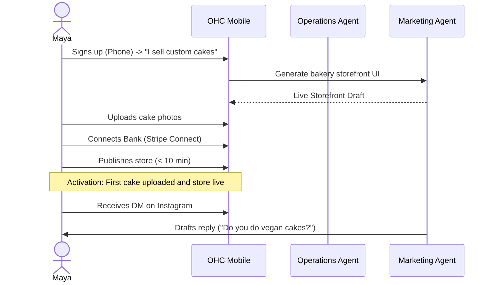
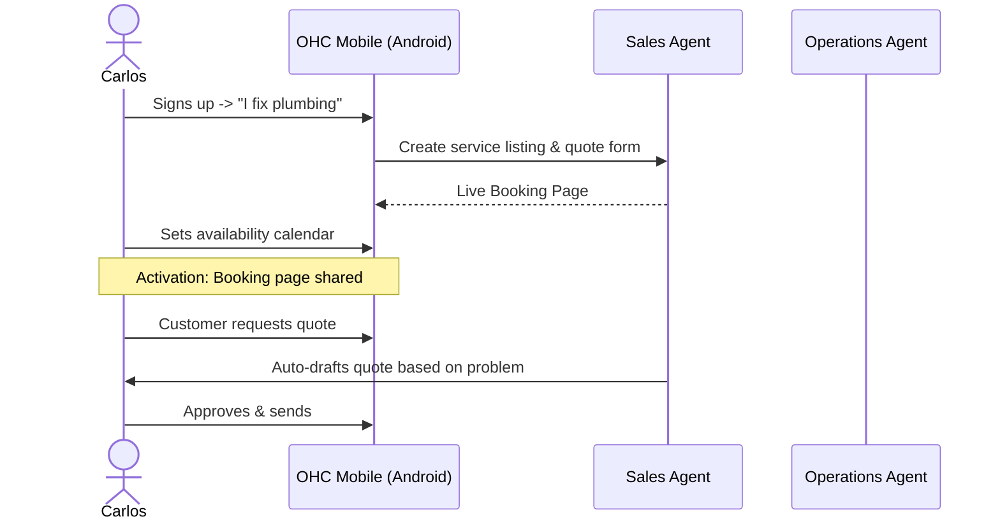
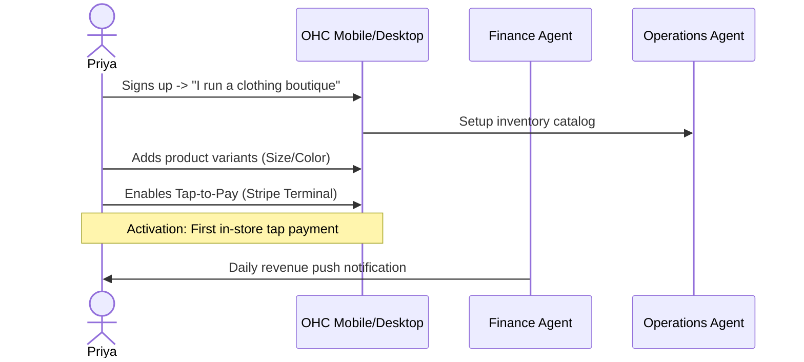
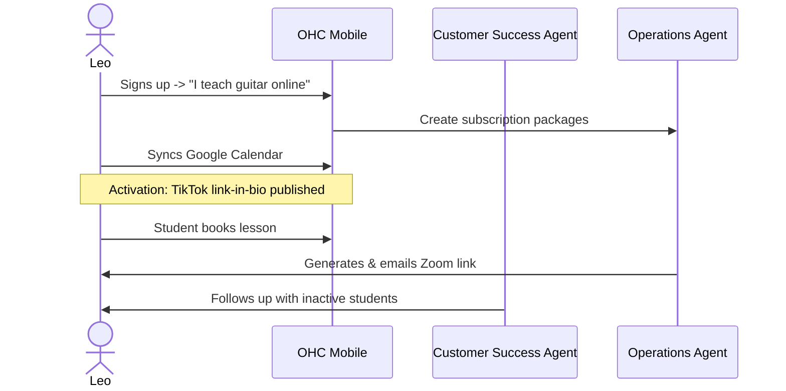
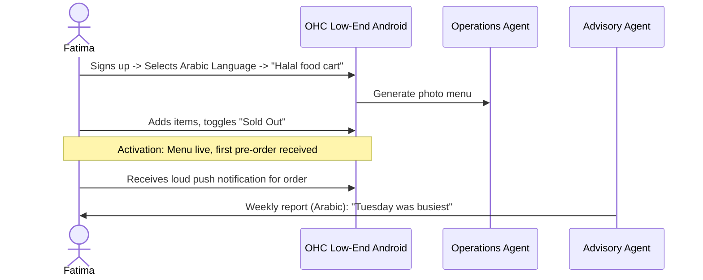

# [Business Journey] OHC End-to-End User Journey Architecture

## Problem Statement
Small business owners (bakers, handymen, tutors) are overwhelmed by the complexity of traditional platforms (Shopify, Wix). They abandon onboarding when faced with DNS settings, payment gateway configurations, or SEO optimization. OHC must guide non-technical users from idea to live business in under 10 minutes, entirely on mobile, using AI agents to handle the complexity.

## Research Report: Competitive Analysis & Pain Points
Based on the OHC market positioning against Shopify, Wix, Squarespace, and GoDaddy:
- **Shopify:** Setup time is 30-60 min. Target user is SMB/Tech-savvy.
- **Wix:** Complex editor, setup time 20-40 min.
- **Squarespace:** Portfolio first, complex store setup.
- **OHC:** Setup time < 10 min, zero technical knowledge required, mobile-first management.

### Persona-Specific Pain Points (Friction Points)
| Persona | Business | Friction Point (Abandonment Risk) |
|---|---|---|
| **Maya** (28) | Home Baker | Forcing her to configure Stripe webhooks or design a desktop layout. She runs everything from her iPhone. |
| **Carlos** (42) | Handyman | Asking him to write SEO copy or build a multi-page site. He just needs a booking form and quotes. Android only. |
| **Priya** (35) | Boutique | Manually syncing online and in-store inventory. She needs automatic sync and mobile analytics. |
| **Leo** (22) | Music Tutor | Integrating Zoom links manually into a calendar. He needs automatic lesson links and subscription billing. |
| **Fatima** (50) | Food Cart | English-only interfaces and complex POS hardware. She needs Arabic support, sold-out toggles, and low-data mobile performance. |

## Design Doc: Business Journey Architecture

### 1. Maya — The Home Baker (Physical Products)

### 2. Carlos — The Handyman (Services & Bookings)

### 3. Priya — The Boutique Owner (Inventory & POS)

### 4. Leo — The Music Tutor (Subscriptions & Digital)

### 5. Fatima — The Food Cart Operator (Pre-orders, Multilingual)

### Implementation Prompt for Engineering Swarm
**Task:** Build the OHC unified onboarding flow and core persona journeys.
**User-Facing Outcome:** A mobile-first (375px) wizard where users select their business type (Baker, Handyman, Boutique, Tutor, Food Cart). The system automatically provisions the appropriate AI Agents (Operations, Marketing, Sales, Customer Success, Finance, Advisory) and configures the default entity structure (products, services, bookings) without asking for database fields or API keys.
**Acceptance Criteria:**
- 100% of the UI passes the grandmother test (no technical jargon).
- Visual Excellence Mandate applied: Glassmorphism tokens, minimum 44x44 touch targets.
- Multilingual support foundation established (RTL support for Arabic).
- E2E tests must cover the complete flow for each persona from login to live storefront.
**Priority:** P0
**Estimated Scope:** Large

