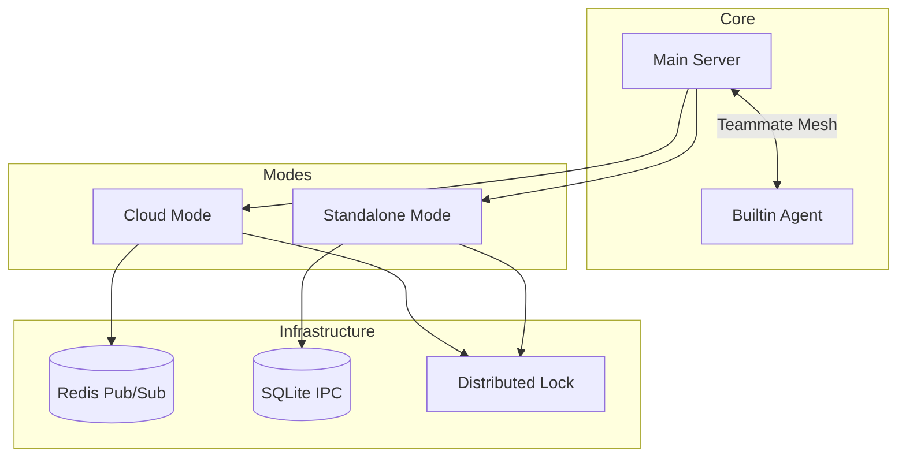

# OHC Swarm Interoperability Architecture

## Overview
This document outlines the high-level architecture for the OHC Swarm's interoperability protocols across Cloud and Standalone modes.

## Architecture Diagram

## Details
- **Teammate Mesh**: In Cloud, utilizes Redis Pub/Sub. In Standalone, utilizes SQLite IPC `mesh_messages` tables.
- **Distributed Locking**: Utilizes Redlock in Cloud and `ON CONFLICT DO UPDATE` UPSERT logic in SQLite with explicit expiration validation (`expires_at <= datetime('now')`).
- **State Handoff**: `SyncStateHandoff` messages sync memory contexts using `to_timestamp` (Postgres) and `datetime(..., 'unixepoch')` (SQLite).
