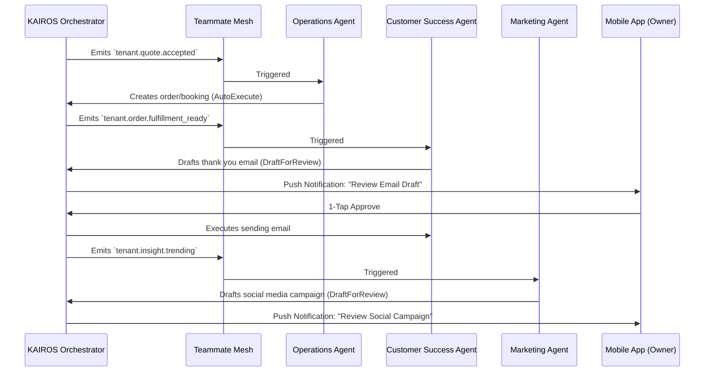

# Architecture Brief: AI Agent Department

## Title
OHC AI Agent Department Architecture: Invisible Coordination and 1-Tap Approvals

## Problem Statement
Small business owners (Maya, Carlos, Priya) do not have time to manually manage marketing campaigns, customer support replies, and order fulfillment tracking. While OHC has agent capabilities, they need to operate seamlessly as distinct "Departments" that coordinate invisibly. Without clear architectural boundaries, event-driven triggers, and a safe, 1-tap mobile approval workflow for high-risk actions, users will either be overwhelmed by agent activity or face unapproved external actions (e.g., incorrect social media posts). We must design an architecture where departments coordinate via events and request mobile-first approvals for external actions.

## Research Report
- **Current State:** The backend (`src/server/orchestration/departments/`) currently has foundational implementations for `OperationsAgent`, `MarketingAgent`, and `CustomerSuccessAgent`.
- **Event Triggers:**
  - `Operations` subscribes to `tenant.quote.accepted`.
  - `Marketing` subscribes to `tenant.insight.trending`.
  - `CustomerSuccess` subscribes to `tenant.order.fulfillment_ready`.
- **Approval Workflows:** Agents determine `ActionRisk` (`AutoExecute` vs `DraftForReview`) based on tenant configurations. The orchestrator handles `request_approval` which creates a `Pending` request for the tenant.
- **Competitive Benchmark:** Platforms like Shopify have disjointed third-party apps for marketing and support. OHC's competitive edge is having natively integrated AI departments that share context and coordinate via the `Teammate Mesh`.

## Design Doc

### Architecture Diagram (Mermaid.js)

### Mobile UX Flow (375px First)
- **Agent Activity Feed:** A unified feed showing recent `AutoExecute` actions (e.g., "Order #123 created by Operations") and `Pending` approvals.
- **1-Tap Approvals:** When an agent drafts a response (e.g., Customer Success email), it appears as a card with the generated content and explicit "Approve" and "Edit" buttons. Target touch size is 44x44px.
- **Department Settings:** Jargon-free toggles to set the "Tone of Voice" and auto-approve limits for each department.

### Key Design Decisions
- **Decoupled Event Driven Coordination:** Departments do not call each other directly. They rely on the KAIROS Orchestrator and Teammate Mesh events to ensure loose coupling and fault tolerance.
- **Risk-Based Execution:** High-risk external actions (emailing customers, posting on social media) default to `DraftForReview`, requiring explicit owner approval, building trust. Low-risk internal state updates default to `AutoExecute`.
- **Shared Memory:** All departments can query past business interactions, ensuring consistent tone and context across functions.

## Implementation Prompt
**To Implementer Agent:**
Implement the 'Draft-for-Review' approval workflow UI in the mobile dashboard and connect it to the existing backend orchestrator's approval mechanism. Create a unified 'Agent Feed' component that displays pending `ApprovalRequest` items from the orchestrator. Implement a 1-tap 'Approve' button that calls the orchestrator's approval endpoint, instantly reflecting the 'Approved' state via optimistic UI updates before syncing. Ensure the feed component adheres to the Visual Excellence Mandate (Glassmorphism, correct typography) and is optimized for 375px screens with 44x44px touch targets. Do not alter the underlying agent event subscriptions. Write an E2E Playwright test verifying the 1-tap approval flow for a pending Marketing campaign draft.

## Priority
P0

## Estimated Scope
Medium
