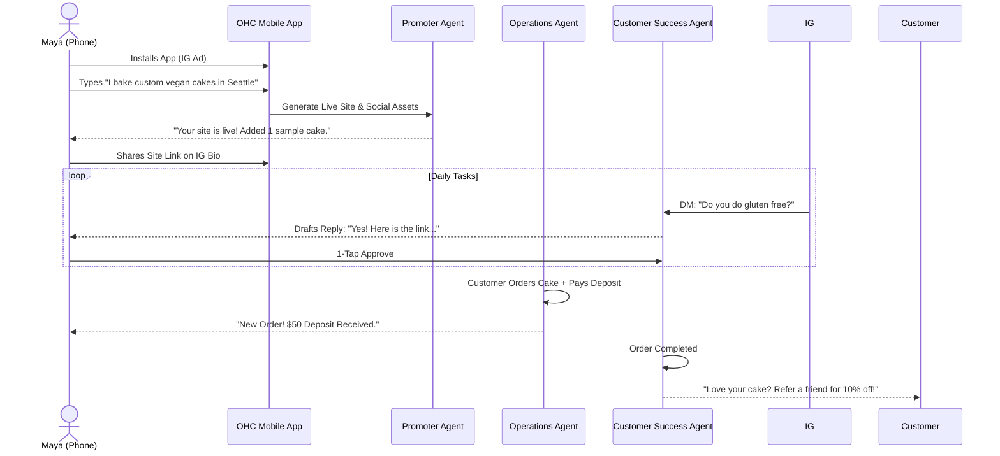
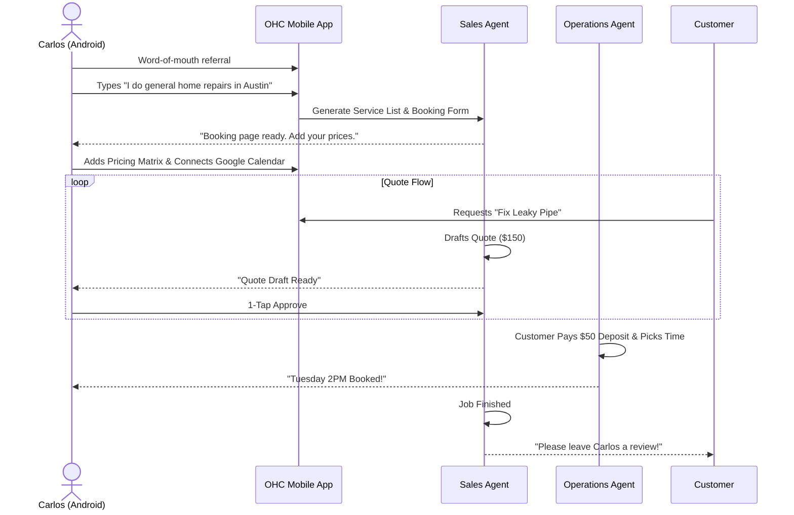
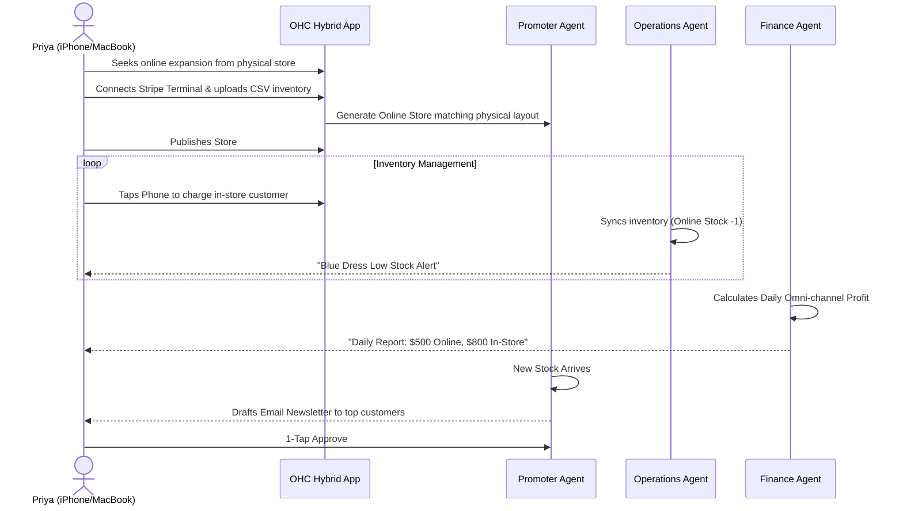
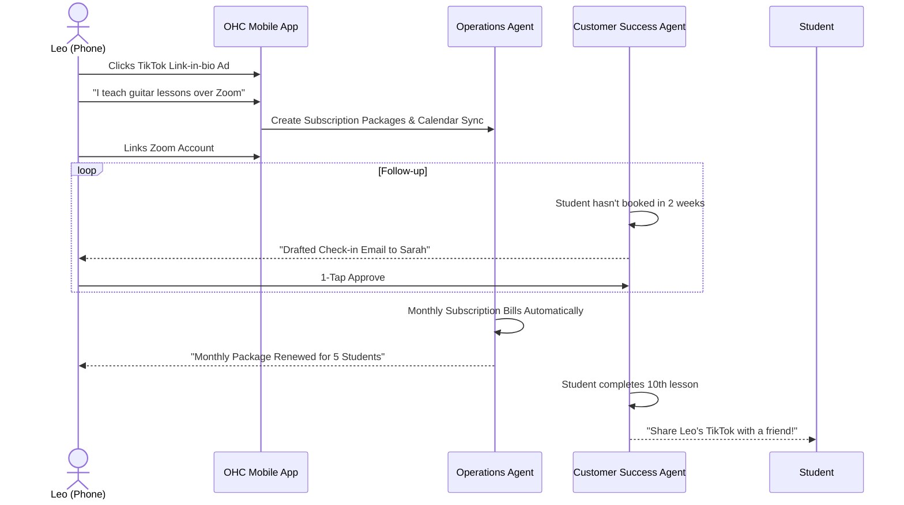
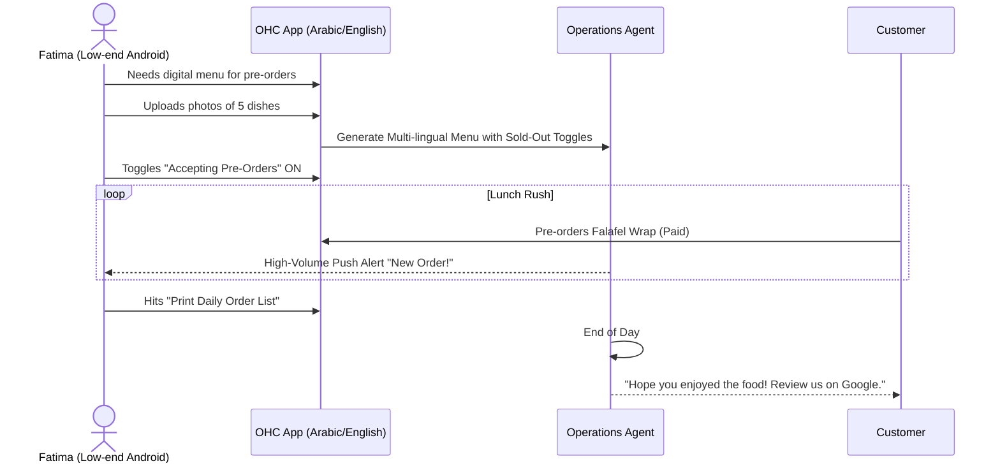

# [architecture] Business Journey Architecture: End-to-End Persona Workflows

## Title
Business Journey Architecture: End-to-End Persona Workflows

## Problem Statement
The user journey for non-technical small business owners (like Maya the Baker, Carlos the Handyman, Priya the Boutique Owner, Leo the Music Tutor, and Fatima the Food Cart Operator) across existing platforms (Shopify, Wix) is fragmented and heavily reliant on manual configuration. They face a high barrier to entry ("Setup Complexity") and significant operational fatigue once live. OHC needs a definitive, radically simple, end-to-end journey architecture that maps exactly how real-world personas interact with the platform from discovery to daily operations, with AI agents invisibly handling the complexity.

## Research Report
Based on the market feature gap analysis and top SMB pain points:
- **Shopify & Wix**: Onboarding takes 20-60 minutes. Users are bombarded with technical jargon (DNS, Liquid templates) and isolated tools requiring manual wiring.
- **Durable**: Offers fast storefront generation (<1m) but lacks operational depth for complex flows (e.g., custom orders with deposits, physical POS sync).
- **OHC Target**: Reduce "Time to Live" to under 10 minutes (or <1m for instant generation) with zero technical knowledge.
- **Journey Friction Points Identified**:
  1. *Acquisition & Onboarding*: Overwhelm from too many setup questions.
  2. *Activation*: Stalled progress after the first product is added but before the first sale.
  3. *Retention*: The "never-ending inbox" and manual marketing tasks cause churn.
  4. *Revenue*: Lack of clear visibility into profit margins prevents business growth.

## Design Doc

### Key Design Decisions & Rationale
1. **Conversational Instant Onboarding**: Instead of multi-step wizards, onboarding uses a single conversational input ("Tell us about your business"). This minimizes friction and leverages the Advisor Agent to fill 80% of metadata.
2. **Mobile-First (375px) Operations**: All daily management (approvals, insights) happens via a continuous activity feed on the mobile dashboard. This matches the reality of solopreneurs who manage their business from their phones.
3. **Event-Driven AI Teammates**: Agents are not reactive tools; they proactively monitor the event mesh (e.g., new order, new DM) and draft responses or tasks for 1-tap approval.

### AI Agent Integration Points
- **The Advisor**: Extrapolates business metadata during onboarding and generates weekly human-language health briefings.
- **The Promoter**: Automatically designs the storefront and schedules 7-day social media calendars upon new product creation.
- **The Ambassador**: Listens to inbound DMs/messages, drafts context-aware replies, and queues them for approval.
- **The Manager (Operations)**: Tracks inventory velocity, flags low stock, and manages order state transitions.
- **The Accountant**: Monitors transactions and provides plain-language financial summaries.

### Architecture Diagrams (Mermaid.js)

#### 1. Maya (The Home Baker) - Complete Lifecycle Journey

#### 2. Carlos (The Handyman) - Complete Lifecycle Journey

#### 3. Priya (The Boutique Owner) - Complete Lifecycle Journey

#### 4. Leo (The Music Tutor) - Complete Lifecycle Journey

#### 5. Fatima (The Food Cart Operator) - Complete Lifecycle Journey

### Mobile UX Flow (375px First)
1. **Acquisition (Link-in-bio / Ad)**: User taps "Start my business".
2. **Onboarding (Conversational)**: A single screen with native mobile keyboard. Prompt: "What do you do?" User inputs 1-2 sentences.
3. **Generation**: Loading screen with micro-animations. Agents generate the storefront, tagline, and initial product drafts in parallel.
4. **Activation / Dashboard**:
   - Top: "Agent Actions Today" Feed (e.g., "The Promoter drafted a welcome post").
   - Middle: "Quick Actions" (Add Product, View Live Site).
   - Bottom: Native mobile navigation bar (Home, Orders, Chat, Reports).
5. **Approval Workflow**: Tapping an agent draft opens a modal with "Edit" or "Approve & Send" buttons. Minimum touch target 44x44px.

## Implementation Prompt
Implement the end-to-end "Business Journey Architecture" by creating the core orchestration flows for the 5 persona journeys defined in this doc.
1. Build the Conversational Onboarding UI component (Slint/Flutter, targeting 375px) that captures the single text input and triggers the generation pipeline.
2. Implement the "Agent Activity Feed" on the mobile dashboard.
3. Wire the Teammate Mesh to route `MessageReceived` and `OrderPlaced` events to the appropriate AI departments (Customer Success, Operations) to populate the feed with draft actions.
4. Ensure all interactions utilize the OHC Premium Token library (Glassmorphism, 20px blur) and are fully functional on a 375px width.

## Priority
P0

## Estimated Scope
Large
