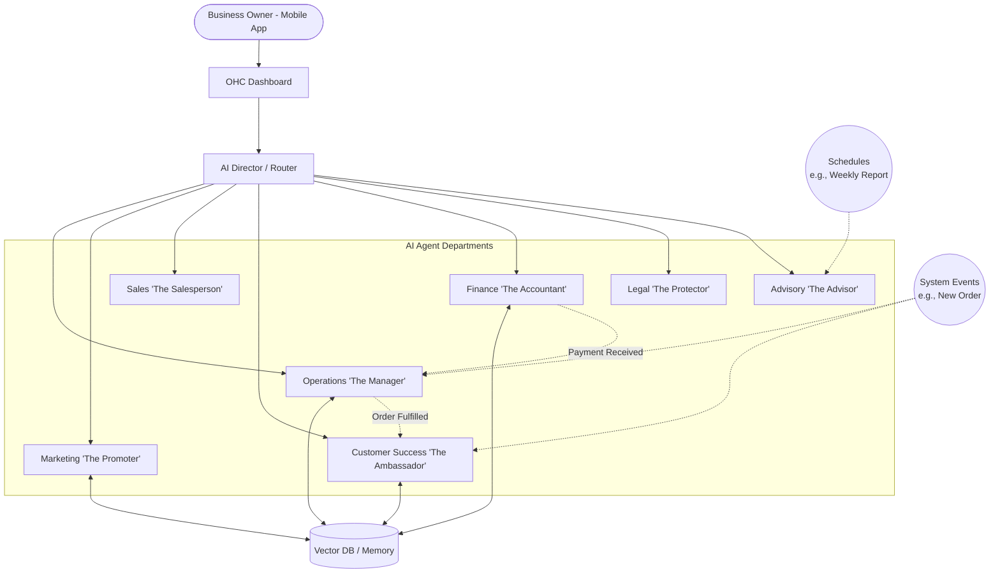

# AI Agent Department Architecture

## Problem Statement
Small business owners (our core personas like Maya the Baker, Carlos the Handyman, Priya the Boutique Owner) are overwhelmed by the operational complexities of running a business. They lack the time and technical expertise to handle marketing, customer support, legal compliance, and financial tracking simultaneously. While they understand "departments" in a traditional business sense (e.g., Sales, Operations, Finance), current software platforms expose technical primitives (e.g., cron jobs, API keys, webhooks) rather than business primitives. OHC needs a cohesive, invisible AI architecture that maps directly to these recognizable business departments, functioning autonomously yet cohesively to run the business on the user's behalf.

## Research Report
**Market Gap Analysis:**
- **Shopify / Wix / Squarespace:** AI features are mostly bolted on as sidekicks or chatbots (e.g., Shopify Sidekick). They assist with tasks like generating product descriptions or answering help questions, but they do not *proactively run* the business.
- **GoDaddy / Zyro:** Basic automated marketing (e.g., social posting scheduling) but completely lacking a unified, conversational context across the business.
- **OHC Opportunity:** Treat AI as the core infrastructure. Organize AI capabilities into "Departments" with friendly names (e.g., "The Manager", "The Promoter"). These departments must coordinate seamlessly, sharing context and memory, to provide an end-to-end operational backend.

**Findings:**
1. **Frictionless Delegation:** Users want to assign a goal (e.g., "Get me more cake orders for Valentine's Day") and have the system figure out the execution (Marketing designs a promo, Customer Success drafts emails, Operations preps inventory).
2. **Trust & Control:** Users need a mechanism to build trust over time. Initially, they want to review AI drafts before sending (Draft-for-Review). Later, they switch to Auto-Execute.
3. **Context is King:** The AI must remember past interactions, seasonal trends, and customer preferences to be useful.

## Design Doc

### Architecture Overview

### Key Design Decisions & Rationale

1. **Trigger Mechanisms:**
   - **On Demand:** User explicitly requests an action via the UI (e.g., "Draft a refund policy").
   - **On Event:** Webhooks or database events (e.g., Stripe payment received triggers Finance to record, Operations to prep, Support to email).
   - **On Schedule:** Cron-based checks (e.g., Advisory runs every Sunday night to generate the weekly health report).
   *Rationale:* This maps to how a real employee operates—sometimes instructed, sometimes reacting to events, sometimes doing routine tasks.

2. **Inter-Department Coordination:**
   - Departments communicate via an internal Event Bus (Pub/Sub).
   - Example: Operations finishes packing an order → emits `OrderReady` event → Customer Success catches it and sends the tracking SMS.
   *Rationale:* Decoupling departments ensures one failing agent doesn't bring down the entire business flow.

3. **Context Memory & State:**
   - All departments share a centralized Vector DB for semantic memory (e.g., "Maya prefers polite but casual tone") and a relational DB for hard state (e.g., "Order #1045 is paid").
   *Rationale:* Prevents the "amnesia" common in LLM wrappers. The Customer Success agent must know the Finance agent already approved the refund.

4. **Approval Workflows (Trust Building):**
   - **Draft-for-Review (Default for new users/risky actions):** The agent generates the artifact (email, post, contract) and pushes a notification to the owner's phone for 1-tap approval.
   - **Auto-Execute (Opt-in):** The agent performs the action silently and logs it in the audit trail.
   *Rationale:* Non-technical users need to trust the AI before letting it speak for their business.

5. **Usage Budgeting & Throttling:**
   - Managed via the tenant's tier. Each action consumes a standardized "AI Action Token".
   - Hard limits prevent runaway costs. A central API gateway throttles requests per tenant.
   *Rationale:* Ensures profitable unit economics while providing clear, predictable constraints to the user.

### Mobile UX Flow (375px First)

**Screen Flow: Approving a Marketing Campaign**
1. **Push Notification:** "The Promoter drafted a Valentine's Day Instagram post. Review?"
2. **Action Hub (Home Screen):** A swipeable card stack of pending AI actions.
3. **Detail View:** Shows the AI-generated image, caption, and schedule.
4. **Interaction:**
   - Button: `Approve & Schedule`
   - Button: `Edit Text`
   - Button: `Regenerate Image`
   - Toggle: `Always auto-post similar campaigns` (Hidden behind an "Advanced" gear icon to keep it clean).

### AI Agent Integration Points
- **System Prompts:** Each department gets a persona-specific system prompt loaded dynamically based on the business type.
- **Tool Access:** Operations has DB write access for orders; Marketing has API access to Instagram; Legal has a PDF generator tool.
- **Audit Log:** Every AI action is recorded in a plain-English log visible on the mobile dashboard.

## Implementation Prompt
**For Implementer Agent:**
Implement the core infrastructure for the AI Agent Departments. Focus on creating the routing logic (AI Director) that can accept generic business intents and route them to the correct logical department based on the user's configuration. You must build the approval workflow engine that allows actions to be flagged as `NeedsReview` or `AutoExecute`, pushing notifications to the frontend. Ensure the system uses the central Event Bus for inter-agent communication (e.g., triggering a Customer Success task after an Operations task completes). Do not worry about the specific LLM integration yet; mock the agent responses to validate the coordination, memory sharing, and UI state updates on the mobile app. All UI labels must follow the 'Grandmother Test' (e.g., use "My Team" instead of "Agent Routing").

## Priority
P0 (Critical)

## Estimated Scope
Large
