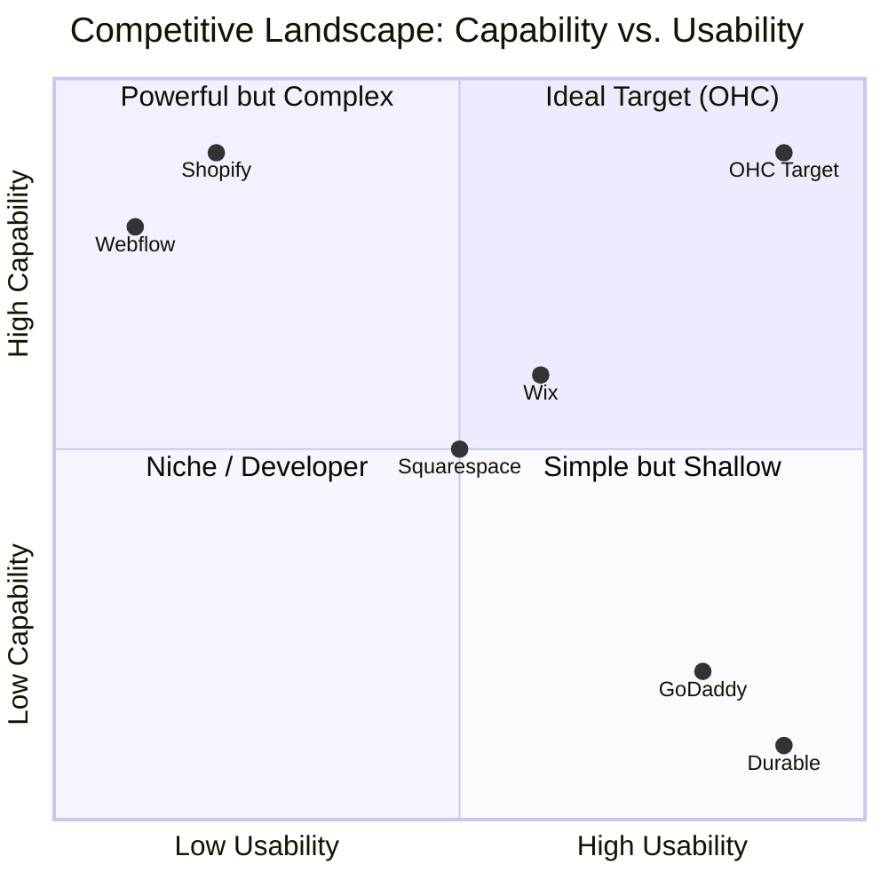
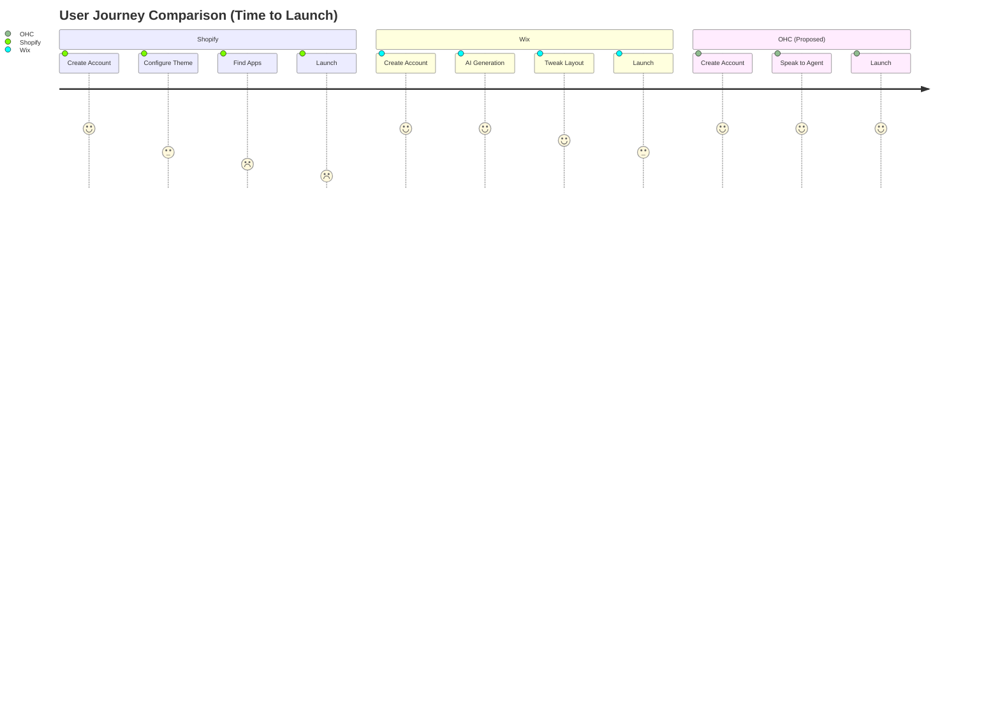

# OHC Small Business Platform Research Report

## 1. Deep Competitor Audit

### Shopify
- **Onboarding Flow:** Long, multi-step process asking many business details before getting to the builder. Focus is on commerce setup.
- **Time to Live Store:** Days/Weeks due to complexity.
- **Mobile App Quality:** Strong for managing existing stores (orders, analytics), poor for initial setup and design.
- **AI Features:** "Sidekick" chatbot for merchant assistance, AI product descriptions. Not autonomous.
- **Pricing:** Basic plan starts around $39/mo.
- **Free Tier:** None (only a short trial).
- **Major Complaints (Trustpilot/Reddit):** Overwhelming for beginners. App ecosystem gets very expensive quickly ("nickel and diming"). Setup complexity.

### Wix
- **Onboarding Flow:** AI chat setup (Wix ADI) or template selection.
- **Time to Live Store:** Hours/Days.
- **Mobile App Quality:** Good for basic management and booking.
- **AI Features:** AI website generator, text/image generation. One-time setup focus.
- **Pricing:** Core plan around $29/mo.
- **Free Tier:** Yes, but heavily branded with Wix ads.
- **Major Complaints:** Editor can feel bloated/sluggish. Hidden fees for essential business tools.

### Squarespace
- **Onboarding Flow:** Template-first approach. Visual focus.
- **Time to Live Store:** Hours/Days.
- **Mobile App Quality:** Basic management.
- **AI Features:** Design Intelligence (AI layout generation), AI copy generation.
- **Pricing:** Personal plan starts around $16/mo.
- **Free Tier:** None (only a 14-day trial).
- **Major Complaints:** Rigid templates (hard to customize outside boundaries). Weak native scheduling compared to dedicated tools.

### GoDaddy Website Builder / Airo
- **Onboarding Flow:** Extremely fast, question-based setup.
- **Time to Live Store:** Minutes.
- **Mobile App Quality:** Basic.
- **AI Features:** Airo focuses on branding (logo, domain, initial draft). Limited post-launch autonomous features.
- **Pricing:** Aggressive initial discounts, high renewal rates.
- **Free Tier:** Limited free tier available.
- **Major Complaints:** Aggressive upselling. Sites look generic and lack depth.

### Zyro / Hostinger Builder
- **Onboarding Flow:** Grid-based drag and drop or AI generation.
- **Time to Live Store:** Hours.
- **Mobile App Quality:** Very limited.
- **AI Features:** AI writer, heatmaps, logo maker. Tools are disjointed rather than unified agents.
- **Pricing:** Budget-friendly.
- **Free Tier:** None.
- **Major Complaints:** Lack of advanced ecommerce features. Very basic app marketplace.

### Webflow & Framer
- Focus exclusively on advanced design and development, totally unsuitable for the non-technical SMB persona described (Maya, Carlos).

### Square Online
- **Onboarding Flow:** Syncs seamlessly if already using Square POS.
- **Time to Live Store:** Hours.
- **Mobile App Quality:** Excellent POS integration.
- **AI Features:** Basic generative text.
- **Pricing:** Free tier available (pay per transaction).
- **Major Complaints:** Limited customization for pure ecommerce outside of food/retail.

### Rising AI-Native Competitors
- **Durable:** Generates a site in 30 seconds. Very thin on actual business management logic (CRM/Invoicing).
- **10Web & Hocoos:** Focused primarily on the site generation step, ignoring the ongoing business orchestration needs.



## 2. Top 10 SMB Pain Points & Persona Mapping
*(Based on common trends in r/smallbusiness and App Store reviews for major platforms)*

1. **Setup Complexity (35%):** "I just want a simple site, not a PhD in web design." (Maya - Baker)
2. **Integration Chaos (25%):** "I have to use 4 different apps just to take an appointment and get paid." (Carlos - Handyman, Leo - Music Tutor)
3. **No Mobile First (20%):** "I don't own a laptop, I run my food cart from my phone." (Fatima - Food Cart)
4. **Expense/Add-ons (20%):** "Shopify apps cost more than my monthly inventory." (Priya - Boutique)
5. **Scattered Management:** No single pane of glass for CRM, inventory, and site.
6. **No Booking System:** Native booking is missing or weak on ecommerce-focused platforms. (Leo)
7. **Manual Follow-ups:** Chasing clients for payment or scheduling. (Carlos)
8. **Inventory Sync:** Physical store and online store out of sync. (Priya)
9. **Language Barriers:** Platforms are English-first and complex. (Fatima)
10. **AI Not Invisible:** Existing AI tools require prompting, which is a new skill to learn. (Maya)



## 3. Feature Gap Matrix

| Feature | Shopify | Wix | Squarespace | Zyro | GoDaddy | OHC (Current) | OHC (Opportunity) |
| :--- | :--- | :--- | :--- | :--- | :--- | :--- | :--- |
| **Setup Time** | Days/Weeks | Hours/Days | Hours/Days | Hours | Minutes | TBD | < 10 mins (Autonomous AI) |
| **Mobile App** | Good (Mgmt) | Good | Basic | Weak | Basic | TBD | 100% Mobile First |
| **AI Agents** | Chatbot | One-time Gen | Design Gen | Disjointed | Draft Gen | Agentic Engine | Invisible & Continuous |
| **Booking** | App Store | Native | Native | Embeds | Basic | Missing | Native & AI-driven |
| **Invoicing** | App Store | Native | Native | Basic | Basic | Missing | Native CRM Integration |

```mermaid
heatmap
    title "Feature Gap Heatmap (1=Poor, 5=Excellent)"
    x-axis "Shopify","Wix","Squarespace","GoDaddy","OHC (Goal)"
    y-axis "Setup Speed","Mobile UX","Agentic AI","Native Booking","Native Invoicing"
    1,3,3,5,5
    5,4,3,2,5
    2,3,2,1,5
    1,4,4,2,5
    1,3,3,2,5
```

## 4. AI Differentiation Manifesto
OHC will leapfrog the market by providing **Invisible, Autonomous Agents** rather than just chatbots. SMB owners don't want to learn how to prompt an AI; they want the AI to do the work.

1. **Auto-replying to customer messages:** Saves hours per day.
2. **Auto-writing product descriptions:** Saves 30 min per upload.
3. **Auto-generating social posts:** Removes biggest marketing barrier.
4. **Auto-sending follow-up emails:** Recovers abandoned carts.
5. **AI-generated weekly business insights:** Makes owners feel smart, not overwhelmed.

## 5. Market Sizing & Strategic Direction
- **TAM:** 33+ million small businesses in the US alone (Source: US SBA). A massive percentage (est. 25-30%) currently have no online presence or rely solely on social media (e.g., Instagram DMs).
- **Beachhead Market:** Service-based solopreneurs (e.g., tutors, handymen, beauty professionals) who need booking and invoicing more than complex ecommerce. This targets the "Integration Chaos" pain point directly.
- **Geographic Expansion:** High opportunity in LATAM and MENA where mobile-first business management is critical.
