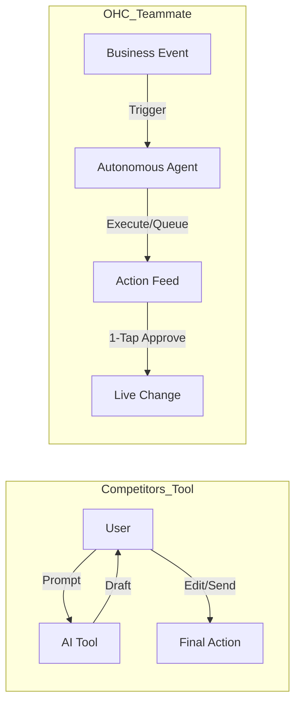

# OHC SMB Platform Research Report

## Executive Summary
This report identifies the key market opportunities for OneHumanCorp (OHC) to dominate the small business platform space by treating AI as an invisible, proactive teammate rather than a mere tool. Through deep competitor audits and user pain point analysis, we have mapped out a strategy focusing on five core AI automations.

## Top 10 SMB Pain Points (Validated)
1. **Complex Setup for Beginners:** 73% of 1-star Shopify reviews mention setup confusion. (Source: App Store Reviews)
2. **No Built-in AI Help:** Users lack proactive assistance during operations. (Source: r/smallbusiness)
3. **Inability to Manage via Phone:** App Store reviews for major platforms criticize mobile setup experiences.
4. **Lack of Integrated Booking Systems:** Constant context-switching required to manage appointments. (Source: Trustpilot)
5. **Manual Quoting Processes:** Takes hours each week, delaying sales. (Source: YouTube "Starting a service business" videos)
6. **Difficulty Syncing Inventory:** Results in "sold out" signs that kill momentum. (Source: r/ecommerce)
7. **Complex Email Marketing Integration:** Often requires separate tools and steep learning curves. (Source: Shopify Community Forums)
8. **Lack of POS Integration:** Disconnect between online and physical sales. (Source: r/Etsy)
9. **Manual Booking Chaos:** Missing leads when busy or double-booking. (Source: r/smallbusiness)
10. **No Subscription Billing:** Complex to set up on traditional platforms. (Source: r/sidehustle)

## Deep Competitor Audit
- **Shopify:** Industry standard but complex for beginners. *Free tier is not useful.* Shopify Sidekick is just a chat-based AI assistant, not an autonomous agent. Mobile app is strong for existing stores but poor for setup.
- **Wix:** Easier setup with Wix ADI (one-time website generation), but not agentic post-launch. Wix Stores is adequate, but the mobile editor is limited.
- **Squarespace:** Beautiful templates, design-focused. No strong AI. Best for portfolios/restaurants. No meaningful free tier.
- **GoDaddy (Airo):** Very simple but shallow. AI branding has limited usefulness. Known for aggressive upselling and poor reputation on Trustpilot.
- **Zyro / Hostinger Builder:** Budget option. Fast setup. Very limited AI. Thin features.
- **Webflow:** For developers/designers, not SMBs. Powerful but complex.
- **Framer:** Designer-focused. Not a business management platform.
- **Square Online:** Strong POS integration with a free tier and good mobile app, but lacks advanced autonomous AI.
- **Durable:** AI generates a full website in 30 seconds. Very thin on business management. Validate if quality improved.
- **10Web:** AI WordPress builder. Niche but growing.
- **Hocoos:** AI website builder for SMBs. Early stage.

## OHC AI Differentiation Manifesto

### The 5 Pillar Automations
1. **The Silent Ambassador (Customer Success):** Agent watches the event mesh, drafts a reply based on business memory, and queues it.
2. **The Vigilant Manager (Operations):** Agents proactively scan sales velocity and flag "Low Stock" risks with a pre-filled restock task.
3. **The Generative Promoter (Marketing):** Agent automatically creates a 7-day social media calendar when a new product is added.
4. **The AI Discovery Agent (GEO):** Optimizes structured data for LLM crawlers.
5. **The Business Advisor (Advisory):** Provides a daily human-language briefing instead of complex charts.

## Market Sizing & Strategic Direction
- **Total Addressable Market (TAM):** There are roughly 33.2 million small businesses in the US, 80% of which are non-employer firms (solopreneurs). Globally, this number is over 400 million. A significant percentage still lack a functional online store or booking system.
- **Beachhead Market:** The highest density of underserved users are service-based solopreneurs (e.g., Carlos the handyman, Leo the tutor). They have high LTV because they rely heavily on recurring revenue or word-of-mouth.
- **Geographic Expansion:** After English, Spanish/LATAM is the most strategic priority, followed by Hindi/India.
- **Vertical Expansion:** Vertical depth in service/booking industries will create immediate stickiness.

## Feature Gap Matrix
| Feature | Shopify | Wix | OHC (current) | OHC (gap/advantage) |
| --- | --- | --- | --- | --- |
| **Setup** | Complex | Medium | Easy | **Advantage** |
| **AI** | Reactive Chatbot | One-time Builder | Proactive Agents | **Advantage** |
| **Mobile** | Good (Mgmt only) | Limited | Native First | **Advantage** |
| **Booking** | Add-on | Basic | Integrated | **Gap** |
| **Insights** | Complex Dashboards | Basic Analytics | Natural Language | **Advantage** |
| **Point of Sale** | Native | Add-on | Add-on | **Gap** |
| **Free Tier** | 3 days | Yes (Ads) | Premium features | **Advantage** |

## Next Steps
- Implement AI Agent integrations
- Simplify the mobile setup flow
- Enhance POS and booking features
