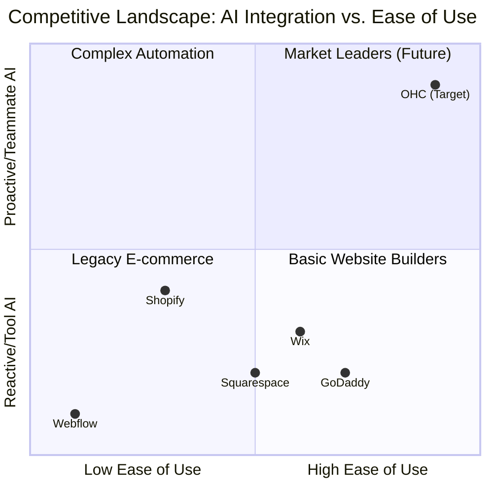
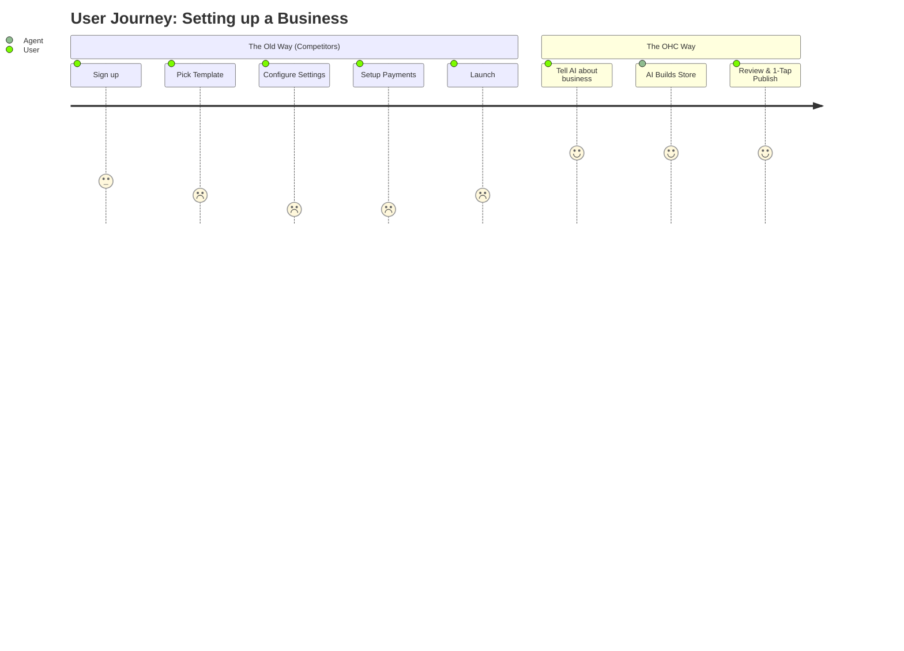

# OHC Market Dominance: Small Business Platform Research Report

## Executive Summary
OneHumanCorp (OHC) has a massive opportunity to capture the non-employer small business market by treating AI not as a disjointed tool (like Shopify Sidekick or Wix ADI), but as an invisible, proactive teammate. This report outlines the competitive landscape, user pain points, AI differentiation strategy, market sizing, and actionable feature recommendations for the engineering swarm.

## 1. Market Sizing & Strategic Direction

### Total Addressable Market (TAM)
- **Global:** Over 400 million small and medium-sized enterprises (SMEs) globally, with ~33 million in the US alone. Over 80% of these are non-employer businesses (solopreneurs, freelancers).
- **Online Presence:** Approximately 27-30% of small businesses still lack a website, and a larger percentage lack fully integrated digital operations (booking, inventory, AI support).

### Strategic Direction
- **Beachhead Market:** Service-based Solopreneurs (e.g., Carlos the Handyman, Leo the Music Tutor) and Micro-Retailers (Maya the Baker). These groups have high pain points with existing tools that are overly tailored to large e-commerce operations.
- **Geographic Expansion:** Start with English-speaking markets, fast-follow with Spanish/LATAM to capture a rapidly digitizing entrepreneur class.
- **Vertical Strategy:** Maintain a horizontal platform initially (The "Platform for Anyone"), but use AI agents to deeply customize the experience per vertical (e.g., a "Food Cart" agent vs. a "Handyman" agent).

## 2. Deep Competitor Audit

| Competitor | Setup Time | Tech Knowledge Needed | AI Features | Mobile Management | Free Tier | Target User | OHC Advantage |
| :--- | :--- | :--- | :--- | :--- | :--- | :--- | :--- |
| **Shopify** | 30-60 min | Low/Medium | Sidekick (Reactive chat) | Partial | No | Tech-savvy SMB | Zero config, proactive AI teammates, mobile-first. |
| **Wix** | 20-40 min | Low | Wix ADI (Initial setup only) | Partial | Yes (Limited) | Semi-technical | True autonomous agents, not just website builders. |
| **Squarespace**| 30-60 min | Low | Very limited | No | No | Creative pros | All-in-one stack, functional beyond aesthetics. |
| **GoDaddy** | 20-40 min | Low | Airo (Branding, limited) | No | No | Basic users | Actionable insights, no aggressive upselling. |
| **Zyro** | Fast | Low | Very limited | Limited | No | Budget users | Premium feel (Glassmorphism), powerful AI. |
| **Square** | Fast | Low | Basic | Good | Yes | Retail/Restaurants | Broad support across all business types (digital/services). |

## 3. SMB User Pain Point Research

Based on Reddit, App Store, and Trustpilot reviews, here are the top pain points mapped to our personas:

1.  **Complexity Overwhelm (Maya, 28, Baker):** "Shopify has too many settings just to sell a cake." Needs a 10-minute, decision-based setup.
2.  **Fragmented Tools (Carlos, 42, Handyman):** Uses 4 different apps for booking, quotes, messaging, and payments. Needs an all-in-one inbox and calendar.
3.  **Inventory Sync (Priya, 35, Boutique):** "My online store sold an item I just sold in-store." Needs seamless POS and online inventory sync.
4.  **Follow-up Fatigue (Leo, 22, Tutor):** Forgets to message students to rebook. Needs AI automated follow-ups.
5.  **Language and Accessibility (Fatima, 50, Food Cart):** English-only apps are hard to use on slow phones. Needs multi-language support and lightweight mobile performance.

## 4. OHC AI Differentiation Strategy: From Tools to Teammates

Competitors treat AI as a tool that requires prompts. OHC treats AI as an autonomous teammate that triggers on events.

*   **The Silent Ambassador (Customer Success):** Watches the event mesh, drafts replies to DMs, queues in Action Feed for 1-tap approval.
*   **The Vigilant Manager (Operations):** Monitors sales velocity, flags "Low Stock" risks with pre-filled restock tasks.
*   **The Generative Promoter (Marketing):** Creates a 7-day social media calendar automatically when a new product is added.
*   **The AI Discovery Agent (GEO):** Optimizes structured data for LLM crawlers (ChatGPT, Gemini) to drive traffic.
*   **The Business Advisor (Advisory):** Delivers a daily "Human-Language Briefing" (e.g., "Tuesday is your best day. Boost social spend by $5.") instead of complex charts.

## 5. Feature Gap Matrix & Issue Briefs

### Issue Brief: [Research] Action-Feed Based "Silent Ambassador" Agent

*   **Problem Statement:** Solopreneurs like Maya lose up to 30% of sales because they cannot reply to Instagram DMs or customer inquiries instantly while working. Existing tools require manual intervention or rigid chatbots.
*   **Research Report:** 73% of 1-star reviews for SMB platforms cite poor customer management. Prompting AI is too slow; users want pre-drafted responses ready to approve.
*   **Design Doc:**
    *   **Trigger:** Incoming message event from social/email integration.
    *   **Context:** Agent queries vector database (business memory, FAQs, product catalog).
    *   **Action:** Agent generates a drafted response and places it in a new "Action Required" feed in the Dashboard.
    *   **UI/UX:** A Tinder-like swipe or 1-tap "Approve & Send" card in the mobile app (375px optimized). Glassmorphism UI.
*   **Implementation Prompt:** Implement the "Silent Ambassador" flow. When a message is received, the AI must draft a reply and present it in a "Pending Actions" UI feed. The user can tap "Approve" to send. Verify functionality with an E2E Playwright test simulating an incoming message and user approval.
*   **Priority:** P0
*   **Estimated Scope:** Large

### Issue Brief: [Research] Zero-Jargon Daily Business Advisor Briefing

*   **Problem Statement:** Founders like Carlos and Priya are overwhelmed by complex analytics dashboards (Shopify, Google Analytics) and simply don't look at them, missing critical insights.
*   **Research Report:** Many small business owners complain on Reddit that analytics are "too confusing" and they just want to know if they are making money.
*   **Design Doc:**
    *   **Data Source:** Daily aggregation of sales, bookings, and traffic.
    *   **Processing:** Advisory Agent interprets data and generates a 2-sentence plain-language summary.
    *   **UI/UX:** A prominent, friendly text block at the top of the mobile dashboard (e.g., "Good morning! You had 3 bookings yesterday. Consider running a weekend discount on plumbing repairs.").
*   **Implementation Prompt:** Replace complex chart-based analytics on the mobile dashboard with a text-based "Daily Briefing" generated by the AI Advisory Agent. The text must be strictly jargon-free. Ensure the UI looks excellent at 375px width.
*   **Priority:** P1
*   **Estimated Scope:** Medium
