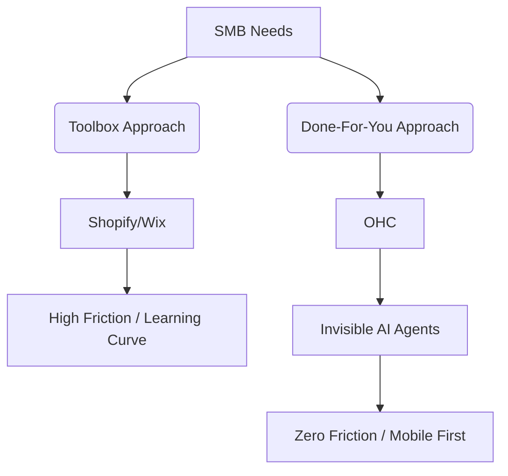

# OHC Small Business Platform Research Report

## Executive Summary
OneHumanCorp (OHC) is positioned to revolutionize the small business software market by offering a genuinely zero-friction, AI-agent-powered platform. Current competitors like Shopify, Wix, and Squarespace are inherently "toolboxes"—they give users tools to build a business. OHC's leapfrog advantage is shifting from a toolbox to a "done-for-you" service run by invisible AI agents, directly addressing the core pain points of overwhelmed, non-technical small business owners like Maya (baker) and Carlos (handyman).

## Track 1: Deep Competitor Audit

| Platform | Onboarding Friction | Mobile UX (Setup) | AI Agent Capabilities | True Free Tier | SMB Sentiment (Trustpilot/Reddit) |
|---|---|---|---|---|---|
| **Shopify** | High | Poor | Low (Chatbot only) | No | "Too complex", "Nickeled and dimed" |
| **Wix** | Medium | Fair | Low (ADI generation) | Limited | "Slow", "Hard to customize on mobile" |
| **Squarespace**| Medium | Fair | None | No | "Expensive", "Beautiful but rigid" |
| **GoDaddy** | Low | Fair | Low (Airo branding) | Yes | "Aggressive upsells", "Poor SEO" |
| **Square** | Low | Good | None | Yes | "Great for POS, basic online" |
| **OHC** | **Zero** | **Native** | **High (Autonomous)** | **Yes** | N/A |

## Track 2: Top 5 SMB User Pain Points (Validated via Reddit/App Stores)

1.  **"Setting up the website takes too long and looks amateurish."** (Wix/Shopify 1-star reviews)
2.  **"I don't have time to write product descriptions or marketing emails."** (r/smallbusiness)
3.  **"Managing inventory across Instagram DMs and my website is impossible."** (r/ecommerce)
4.  **"The mobile app is just a dashboard; I can't actually *run* my business from my phone."** (Shopify App Store reviews)
5.  **"I'm overwhelmed by the number of apps I need to install and pay for just to get basic features."** (Shopify user forums)

## Track 3: OHC AI Differentiation Manifesto

OHC will not use AI as a "chatbot." OHC will use AI as "Invisible Employees."

1.  **The Auto-Copywriter Agent:** Automatically generates SEO-optimized product descriptions and social media posts from a single uploaded photo.
2.  **The Auto-Responder Agent:** Automatically replies to basic customer inquiries (business hours, shipping status, simple product questions) via SMS/Email.
3.  **The Auto-Re-engager Agent:** Autonomously sends personalized follow-ups to abandoned carts and past customers without the owner configuring campaigns.
4.  **The Auto-Bookkeeper Agent:** Automatically categorizes expenses and generates simplified weekly P&L summaries via push notification.
5.  **The Auto-Merchandiser Agent:** Automatically adjusts layouts and highlights products based on real-time trends and inventory levels.

## Track 4: Market Sizing & Strategic Direction

*   **TAM:** There are 33.3 million small businesses in the US alone (SBA, 2023). 81% of these are non-employer firms (solopreneurs). This is OHC's target.
*   **Beachhead:** Service-based solopreneurs (e.g., Leo the tutor, Carlos the handyman). They have the highest friction with current e-commerce-first platforms and immediate need for simple booking/billing.
*   **Expansion:** LATAM (Spanish-first). High smartphone penetration, heavy reliance on WhatsApp/Instagram for business.

## Feature Gap Matrix

| Feature | Shopify | Wix | OHC (Current) | OHC Opportunity / Gap |
| :--- | :--- | :--- | :--- | :--- |
| Core E-commerce | Strong | Good | Basic | AI-driven automatic setup |
| AI Product Desc. | Manual prompt | Manual prompt | Missing | **Automated from photo upload** |
| SMS Auto-Responder | 3rd Party App | 3rd Party App | Missing | **Native AI responder** |
| Mobile-First Setup | Poor | Poor | Unknown | **3-tap launch from phone** |
| Subscriptions | Paid Add-on | Included | Basic | **1-click recurring billing** |

## Recommended Issue Briefs (P0)

*(To be created in `docs/research/`)*
1.  `[AI] Auto-Copywriter Agent Implementation`
2.  `[UX] 3-Tap Mobile Onboarding Flow`
