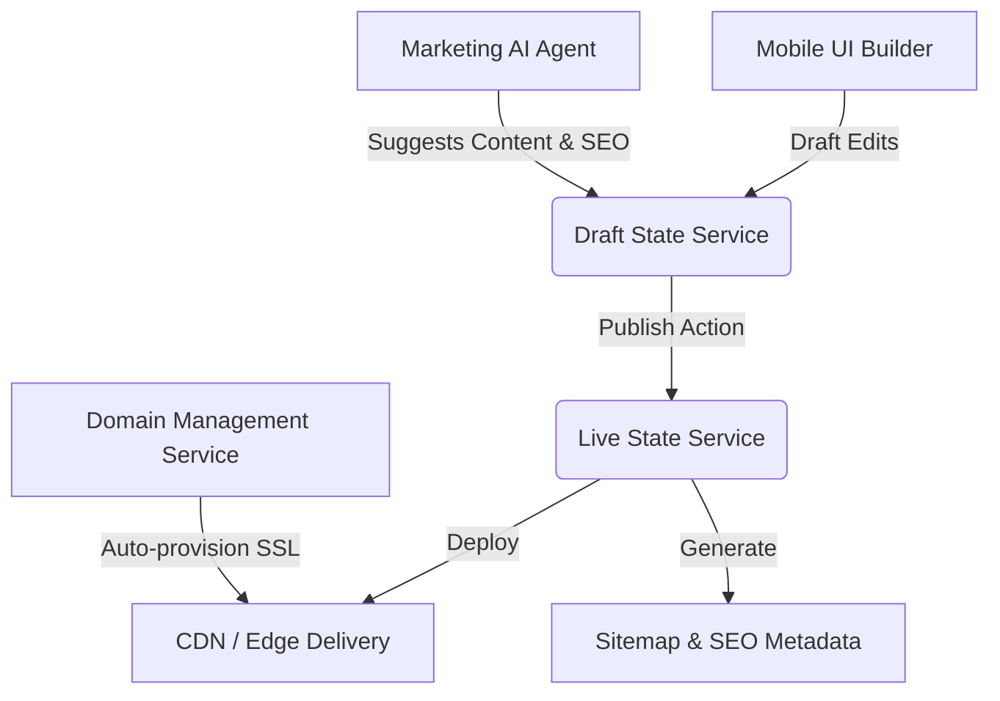

# Issue Brief: Website & Storefront Builder Architecture

## Title
Website & Storefront Builder Architecture: A Mobile-First, AI-Driven Drag-and-Drop Builder

## Problem Statement
Building a website is currently too complex for our core personas—Maya (baker), Carlos (handyman), and Fatima (food cart). They are overwhelmed by technical jargon, complicated design interfaces, and the effort required to make a site look professional and rank well on Google. They need a simple, intuitive, mobile-first builder that allows them to go from zero to a live, beautiful storefront in under 10 minutes, all from a 375px phone screen. They don't want to worry about SEO, SSL certificates, or domain management; the platform should handle these invisibly.

## Research Report
- **Goal**: Design the user experience and high-level architecture for a mobile-first, drag-and-drop website and storefront builder.
- **Findings**:
  - The builder must fundamentally support a mobile-first experience. Content blocks need to stack naturally on small screens and expand elegantly on desktops.
  - A block-based architecture (hero, product grid, testimonials) simplifies the cognitive load for users compared to absolute positioning or complex grid layouts.
  - Users want a simple "publish" mechanism without dealing with complex staging environments.
  - Domain routing and SSL provisioning must be entirely zero-touch.
- **Competitive Analysis**:
  - **Shopify / Wix / Squarespace**: Offer extensive builders, but they are often desktop-heavy and require significant time to master. Wix AI helps but still exposes a lot of manual tweaking.
  - **GoDaddy**: Fast setup but rigid and often lacks the premium aesthetic.
  - **OHC Advantage**: The builder is primarily an AI-guided assembly of premium content blocks, managed effortlessly from a phone. The "Marketing & Advertising" AI agent actively helps generate copy, select images, and structure the page, while handling all SEO metadata invisibly.

## Design Doc

### Content Blocks
The builder relies on predefined, beautifully styled "Glassmorphism" blocks:
- **Hero**: Main headline, subtitle, background image/color, primary Call to Action (CTA).
- **Product Grid**: Dynamically displays top-selling or selected products from the business's inventory.
- **Text & Image**: Simple informational block with an image alongside or above text.
- **Testimonials**: Auto-pulled from the Customer Success agent's review requests.
- **Booking Calendar**: Native integration with the Operations agent for service appointments.
- **Contact Form**: Simple form to capture leads or inquiries, routing directly to the Customer Success inbox.

### Templates & Customization
- **Templates**: Users start with an AI-selected base template mapped to their business type (e.g., Baker, Handyman). Templates pre-populate the essential blocks.
- **Customization**: Users can drag to reorder blocks, toggle visibility, and adjust global design tokens (color palette, typography) without editing individual block CSS.

### Publishing Flow
- **Draft Mode**: Changes are saved continuously to a draft state. The AI can propose draft modifications.
- **Live Publishing**: A single "Publish" button promotes the draft state to live. Old live versions are kept as revision history for simple rollback.

### Automated SEO
- The Marketing AI agent automatically generates meta titles, descriptions, and structured data (JSON-LD) based on page content.
- Image alt texts are auto-generated.
- Sitemaps are automatically maintained and submitted to search engines when the site goes live.

### Domains & SSL
- **Provisioning**: Every tenant receives an `*.ohc.shop` subdomain by default with an auto-provisioned SSL certificate.
- **Custom Domains**: Paid tiers allow users to link a custom domain. The system handles DNS verification checks and automatically issues and renews the SSL certificate without user intervention.

### Architecture Diagram

### Mobile UX Flow
1. **Setup**: AI asks 3 simple questions (Business Name, Type, Vibe).
2. **Generation**: AI generates a complete draft site using relevant blocks.
3. **Editing**: User previews the site on their 375px screen. Tapping a block opens a simple bottom sheet to edit text, swap images, or hide the block.
4. **Publishing**: User taps a prominent "Publish Site" button at the top of the screen. A success animation plays, and the live link is presented with a shareable QR code.

## Implementation Prompt
Implement the Website & Storefront Builder feature. The objective is to build a mobile-first editing experience where a user can manage their site's layout using a set of predefined content blocks (Hero, Product Grid, Testimonials, etc.). The user must be able to view their draft site, edit content within blocks via a simple mobile-friendly interface, and publish changes to a live state with a single tap. The Marketing AI agent should automatically generate and maintain SEO metadata for the published site. Assume domain and SSL provisioning are handled by external services, but ensure the UI provides clear status indicators for domain setup. Acceptance criteria include a fully functional mobile UI that allows block reordering and content editing, seamless draft-to-live publishing, and automatic SEO metadata generation upon publishing.

## Priority
P0

## Estimated Scope
Large
