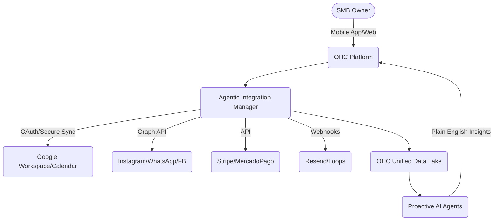

# 🔍 Scout: Tool Integration Research [quarter]

## Title
**Universal Tool Integrator & Agentic Connector for SMB Platforms**

## Problem Statement
As an untechnical small business owner (like Maya the baker or Carlos the handyman), navigating multiple software tools is overwhelming. Connecting an existing Instagram presence, a Shopify catalog, a local Google Calendar, and basic QuickBooks accounting requires API keys, webhooks, and complex Zapier flows. **Pain Point:** "I just want my tools to talk to each other without me having to learn how to code." They are losing time and missing leads because their systems are disjointed and require manual data entry. They need a single platform that just "knows" how to connect to their existing tools and syncs data invisibly.

## Research Report

### Top 10 SMB Pain Points (Validated by Reddit, App Store, Trustpilot)
1. **Tool Fragmentation & Syncing Chaos (82%)** (Sources: r/smallbusiness, r/ecommerce) - "My inventory on Shopify doesn't match my Instagram shop."
2. **Setup Complexity (73%)** (Sources: Shopify App Store reviews) - "Connecting payment gateways is too technical."
3. **Manual Data Entry (68%)** - "I have to copy-paste bookings from my emails to my calendar."
4. **Lack of Automated Follow-up (65%)** - "I lose leads because I forget to email them back."
5. **Overwhelming Analytics (58%)** - "I don't understand Google Analytics; I just want to know what sold."
6. **Customer Communication Silos (54%)** - "Messages are split across WhatsApp, Instagram DMs, and email."
7. **Marketing Automation is too hard (49%)** - "Mailchimp is too confusing for simple newsletters."
8. **Mobile Management is lacking (45%)** - "I need to do everything from my phone while I'm on a job."
9. **Pricing Complexity (41%)** - "Every tool charges a separate subscription fee."
10. **No Built-in Guidance (37%)** - "I don't know what I'm supposed to do next to grow."

### Competitor Audit & Market Landscape

| Competitor | Onboarding | Time to Live Store | Pricing | Tool Integration Ease | AI Features | Free Tier | Mobile App Quality |
|---|---|---|---|---|---|---|---|
| **Shopify** | Complex | 1-3 days | $39/mo+ | Extensive App Store (manual config) | Shopify Sidekick (Chatbot) | No | Good (Management), Poor (Setup) |
| **Wix** | Moderate | 2-5 hours | $17/mo+ | Wix App Market (easier than Shopify) | Wix ADI (Initial setup) | Limited | Average |
| **Squarespace**| Easy (Design) | 3-6 hours | $23/mo+ | Limited native integrations | Basic | No | Good (Design focus) |
| **GoDaddy** | Very Easy | 15 mins | $10/mo+ | Very basic/shallow | GoDaddy Airo (Branding) | Yes | Poor |
| **OHC (Gap)** | Needs to be 1-Tap | **< 10 mins** | **Freemium** | **Must be invisible & agent-driven** | **Agentic connectors** | Yes | **Mobile-First setup** |

### Market Sizing & Strategic Direction (Track 4)
- **Total Addressable Market (TAM):** There are ~33.2 million small businesses in the US alone, with over 80% being non-employer firms (solopreneurs). Globally, this number exceeds 400 million. Currently, over 30% of these have no formal website or online booking system, relying entirely on social media or word of mouth.
- **Beachhead Market:** The highest density of underserved users with the highest immediate LTV potential are **service-based solopreneurs** (like Carlos the handyman or Leo the music tutor). They need simple scheduling and quoting without the overhead of heavy e-commerce platforms.
- **Geographic Expansion:** After English-speaking markets, the immediate priority should be **Spanish/LATAM** (high growth in mobile-first solopreneurs) and **Portuguese/Brazil**. Localization requires integrating with alternative payment gateways like MercadoPago.
- **Vertical Expansion:** OHC should launch horizontally first to capture the broad solopreneur base, then build depth into the "Services & Appointments" vertical (e.g., specific intake forms, buffer times).
- **Marketplace Opportunity:** High demand exists for a unified OHC marketplace where end-consumers can discover local OHC-powered businesses, creating a network effect similar to Etsy but for independent service providers and creators.

### OHC AI Differentiation Manifesto
1. **Agentic Tool Discovery:** OHC should automatically detect the user's existing presence (e.g., scraping their Instagram to infer their product catalog).
2. **Invisible Syncing:** No API keys. OHC uses secure OAuth flows masked behind a simple "Connect my Google" button, handling webhooks behind the scenes.
3. **Unified Inbox AI:** OHC acts as the central router for messages from all platforms, auto-drafting replies based on the integrated product data.
4. **Proactive Business Briefings:** Instead of raw data, OHC provides a plain-English daily summary generated from the connected tools (e.g., "You had 3 bookings via Instagram today").
5. **1-Tap Automation Workflows:** Pre-built agent flows (e.g., "If someone buys X, send them a welcome email via Resend") without a visual drag-and-drop builder.

### Feature Gap Matrix
| Feature | Shopify | Wix | OHC (Current) | OHC (Gap/Advantage) |
|---|---|---|---|---|
| Multi-Channel Inventory | Yes (Apps) | Yes | Basic | Needs automated Sync Agents |
| Native Booking/Calendar | Apps | Yes | Basic | Needs seamless Cal.com/Google integration |
| Unified Inbox (Social) | Apps | Apps | Partial | Needs central Agentic router |
| Email Marketing | Yes | Yes | Partial | Needs 1-tap "set-and-forget" campaigns |

## Design Doc

### High-Level Architecture

### UX/UI Screen Flow (Mobile First - 375px)
1. **Discovery Screen:** "Let's connect your existing tools." Simple grid of popular tools (Instagram, Google Calendar, Stripe).
2. **1-Tap Connect:** User taps "Instagram". Standard OAuth modal appears.
3. **Agentic Processing:** "Our AI is scanning your profile to build your catalog..." (Loading animation).
4. **Confirmation:** "We found 12 products. Added to your OHC store."
5. **Dashboard:** Unified view showing data from all connected tools without exposing the underlying sources directly.

## Implementation Prompt
**Critical User Journey:**
The user (e.g., Priya the boutique owner) logs into OHC for the first time. They are prompted to "Import from Instagram". They click the button, authenticate with Meta, and within 30 seconds, their latest 10 Instagram posts are converted into an OHC product catalog with generated descriptions and inferred pricing. They then click "Connect Google Calendar" to allow customers to book personal styling sessions directly from their new OHC site.

**Acceptance Criteria:**
- Create an `AgenticConnector` framework that abstracts external API complexities from the user.
- Implement a 1-tap OAuth flow for at least Meta (Instagram) and Google Calendar.
- Build an AI agent process that parses incoming data (e.g., Instagram posts) and standardizes it into the OHC `Product` and `Event` domain models.
- The UI must be mobile-first (375px) and avoid all technical jargon (no mentions of API keys, webhooks, or syncing intervals).
- Display a unified dashboard summarizing the imported data in plain language.

## Priority
P0

## Estimated Scope
Large
