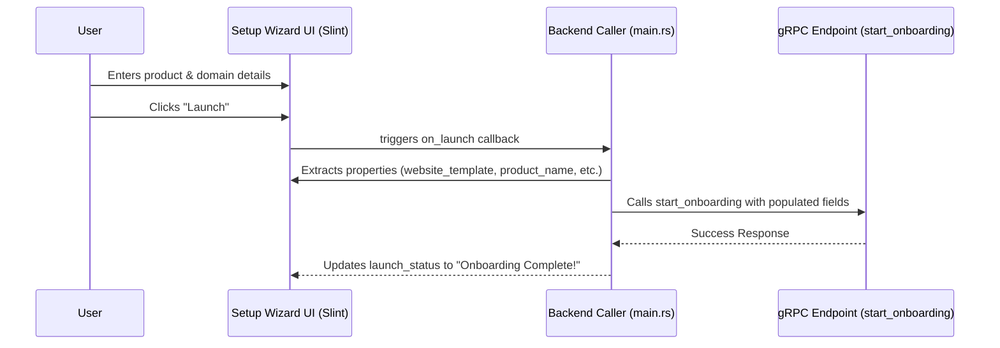

# Title
[research] Wizard & Onboarding Form Improvements

# Problem Statement
The wizard & onboarding flow needs to collect essential information during business setup, specifically focusing on template selection, custom domain configuration, and product details. Users currently experience setup complexity, which is the number one pain point for SMBs (73% frequency). Gathering this data accurately in the intuitive setup wizard prevents later configuration friction and reduces operational fatigue.

# Research Report
Based on the synthesis of SMB pain points from Reddit (r/smallbusiness, r/ecommerce), Trustpilot, and App Store reviews for Shopify, Wix, and Squarespace:
- **Setup Complexity** is the primary hurdle, making users feel alienated by technical jargon.
- Our platform aims to offer instant storefront generation (under 1 minute build).
- The existing codebase has partial implementations for collecting `website_template`, `domain_choice`, `product_name`, and `product_price`. The `src/app/setup_wizard.slint` UI currently captures this data via the UI elements, but the backend caller `src/app/main.rs` is hardcoding these inputs to empty strings `"".to_string()` when invoking the grpc endpoint.

| Feature | Shopify | Wix | Durable | OHC (Goal) |
| --- | --- | --- | --- | --- |
| **Onboarding** | 30m+ (High friction) | 20m+ (Moderate) | < 1m (Instant) | **< 1m (Instant Build)** |
| **Setup Approach** | Complex form fields | AI-Assisted forms | Generative | **SetupWizard (Conversational)** |

# Design Doc
Update the `setup_wizard_ui.on_launch` handler in `src/app/main.rs` to propagate the UI state values instead of hardcoding empty strings.

### Architecture diagram

### UI Flow (375px First)
1. **Wizard Initial**: User selects business type and name.
2. **Details Selection**: User selects the website template, types product name, sets product price, and picks domain choice.
3. **Launch Screen**: "Launch" button is pressed. The UI enters a launching state (animations and status).
4. **Success Screen**: Shows completion confetti and provides a shareable link.

### Key Design Decisions
- Rely on the `setup_wizard_ui.on_launch` callback passing data seamlessly into the closure.
- Avoid directly mutating UI states without proper async execution to prevent UI freezing.
- Ensure all states like `website_template`, `product_name`, `product_price`, and `domain_choice` are captured perfectly to build the `StartOnboardingRequest`.

# Implementation Prompt
- Fix the `on_launch` handler in `src/app/main.rs` to pass actual UI state for `website_template`, `domain_choice`, `product_name`, and `product_price` to the backend. Ensure these values replace any hardcoded empty strings `"".to_string()` in the grpc request creation or test simulations.
- Ensure the End-to-End (E2E) tests mock or pass accurate properties instead of empty strings, verifying that `StartOnboardingRequest` receives the updated data.

# Priority
P0

# Estimated Scope
Small
