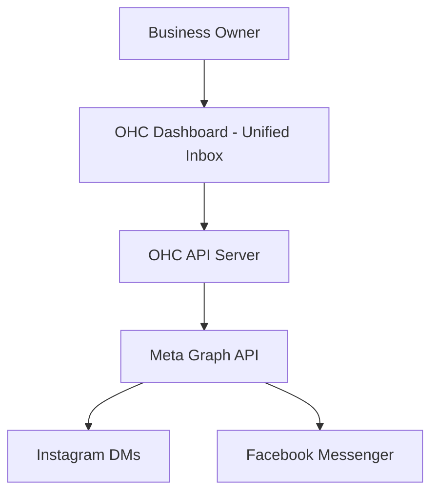
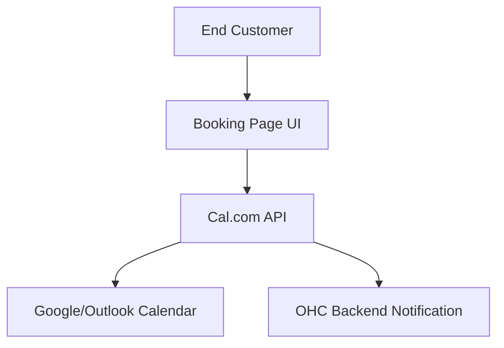
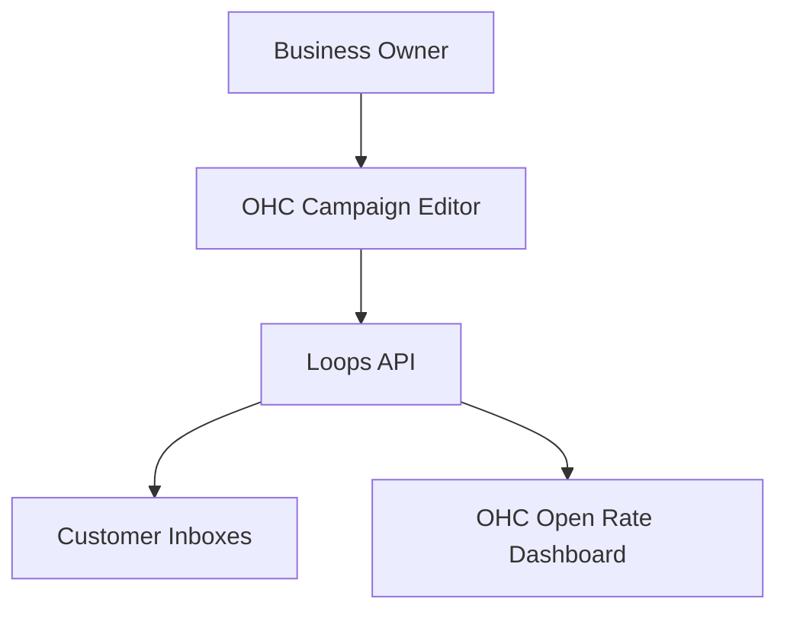
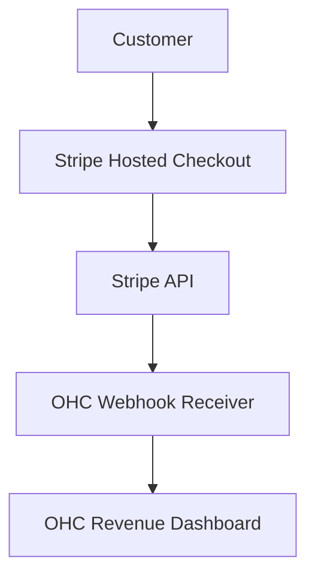
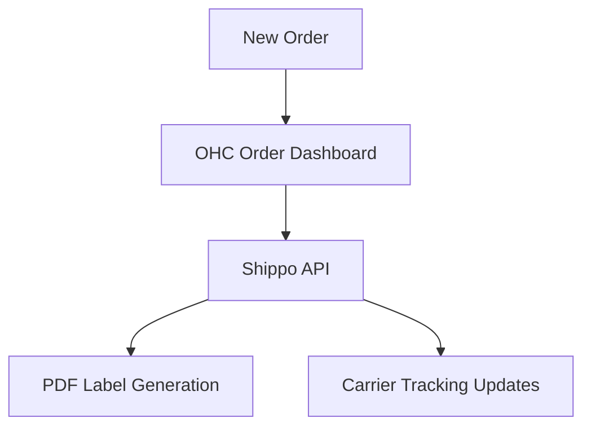
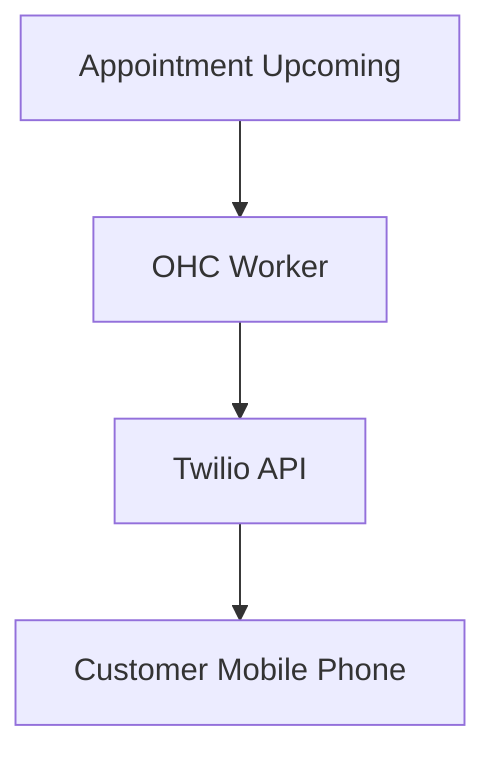
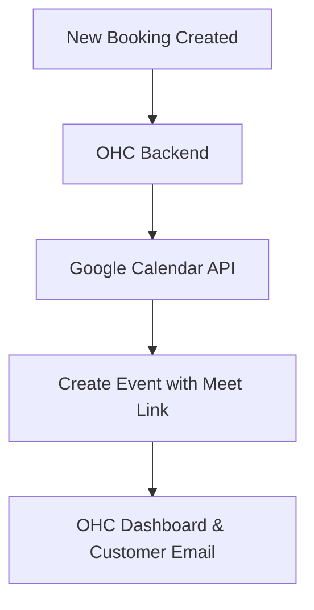

# 🔎 Scout: Tool Integration Research [quarter]

This report evaluates key tool integrations across multiple categories to expand the One Human Corp (OHC) platform's capabilities for small business owners.

---

## Social Media Integration: Meta Graph API (Instagram & Facebook DMs)

**Title**: Unified Social Media Inbox via Meta Graph API
**Problem Statement**: Small business owners, like Fatima who runs a bakery, miss customer orders because messages are scattered across Instagram DMs, Facebook comments, and WhatsApp. Checking multiple apps manually takes time away from her actual business and leads to lost revenue when inquiries are missed.
**Research Report**:
- **Tool Evaluated**: Meta Graph API for Messenger and Instagram DMs
- **What problem it solves for which persona**: Allows Fatima to see and reply to all customer inquiries in one place.
- **How it would appear to the business owner**: A simple "Connect Instagram/Facebook" button in the OHC platform. Once connected, a "Unified Inbox" appears where all messages look like normal chat conversations.
- **Key advantages and risks**: Highly reliable and industry-standard. Risk involves the complex Meta app review process and OAuth flow which can be fragile.
- **Rough pricing estimate**: Free for basic API access; scales with heavy usage but generally negligible for SMBs.
- **Environment**: Works seamlessly in both Cloud (multi-tenant) and Standalone (local) modes via standard OAuth redirects.

**Design Doc**:

- **Trigger**: Business owner navigates to "Inbox" and clicks "Connect Social Media".
- **Action**: Authenticates via Meta, fetching recent messages and setting up webhooks.
- **View**: A unified chat interface displaying messages from all connected channels.

**Implementation Prompt**: Build a "Unified Inbox" screen that lets users connect their Facebook and Instagram business accounts. The screen should show a unified list of conversations and allow the user to send replies directly from OHC. The setup must be a 1-click OAuth flow with plain English explanations, hiding all technical webhook configuration from the user.
**Priority**: P0
**Estimated Scope**: Large

---

## Calendar & Scheduling: Cal.com

**Title**: Automated Customer Booking with Cal.com
**Problem Statement**: Scheduling consultations or lessons involves endless back-and-forth emails ("Does Tuesday at 2 PM work?"). This frustrates customers and eats up the business owner's day.
**Research Report**:
- **Tool Evaluated**: Cal.com Open Source API
- **What problem it solves for which persona**: Lets service-based business owners (like a local tutor) send a link where customers can book available time slots directly.
- **How it would appear to the business owner**: A "Booking Links" page where they can set their working hours and get a shareable URL to give to customers.
- **Key advantages and risks**: Cal.com is open-source, embeddable, and developer-friendly. Risk is managing the two-way sync if the owner uses multiple external calendars (Google + Outlook).
- **Rough pricing estimate**: Free core tier; custom branding is ~$12/mo.
- **Environment**: Fully supports both Cloud and Standalone modes due to its open-source nature and robust API.

**Design Doc**:

- **Trigger**: Business owner creates a "15-min Consultation" event type.
- **Action**: Cal.com generates a booking link and syncs availability.
- **View**: The owner sees a list of upcoming appointments in their OHC dashboard.

**Implementation Prompt**: Create a "Schedule & Bookings" module where a business owner can connect their Google Calendar, set their working hours, and generate a personal booking link. When a customer books a slot, the appointment should automatically appear in the OHC dashboard's daily overview. Keep the time zone settings automatic to prevent confusion.
**Priority**: P1
**Estimated Scope**: Medium

---

## Email Marketing: Loops

**Title**: Customer Email Campaigns via Loops
**Problem Statement**: Business owners want to announce sales or new products to their loyal customers but find tools like Mailchimp too complex, bloated, and expensive. They just need to send a nice-looking email to their contact list easily.
**Research Report**:
- **Tool Evaluated**: Loops (loops.so)
- **What problem it solves for which persona**: Allows a boutique store owner to easily send a weekly newsletter or promo code.
- **How it would appear to the business owner**: An "Email Customers" tab with simple templates and a straightforward "Send to All" button.
- **Key advantages and risks**: Very clean API, great templates, fast integration. Risk is domain reputation management and strict anti-spam requirements that might confuse non-technical users.
- **Rough pricing estimate**: Free up to 1k contacts, then ~$16/mo.
- **Environment**: Cloud-first API; works in Standalone mode as an external service call.

**Design Doc**:

- **Trigger**: Owner writes an email in OHC and clicks "Send".
- **Action**: OHC syncs the contact list to Loops and triggers the campaign broadcast.
- **View**: A simple analytics view showing "Sent", "Opened", and "Clicked".

**Implementation Prompt**: Add an "Email Campaigns" feature to the OHC dashboard. The user should be able to pick a simple template, write a message, and send it to all their registered customers. Show a simple success screen and a basic "open rate" percentage later. All DNS and domain verification steps must be abstracted away or guided via an intuitive wizard.
**Priority**: P2
**Estimated Scope**: Medium

---

## Payment Processing: Stripe

**Title**: Seamless Global Payments with Stripe
**Problem Statement**: Getting paid online is hard. Setting up merchant accounts takes weeks, and small businesses need to accept credit cards securely without worrying about compliance or fraud.
**Research Report**:
- **Tool Evaluated**: Stripe APIs (Checkout & Connect)
- **What problem it solves for which persona**: Enables quick, secure credit card acceptance for any business owner selling goods or services online.
- **How it would appear to the business owner**: A "Payments" tab where they enter their bank details. After that, they can generate payment links or automatically charge for bookings.
- **Key advantages and risks**: Industry-leading developer experience, massive global reach. Risk is account bans due to algorithmic fraud detection which can freeze small business funds unexpectedly.
- **Rough pricing estimate**: 2.9% + 30¢ per successful card charge. No monthly fee.
- **Environment**: Works perfectly in both Cloud and Standalone modes via API and webhooks.

**Design Doc**:

- **Trigger**: Owner generates an invoice or payment link in OHC.
- **Action**: Customer pays via Stripe; Stripe sends a webhook to OHC.
- **View**: Owner sees a "Paid" status and a growing revenue graph.

**Implementation Prompt**: Implement a "Get Paid" setup wizard where the business owner can connect a bank account. Once connected, allow them to create simple "Payment Links" for specific amounts (e.g., "$50 for Consultation") that they can text or email to customers. When paid, the dashboard should show a friendly notification and update their total earnings.
**Priority**: P0
**Estimated Scope**: Large

---

## Shipping & Logistics: Shippo

**Title**: Automated Shipping Labels via Shippo
**Problem Statement**: E-commerce sellers spend hours copying and pasting customer addresses from their storefront into carrier websites (USPS, UPS) to buy and print shipping labels manually.
**Research Report**:
- **Tool Evaluated**: Shippo API
- **What problem it solves for which persona**: Lets an independent maker automatically generate shipping labels for new orders without re-typing addresses.
- **How it would appear to the business owner**: An "Orders to Ship" list. Next to each order is a "Print Label" button that generates a printable PDF and shows the exact shipping cost.
- **Key advantages and risks**: Aggregates many carriers into one API, offers discounted rates. Risk is complex international customs forms and package dimension handling.
- **Rough pricing estimate**: Free tier available; 5¢ per label + carrier postage costs.
- **Environment**: Cloud API compatible with both Cloud and Standalone OHC deployments.

**Design Doc**:

- **Trigger**: Owner clicks "Fulfill Order".
- **Action**: OHC sends address and weight to Shippo, purchases the label, and retrieves the tracking number.
- **View**: Owner downloads the PDF label to print.

**Implementation Prompt**: Build an "Order Fulfillment" screen where a user can view unfulfilled physical orders. Add a "Buy & Print Label" button that automatically fetches the cheapest USPS/UPS rate, charges the owner's account, and provides a printable PDF label. Hide the complex box-dimension settings under an "Advanced Options" toggle.
**Priority**: P1
**Estimated Scope**: Large

---

## SMS & Notifications: Twilio

**Title**: Reliable SMS Notifications with Twilio
**Problem Statement**: Emails often go unread. For urgent updates (like "Your table is ready" or "Your appointment is in 1 hour"), businesses need to reach customers via text message, especially for users with lower English proficiency who rely heavily on SMS.
**Research Report**:
- **Tool Evaluated**: Twilio Programmable SMS
- **What problem it solves for which persona**: Allows a restaurant or clinic owner to send automated SMS reminders to reduce no-shows.
- **How it would appear to the business owner**: A simple toggle in settings: "Send SMS reminders to customers". No coding or API keys required from them.
- **Key advantages and risks**: Global reach, extremely reliable. Risk is A2P 10DLC compliance in the US, which requires business registration and can take weeks to approve, confusing small owners.
- **Rough pricing estimate**: ~$0.0079 per message in the US.
- **Environment**: Works seamlessly in both Cloud and Standalone modes.

**Design Doc**:

- **Trigger**: System detects an appointment is 24 hours away.
- **Action**: OHC triggers a Twilio SMS API call.
- **View**: Owner sees a "Reminder Sent" checkmark next to the appointment.

**Implementation Prompt**: Create a feature that automatically sends an SMS reminder for booked appointments. The business owner should simply see a toggle switch to enable SMS reminders. Abstract all Twilio API interactions. Provide a simple template editor (e.g., "Hi [Name], reminder for your booking tomorrow at [Time]") to keep it foolproof.
**Priority**: P1
**Estimated Scope**: Medium

---

## Video Conferencing: Google Meet

**Title**: 1-Click Video Calls with Google Meet
**Problem Statement**: Virtual service providers (tutors, therapists) struggle with generating and emailing Zoom/Meet links manually for every appointment, leading to lost links and frustrated clients.
**Research Report**:
- **Tool Evaluated**: Google Calendar API (with Meet integration)
- **What problem it solves for which persona**: Automatically creates a unique video meeting link for every booked consultation.
- **How it would appear to the business owner**: When viewing an upcoming appointment, a "Join Video Call" button is prominently displayed for both the owner and the customer.
- **Key advantages and risks**: Free, universally recognizable, and no software installation required for the customer. Risk involves Google's strict OAuth verification requirements for production apps.
- **Rough pricing estimate**: Free (included with Google accounts).
- **Environment**: Fully supports Cloud and Standalone modes via standard OAuth 2.0.

**Design Doc**:

- **Trigger**: A new virtual appointment is scheduled.
- **Action**: OHC requests a new Calendar event with `conferenceData` enabled.
- **View**: Dashboard shows a clear "Join Call" button.

**Implementation Prompt**: Integrate video conferencing directly into the booking system. When a business owner links their Google account, automatically attach a Google Meet link to all virtual appointments. The dashboard must prominently display a "Join Video Call" button exactly 15 minutes before the meeting starts, removing the need for the owner to search their email for the link.
**Priority**: P2
**Estimated Scope**: Medium
