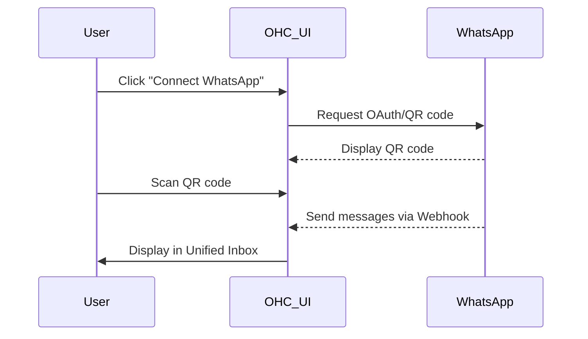
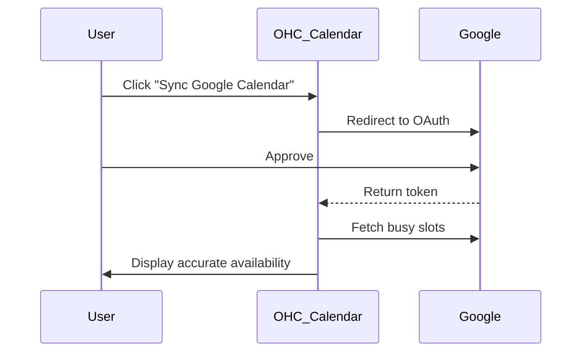
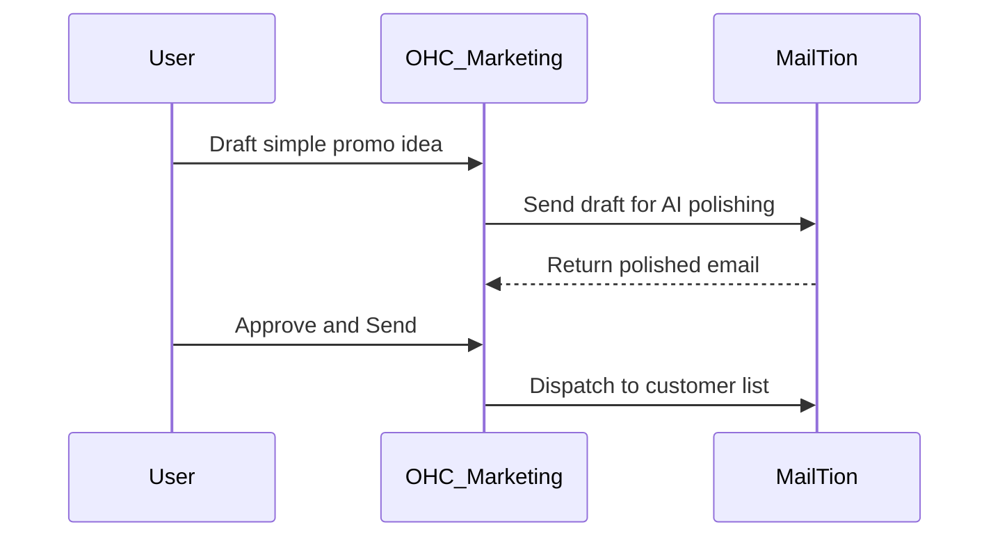
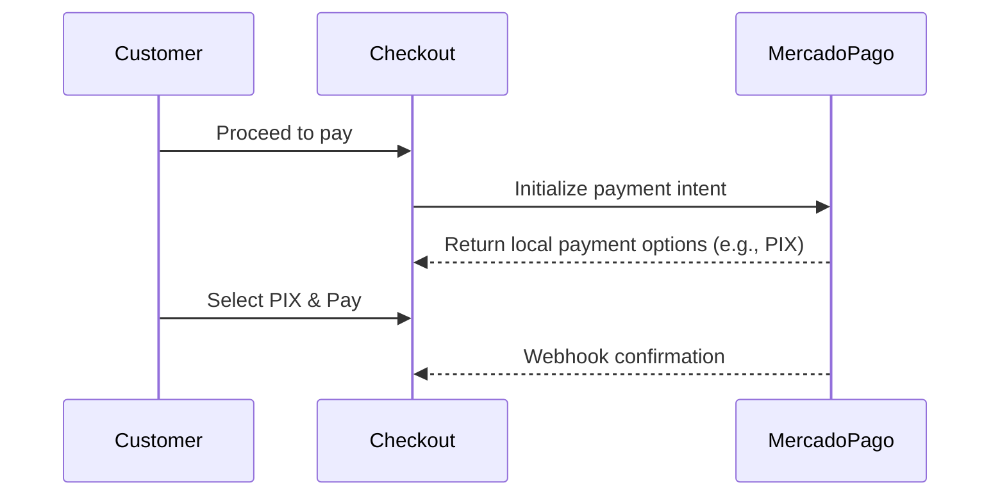
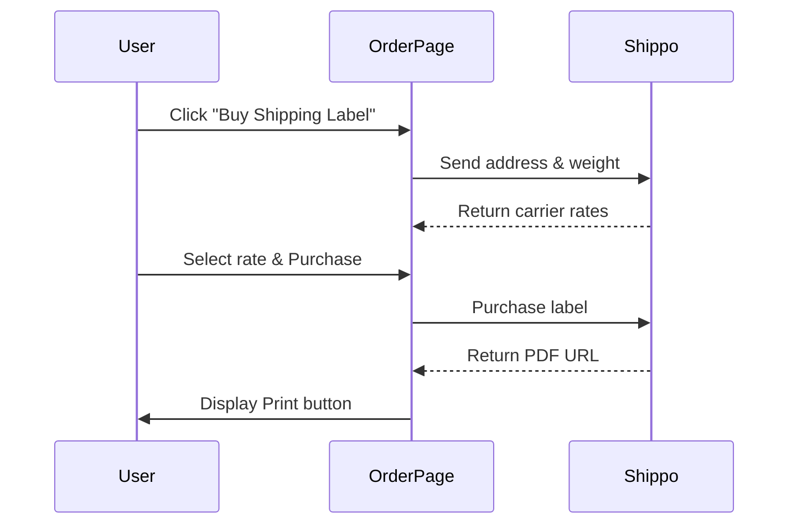
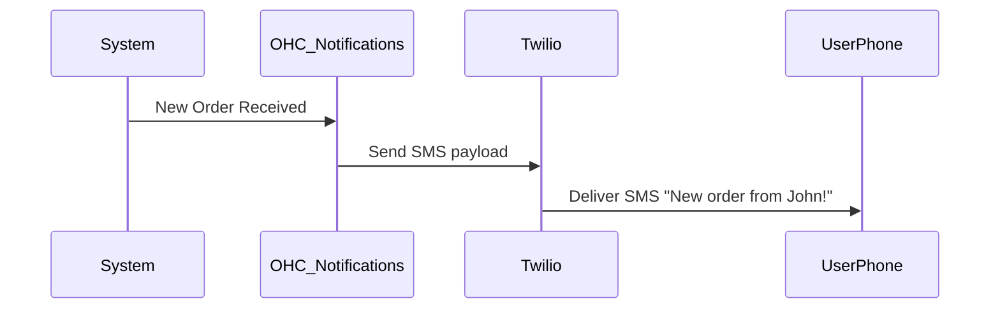
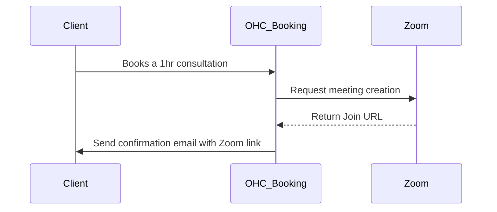

# Scout Tool Integration Research Report Q4

## Executive Summary
This report evaluates seven tool integrations across various categories designed to help small business owners streamline operations without coding. The integration targets are assessed for ease of use, pricing, reputation, and compatibility in both Cloud and Standalone environments.

## Persona Pain Points Summary
| Persona | Business Type | Pain Point | Addressed By |
|---------|---------------|------------|--------------|
| Fatima  | Local Bakery  | Misses DMs from customers on WhatsApp while baking; struggles with English communication. | WhatsApp Integration, Twilio SMS |
| Carlos  | Freelance Consultant | Double bookings and missed meetings due to manual calendar sync. | Google Calendar, Zoom |
| Sarah   | Boutique Retail | Needs to email past customers about sales but finds Mailchimp too complex. | MailTion Email Marketing |
| Diego   | LATAM E-commerce | Needs local payment solutions because Stripe isn't widely used by his customers. | Mercado Pago |
| Maya    | Handmade Crafts | Printing shipping labels manually takes hours each week. | Shippo Integration |

## Competitive Analysis
| Category | Evaluated Tool | Ease of Use | Pricing | Reputation | Cloud & Standalone Support |
|----------|----------------|-------------|---------|------------|----------------------------|
| Social Media | WhatsApp Business | High | Freemium | High (HackerNews approved) | Yes |
| Calendar | Google Calendar | High | Free | High | Yes |
| Email Marketing | MailTion | Medium-High | Varies | Growing | Yes |
| Payments | Mercado Pago | High | Transaction-based | High (LATAM specific) | Yes |
| Shipping | Shippo | High | Pay-as-you-go | High (HackerNews approved) | Yes |
| SMS | Twilio | Medium | Pay-per-message | High (Industry standard) | Yes |
| Video | Zoom | High | Freemium | High | Yes |

---

# Issue Briefs

## [Social Media] Integrate WhatsApp Business API into Unified Inbox
**Problem Statement:** Business owners like Fatima receive critical orders via WhatsApp but miss them because they are not connected to their central dashboard. Checking their phone constantly interrupts work.
**Research Report:**
- **Ease of Use:** High for end users; they just connect via a QR code.
- **Pricing:** WhatsApp charges per conversation, but the first 1000 service conversations per month are often free.
- **Reputation:** Widely trusted and discussed on HackerNews as a critical agricultural and small business tool.
- **Compatibility:** Works well in Cloud via webhooks and Standalone via polling or local gateway.
**Design Doc:**
- **UX:** User navigates to Settings -> Integrations. Clicks "Connect WhatsApp" and scans a QR code. Messages appear in the OHC unified inbox.

**Implementation Prompt:** Provide a "Connect WhatsApp" button in the Settings page. Once connected, route all incoming WhatsApp messages to the OHC Unified Inbox, allowing the business owner to reply directly from the OHC dashboard. Ensure the UI works perfectly on mobile devices.
**Priority:** P0
**Estimated Scope:** Large

---

## [Calendar] Two-Way Sync with Google Calendar
**Problem Statement:** Service providers double-book themselves because their personal Google Calendar isn't synced with their OHC booking page.
**Research Report:**
- **Ease of Use:** Extremely high; familiar OAuth flow.
- **Pricing:** Free API usage within standard quotas.
- **Reputation:** Industry standard.
- **Compatibility:** Standard OAuth works for Cloud; Standalone requires a local OAuth redirect handler.
**Design Doc:**
- **UX:** User goes to Calendar settings, clicks "Sync Google Calendar", approves Google permissions. OHC blocks out busy times and adds new OHC bookings to Google Calendar.

**Implementation Prompt:** Add a "Sync Google Calendar" option. When enabled, OHC should block out times when the user is busy on Google Calendar and push new OHC appointments to Google Calendar. Must be fully responsive for mobile.
**Priority:** P0
**Estimated Scope:** Medium

---

## [Email Marketing] AI-Powered Email Campaigns with MailTion
**Problem Statement:** Owners want to send promotions to their customer list but find traditional tools like Mailchimp too complicated to design and segment.
**Research Report:**
- **Ease of Use:** High, especially with AI-assisted copywriting (noted in HN discussions).
- **Pricing:** Affordable for small lists.
- **Reputation:** Emerging alternative to complex legacy platforms.
- **Compatibility:** API-based, works in both Cloud and Standalone.
**Design Doc:**
- **UX:** In the "Customers" tab, user selects "Send Promotion". They type a rough idea, OHC uses MailTion API to generate and send a polished email to the selected customer segment.

**Implementation Prompt:** Integrate MailTion to allow users to type a brief promo idea and send a professionally formatted email to their customer list directly from the OHC mobile or desktop dashboard.
**Priority:** P1
**Estimated Scope:** Medium

---

## [Payments] LATAM Payment Gateway with Mercado Pago
**Problem Statement:** Small businesses in Latin America lose sales because their customers prefer local payment methods like PIX, OXXO, or local credit cards which standard gateways don't support well.
**Research Report:**
- **Ease of Use:** Easy for users in LATAM who are familiar with it.
- **Pricing:** Standard transaction fees (typically 3-5%).
- **Reputation:** The undisputed leader in LATAM e-commerce.
- **Compatibility:** Excellent API support for Cloud and Standalone.
**Design Doc:**
- **UX:** In Payment Settings, users in LATAM see Mercado Pago as a primary option. They log in to connect their account. Checkout pages dynamically show local payment options (e.g., PIX in Brazil).

**Implementation Prompt:** Add Mercado Pago as a checkout provider. When a customer checks out, display Mercado Pago options localized to their country. The business owner should see a simple "Connect Mercado Pago" button in settings. Ensure seamless mobile checkout.
**Priority:** P1
**Estimated Scope:** Large

---

## [Shipping] Automated Label Generation via Shippo
**Problem Statement:** E-commerce owners spend hours copying addresses from their dashboard into carrier websites to print shipping labels.
**Research Report:**
- **Ease of Use:** High; Shippo abstracts carrier complexity.
- **Pricing:** Pay per label (cents) plus postage.
- **Reputation:** Highly regarded on HackerNews for easy API integration.
- **Compatibility:** API based; fully supports Cloud and Standalone.
**Design Doc:**
- **UX:** On an Order page, the user clicks "Buy Shipping Label". They select package size, see rates, click "Purchase", and a PDF label is generated for printing.

**Implementation Prompt:** Implement a "Buy Shipping Label" flow on the order details page. Fetch rates using the Shippo integration, allow the user to select a rate, and display a printable PDF label. Must function flawlessly on mobile browsers.
**Priority:** P1
**Estimated Scope:** Large

---

## [SMS] Reliable Global SMS Notifications via Twilio
**Problem Statement:** Non-English speaking users like Fatima often ignore emails but check SMS immediately. They need reliable SMS notifications for new orders.
**Research Report:**
- **Ease of Use:** Transparent to the user; they just provide their phone number.
- **Pricing:** Pay per text (fraction of a cent).
- **Reputation:** The gold standard for SMS delivery.
- **Compatibility:** Cloud works via API; Standalone works as long as internet is available.
**Design Doc:**
- **UX:** In Settings, user enables "SMS Notifications for New Orders" and enters their phone number. They receive a verification text. Once verified, they get instant alerts.

**Implementation Prompt:** Add an SMS notification toggle in the user's notification settings. Use Twilio to send a verification code, and subsequently route critical alerts (like new orders) to their mobile device via SMS.
**Priority:** P0
**Estimated Scope:** Medium

---

## [Video] Automated Meeting Links via Zoom
**Problem Statement:** Consultants manually create Zoom links and email them to clients after a booking is made, looking unprofessional and wasting time.
**Research Report:**
- **Ease of Use:** Very high; users just authorize Zoom once.
- **Pricing:** Free for basic, requires paid Zoom for longer meetings.
- **Reputation:** Universal standard for video conferencing.
- **Compatibility:** Standard OAuth, works across Cloud and Standalone.
**Design Doc:**
- **UX:** In Booking Settings, user selects "Add Zoom link to meetings". Upon a new booking, OHC auto-generates a Zoom link and includes it in the confirmation email and calendar invite.

**Implementation Prompt:** Integrate a "Connect Zoom" OAuth flow. When a customer books an online service, automatically generate a Zoom meeting and embed the join link into the confirmation page, email, and calendar invite.
**Priority:** P2
**Estimated Scope:** Medium
