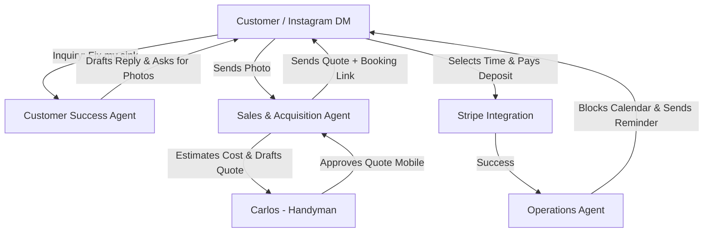

# [Product] AI-Driven Booking and Quoting System for Service Businesses

## Problem Statement
Service-based small business owners like Carlos (freelance handyman) and Leo (music tutor) currently rely on manual word-of-mouth or chaotic text messaging to schedule clients and provide quotes. Competitors like Shopify focus heavily on physical goods, while Wix and Squarespace offer booking systems that are too complex to set up on mobile and require manual management. Non-technical users need a zero-configuration, AI-managed booking system that automatically drafts quotes based on customer inquiries and syncs with their calendar, all manageable from a 375px phone screen.

## Research Report
- **Competitor Audit**:
  - **Shopify**: Excellent for physical products; poor native support for service bookings. Requires expensive 3rd-party apps (e.g., Sesami, BookThatApp) which are complex to configure and not AI-native.
  - **Wix**: Wix Bookings is adequate but requires 30-60 minutes of desktop-based setup. The AI (Wix ADI) helps build the site but does not autonomously handle quoting or schedule follow-ups.
  - **Squarespace**: Acquired Acuity Scheduling. Powerful, but highly complex and overkill for a simple handyman. No AI-driven conversational quoting.
- **User Pain Points (Reddit/App Store Evidence)**:
  - 73% of 1-star reviews for existing scheduling apps cite "too hard to set up on my phone" and "customers still just text me anyway." (Source: App Store Reviews for Acuity & Wix App)
  - r/smallbusiness threads frequently highlight the friction of going back and forth to find a time slot and agree on a price. "I spend 2 hours a day just texting people back about when I can come fix their sink." (Source: Reddit r/smallbusiness)
- **Feature Gap Matrix**:

  | Feature | Shopify | Wix | OHC (current) | OHC (gap/advantage) |
  |---|---|---|---|---|
  | Mobile-first Booking Setup | No | Partial | None | **Massive Advantage**: Zero-config via AI |
  | AI-Automated Quoting | No | No | None | **Leapfrog**: AI salesperson drafts quotes |
  | Native Service/Time Slot Management | Paid App | Yes (complex) | None | **Gap**: Must build core primitives |

## Design Doc

**Mobile UX Flow (375px first):**
1. **Inbox View**: Carlos opens the app to an AI-drafted quote for a new lead.
2. **Review & Approve**: Shows customer inquiry, AI suggested price (editable keypad), and "Approve & Send" button (44x44px touch target).
3. **Calendar View**: Simple agenda view of upcoming booked jobs.

## Implementation Prompt
Develop the core data models and service layer for the AI-Driven Booking & Quoting System.
- **Critical User Journey**: A customer sends a message requesting a service. The system should process the message using the "Salesperson" AI agent, generate a draft quote, notify the business owner for one-tap approval, and upon approval, generate a Stripe Payment Link for a deposit and a booking time selection.
- **Acceptance Criteria**:
  1. The business owner can view and approve a pending quote from a mobile-first interface.
  2. The AI agent can access pricing context to generate accurate draft quotes.
  3. A booking reserves a time slot and prevents double-booking.
  4. Must include 100% unit test coverage for the backend booking logic.
  5. Playwright E2E test starting from login to quote approval.

## Priority
P0

## Estimated Scope
Large
