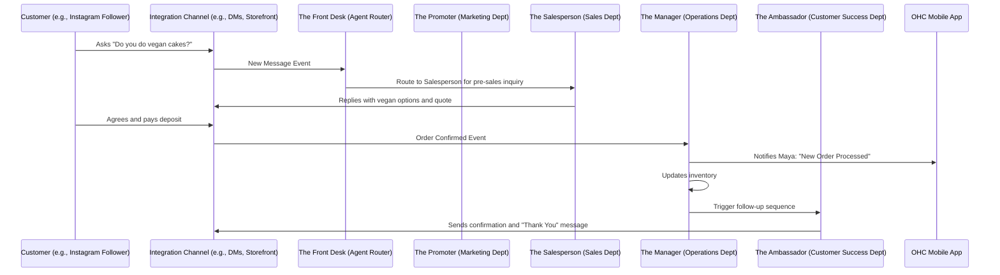

# [Architecture] AI Agent Department Architecture

## Title
AI Agent Department Architecture: Invisible Background Departments for Small Businesses

## Problem Statement
Small business owners (like Maya the baker or Carlos the handyman) don't want to "configure AI" or "prompt an LLM." They want to hire an employee to do a job. Currently, the concept of "AI agents" feels too technical and detached from how a real business operates. The business owner needs AI organized into familiar, friendly "Departments" (like Operations, Marketing, and Customer Success) that run invisibly in the background to handle the complexity of running the business, without requiring technical knowledge, API keys, or manual prompting.

## Research Report
Small business owners often feel overwhelmed by the sheer number of hats they have to wear. Our competitive analysis against Shopify, Wix, Squarespace, and GoDaddy reveals that while these platforms offer "AI tools" (e.g., AI text generation, AI image generation), they require the user to actively interact with the AI as a tool rather than delegating a process to a background worker.
- **Shopify:** Requires manual configuration of tools; AI is mostly for text/image generation.
- **Wix/Squarespace:** AI site builders get you started but don't run the business for you daily.
- **OHC Advantage:** We can position AI as background "Departments" that autonomously handle tasks based on events.
The key to success is hiding the AI behind friendly, human-centric concepts. When Carlos receives a booking, he shouldn't think "the webhook triggered an agent." He should think "my Operations Manager processed the order."

## Design Doc
### Architecture Diagram

### UI Wireframes & Screen Flow (375px first)
1. **The "Team" Tab:** A clean mobile view showing the business's "Departments".
2. **Department Cards:** Each card (e.g., "The Promoter", "The Manager") shows an activity feed of what they did today (e.g., "Drafted an SEO post", "Answered 3 customer questions").
3. **Approval Inbox:** For actions requiring review (e.g., sending a large quote or a mass email), a simple "Approve" or "Reject" swipe interface, much like a dating app or email triage.
4. **Settings:** Toggle between "Auto-Pilot" (agents execute automatically) and "Review Mode" (agents draft actions for approval).

### AI Agent Integration Points
- **Trigger Mechanisms:** Departments are triggered via schedules (e.g., weekly health report), external events (e.g., new order received, new DM), or on-demand via the owner.
- **Coordination:** Departments communicate via an internal event bus. When Operations finishes processing a refund, it emits an event that Customer Success picks up to send a follow-up apology.
- **Memory & Context:** All departments share a unified view of the customer's history. The Ambassador knows what The Salesperson promised the customer.
- **Budgeting:** Each tenant has an overarching AI action budget per month based on their tier. Limits are visually represented as an "energy bar" for the team.

### Key Design Decisions
- **Familiar Naming:** Agents are never referred to as "Agents" or "Bots" in the UI. They are "Departments" or "Roles" (e.g., The Manager, The Promoter).
- **Progressive Autonomy:** New accounts default to "Review Mode" where actions are drafted for approval. As the owner builds trust, they can toggle specific departments to "Auto-Pilot".
- **Unified Memory:** Preventing fragmented interactions by ensuring all departments access the same customer context timeline.

## Implementation Prompt
**User-Facing Outcome:** Implement the "Team" tab in the mobile dashboard where business owners can view and manage their AI Departments. The UI must display cards for Operations, Marketing, Sales, and Customer Success, showing a simplified activity feed of what each department accomplished today. Include a "Pending Approvals" queue with swipe-to-approve mechanics for drafted actions.
**Critical User Journey (CUJ):** Maya opens the app, sees a notification that "The Salesperson" drafted a quote for a custom vegan cake. She opens the Pending Approvals queue, reviews the drafted quote, and swipes right to approve and send it.
**Acceptance Criteria:**
- The mobile UI (375px) strictly adheres to Glassmorphism tokens, Outfit/Inter typography, and OHC entrance/exit animation timings.
- The UI features a default "Simple Mode" with an `is_advanced` sticky toggle for power users.
- The components are fully accessible (WCAG 2.1 AA) and display data cleanly without exposing any technical configuration (no JSON, no API keys).

## Priority
P0

## Estimated Scope
Large