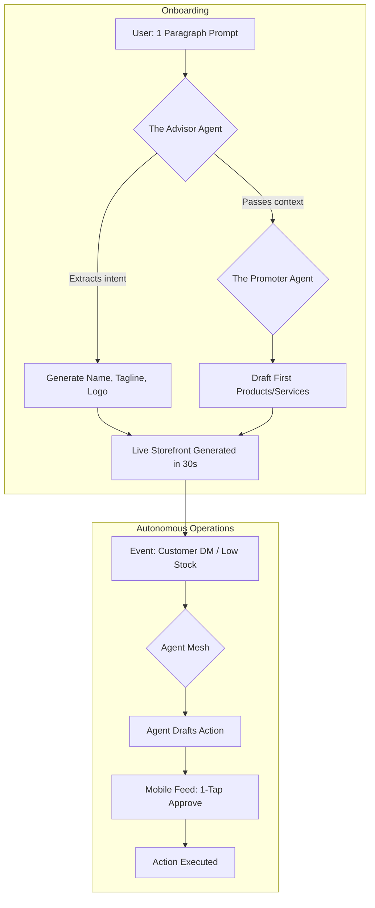

# Feature Brief: OHC Autonomous Agency & Instant Storefront Engine

## Problem Statement
The primary barrier to entry for non-technical small business owners (SMBs) is the complexity of setting up an online presence. While platforms like Shopify and Wix offer "easy" builders or basic AI design tools, the user must still manually navigate dashboards, manage plugins, write content, and handle operations.
Competitors like Durable offer speed ("30-second website") but lack depth in business management. There is a massive gap in the market for a platform that acts not just as a builder, but as an **Autonomous Teammate**—an engine that builds the store instantly and then proactively manages marketing, operations, and customer success without requiring the owner to understand technical jargon.

## Research Report

### Market Dynamics & Competitor Landscape
Our audit of the global SMB landscape, based on competitor analyses and user sentiment (Reddit, App Store, Trustpilot), reveals that non-technical founders struggle significantly with traditional SaaS models.

#### Competitor Highlights:
*   **Shopify:** Industry standard for e-commerce, but features high onboarding friction (30-60+ mins) and relies heavily on a complex App Store. "Sidekick" is a reactive chat tool, not an autonomous agent.
*   **Wix:** Strong design focus with "Wix ADI", but post-launch management still requires navigating a dense, hybrid UI.
*   **Squarespace:** Beautiful templates but heavily reliant on manual design tweaks. Weak AI presence.
*   **Durable:** A leader in "instant generation" (30-second websites), but fundamentally thin on post-launch business management.
*   **10Web:** Focuses heavily on migrating and managing WordPress via AI. Targets agencies and developers rather than the non-technical solopreneur.

#### The Top 10 SMB Pain Points (Validated by Reddit & Trustpilot)
1. **Setup Complexity (73%):** Users are overwhelmed by domain configuration, templates, and shipping settings.
2. **Operational Fatigue (68%):** Manually responding to customer DMs and managing inventory across channels leads to burnout.
3. **Marketing Dread (55%):** Creating ongoing content for social media and maintaining SEO is consistently cited as a reason businesses fail.
4. **Invisible Discovery (52%):** "I built it, but nobody came." SEO is seen as a black art.
5. **Technical Jargon (48%):** Frustration with terms like CNAME, APIs, and Webhooks.
6. **Cost Creep (45%):** App stores lead to subscription hell, where a $29 plan becomes $200 quickly.
7. **Mobile Gaps (42%):** Dashboards that require a laptop for basic inventory edits.
8. **Communication Lag (40%):** Losing sales because DMs aren't answered while the owner is sleeping.
9. **Financial Fog (35%):** Inability to see real profit vs. revenue without exporting to a spreadsheet.
10. **Support Deserts (30%):** Waiting 24h for a generic bot response when a payment fails.

### OHC AI Differentiation Manifesto
To leapfrog the competition, OHC will implement these 5 AI automations first, turning AI from a *tool* into a *teammate*:
1. **The Silent Ambassador (Customer Success):** Proactively monitors the event mesh and auto-drafts DM replies based on business memory, queuing them for 1-tap approval.
2. **The Vigilant Manager (Operations):** Scans sales velocity and flags "Low Stock" risks with pre-filled restock tasks.
3. **The Generative Promoter (Marketing):** Automatically generates a 7-day social media calendar whenever a new product is added.
4. **The AI Discovery Agent (GEO):** Optimizes structured data for LLM crawlers (ChatGPT, Gemini) to ensure the business is recommended in AI searches.
5. **The Business Advisor (Advisory):** Provides daily human-language briefings (e.g., "Tuesday is your best day. Your vegan cake is trending") instead of complex charts.

### Competitive Feature Gap Matrix

| Feature | Shopify | Wix | Durable | OHC (Target) |
| :--- | :--- | :--- | :--- | :--- |
| **Setup Time** | 30-60 min | 20-40 min | < 1 min | **< 1 min** |
| **AI Role** | Reactive Assistant | Design Generation | Instant Site Build | **Autonomous Teammate** |
| **Marketing** | Manual/App Store | Template-based | Basic | **Proactive Social/GEO** |
| **Target UX** | Desktop-first | Hybrid | Mobile-first | **Mobile-Only Optimized** |

### Market Sizing & Strategic Direction
* **Total Addressable Market (TAM):** Millions of non-employer small businesses globally lack a strong, autonomous online presence.
* **Beachhead Market:** Service professionals (e.g., Leo the Tutor, Carlos the Handyman) represent the highest density of underserved users who need scheduling, quoting, and client management unified without technical complexity.

### User Persona Mapping

| Persona | Current Pain Point | OHC Solution (The Teammate) |
| :--- | :--- | :--- |
| **Maya (Baker, 28)** | "Shopify is too complex; I lose orders in IG DMs." | *Customer Success Agent* auto-drafts DM replies. |
| **Carlos (Handyman, 42)** | "I don't have time to build a site or quote jobs." | *Instant Build* + *Sales Agent* auto-sends quotes. |
| **Priya (Boutique, 35)** | "Inventory sync is a nightmare." | *Operations Agent* flags low stock and syncs POS. |
| **Leo (Tutor, 22)** | "Managing subscriptions is chaos." | *Finance Agent* handles recurring billing natively. |
| **Fatima (Food Cart, 50)** | "English platforms are hard; missing pickup orders." | *Multi-lingual Instant Menu* + Mobile push alerts. |

## Recommendations
Based on the evidence, OHC must lean into two key product pillars:
1.  **Instant Setup (< 60 seconds):** Using the user's brief input to extrapolate a complete site.
2.  **Autonomous Operations (The Agent Mesh):** Treating AI as functional departments (Operations, Marketing, Sales) rather than reactive chat boxes.

## Design Doc

### High-Level Architecture
1.  **Instant Onboarding Engine:**
    *   Replaces the multi-step `SetupWizard` with a single, conversational prompt ("Tell us about your business").
    *   **The Advisor** (AI Agent) parses the input, generates a business name, tagline, and selects the optimal template.
    *   **The Promoter** (AI Agent) drafts initial product listings and layouts.
2.  **The Event-Mesh Architecture:**
    *   Instead of a static dashboard, the platform operates on an event-driven mesh.
    *   When an event occurs (e.g., an Instagram DM, a completed order), the relevant Agent (e.g., *Customer Success*, *Operations*) is triggered.
    *   The Agent drafts a proposed action and pushes it to the user's mobile lock screen or centralized "Action Required" feed.
3.  **Mobile-First Vibe UI:**
    *   A 375px optimized interface. Actions are 1-tap approvals. No deep menus.

## Implementation Prompt
1.  **Refactor Onboarding:** Modify `src/app/setup_wizard.slint` and `src/app/main.rs` to support an "Instant Build" mode. This mode accepts a single text block, routes it through the LLM routing gateway to generate `website_template`, `domain_choice`, `product_name`, and `product_price`, and instantly provisions the site.
2.  **Agent Action Feed UI:** Create a new mobile-first UI component (`ActionFeed`) that displays proactive tasks generated by the Agent Mesh (e.g., drafted email replies, restock warnings).
3.  **Ensure E2E Testing:** Write a Playwright/Slint headless test that verifies a user can launch an instant storefront with a single prompt, logging in via the UI first.

## Priority
P0

## Estimated Scope
Large
