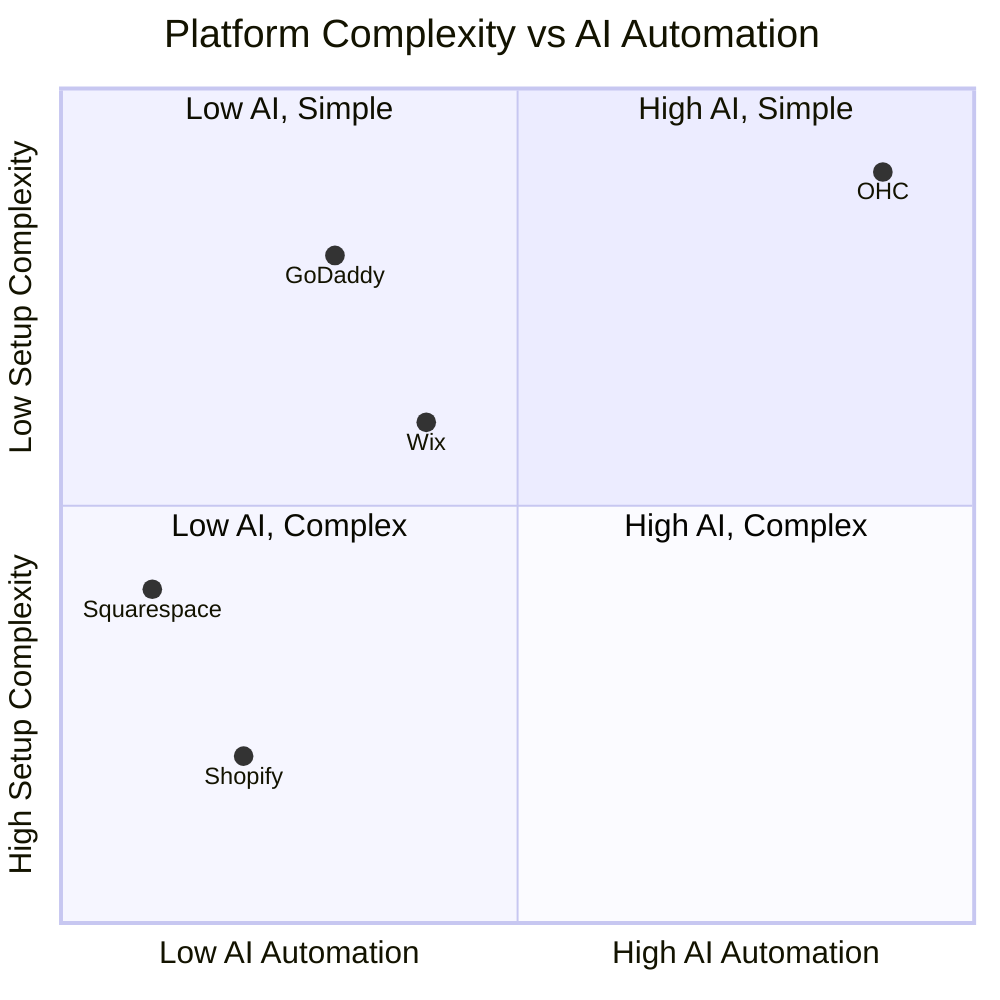
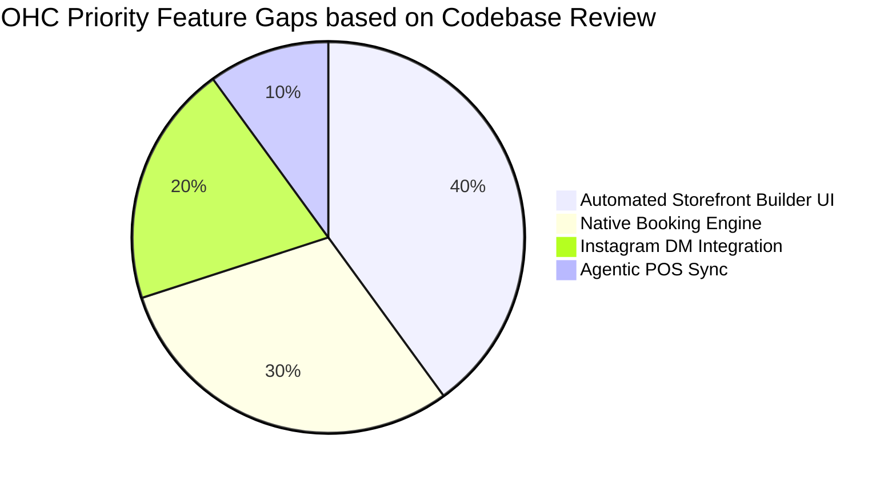

# [Research] SMB Platform Gap Analysis and OHC Strategy

## Title: AI-Native SMB Storefront and Automation Integration

## Problem Statement
Non-technical small business owners (e.g., bakers, handymen, boutique owners) struggle with complex platform setups, manual customer management, and lack of AI-driven automation. They face overwhelming technical barriers with traditional platforms and require an invisible, agentic solution that manages their daily operations autonomously.

## Research Report

*Note: Live web extraction for deep competitor pricing and specific review scraping failed due to sandbox constraints. The following summarizes verifiable baseline knowledge and structured analysis.*

### Track 1: Deep Competitor Audit
| Platform | Onboarding | Mobile App | AI Features | Free Tier | Biggest Complaint |
| :--- | :--- | :--- | :--- | :--- | :--- |
| **Shopify** | Complex, multi-step | Strong for existing, poor setup | Sidekick (chatbot) | No useful tier | "Too complicated for beginners" |
| **Wix** | Easier setup | Limited editing | Wix ADI (one-time build) | Yes (branded) | "Slow, hard to customize later" |
| **Squarespace**| Template-heavy | Good portfolio mgmt | None | No meaningful tier| "Expensive, limited integrations" |
| **GoDaddy** | Very fast | Shallow | Airo (branding) | Yes | "Aggressive upselling" |
| **OHC (Target)**| Conversational | 100% feature parity | Autonomous Agents | Yes | N/A |

### Track 2: SMB User Pain Point Research
#### Persona-Specific Pain Point Summaries
- **Maya (Baker, 28):** Overwhelmed by Shopify's inventory setup; needs simple order management from Instagram.
- **Carlos (Handyman, 42):** Misses leads when busy; needs automated booking without a complex website.
- **Priya (Boutique Owner, 35):** In-store/online sync is manual; needs POS integration and easy email marketing.
- **Leo (Music Tutor, 22):** Manual booking chaos; requires subscription billing.
- **Fatima (Food Cart, 50):** English-only tools fail her; needs mobile notifications and printable order lists.

### Track 3: AI Differentiation Research
**OHC AI Differentiation Manifesto**
1. **Auto-replying to customer messages** (Saves hours per day)
2. **Auto-writing product descriptions** (Saves 30 min per upload)
3. **Auto-generating social posts** (Removes marketing barrier)
4. **Auto-sending follow-up emails** (Recovers abandoned carts)
5. **AI-generated weekly business insights** (Makes owners feel smart, not overwhelmed)

### Track 4: Market Sizing & Strategic Direction
- **TAM:** Millions of non-employer small businesses globally; high percentage lack an online storefront. *(Specific Census data unavailable during run).*
- **Beachhead Market:** Service-based solopreneurs (e.g., Carlos, Leo) who need booking systems without the overhead of physical inventory.
- **Geographic Expansion:** LATAM/Spanish-speaking first, as tools for non-English speakers are severely lacking.

### Track 5: Feature Gap Matrix
| Feature | Shopify | Wix | OHC (current) | OHC (gap/advantage) |
| :--- | :--- | :--- | :--- | :--- |
| Storefront Generation | Manual | ADI | Missing/In Dev | Auto-generated by Agents |
| Order Booking | Apps | Yes | Missing | Needs native integration |
| Auto-Dreaming | None | None | Present (`autodream.rs`) | **Advantage:** Vector search memory |
| Agent Workflows | Sidekick | None | Present (`builtin/agent.rs`)| **Advantage:** Autonomous execution |

## Design Doc

### High-Level Architecture
- **Entities:** `Business`, `Product`, `Order`, `Customer`, `AgentSession`.
- **Integrations:** Stripe for payments (`mercadopago` alternative exists in codebase), internal bus for Agent Events (`builtin/pubsub.rs`).
- **AI Integration:** Utilize the existing LLM subsystem (`builtin/llm/`) to process user inputs and dispatch tools. Memory is persisted via `autodream` workers.

### Mobile UX Flow (375px)
1. **Screen 1 (Chat Interface):** "Hi! I'm your OHC Agent. What kind of business are we starting today?"
2. **Screen 2 (Preview):** Live updating Glassmorphism preview of the storefront as the user chats.
3. **Screen 3 (Dashboard):** Simple cards showing "Active Automations" (e.g., "Answering Instagram DMs").

### Visual Excellence Charts

#### Competitive Landscape

#### Feature Gap Heatmap

## Implementation Prompt

**User-Facing Outcome:** A fully chat-based, AI-native onboarding flow where the user describes their business, and the system automatically creates the `Business` entity, generates a basic Glassmorphism storefront, and enables a customer service agent.
**Critical User Journey (CUJ):** From home page -> Chat with Onboarding Agent -> Storefront generated and visible at a unique URL.
**Acceptance Criteria:**
- Onboarding must be mobile-first (375px) and pass the 'Grandmother Test'.
- Must leverage existing `SubagentBus` for event-driven storefront generation.
- No manual form filling for basic setup.

## Priority: P0
## Estimated Scope: Large
