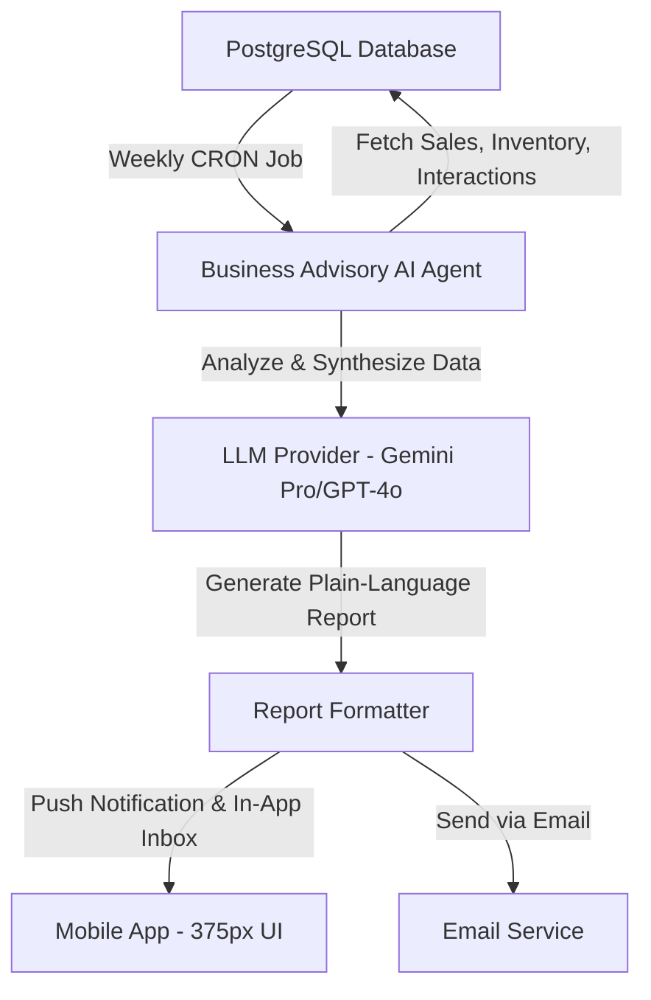

# [Advisory] Plain-Language Weekly Business Health Report

## Title
AI-Generated Plain-Language Weekly Business Health Report

## Problem Statement
Small business owners (like Maya the baker and Carlos the handyman) are overwhelmed by traditional analytics dashboards. Metrics like "conversion rate," "bounce rate," and "session duration" are technical jargon that fail the "Grandmother Test." Competitors like Shopify and Wix present users with complex graphs that require interpretation. As a result, non-technical owners ignore their data and miss critical insights about their business health, seasonal trends, and opportunities for growth.

## Research Report
### Competitor Audit
- **Shopify**: Provides a robust analytics dashboard with charts and graphs. Requires technical understanding to interpret metrics (e.g., "Online store conversion rate", "Average order value"). No built-in plain-language synthesis without third-party apps.
- **Wix**: Similar to Shopify. Offers "Analytics & Reports" but places the burden of interpretation on the user.
- **Squarespace**: Basic commerce analytics. Beautiful but still relies on standard charts and numerical data points.
- **GoDaddy**: Very basic metrics, mostly focused on website visits rather than actionable business health.

### User Pain Points
Based on App Store reviews and Reddit (r/smallbusiness), users frequently express:
- "I don't know what to do with my website traffic data."
- "I just want someone to tell me if I'm doing well or not."
- "I don't have time to look at charts, I'm busy making my products."

### Current OHC Feature State
Based on a codebase audit (`src/app/src/*.slint`), OHC currently has `dashboard.slint`, `referrals.slint`, `handoffs.slint`, `logs.slint` and others, but lacks a dedicated UI or system for generating and displaying plain-language weekly summaries of business health. The current dashboard might show data, but not a synthesized weekly report.

### Opportunity
OHC can leapfrog competitors by replacing the traditional "Analytics Dashboard" with a weekly, plain-language "Business Health Report" generated by the Business Advisory AI agent. Instead of a chart showing a 15% increase in traffic, the agent simply states: "You had 8 orders this week. Vegan cake requests doubled. Consider adding a vegan chocolate option!"

## Design Doc

### UI Flow (Mobile-First, 375px)
1. **Notification**: User receives a push notification on Sunday morning: "Your Weekly Business Snapshot is ready! 📈"
2. **Inbox/Dashboard**: Tapping the notification opens a Glassmorphism card (20px blur, Outfit font) in the OHC app.
3. **Report Content**:
   - **Summary**: "Great job this week, Maya! You made $450 from 8 orders."
   - **Insight 1**: "Tuesday was your busiest day. Most people bought the Lemon Pound Cake."
   - **Actionable Suggestion**: "We noticed 3 people asked about vegan options in DMs. Want me to draft a new 'Vegan Options' menu section for your website?"
   - **One-Tap Action**: [Yes, draft it] | [No thanks]

## Implementation Prompt
Implement the "Business Advisory" AI agent's weekly health report feature.
1. **Backend**: Create a scheduled worker (using PostgreSQL SKIP LOCKED job queue) that runs weekly for each tenant. The worker should gather the past week's data (sales volume, top products, customer inquiry themes from the Customer Success agent).
2. **AI Integration**: Pass the gathered data to the LLM Provider using the Business Advisory system prompt. The prompt must instruct the LLM to output a radically simple, plain-language summary (no jargon like "conversion rate").
3. **Frontend**: Display the generated report in the Flutter app's dashboard as a premium Glassmorphism card. Include at least one actionable suggestion with a simple "Yes/No" interaction button.
4. **CUJ/Acceptance Criteria**: A user logs in, navigates to their dashboard, and can read a non-technical, AI-generated weekly summary of their business performance that includes at least one suggested action.

## Priority
P1

## Estimated Scope
Medium
