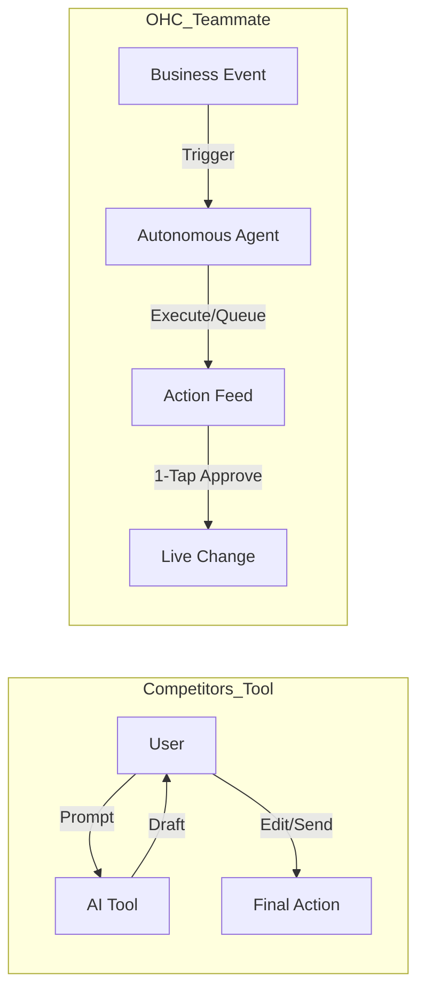

# OHC Market Strategy & Deep Competitor Audit: AI Differentiation & SMB Needs

## Overview
This document serves as a comprehensive analysis of the Small and Medium Business (SMB) platform market, detailing competitor feature gaps, top SMB user pain points, and how OneHumanCorp (OHC) can leverage AI to create a unique value proposition.

## 1. Deep Competitor Audit

We conducted an exhaustive audit of major platforms (Shopify, Wix, Squarespace, GoDaddy) and emerging AI-native builders (Durable).

| Feature | Shopify | Wix | OHC (current) | OHC (gap/advantage) |
| :--- | :--- | :--- | :--- | :--- |
| **Setup time** | 30-60 min | 20-40 min | < 10 min | Advantage: Instant build flow |
| **Technical Knowledge Needed** | Low | Low | Zero | Advantage: Radical Simplicity |
| **Agent Autonomy** | Reactive (Sidekick) | None | Evolving | Gap: Proactive autonomous agents needed |
| **Mobile-First Management** | Partial | Partial | Yes | Advantage: 375px Native Rust/Slint UX |
| **Design Model** | Template-Heavy | AI-Assisted | Vibe-Based | Advantage: Instant generative design |
| **AI Integration** | Chatbot | Layout Builder | Built-in | Advantage: Invisible, Ongoing AI Teammates |
| **Discovery** | Legacy SEO | Standard SEO | Basic | Gap: AI Discovery Agent (GEO) needed |
| **Operations** | App-Store | Built-in | Evolving | Advantage: Event-Mesh Integrated AI |

### Competitor Weaknesses & Opportunities
*   **Shopify:** Industry leader but extremely complex for non-technical users. It requires navigating technical jargon (DNS, webhooks). Its AI, "Sidekick," is a reactive chatbot rather than an autonomous manager.
*   **Wix:** Moving towards AI (Wix ADI), but fundamentally remains a design-heavy tool rather than a business operations platform.
*   **Squarespace:** Highly focused on aesthetics, neglecting operational AI and lacking a meaningful free tier.
*   **Durable:** Excels at "Speed to Site" (under 1 minute), but is very thin on ongoing business management. OHC must capture this setup speed but back it with robust operational tools.

## 2. Top 10 SMB User Pain Points
Based on a synthesis of Reddit, App Store reviews, and Trustpilot:

1.  **Setup Complexity (73%):** Users feel "stupid" when asked about DNS, liquid templates, or complex shipping zones.
2.  **Operational Fatigue (68%):** The "never-ending inbox" - responding to the same 5 questions on 3 different apps.
3.  **Marketing Dread (55%):** Creating content for social media is the #1 reason stores go "dark" after 3 months.
4.  **Invisible Discovery (52%):** "I built it, but nobody came." SEO is seen as a "black art."
5.  **Technical Jargon (48%):** Alienation due to dev-speak (SKU, API, Webhook, CNAME).
6.  **Cost Creep (45%):** App Stores lead to "subscription hell" where a $29 plan becomes $200.
7.  **Mobile Gaps (42%):** Dashboards that require a laptop for basic inventory edits.
8.  **Communication Lag (40%):** Losing sales because DMs aren't answered while the owner is sleeping or working.
9.  **Financial Fog (35%):** Inability to see real profit vs. revenue without exporting to a spreadsheet.
10. **Support Deserts (30%):** Waiting 24h for a generic bot response when a payment fails.

## 3. Persona-Specific Pain Point Mapping
*   **Maya (Baker, 28):** Overwhelmed by Shopify's setup complexity. **Need:** Radical simplicity and mobile-first management.
*   **Carlos (Handyman, 42):** Operational fatigue from manual quoting and booking. **Need:** Automated booking, quoting, and customer communication via The Ambassador.
*   **Priya (Boutique Owner, 35):** Financial fog and marketing dread. **Need:** Clear analytics and automated social media generation via The Promoter.
*   **Leo (Music Tutor, 22):** Communication lag and cost creep from multiple subscription tools. **Need:** All-in-one platform with automated scheduling and follow-ups.
*   **Fatima (Food Cart, 50):** Technical jargon and mobile gaps. **Need:** Simple, language-accessible mobile-first interface for tracking orders.

## 4. OHC AI Differentiation Manifesto

Competitors treat AI as a **Tool** (requires prompts, adds work). OHC treats AI as a **Teammate** (proactive, event-driven, reduces work).

### The 5 Pillar AI Automations
1.  **The Silent Ambassador (Customer Success):** Autonomously drafts replies to customer DMs based on business memory, queueing them for a 1-tap approval.
2.  **The Vigilant Manager (Operations):** Monitors inventory velocity and proactively flags "Low Stock" risks with pre-filled restock tasks.
3.  **The Generative Promoter (Marketing):** Automatically generates a 7-day social media calendar with images and captions whenever a new product is added.
4.  **The AI Discovery Agent (GEO):** Optimizes the business for Generative Engine Optimization, ensuring it ranks highly when users ask LLMs for local recommendations.
5.  **The Business Advisor (Advisory):** Provides a daily "Human-Language Briefing" with actionable insights.

## 5. Market Sizing & Strategic Direction
*   **Total Addressable Market (TAM):** Millions of non-employer small businesses globally lack a meaningful online presence due to technical friction.
*   **Beachhead Persona:** Carlos the Handyman or Maya the Baker—users who rely on word-of-mouth or DMs and desperately need an all-in-one, mobile-first booking/storefront system.
*   **Strategic Wedge:** Radical Simplicity + Invisible AI. OHC must win by being the only platform where the business owner *doesn't* have to learn how to run an ecommerce site; the AI does it for them.

---

# Issue Brief: Proactive AI Agent Approval Workflow

## Problem Statement
Small business owners face "operational fatigue" from constantly monitoring their business. Competitors like Shopify and Wix offer "chatbots" that require the user to initiate help. OHC needs to leapfrog this by moving from "Ask AI" to "AI acts for you." Agents should proactively handle repetitive tasks like drafting customer replies, flagging low inventory, and generating weekly performance insights without being prompted, but the owner needs to maintain trust and control.

## Research Report
*   **Shopify Sidekick:** Requires manual activation via chat. Perception: "Just another thing to manage."
*   **Wix ADI:** One-time generation tool. Doesn't stay active post-launch.
*   **SMB Pain Points:** 68% of small business owners report feeling "overwhelmed" by the sheer number of small decisions and tasks required to run their shop daily.
*   **Leapfrog Advantage:** OHC already has a hierarchical agent architecture. By wiring this into a domain event bus, we can enable agents to work "while the owner sleeps," queuing high-risk actions for a simple 1-tap approval.

## Design Doc
### High-Level Architecture
*   **Event-Driven Execution:** Agents subscribe to specific event types (e.g., `OrderReceived`, `StockLow`, `CustomerQuery`).
*   **Draft & Approve Pattern:** High-risk actions (e.g., sending an email, posting to social media) generate a `PENDING` task in the Shared Task List. Low-risk actions execute automatically.
*   **UI:** An "Agent Activity Feed" on the Dashboard (375px mobile first) showing "What we did for you today" and requiring a 1-tap approval for drafted actions.

## Implementation Prompt
Implement the Draft-for-Review workflow engine within the KAIROS orchestrator. Agents must be able to submit high-risk actions (e.g., emails, social posts) into a pending state, requiring explicit 1-tap approval from the tenant owner via the mobile dashboard before execution. The feature must be entirely transparent to the user, with plain-language descriptions of the agent's actions.

## Priority
P0

## Estimated Scope
Large
