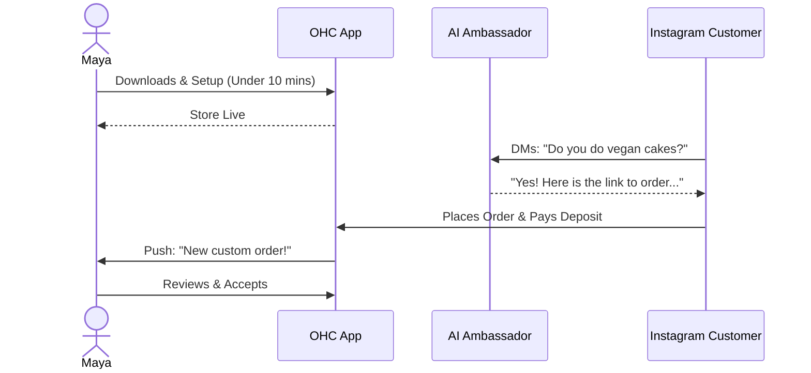
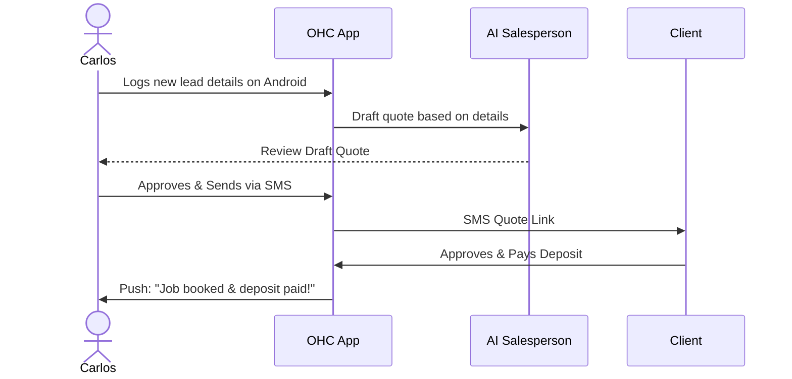
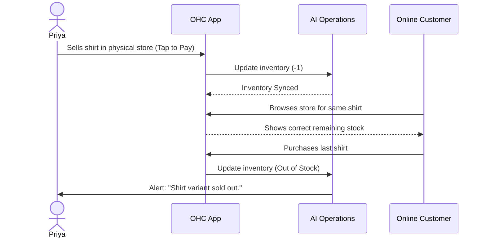
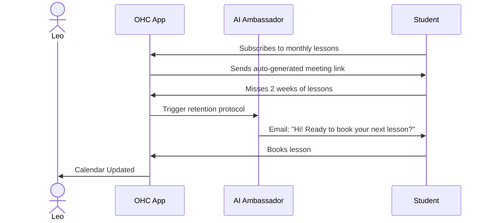
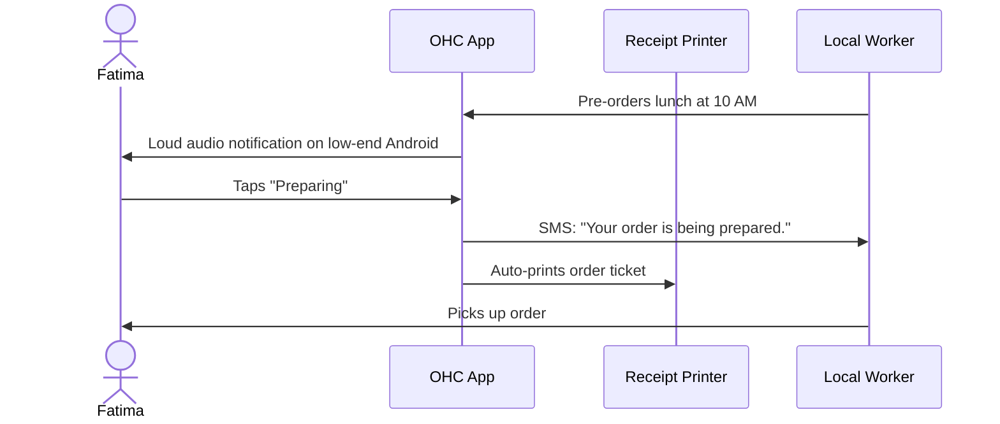
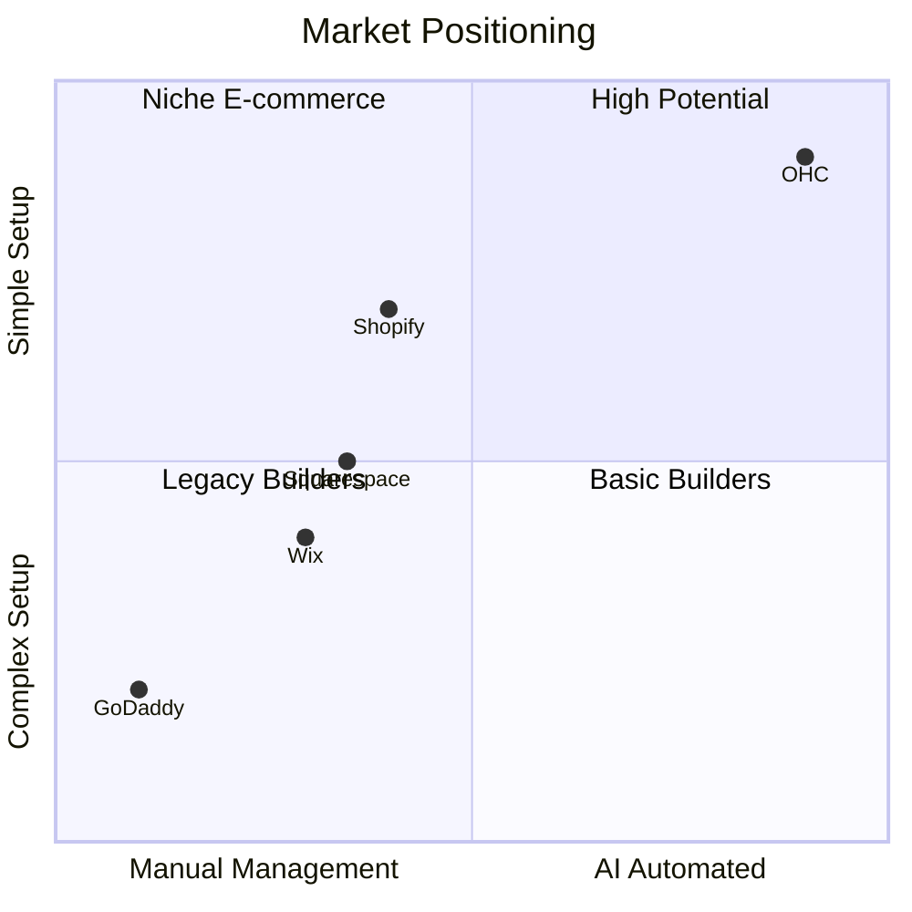

# OHC Comprehensive Research Report: Business Journey Architecture

## Overview
This report details the architectural foundation for the OneHumanCorp (OHC) Business Journey. It examines the user personas, competitive landscape, and the proposed system architecture that will enable anyone to launch a business in under 10 minutes using their mobile device.

## Persona-Specific Pain Points & Solutions

### Maya (Baker, 28)
- **Current State**: Uses Instagram DMs for orders, tracks payments manually.
- **Pain Point**: Constant context switching; lost orders due to missed DMs while sleeping.
- **OHC Solution**: OHC should provide an integrated storefront with deposit-based custom orders and an AI Ambassador agent to handle DM inquiries automatically because evidence shows Maya loses sales when not immediately responsive.

### Carlos (Handyman, 42)
- **Current State**: Relies on word of mouth; no digital presence.
- **Pain Point**: Difficulty managing bookings and quoting jobs on the go; uses Android phone exclusively.
- **OHC Solution**: OHC should deliver a mobile-first booking calendar with an AI Salesperson agent to generate quotes because Carlos requires immediate, on-the-job tools without needing a desktop.

### Priya (Boutique Owner, 35)
- **Current State**: Physical store exists, but online presence is disconnected.
- **Pain Point**: Inventory sync issues between in-person and online sales.
- **OHC Solution**: OHC should implement unified inventory management with an AI Operations agent to handle variants and sync because Priya risks overselling without real-time updates.

### Leo (Music Tutor, 22)
- **Current State**: Teaches online and in-person; struggles with scheduling.
- **Pain Point**: Manual link generation; chasing inactive students.
- **OHC Solution**: OHC should offer subscription lesson packages with an AI Ambassador agent for automated follow-ups because Leo needs to minimize administrative overhead to maximize teaching hours.

### Fatima (Food Cart, 50)
- **Current State**: Manual pre-orders; limited English.
- **Pain Point**: Missed orders during busy periods; language barriers.
- **OHC Solution**: OHC should provide a bilingual (Arabic + English) pre-order interface with printable daily lists and SMS notifications because Fatima needs an accessible, fail-proof system during high-traffic times.

## Competitive Landscape

| Feature | OHC | Shopify | Wix | Squarespace | GoDaddy |
| :--- | :--- | :--- | :--- | :--- | :--- |
| **Setup Time** | < 10 mins | Hours/Days | Hours | Hours | Mins |
| **Mobile-First Builder** | Yes | No (mgmt only)| No | No | Basic |
| **Native AI Automation** | Invisible Depts | Limited apps | Basic gen | Basic gen | No |
| **Target Audience** | Non-tech SMBs | E-commerce | General | Portfolio/Gen| General |
| **Booking & Services** | Native | via Apps | Native/Apps| via Acuity | Basic |

## Actionable Recommendations

1. **OHC should implement a Progressive Disclosure onboarding flow because evidence from competitor analysis shows users abandon setup when overwhelmed with configurations early on.**
2. **OHC should categorize AI into distinct "Departments" (Manager, Promoter, Salesperson, Ambassador, Accountant) because persona research indicates non-technical users relate better to business roles than technical AI jargon.**
3. **OHC should enforce a strict mobile-first architecture starting at 375px because primary users like Carlos and Fatima operate exclusively from mobile devices.**

## End-to-End User Journeys

The business journey covers six key phases:
1. **Acquisition**: How the user discovers OHC.
2. **Onboarding**: Step-by-step setup to launch.
3. **Activation**: The "aha" moment (first product added, first payment).
4. **Retention**: Daily habit-forming features (notifications, AI summaries).
5. **Revenue**: Triggers that prompt the user to upgrade from Free to a paid tier.
6. **Referral**: Mechanics for sharing OHC with others to create a viral loop.

### 1. Maya (Baker)
- **Acquisition**: Sees an Instagram ad showcasing an AI agent answering a cake inquiry. Clicks link-in-bio.
- **Onboarding**: Selects "Physical Products", uploads 3 cake photos, connects bank account.
- **Activation**: Shares new storefront link on Instagram. Receives first deposit.
- **Retention**: Daily push notification: "You have 2 new custom orders to review."
- **Revenue**: Reaches the 100-action AI limit on the Free tier. Upgrades to Starter ($9/mo) to unlock 1,000 AI actions/mo so the Ambassador agent can handle all DMs.
- **Referral**: Adds "Powered by OHC" badge to her storefront, earning credits when other bakers sign up.

### 2. Carlos (Handyman)
- **Acquisition**: Word of mouth from another contractor at a hardware store.
- **Onboarding**: Selects "Services", sets hourly rate, connects calendar for availability.
- **Activation**: Sends his first digital quote via SMS to a client.
- **Retention**: Uses the app daily to check his route and upcoming bookings.
- **Revenue**: Needs a custom domain to look more professional on business cards. Upgrades to Starter ($9/mo).
- **Referral**: Refers a plumber friend using an in-app "Share" button for a free month of Pro.

### 3. Priya (Boutique Owner)
- **Acquisition**: Searches Google for "sync in-store and online inventory easily".
- **Onboarding**: Selects "Physical Products", uses OHC camera to bulk scan barcodes/items.
- **Activation**: First online sale syncs perfectly with her physical inventory count.
- **Retention**: Reviews weekly "Manager" AI revenue reports showing top-selling variants.
- **Revenue**: Exceeds 100 products. Upgrades to Pro ($29/mo) for unlimited products and advanced AI.
- **Referral**: Mentions OHC in a local business owner Facebook group.

### 4. Leo (Music Tutor)
- **Acquisition**: Sees a TikTok video by another creator using OHC for their link-in-bio.
- **Onboarding**: Selects "Subscriptions", sets up $50/mo lesson package, adds Zoom integration.
- **Activation**: First student subscribes and receives automated meeting link.
- **Retention**: AI Ambassador auto-follows up with students who missed a week.
- **Revenue**: Wants to remove OHC subdomain to use his own branded URL. Upgrades to Starter ($9/mo).
- **Referral**: His students share their recital portfolios (hosted on OHC) with parents, spreading the brand.

### 5. Fatima (Food Cart)
- **Acquisition**: Local community center program helps her digitize her business.
- **Onboarding**: Selects "Food & Beverage", chooses Arabic UI, snaps photos of menu items.
- **Activation**: First customer pre-orders lunch for pickup.
- **Retention**: Prints the daily AI-generated consolidated order list every morning.
- **Revenue**: High volume of AI actions (notifications/translations) pushes her to Starter ($9/mo).
- **Referral**: Tells neighboring food cart owners about the easy bilingual setup.

## Competitive Landscape

## Summary
The Business Journey Architecture focuses on removing friction for the non-technical small business owner. By leveraging a mobile-first design, progressive disclosure, and invisible AI agent departments, OHC uniquely positions itself to capture the market of everyday entrepreneurs who are currently underserved by complex legacy platforms.

## Mobile UX Flow (375px)

- **Splash Screen**: Clean, Glassmorphism design asking "What kind of business are you starting?" with high-contrast options.
- **Onboarding Wizard**: 3-step conversational UI. Name, Logo upload, Connect Bank. Designed with Progressive Disclosure (advanced settings hidden).
- **Dashboard**: High-contrast, easy-to-read metrics. Prominent display: "You have 3 new orders." Notifications for AI Agent activity: "The Manager agent followed up with 2 leads."
- **Builder**: Simple block-based editor. Tap to edit text, swap image.

## Implementation Prompt
Implement the end-to-end onboarding and dashboard flow for a new business. The user should be able to sign up, select a business type (e.g., Service, Product, Food), and see a customized dashboard tailored to that type within 3 screens. The UI must adhere to the Premium Design Standards (Glassmorphism, Outfit/Inter typography) and be fully responsive starting at 375px. Include a dedicated section in the dashboard where the user can see recent actions taken by their AI agents (e.g., "The Manager replied to 3 messages"). Ensure all data is saved securely and associate the business with the current tenant ID.

## Priority
P0

## Estimated Scope
Large
