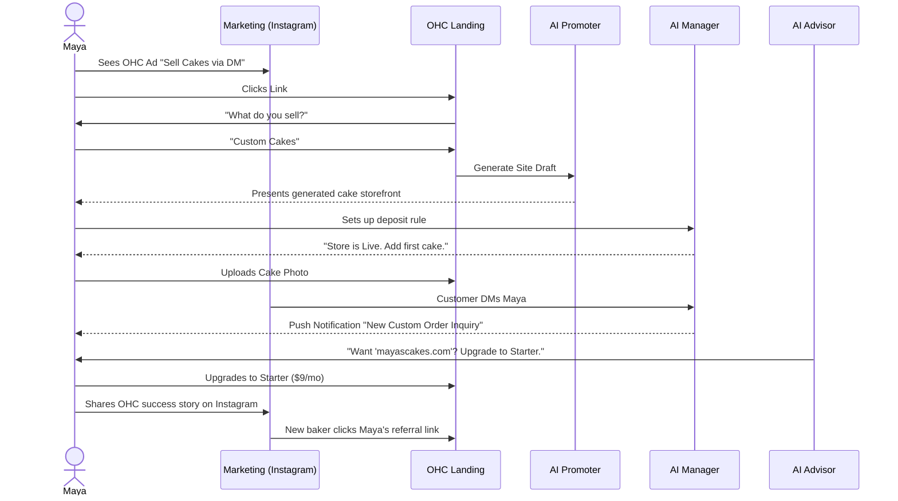
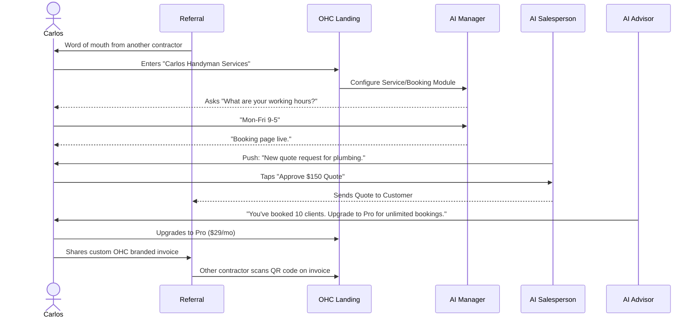
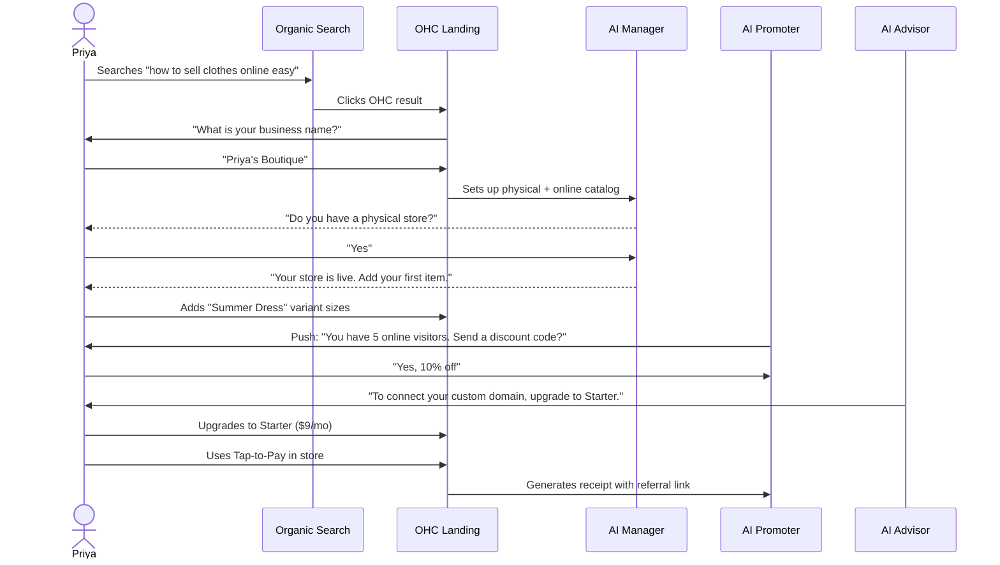
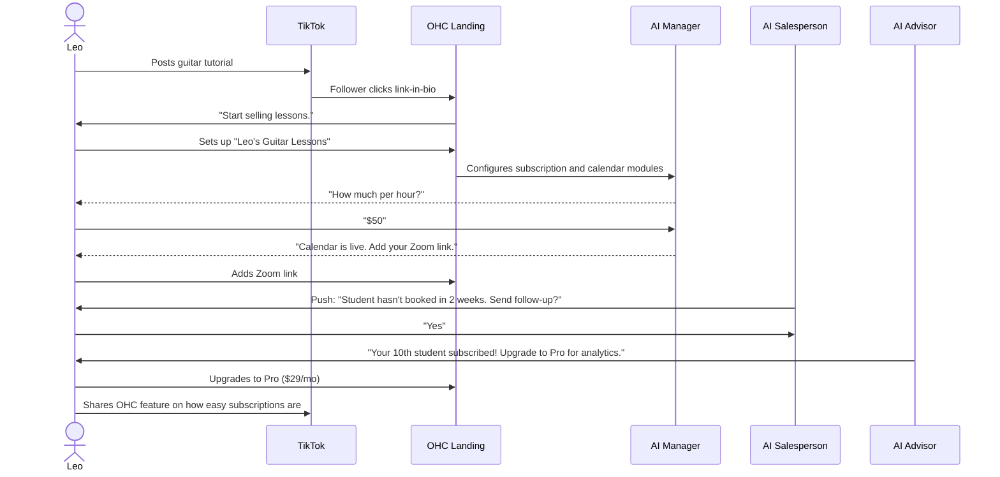
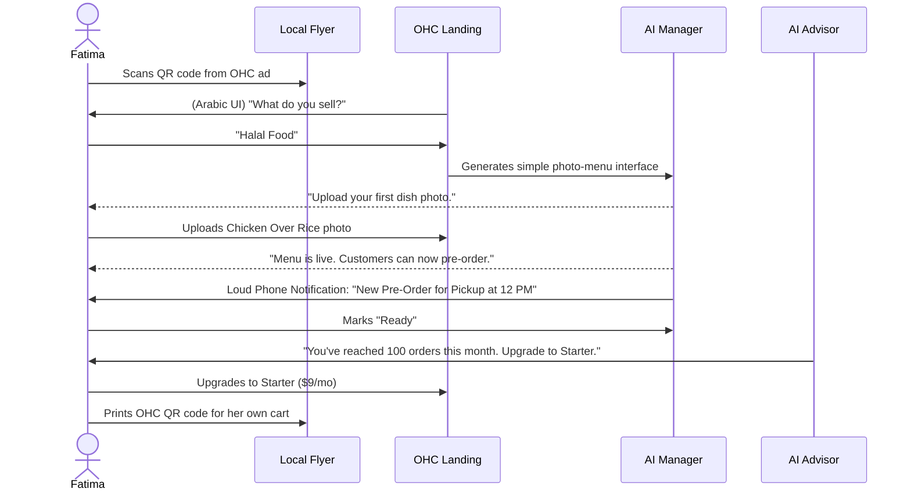

# [Product Architecture] Business Journey Architecture

## Title
Research: Complete End-to-End Business Journey Architecture for OneHumanCorp

## Problem Statement
Small business owners (bakers, handymen, tutors, food cart operators) currently face immense friction when trying to launch a business online. Existing tools like Shopify, Wix, or Squarespace demand technical literacy, hours of setup time, and manual integration of disparate tools (website builders, calendars, payment gateways). For non-technical users, this complexity leads to high abandonment rates during onboarding. We need a unified, frictionless, mobile-first business journey that guides users from zero to live business in under 10 minutes, with AI handling all technical setup invisibly.

## Research Report
### Current Market Landscape
- **Shopify:** Powerful but overwhelming for single-person service or digital businesses. Requires extensive manual theme setup and app installations for features like bookings.
- **Wix/Squarespace:** Complex drag-and-drop builders that break easily on mobile. High friction in connecting payment gateways and setting up specific business logic.
- **Link-in-bio tools (Linktree, Stan):** Easy to set up but lack robust business features (inventory, complex scheduling, physical fulfillment).

### OHC User Needs & Friction Points
- **Friction Point 1:** Blank canvas paralysis. Users abandon setup when asked to design their site or write copy from scratch.
- **Friction Point 2:** Payment gateway setup (Stripe/PayPal integrations). Non-technical users struggle with API keys and business verification steps.
- **Friction Point 3:** Multi-tool fragmentation. Maya needs a catalog, Leo needs bookings, Fatima needs pre-orders. Setting these up manually takes days.

### Persona Analysis & Retention Drivers
- **Maya (Baker):** Needs Instagram DM integration and custom order deposits. Upgrade trigger: Custom domain requirement.
- **Carlos (Handyman):** Needs quote generation and booking calendar. Retention driver: Daily push notifications for new leads.
- **Priya (Boutique):** Needs inventory sync and in-person tap-to-pay. Referral loop: Branded invoices shared with other boutique owners.
- **Leo (Tutor):** Needs automated meeting links and subscription billing. Activation milestone: First recurring payment processed.
- **Fatima (Food Cart):** Needs ultra-simple, localized mobile UI (Arabic/English) for pre-orders. Friction point: High text density; needs icon/photo-driven UI.

## Design Doc

### Mobile UX Flow (375px First)
1. **Acquisition & Landing (0-1 min):**
   - Single, prominent CTA: "Start your business in 60 seconds."
   - User inputs just two things: "What is your business name?" and "What do you sell?" (e.g., "Maya's Cakes", "Custom Cakes").
2. **AI-Assisted Onboarding Wizard (1-3 min):**
   - **Simple Mode (Default):** Conversational UI where the AI asks 3-4 plain-language questions (e.g., "Do you take deposits?", "Where are you located?").
   - Progressive disclosure: Advanced technical settings are hidden by default.
   - The AI invisibly auto-generates the storefront, writes copy, and configures the relevant modules (catalog, calendar, menu).
3. **Activation (3-5 min):**
   - Immediate gratification: "Your store is live! Here is your link."
   - Next Best Action: "Add your first product photo" or "Connect your bank account to get paid."
4. **Retention Dashboard (Daily Use):**
   - Clean, widget-based mobile dashboard.
   - Prominent unread messages/orders.
   - "The Advisor" AI provides daily insights (e.g., "You had 10 visitors yesterday. Tap here to message them.").

### Key Design Decisions
- **No-Code Absolute:** Users never see API keys, DNS settings, or HTML.
- **Conversational Onboarding:** Replace long forms with a chat-like wizard driven by the AI Marketing & Operations departments.
- **Deferred Complexity:** Users can go live and accept orders *before* completing complex tax or compliance settings (handled later by "The Protector" agent via nudge).
- **Session-Sticky Simple Mode:** The UI always defaults to plain language.

### AI Agent Integration Points
- **The Promoter:** Generates initial website layout, copy, and SEO meta tags during onboarding.
- **The Manager:** Configures the appropriate backend modules (inventory vs. bookings) based on the user's initial prompt.
- **The Advisor:** Monitors the user's journey and sends push notifications to drive activation and retention (e.g., "Maya, you haven't added a photo to your new cake listing yet.").

### Architecture Diagrams (Mermaid.js)

#### Maya's Journey (Baker - Physical Products & Custom Orders)

#### Carlos's Journey (Handyman - Services & Bookings)

#### Priya's Journey (Boutique Owner - Physical Retail & Online)

#### Leo's Journey (Music Tutor - Digital Bookings & Subscriptions)

#### Fatima's Journey (Food Cart - Pre-Orders & Notifications)

## Implementation Prompt
**For Implementer Agent:**
Implement the end-to-end Onboarding Wizard and Home Dashboard UI supporting the defined Business Journeys.
1. Create a mobile-first wizard (375px) that collects minimal business details (Name, Type).
2. Integrate the progressive disclosure pattern: ensure all technical settings (like DNS or Stripe API keys) are hidden behind a session-sticky "Advanced Mode" toggle, keeping the default view in plain language ("Simple Mode").
3. Build the core Retention Dashboard that displays "Next Best Actions" (e.g., "Add a product", "Connect bank") and recent AI Agent activity.
4. Ensure the UI gracefully adapts to different business types (e.g., showing a "Menu" module for food carts vs. "Calendar" for tutors).
5. All UI must adhere to the Visual Excellence Mandate (Glassmorphism, Outfit + Inter typography) and pass the 30-second "grandmother test". Write at least 5 E2E Playwright tests verifying this complete flow from login to the final dashboard.

## Priority
P0

## Estimated Scope
Large
