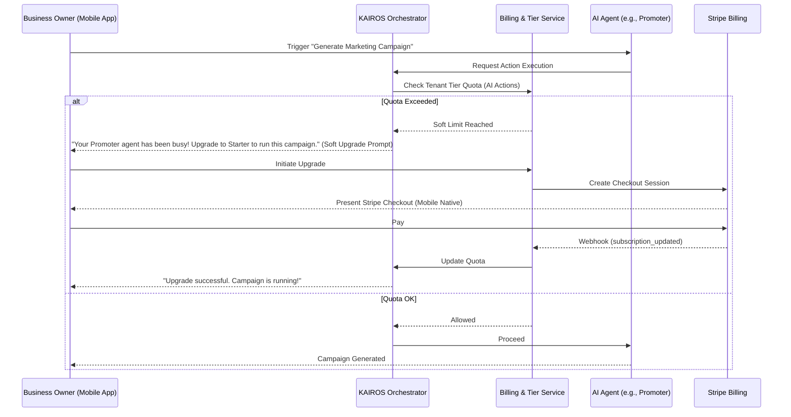

# [architecture] Multi-Tenant SaaS Tier Architecture

## Problem Statement
Small business owners coming to OneHumanCorp (OHC) need a transparent, frictionless path from launching their first product on the "Free" tier to scaling a highly successful operation on "Pro" or "Business" tiers. Currently, there is a lack of defined boundaries around AI agent usage, product limits, and storage constraints per tenant tier.

When a user hits a limit (e.g., maximum AI actions or storage quota), they must encounter a "soft wall" that explains the value of upgrading in plain language, rather than a hard error or generic "Quota Exceeded" exception. We need an architecture for the SaaS Tier system that clearly defines tier limits, seamlessly guides users through upgrade paths (especially on mobile), and guarantees that scaling up never interrupts critical business operations (like a customer placing an order).

## Research Report
### Competitive Analysis
- **Shopify:** Excellent upgrade paths, but relies heavily on third-party app subscriptions rather than a unified tier model. Limits are mostly around staff accounts and reporting features.
- **Wix / Squarespace:** Hard gatekeeping of basic features (like removing platform branding or accepting online payments) behind paid tiers. Often results in user frustration early in the onboarding journey.
- **GoDaddy:** Unclear tier boundaries; users often pay for basic add-ons.

### OHC Differentiation & Findings
OHC's unfair advantage is the invisible AI departments. Therefore, tier differentiation should be centered around **AI capability and scale**, not gatekeeping basic functionality. The Free tier must be genuinely useful for a hobbyist (e.g., Maya baking 1 cake a week).

We define the tiers as follows:
- **Free ($0):** 10 products, 1 AI Department, 100 AI actions/mo, 500MB storage, OHC subdomain.
- **Starter ($9/mo):** 100 products, 3 AI Departments, 1,000 AI actions/mo, 5GB storage, Custom Domain.
- **Pro ($29/mo):** Unlimited products, 10 AI Departments, Unlimited AI actions, 50GB storage, Custom Domain + SSL.
- **Business ($79/mo):** Unlimited products, Unlimited AI Departments, Unlimited AI actions, 500GB storage, Multi-domain.

*Key Insight:* The transition from Free -> Starter is the critical activation point. It typically happens when a user wants to connect a custom domain or needs a second AI department (e.g., adding Customer Success to Operations).

## Design Doc

### Architecture Diagram

### Mobile UX Flow (375px First)
1. **The Soft Wall:** The user tries to enable a 4th AI department on the Starter tier.
2. **The Prompt:** Instead of an error toast, a bottom sheet modal slides up with Glassmorphism styling.
   - *Title:* "Scale Up Your Team"
   - *Body:* "You've reached your limit of 3 AI departments on the Starter plan. Upgrade to Pro to hire 'The Accountant' and unlock unlimited agents."
   - *Action:* A prominent "Upgrade to Pro - $29/mo" button.
3. **The Transaction:** Tapping the button opens a native Stripe Payment Sheet or Apple Pay/Google Pay bottom sheet.
4. **The Resolution:** Upon success, a celebratory micro-animation plays (e.g., confetti or a smooth checkmark), the bottom sheet dismisses, and the 4th AI department is instantly activated.

### Key Design Decisions
- **Soft Limits over Hard Errors:** Critical business operations (e.g., a customer placing an order) MUST NOT be blocked even if the merchant is over their AI action quota. Instead, the AI action is paused/deferred, and the merchant is prompted to upgrade.
- **Centralized Quota Checking:** All quota enforcement happens at the Orchestrator layer before dispatching work to the agents, preventing wasted LLM tokens and standardizing the upgrade prompt logic.
- **Stripe Integration:** We use Stripe Checkout and Payment Elements for handling the actual subscription lifecycle, offloading PCI compliance and invoice generation.

## Implementation Prompt
**Task:** Implement the multi-tenant tier limits and the "Soft Wall" upgrade prompt flow.
**User-Facing Outcome:** When a small business owner attempts an action that exceeds their current tier limit (e.g., adding an 11th product on the Free tier, or exceeding their monthly AI action quota), they should be presented with a beautifully designed, mobile-friendly bottom sheet explaining the limit and offering a 1-tap upgrade path via Stripe. Critical customer-facing operations (like accepting an order) must never be blocked by these limits.
**Acceptance Criteria:**
1. Define the Tier limits (Free, Starter, Pro, Business) in the shared data model.
2. Implement quota tracking in the Orchestrator for AI actions and products.
3. When a limit is hit, the API must return a specific "Quota Exceeded" response that includes the required tier to proceed.
4. The frontend (Flutter/Slint) must catch this response and display the upgrade bottom sheet.
5. Provide E2E tests simulating a user hitting a limit and completing the upgrade flow.

## Priority
P1 (High)

## Estimated Scope
Medium
