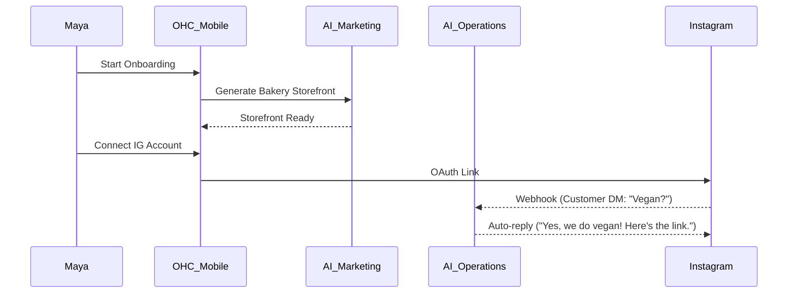
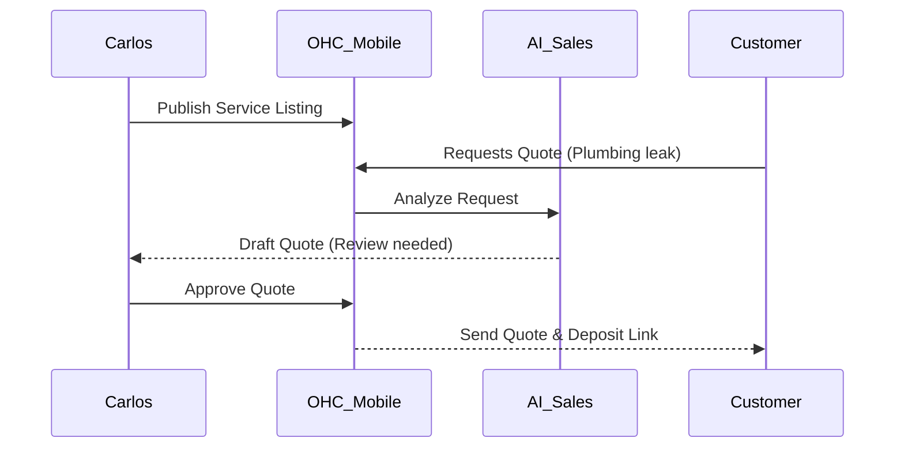
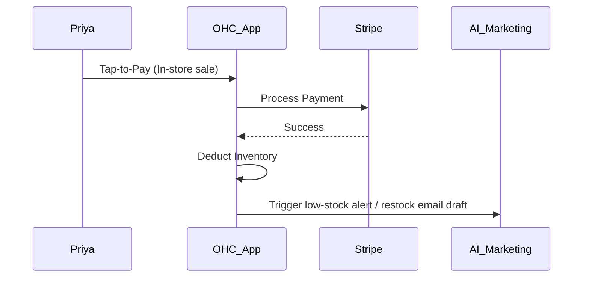
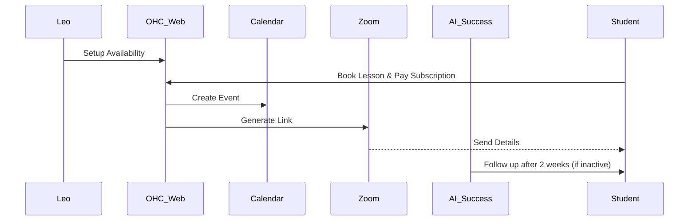
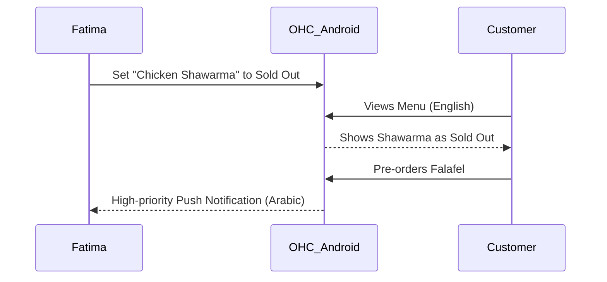

# [Architecture] Business Journey Architecture

## Title
End-to-End Business Journey Architecture for Core User Personas

## Problem Statement
Small business owners—from bakers to handymen—are currently forced to stitch together disjointed, complex tools (e.g., Shopify for e-commerce, Calendly for booking, Mailchimp for marketing). For non-technical users, this friction prevents them from starting or growing their business. We need a unified, frictionless, mobile-first journey where anyone can launch their business in under 10 minutes without touching code, guided invisibly by AI agents.

## Research Report
Current platforms (Shopify, Wix, Squarespace) cater primarily to semi-technical users or those with time/money to hire developers.
- **Shopify**: High learning curve, disjointed app ecosystem for bookings or subscriptions, requires web browser for meaningful setup.
- **Wix/Squarespace**: Template heavy, desktop-first builders, "AI" features are bolted-on chatbots rather than core operators.
- **GoDaddy**: Basic tools, lacking deep operational integrations like deposit tracking or intelligent AI customer support.

**Friction Points to Eliminate:**
1. Complex domain/DNS configuration.
2. Building an initial storefront or menu from scratch.
3. Managing disjointed multi-channel communications (IG, WhatsApp, Email).
4. Manual booking and inventory tracking.
5. Understanding financial performance without an accountant.

## Design Doc

### 1. Maya (The Home Baker, 28, iPhone-only)
**Acquisition:** Sees an Instagram ad or a friend's OHC link-in-bio.
**Onboarding:** Inputs basic details ("Maya's Cakes", custom cakes), AI auto-generates a storefront template tailored to bakeries. Connects Stripe.
**Activation:** Uploads first 3 cake photos. Connects Instagram.
**Retention:** Receives daily notifications on new orders and custom deposit requests.
**Revenue:** Upgrades from Free to Starter when she reaches the 100-order limit or wants a custom domain.
**Referral:** Recommends OHC to a fellow baker on an IG group.

### 2. Carlos (The Freelance Handyman, 42, Android-only)
**Acquisition:** Hears about OHC from a contractor friend.
**Onboarding:** AI suggests service categories (Plumbing, Painting) and standard pricing based on location.
**Activation:** Publishes service listing and sets up booking availability.
**Retention:** Uses the central inbox to manage customer requests and reviews AI-generated quotes.
**Revenue:** Upgrades for unlimited quotes and custom domain.
**Referral:** Word of mouth to other contractors.

### 3. Priya (The Boutique Owner, 35, iPhone/MacBook)
**Acquisition:** Searches "best POS and online store for small boutique".
**Onboarding:** Imports existing inventory list. Sets up variants.
**Activation:** Completes first in-person transaction using Tap-to-Pay (Stripe Terminal).
**Retention:** Uses daily analytics dashboard to track sales trends.
**Revenue:** Upgrades to Pro for unlimited variants and email marketing volume.
**Referral:** Mentions platform in a retail owners forum.

### 4. Leo (The Music Tutor, 22, Web/Mobile)
**Acquisition:** Sees an ad on TikTok for "link-in-bio for teachers".
**Onboarding:** Links Google Calendar. Sets up subscription tiers.
**Activation:** Publishes portfolio page and adds link to TikTok bio.
**Retention:** AI follows up with inactive students.
**Revenue:** Upgrades to manage more than 10 recurring subscriptions.
**Referral:** Shares affiliate link with other tutors.

### 5. Fatima (Food Cart Operator, 50, Low-end Android, Arabic/English)
**Acquisition:** Local community outreach or community center flyer.
**Onboarding:** Selects Arabic language. Takes photos of menu items. AI auto-translates to English.
**Activation:** Toggles "Open for Orders" and receives first pre-order.
**Retention:** Daily use of the printable/viewable order list and sold-out toggles.
**Revenue:** Free tier is sufficient initially; upgrades for higher transaction volume limits.
**Referral:** Tells other food cart owners in the neighborhood.

## Implementation Prompt
**For Implementer Agent:**
Implement the core unified onboarding flow and dashboard architecture that supports these multi-persona journeys.
- **User Outcome:** A non-technical user can sign up, provide minimal business details, and have a tailored storefront/booking page generated by the AI Marketing agent in under 10 minutes.
- **CUJ:** User Launch Business Flow. The user inputs their business name and type, AI generates the initial site and agent configurations, user connects Stripe, and the business goes live.
- **Acceptance Criteria:**
  1. Mobile-first UI (375px baseline) utilizing the Glassmorphism premium design tokens.
  2. Data models must handle polymorphic business types (physical, service, food).
  3. Seamless AI department initialization (Operations, Marketing, Sales, etc.) per tenant.
  4. 100% E2E test coverage for the Onboarding CUJ starting from login.

## Priority
P0

## Estimated Scope
Large
