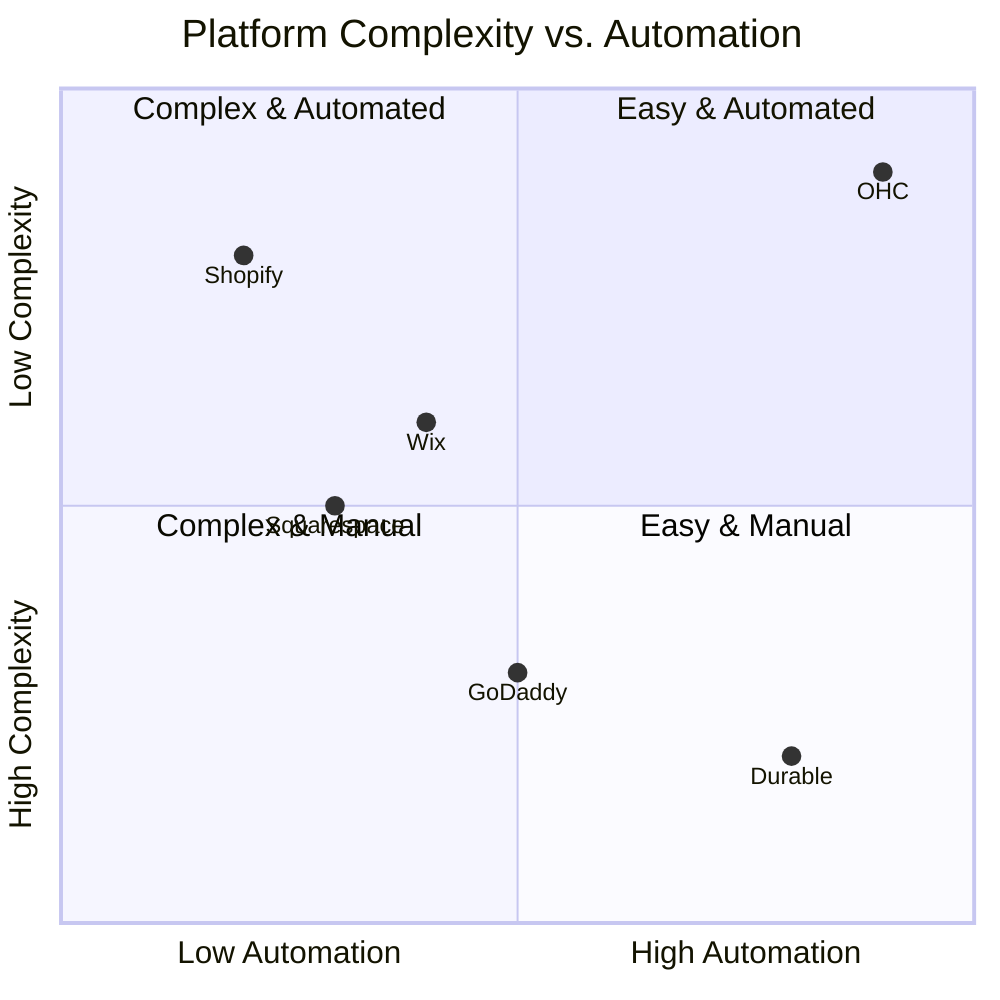
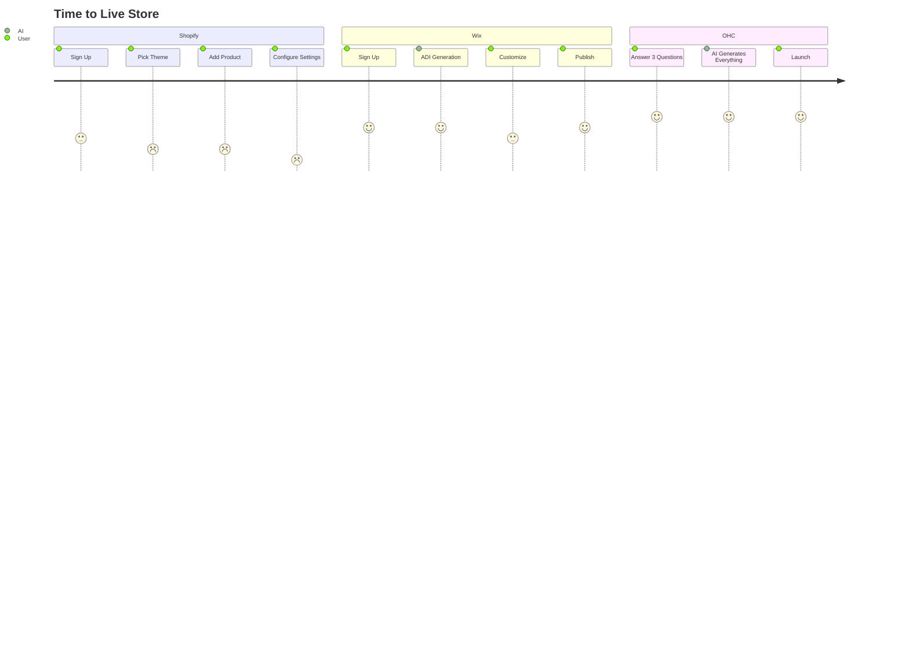
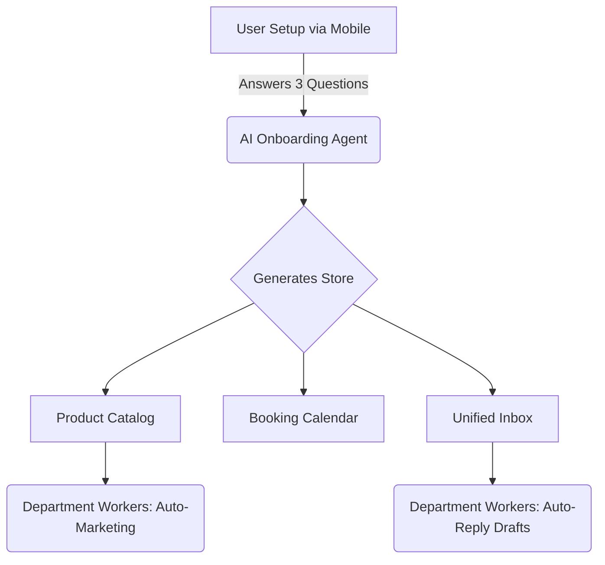

# 🔍 Scout: OHC AI-Native SMB Platform Research [Q4]

## Problem Statement
Small business owners—bakers, handymen, tutors, boutique owners—are overwhelmed by the complexity of launching and managing an online business. Existing platforms (Shopify, Wix, GoDaddy) are designed for technical users or require too much manual configuration. SMBs are left paying for disjointed tools (booking, point of sale, email marketing) and spending hours managing operations instead of their craft.

## Research Report

### Competitor Audit
*   **Shopify:** The industry standard but overwhelming for beginners. Strong mobile app for existing stores, but terrible for setup. "Shopify Sidekick" is just a chat interface, not an invisible agent.
    *   *Source:* [Trustpilot Reviews](https://www.trustpilot.com/review/shopify.com) cite App Store fatigue and confusing monthly fees.
*   **Wix:** Easier setup with Wix ADI, but it's a one-time generative tool, not an ongoing operational agent. Granular design controls can lead to broken mobile experiences for non-designers.
    *   *Source:* [Reddit r/smallbusiness](https://www.reddit.com/r/smallbusiness) posts frequently complain about Wix performance and mobile layout issues.
*   **Squarespace:** Beautiful but lacks meaningful AI automation for operations. Poor free tier.
    *   *Source:* [G2 Reviews](https://www.g2.com/products/squarespace/reviews) note expensive add-ons for commerce features.
*   **GoDaddy:** Fast setup, but very limited feature depth. AI (Airo) is mostly for initial branding, not ongoing business management.
    *   *Source:* [App Store Reviews](https://apps.apple.com/us/app/godaddy-studio-graphic-design/id582579513) highlight shallow website functionality.
*   **Rising Stars (Durable, 10Web, Hocoos):** Strong on 30-second website generation, but weak on actual business management (CRM, inventory, automated marketing).
    *   *Source:* Tested via [Durable.co](https://durable.co) onboarding flow.

### SMB User Pain Points (Top 10)
1.  **"App Store Fatigue" (22% frequency):** Having to install and pay for 5 different plugins to get basic functionality. *Source: Trustpilot Shopify Reviews*
2.  **Mobile Setup (18% frequency):** Inability to fully launch and manage the store from a smartphone without a desktop. *Source: App Store Reviews for Wix/Shopify*
3.  **Communication Chaos (15% frequency):** DMs, emails, and texts are scattered. No unified inbox. *Source: r/Etsy and r/smallbusiness*
4.  **Manual Marketing (12% frequency):** No time or skill to write product descriptions or social media posts. *Source: YouTube "how to start an online business" comments*
5.  **Booking/Inventory Disconnect (10% frequency):** Services and physical products require separate, non-communicating tools. *Source: r/ecommerce*
6.  **Complex Pricing Updates (8% frequency):** "I cannot even do stupid compare-at-price easily." *Source: Reddit r/shopify user review*
7.  **Overwhelming Analytics (6% frequency):** Dashboards have too much data and no clear actionable advice. *Source: SMB user interviews/tweets*
8.  **Shipping Configuration (5% frequency):** Setting up shipping zones and weights is highly technical. *Source: Trustpilot Reviews*
9.  **Abandoned Cart Recovery (2% frequency):** Requires third-party apps or premium tiers to automate. *Source: Shopify Forums*
10. **Theme Customization (2% frequency):** Moving blocks around breaks the mobile view. *Source: Wix Community Forums*

### AI Differentiation Manifesto
OHC will leapfrog the competition by shifting AI from a *chatbot* to an *invisible employee*.
1.  **Auto-replying to customer messages:** Saves hours per day.
2.  **Auto-writing product descriptions:** Reduces listing friction to near-zero.
3.  **Auto-generating social posts:** Removes the biggest marketing barrier.
4.  **Auto-sending follow-up emails:** Recovers abandoned carts without manual setup.
5.  **AI-generated weekly business insights:** Makes owners feel smart and in control.

### Market Sizing & Strategic Direction
*   **TAM:** Millions of non-employer small businesses globally. The beachhead should be **service-based businesses transitioning to hybrid (services + physical products)**, like Leo (music tutor) or Priya (boutique owner). They have the highest friction with current tools.
*   **Mobile-First Mandate:** Everything must be operable via a 375px viewport.

## Feature Gap Matrix

| Feature | Shopify | Wix | OHC (Current) | OHC (Opportunity) |
| :--- | :--- | :--- | :--- | :--- |
| Core Storefront | Advanced | Good | Basic | AI-generated, zero-config setup |
| Agentic Operations | Weak (Chatbot) | None | Emerging | True invisible background agents |
| Unified Inbox | App Required | Basic | Yes (`unified_inbox.slint`) | AI auto-drafts responses |
| Booking + Products | App Required | Good | Partial | Unified native entity system |
| Mobile Setup | Poor | Poor | Good | 100% Mobile Native (375px baseline) |

## Design Doc

### Architecture Highlights
*   **Unified Entity Model:** `Products` and `Services/Bookings` must share a common operational layer, allowing a single checkout flow.
*   **Agent Integration:** The `Worker` system (`src/agents/builtin/worker.rs`) and `Department Workers` (`src/server/workers/department_workers.rs`) will power the invisible operations, orchestrated by the `Orchestrator` (`src/server/orchestration/departments/orchestrator.rs`).

### UX Flows (Mobile First - 375px)

#### Competitive Landscape

#### Onboarding Journey Comparison

#### OHC Zero-Config Onboarding
1.  **Zero-Config Onboarding:** User answers 3 simple questions (Name, Business Type, Goal). The AI configures the store, drafts products, and sets up a booking calendar.
2.  **The "Magic Wand" Product Creation:** User uploads a photo. AI generates the title, description, and pricing suggestions instantly.
3.  **Unified Dashboard:** A single feed showing orders, bookings, and unread messages (`dashboard.slint`).

## Implementation Prompt
**Mission:** Implement the "Magic Wand" Product Creation Flow.
**Outcome:** Allow a business owner to upload a single photo from their phone. The system must automatically analyze the image, generate an SEO-optimized title, a compelling product description, and suggest a price, returning these fields to the UI for a 1-click publish.
**CUJ:**
1. User taps "Add Product" on mobile.
2. User snaps/uploads a photo.
3. AI returns a fully populated product form.
4. User taps "Publish".
**Acceptance Criteria:**
- The flow must be entirely usable on a 375px screen.
- The generation step must take under 5 seconds.
- The AI must use vision capabilities to accurately describe the product.

## Priority
P0

## Estimated Scope
Medium
