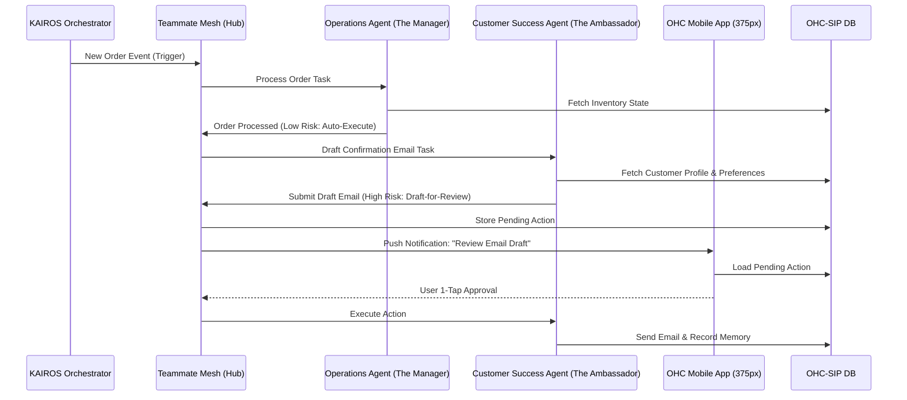

# [architecture] Implement AI Agent Approval Workflow Engine

## Title
Implement AI Agent Approval Workflow Engine for High-Risk AI Actions

## Problem Statement
Small business owners like Maya (baker) and Carlos (handyman) want AI to handle repetitive tasks—like drafting emails to customers or replying to DMs—but they are terrified of the AI saying the wrong thing, offering a discount they didn't authorize, or damaging their hard-earned reputation. They need the AI to act like a helpful employee who drafts the work and says, "Boss, does this look good to send?" rather than acting entirely autonomously on sensitive matters.

## Research Report
- **User Pain Point:** The biggest barrier to AI adoption for SMBs is lack of trust. Business owners fear hallucination in customer-facing communication or financial actions (refunds).
- **Competitive Landscape:**
  - *Shopify Magic*: Focuses on product descriptions and email drafts, but often requires switching contexts to review.
  - *Wix AI*: Good for initial site generation, but lacks continuous "employee-like" operations.
  - *GoDaddy*: Offers basic AI copy generation, but no concept of autonomous departments drafting actions for review.
- **Solution Gap:** There is no platform that treats AI as discrete "departments" (Operations, Marketing, Sales, Customer Success) that can proactively draft high-risk actions (e.g., an email to a VIP customer who just ordered, or a quote for a new lead) and present them in a unified, 1-tap mobile approval feed.
- **Conclusion:** We must implement a "Draft-for-Review" workflow engine within the KAIROS Orchestrator. Low-risk actions (tagging an order) auto-execute; high-risk actions (sending an email, posting on social media, issuing refunds) go into a pending queue requiring explicitly 1-tap mobile approval.

## Design Doc

### Architecture Diagram

### Mobile UX Flow & UI Wireframes (375px first)
- **Screen 1: Push Notification**
  - Text: "The Ambassador drafted an email to Priya. Review now?"
  - Interaction: Tap notification to open the OHC App directly to the Approval Feed.
- **Screen 2: The Approval Feed (Home Screen)**
  - A clean, Glassmorphism card stack showing pending AI actions.
  - Card Content:
    - Department Icon (e.g., Customer Success "The Ambassador")
    - Plain English Summary: "Email drafted to thank Maya for her 5th order."
    - Expandable Preview: Shows the actual email text.
  - Actions:
    - Large 44x44px Touch Targets.
    - [Approve & Send] (Primary, green)
    - [Edit Draft] (Secondary, outline)
    - [Reject] (Tertiary, red text)
- **Screen 3: Success State**
  - Subtle entrance motion (<= 300 ms, cubic-bezier(0.4, 0, 0.2, 1)).
  - Toast notification: "Email sent!"
  - Card dismisses with exit motion (<= 200 ms).

### AI Agent Integration Points
- **Department Definitions:**
  - *The Ambassador (Customer Success)*: Drafts emails, review requests.
  - *The Promoter (Marketing)*: Drafts social media posts, promotional campaigns.
  - *The Salesperson (Sales)*: Drafts quotes and proposals.
- **Risk Assessment:** Agents must attach a `risk_level` (e.g., `LOW`, `HIGH`) to their task outputs within the Teammate Mesh.
- **Pending Queue:** The KAIROS Orchestrator intercepts `HIGH` risk actions, pauses execution, and stores them in the shared state (OHC-SIP DB) awaiting the tenant owner's approval.

### Key Design Decisions
- **1-Tap Approval:** Business owners are busy. The approval process must take less than 5 seconds. We avoid complex editing interfaces by default, favoring a simple Approve/Reject, with an optional edit flow if needed.
- **Mobile-First Notifications:** Approvals happen on the go. Push notifications are the primary trigger for review, ensuring real-time responsiveness to customers.
- **Plain Language:** No technical jargon. The system says "The Ambassador drafted an email", not "Customer Success Agent Task Pending."

## Implementation Prompt
**Context:** Implement the "Draft-for-Review" approval engine in the KAIROS Orchestrator.
**Outcome:** When an AI Agent department (like Customer Success) generates a high-risk action (like sending an email), it should not execute immediately. Instead, it must be paused and placed into a pending approval queue. The mobile dashboard must fetch these pending actions and allow the user to approve or reject them with a single tap. Once approved, the orchestrator resumes and executes the action.
**Core User Journey (CUJ):**
1. The Customer Success Agent drafts a thank-you email.
2. The system pauses the action and marks it as pending review.
3. The business owner opens the mobile app, sees the pending draft, and taps "Approve".
4. The system executes the action (sends the email).
**Acceptance Criteria:**
- High-risk actions from agents are intercepted and stored in a pending state.
- The mobile app can retrieve a list of pending actions for the tenant.
- The business owner can approve or reject the action.
- Approving the action resumes execution; rejecting it discards the draft.
- The feature must be fully functional on a 375px mobile viewport.
- The UI must use Glassmorphism design tokens and ensure all buttons are at least 44x44px.

## Priority
P1

## Estimated Scope
Medium
