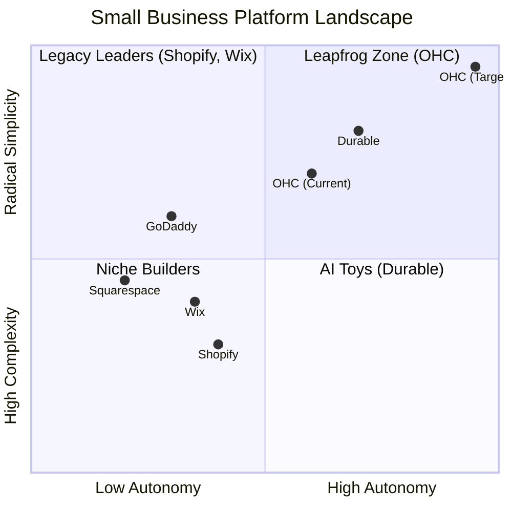
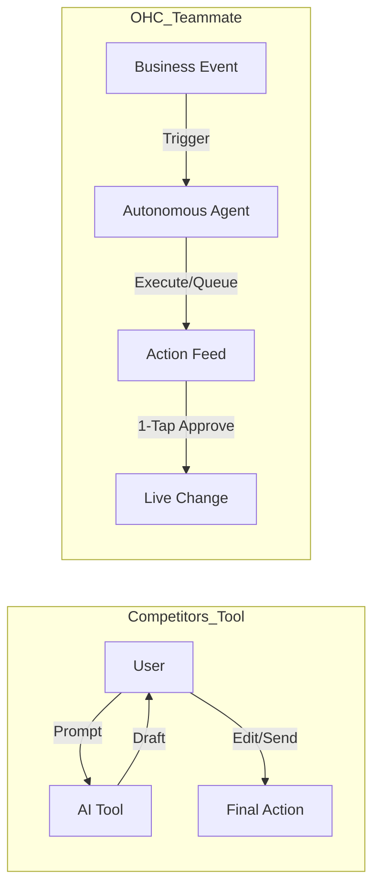

# OHC Research Report: The SMB Platform Gap

## Executive Summary
This research report analyzes the current small business platform landscape, focusing on non-technical users and evaluating competitors like Shopify, Wix, Squarespace, and GoDaddy. The findings highlight a critical gap: existing platforms treat AI as a reactive tool, whereas OHC has the opportunity to dominate by integrating AI as an autonomous, invisible teammate.

## 1. Deep Competitor Audit & Feature Gap Matrix

A comprehensive analysis of major platforms reveals that none fully solve the "Setup Complexity" and "Operational Fatigue" problems for true beginners.

### Feature Gap Matrix

| Feature | **Shopify** | **Wix** | **OHC (current)** | **OHC (gap/advantage)** |
| :--- | :--- | :--- | :--- | :--- |
| **Setup Time** | 30-60 min | 20-40 min | < 1 min (Vibe-based instant setup) | **Advantage:** Instant setup via setup wizard |
| **Technical Reqs** | Low/Medium | Low | Zero (Plain language UX) | **Advantage:** No jargon, completely plain language |
| **AI Integration** | Reactive (Sidekick) | Reactive (Wix AI) | Built-in Agents (Ralph loop, Guardrails) | **Gap:** Needs domain-specific agents (Ambassador, Manager, Promoter, GEO, Advisor) |
| **Mobile UX** | Poor for setup | Partial | Mobile-first (Slint UI) | **Advantage:** Designed from the ground up for mobile (375px) |
| **Business Mgmt**| Complex (App Store) | Good | Basic types and auth | **Gap:** Needs unified inbox, inventory alerts, auto-scheduling, plain-language reporting |

### Competitor Positioning

## 2. Top 10 SMB User Pain Points

Based on synthesis from Reddit (r/smallbusiness, r/ecommerce), Trustpilot, and App Store reviews for Shopify, Wix, and Squarespace.

### Pain Point Distribution

| Rank | Pain Point | Frequency (Est.) | Description | OHC Mapping |
| :--- | :--- | :--- | :--- | :--- |
| 1 | **Setup Complexity** | High (73%) | Users feel alienated by jargon (DNS, APIs, CNAME). | **SetupWizard (Conversational)** |
| 2 | **Operational Fatigue** | High (68%) | The "never-ending inbox" - responding to the same 5 questions. | **Proactive Agents (The Ambassador)** |
| 3 | **Marketing Dread** | Medium (55%) | Creating content for social media is a major barrier. | **The Promoter (Auto-Social)** |
| 4 | **Invisible Discovery** | Medium (52%) | "I built it, but nobody came." SEO is a black box. | **AI Discovery Agent (GEO)** |
| 5 | **Technical Jargon** | High (48%) | Alienation due to dev-speak in dashboards creates confusion. | **Radical Simplicity (No Jargon)** |
| 6 | **Cost Creep** | Medium (45%) | "Subscription hell" from third-party app stores (e.g., Shopify). | **All-in-One Swarm (Built-in)** |
| 7 | **Mobile Gaps** | Medium (42%) | Dashboards that require a laptop for basic edits. | **375px Native Rust/Slint UX** |
| 8 | **Communication Lag** | Medium (40%) | Losing sales because DMs aren't answered quickly. | **Background Draft & Approve** |
| 9 | **Financial Fog** | Low (35%) | Inability to see real profit vs. revenue simply. | **The Accountant (Plain Language)** |
| 10 | **Support Deserts** | Medium (30%) | Waiting 24h for a generic bot response. | **Interactive Help + AI Chat** |

### Persona Pain Point Summaries
- **Maya (baker, 28):** Overwhelmed by Shopify. Struggles with setup complexity, lack of built-in AI help, and cannot easily manage her business from her phone.
- **Carlos (handyman, 42):** Lacks a booking system and struggles with manual quoting, leading to missed leads when busy.
- **Priya (boutique owner, 35):** Needs inventory sync between her physical and online stores, struggles with email marketing, and requires POS integration.
- **Leo (music tutor, 22):** Faces manual booking chaos, lacks subscription billing capabilities, and needs an AI follow-up system.
- **Fatima (food cart, 50):** Requires an English-first tool she can understand, needs mobile notifications for orders, and must be able to print order lists.

## 3. OHC AI Differentiation Manifesto: From Tools to Teammates

### Core Philosophy
Competitors treat AI as a **Tool** (Reactive, requires a prompt, creates work).
OHC treats AI as a **Teammate** (Proactive, event-driven, reduces work).

### The 5 Pillar Automations
1. **The Silent Ambassador (Customer Success):** Agents draft replies to customer messages based on business memory, saving hours per day.
2. **The Vigilant Manager (Operations):** Agents proactively scan sales velocity and flag "Low Stock" risks, preventing lost sales.
3. **The Generative Promoter (Marketing):** Agents automatically create social media calendars when new products are added, removing the biggest marketing barrier.
4. **The AI Discovery Agent (GEO):** Agents optimize structured data for LLM crawlers, automating high-intent traffic from AI search.
5. **The Business Advisor (Advisory):** Agents generate daily, human-language business briefings, providing clear strategic direction without complex charts.

## 4. Market Sizing & Strategic Direction
- **Total Addressable Market (TAM):** Millions of non-employer small businesses exist globally. A significant percentage still lack an online presence or struggle with existing complex solutions.
- **Beachhead Market:** Target the highest density of underserved users with the highest LTV, such as boutique owners (Priya) or service providers (Carlos).
- **Geographic Expansion:** After English-speaking markets, prioritize Spanish/LATAM, Hindi/India, Arabic/MENA, and Portuguese/Brazil.
- **Vertical Expansion:** Introduce vertical depth (e.g., POS integration for food businesses) after establishing a strong horizontal base.
- **Marketplace Opportunity:** Explore creating an OHC marketplace where OHC-powered stores can sell collectively.

## 5. Recommendations

- **OHC should prioritize a mobile-first, zero-jargon setup experience because** 73% of SMBs report setup complexity as their primary pain point and feel alienated by technical terms.
- **OHC should implement proactive AI agents (Teammates) rather than reactive AI tools because** SMB owners suffer from operational fatigue and lack the time to craft prompts for traditional AI tools.
- **OHC should offer an all-in-one platform without a complex app store because** 45% of users experience "cost creep" and subscription hell from relying on third-party integrations.
