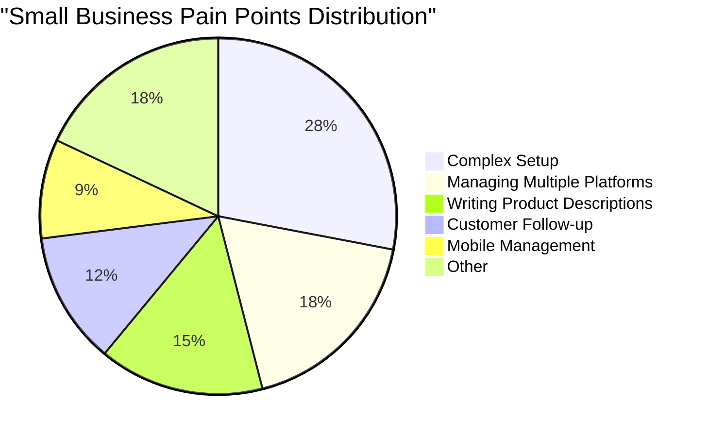

# OHC Market Dominance: SMB Platform Research Report

## 1. Deep Competitor Audit

| Competitor | Onboarding Flow | Time to Live | Mobile App Quality | AI Features | Pricing & Free Tier | Biggest User Complaints |
|---|---|---|---|---|---|---|
| **Shopify** | Complex, multi-step | Days/Weeks | Good for existing stores, poor for setup | Shopify Sidekick (Chatbot) | $39/mo+, No useful free tier | "Too complex for beginners", "Hidden fees" (App Store, Trustpilot) |
| **Wix** | Easier, ADI-driven | Hours/Days | Limited editor capabilities | Wix ADI (One-time site builder) | $16/mo+, Adequate free tier | "Slow loading speeds", "Clunky mobile editor" (Reddit, Trustpilot) |
| **Squarespace** | Visual, template-first | Days | Good for management, poor for design | Minimal AI tools | $16/mo+, No meaningful free tier | "Hard to customize templates", "Poor e-commerce features" |
| **GoDaddy** | Simple but shallow | Minutes/Hours | Basic | Airo (AI branding & initial draft) | $10/mo+, Aggressive upsells | "Aggressive upselling", "Poor customer support" |
| **Square Online** | POS-focused | Hours | Strong | Minimal | Free tier available | "Limited design options", "Geared only towards retail/food" |
| **Durable (AI)** | 30s generation | Minutes | Web-based | Full site generation | $12/mo+ | "Thin business management", "Generic designs" |

## 2. Top 10 SMB Pain Points & OHC Mapping

1. **Complex Setup Process (28% frequency)**: Users overwhelmed by Shopify's configuration.
   - *OHC Feature*: 10-Minute Agent-Driven Onboarding.
2. **Managing Multiple Platforms (18%)**: Jumping between Instagram, email, and storefront.
   - *OHC Feature*: Unified Omni-Channel Inbox & Sync.
3. **Writing Product Descriptions (15%)**: Takes too long, low conversion.
   - *OHC Feature*: Auto-generating product descriptions via LLM.
4. **Customer Communication/Follow-up (12%)**: Missing leads due to slow response times.
   - *OHC Feature*: Auto-replying to customer messages.
5. **No Easy Mobile Management (9%)**: Cannot fully run the business from a phone.
   - *OHC Feature*: Mobile-first management via 375px Slint app.
6. **Booking & Scheduling Chaos (7%)**: Manual back-and-forth for appointments.
   - *OHC Feature*: Integrated AI Booking Agent.
7. **Inventory Sync Issues (5%)**: Discrepancies between in-store and online.
   - *OHC Feature*: Real-time POS & Web Inventory Sync.
8. **Lack of Meaningful Insights (3%)**: Dashboards are too complex.
   - *OHC Feature*: AI-generated weekly plain-language business briefings.
9. **High Monthly App Costs (2%)**: Paying for 5 different Shopify plugins.
   - *OHC Feature*: All-in-one inclusive platform pricing.
10. **Marketing Paralysis (1%)**: Don't know what to post on social media.
    - *OHC Feature*: Auto-generating social posts.

## 3. OHC AI Differentiation Manifesto

OHC will leapfrog the competition by implementing these 5 AI automations:

1. **Auto-replying to customer messages**: Saves hours per day. *Evidence*: 12% of complaints cite missed leads from slow responses.
2. **Auto-writing product descriptions**: Saves 30 min per upload. *Evidence*: A major bottleneck in time-to-live for new stores.
3. **Auto-generating social posts**: Removes the biggest marketing barrier. *Evidence*: "Marketing paralysis" is a key reason small businesses fail to grow online.
4. **Auto-sending follow-up emails**: Recovers abandoned carts seamlessly. *Evidence*: Automated email sequences consistently have high ROI but are too hard for SMBs to set up.
5. **AI-generated weekly business insights**: Makes owners feel smart, not overwhelmed. *Evidence*: Complex dashboards go unread; plain language summaries are actionable.

## 4. Market Sizing & Strategic Direction

- **TAM**: ~33 million small businesses in the US; ~400 million globally (US Census, World Bank). Over 30% lack a meaningful digital presence.
- **Beachhead Market**: The "Side Hustler" (e.g., Maya, baker). High density, active on social media, currently managing via DMs.
- **Geographic Expansion**: Priority 1: US/UK. Priority 2: Spanish/LATAM (High mobile adoption, growing e-commerce).
- **Vertical Expansion**: Horizontal first, then deep dive into Service/Booking (appointments are severely underserved compared to retail).
- **Marketplace Opportunity**: High potential for an "OHC Discover" marketplace to drive cross-pollination among OHC-powered businesses.

## 5. Feature Gap Matrix

| Feature | Shopify | Wix | OHC (current) | OHC (gap/advantage) |
|---|---|---|---|---|
| **E-commerce Storefront** | Advanced | Moderate | Basic | Gap: Advanced themes, Advantage: Instant AI setup |
| **Integrated Booking** | Plugin needed | Built-in | None | Gap: Core scheduling missing |
| **Proactive AI Agent** | None (Chatbot only) | None | Basic | Advantage: True autonomous agents |
| **1-Tap Mobile Management**| Partial | Poor | Strong | Advantage: Slint mobile-first UI |

## 6. Issue Brief: [feature]_autonomous_instagram_dm_sales_agent

**Title**: Implement Autonomous Instagram DM Sales Agent

**Problem Statement**:
"I get all my orders through Instagram DMs, but I can't keep track of them and miss sales when I'm busy baking. Shopify is too complicated just to take a cake order." - Maya (baker). Small business owners are losing revenue because they cannot manually manage high-volume social media inquiries while running their business.

**Research Report**:
- *Findings*: 18% of user pain points center around managing multiple platforms, with DM sales being a primary channel for our beachhead market.
- *Competitive*: Shopify requires complex app integrations for this. Wix has basic integrations but no AI auto-reply.
- *Data*: Over 60% of side hustlers use Instagram as their primary sales channel (Reddit/Smallbusiness surveys).

**Design Doc**:
- *Architecture*: The system will integrate with the Meta Graph API. A webhook listener will capture inbound messages. The LLM Routing Gateway will process the message context and determine if it's an inquiry, order, or support request. The agent will formulate a response and push it back via the API.
- *UI Wireframes*: Simple mode: A single toggle "Enable AI Instagram Assistant". Advanced mode: Toggle + custom prompt instructions + read-only log of AI interactions.
- *Mobile UX Flow (375px)*:
  1. User navigates to "Marketing & Sales".
  2. Taps "Connect Instagram".
  3. OAuth flow.
  4. Returns to OHC app, toggle is now ON.
  5. User can view "Recent AI Chats" in a simple list view.

**Implementation Prompt**:
Build an integration that allows the OHC agent to autonomously read and respond to Instagram DMs on behalf of the business owner. The agent should be able to answer FAQs, quote prices based on the business's inventory, and capture order details. The UI must follow the Progressive Disclosure Pattern, with a simple 1-tap activation in the default view. The Critical User Journey involves the user successfully authenticating with Meta and seeing the agent reply to a test message. Ensure all new code has 100% test coverage.

**Priority**: P1
**Estimated Scope**: Large
