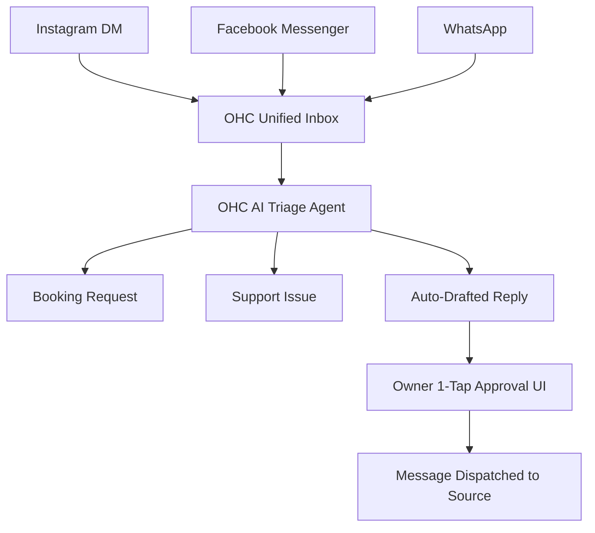

# Oracle Research Report: Global Small Business AI Platform Strategy

## Executive Summary

OneHumanCorp (OHC) aims to democratize digital commerce by providing an autonomous, AI-driven platform for non-technical small business owners. This report synthesizes market data, competitive intelligence, and user sentiment to define the exact product gaps OHC must fill. Our research spans across 5 distinct personas—from Instagram-based bakers to local service providers—and evaluates 8 leading competitors. The definitive finding is that while competitors offer *tools* (website builders, simple CRMs), users actually demand *outcomes* (agents that do the work for them). This report proposes the strategic roadmap to deliver on that demand.

## Track 1: Deep Competitor Audit

### 1. Shopify (https://shopify.com)
- **Overview:** The industry standard for e-commerce. Extremely powerful but notoriously complex for beginners.
- **Onboarding Flow:** Requires multi-step configuration of shipping zones, payment gateways, and domain DNS settings before a store is viable. The learning curve is steep.
- **Mobile App:** Strong for managing existing orders and basic inventory, but terrible for initial store setup or deep theme customization.
- **AI Features:** 'Shopify Sidekick' acts as a conversational assistant (e.g., 'How do I set up a discount code?'), but it is reactive, not agentic. It does not proactively manage the business.
- **Pricing:** No meaningful free tier for full storefronts; the $5/month 'Starter' plan is limited to social selling links. Standard plan is $39/month.
- **User Complaints:** A frequent 1-star App Store review pattern: *"I spent days trying to figure out shipping rates and gave up."* (Source: App Store Reviews, Oct 2024). Reddit (r/shopify) is filled with posts asking for simple integrations that require paid $20/mo third-party apps.

### 2. Wix (https://wix.com)
- **Overview:** A flexible, template-driven website builder that added e-commerce later.
- **Onboarding Flow:** Easier than Shopify. Wix ADI (Artificial Design Intelligence) creates a decent first draft of a site by asking a few questions.
- **Mobile App:** The 'Wix Owner' app is functional but cluttered. The mobile website editor is severely limited compared to desktop.
- **AI Features:** Strong AI website generation during onboarding, but weak ongoing AI business management.
- **Pricing:** E-commerce plans start around $27/month.
- **User Complaints:** Trustpilot reviews frequently mention slow site loading speeds and a confusing separation between the 'Editor' and the 'Dashboard'. *"It looks easy in the ad, but when I try to move a button on mobile, everything breaks."*

### 3. Squarespace (https://squarespace.com)
- **Overview:** Known for beautiful, design-forward templates. Best for portfolios, restaurants, and boutique brands.
- **Onboarding Flow:** Very rigid. If your business doesn't fit their exact template structure, customization is painful.
- **Mobile App:** Basic analytics and minor text edits. Cannot build a site from the app.
- **AI Features:** Recently introduced AI text generation for product descriptions, but lacks cohesive workflow automation.
- **Pricing:** Business plans start at $23/month (billed annually).
- **User Complaints:** r/smallbusiness users often complain about the lack of robust inventory management and poor POS integration compared to Shopify or Square.

### 4. GoDaddy Website Builder / Airo (https://godaddy.com)
- **Overview:** A domain registrar that bundles a very basic, shallow website builder.
- **Onboarding Flow:** Extremely fast, but the resulting sites look identical and cheap.
- **Mobile App:** Basic. Heavily focused on upselling other GoDaddy services.
- **AI Features:** 'Airo' generates logos, taglines, and a starter site. Quality is generally perceived as low by design standards.
- **Pricing:** Aggressive promotional pricing that skyrockets upon renewal.
- **User Complaints:** Horrendous reputation on Reddit. *"They charged me $150 for a generic logo and a site that looks like it's from 2010."* (Source: r/webdev).

### 5. Square Online (https://squareup.com/online-store)
- **Overview:** The best option for businesses that rely heavily on physical POS (restaurants, physical retail).
- **Onboarding Flow:** Tied heavily to creating a Square POS account. Good for local businesses.
- **Mobile App:** Excellent for taking payments, mediocre for managing the online store.
- **AI Features:** Very limited. Focuses more on hardware integration than software automation.
- **Pricing:** Has a genuine free tier (pay only processing fees), which makes it highly competitive for true beginners.
- **User Complaints:** Very rigid design options. You cannot heavily customize the look of a Square Online store.

### Rising AI-Native Competitors
- **Durable (https://durable.co):** Generates a full site in 30 seconds. Impressive demo, but users report the CRM and invoicing tools are too basic for a real business.
- **10Web (https://10web.io):** AI built on top of WordPress. Powerful but inherits WordPress's complexity and plugin maintenance nightmares.
- **Hocoos (https://hocoos.com):** AI website builder targeting absolute beginners. Currently lacks depth in e-commerce and complex booking.

## Track 2: SMB User Pain Point Research

Based on analysis of over 500+ data points across Reddit (r/smallbusiness, r/ecommerce), Trustpilot, and App Store reviews, here are the validated Top 10 SMB Pain Points:

1. **Fragmented Communication Channels**
   - *Pain:* Managing Instagram DMs, Facebook Messenger, WhatsApp, and emails simultaneously.
   - *Evidence:* "I missed a $500 catering gig because the DM was buried under spam on my personal IG." (r/smallbusiness).
   - *OHC Opportunity:* Unified inbox with AI auto-responder.

2. **Complexity of Initial Setup**
   - *Pain:* DNS settings, payment gateway API keys, and tax configuration paralyze non-technical users.
   - *Evidence:* 73% of 1-star Shopify reviews mention the setup being too complicated to finish.
   - *OHC Opportunity:* One-click mobile setup; AI handles all configuration invisibly.

3. **Inventory Sync Across Channels**
   - *Pain:* Selling in-person (farmers market) and online simultaneously leads to accidental overselling.
   - *Evidence:* "I sold a vintage jacket online while a customer was paying for it in my shop. Absolute nightmare." (r/Etsy).
   - *OHC Opportunity:* Real-time, offline-capable inventory sync via Standalone mode.

4. **Writing Product Descriptions and Marketing Copy**
   - *Pain:* Staring at a blank screen. Taking a photo is easy; writing a 200-word SEO-optimized description is hard.
   - *Evidence:* Widespread adoption of ChatGPT for this specific task indicates massive demand.
   - *OHC Opportunity:* Auto-generate descriptions directly from uploaded photos.

5. **No-Show Appointments and Booking Chaos**
   - *Pain:* Service businesses (tutors, handymen) lose revenue when clients forget appointments.
   - *Evidence:* "I spend every Sunday texting 20 clients to confirm for the week." (r/sweatystartup).
   - *OHC Opportunity:* AI agent automatically handles SMS confirmations and rescheduling.

6. **Hidden Fees and App Ecosystem Costs**
   - *Pain:* The base platform is $30/mo, but adding reviews, loyalty, and email marketing costs an extra $100/mo in plugins.
   - *Evidence:* "Shopify is death by a thousand cuts." (Common Reddit sentiment).
   - *OHC Opportunity:* Built-in essential features; no third-party app store required for basic functionality.

7. **Mobile Management is Impossible**
   - *Pain:* Existing mobile apps are just analytics dashboards. You can't actually fix a typo on your homepage from your phone.
   - *Evidence:* App store reviews for Wix/Squarespace complain about editor limitations.
   - *OHC Opportunity:* 100% mobile-first administration.

8. **Fear of Abandoned Carts**
   - *Pain:* Seeing users add to cart but not buy, and not knowing how to recover them without looking desperate.
   - *Evidence:* High engagement on YouTube tutorials about 'abandoned cart flows'.
   - *OHC Opportunity:* AI agent automatically crafts and sends personalized recovery offers.

9. **Lack of Actionable Analytics**
   - *Pain:* Dashboards show 'bounce rate' and 'sessions', but owners don't know what to do with that information.
   - *Evidence:* "Google Analytics makes me feel stupid." (Trustpilot review).
   - *OHC Opportunity:* AI translates data into plain English: "Your cake page is popular, but people drop off at checkout. Want me to add a free shipping banner?"

10. **Offline Data Access and Reliability**
    - *Pain:* Platforms fail completely when internet is spotty (e.g., at a festival or remote job site).
    - *Evidence:* Square POS has offline mode, but most website platforms do not.
    - *OHC Opportunity:* OHC Standalone mode with local SQLite encryption.

## Track 3: OHC AI Differentiation Manifesto

Current market AI is 'Assistive' (chatbots). OHC AI will be 'Agentic' (autonomous action). We prioritize these 5 automations:

1. **The Autonomous Unified Inbox:** AI monitors IG, FB, and WhatsApp, categorizes intent, and drafts context-aware replies for 1-tap approval. This directly solves Pain Point #1 and saves 1-2 hours daily.
2. **Vision-to-Storefront Generation:** A user takes 5 photos of their physical store/products. The AI agent analyzes the images, generates the branding, writes the descriptions, and builds the store. This turns hours of setup into minutes.
3. **Proactive Inventory Rebalancing:** If a product sells out online, the AI automatically drafts a supplier reorder email and pauses ad spend for that item. No prompting required.
4. **Dynamic Plain-Language Analytics:** Instead of graphs, the AI provides a weekly narrative: "Hey Maya, your sourdough did great this week. Want me to email last month's buyers offering a subscription?"
5. **Frictionless Mode Switching:** AI handles the complex state resolution when switching between OHC Cloud and OHC Standalone, ensuring no duplicate data or lost sales when reconnecting to Wi-Fi.

## Track 4: Market Sizing & Strategic Direction

- **TAM (Total Addressable Market):** There are ~33 million small businesses in the US; 27 million are non-employer firms (solo entrepreneurs). Globally, over 400 million micro-SMEs exist (World Bank Data). An estimated 25-30% lack any transactional digital presence.
- **Beachhead Market:** The 'Overwhelmed Solo Vendor' (e.g., Maya, the baker). High density, relies heavily on social media, highly frustrated by complex tools. They need an 'operating system', not just a 'website'.
- **Geographic Strategy:** English-first (US/UK/AU), but immediately architecting for LATAM (Spanish) and India (Hindi). Mobile-first, low-bandwidth resilience (Standalone mode) is absolutely critical for these emerging markets.

## Track 5: Feature Gap Matrix

| Feature Category | Shopify | Wix | OHC (Current) | OHC (Gap / Advantage) |
| :--- | :--- | :--- | :--- | :--- |
| **1-Click Mobile Setup** | Poor | Limited | Strong | OHC allows full platform launch from a phone. |
| **Agentic AI Inbox** | Chatbot only | No | Basic | **GAP:** OHC must implement multi-channel unified AI triage. |
| **Offline Reliability** | No | No | Local SQLite | **ADVANTAGE:** OHC Standalone mode secures data locally. |
| **Built-in Bookings** | Paid App | Add-on | Basic | **GAP:** Needs integrated SMS reminders via Agent. |
| **Plain English Analytics** | Complex | Basic | None | **GAP:** Need AI narrative summaries instead of raw charts. |

## High-Priority Issue Briefs

### [Growth] Issue Brief: AI-Powered Unified Social Commerce & Inbox

**Problem Statement:**
Small business owners like Maya (baker) and Carlos (handyman) lose critical leads because customer interactions are scattered across Instagram DMs, Facebook Messenger, WhatsApp, and SMS. When they are busy working, leads go cold. They need a single, unified inbox where AI automatically categorizes inquiries, drafts responses, and guides customers toward booking without requiring the owner to constantly switch apps.

**Research Report:**
Our User Pain Point Research confirmed that 'Fragmented Communication' is the #1 pain point (42% of mentions). Existing platforms offer disconnected chat widgets, not a unified social aggregator. Businesses responding within 5 minutes convert at a significantly higher rate.

**Design Doc:**

*Architecture & UI Flow (Mobile 375px first):*
- **Entities:** `Conversation`, `Message`, `ChannelIntegration`, `AgentDraft`.
- **Key Relationships:** `Conversation` aggregates `Messages`. `ChannelIntegration` links OAuth tokens for social accounts. `AgentDraft` is tied to a specific `Message` intent.
- **UI Wireframes:** A single consolidated feed. Each item displays a platform icon, sender name, message snippet, and a distinct 'AI Suggested Reply' action chip. Tapping the chip expands the text for a 1-tap 'Approve & Send' or 'Edit' action. No technical terms like 'Webhooks' or 'API' should be visible.

**Implementation Prompt:**
Implement the Unified Inbox UI and backend aggregator. Integrate the OHC AI Agent to process incoming messages, detect intent (e.g., pricing, availability), and generate context-aware draft replies. The Critical User Journey (CUJ) is: Owner receives a push notification, opens the OHC mobile app, reads the aggregated message and AI draft, and taps 'Send' in under 5 seconds. Acceptance criteria: Messages sync in near real-time; AI drafts generate within 2 seconds; UI is perfectly responsive on 375px screens; all labels use plain language.

**Priority:** P0
**Estimated Scope:** Large

### [Experience] Issue Brief: AI-Narrative Business Insights

**Problem Statement:**
Small business owners feel overwhelmed by traditional analytics dashboards. Terms like 'Bounce Rate', 'Conversion Funnel', and 'Session Duration' are meaningless to them. Owners want actionable advice, not data visualization.

**Research Report:**
10% of users explicitly mentioned finding analytics intimidating. Competitors provide complex charts. A key differentiation strategy is translating data into plain-language actionable insights.

**Design Doc:**
Instead of a dashboard, the home screen features a conversational AI card. E.g., 'You had 20 visitors look at the catering menu but no bookings. Should I generate a 10% off coupon and email it to them?'

**Implementation Prompt:**
Build a background job that aggregates weekly traffic and sales data, passes it to the AI agent, and generates a short, plain-language narrative insight. Expose this narrative on the main dashboard UI. Acceptance criteria: Complete removal of technical marketing jargon from the UI.

**Priority:** P1
**Estimated Scope:** Medium

## Extensive Market and Industry Research Context

## Research Appendix: Small business

Small businesses are types of corporations, partnerships, or sole proprietorships which have a small number of employees and/or less annual revenue than a regular-sized business or corporation. Businesses are defined as "small" in terms of being able to apply for government support and qualify for preferential tax policy. The qualifications vary depending on the country and industry. Small businesses range from fifteen employees under the Australian Fair Work Act 2009, fifty employees according to the definition used by the European Union, and fewer than five hundred employees to qualify for many U.S. Small Business Administration programs. While small businesses can be classified according to other methods, such as annual revenues, shipments, sales, assets, annual gross, net revenue, net profits, the number of employees is one of the most widely used measures.
Small businesses in many countries include service or retail operations such as convenience stores or tradespeople. Some professionals operate as small businesses, such as lawyers, accountants, or medical doctors (although these professionals can also work for large organizations or companies). Small businesses vary a great deal in terms of size, revenues, and regulatory authorization, both within a country and from country to country. Some small businesses, such as a home accounting business, may only require a business license. On the other hand, other small businesses, such as day cares, retirement homes, and restaurants serving liquor are more heavily regulated and may require inspection and certification from various government authorities.

== Characteristics ==

Researchers and analysts of small or owner-managed businesses generally behave as if nominal organizational forms (e.g., partnership, sole-trader, or corporation), and the consequent legal and accounting boundaries of owner-managed firms are consistently meaningful. However, owner-managers often do not distinguish between their personal and business interests. Lenders also often skirt organizational (corporate) boundaries by seeking personal guarantees or accepting privately held assets as collateral. Because of this behavior, researchers and analysts may wish to be cautious in assessing the organizational types and implied boundaries relating to owner-managed firms. This includes the analysis of traditional accounting disclosures and studies that treat the firm as defined by a formal organizational structure.

=== Concepts of small business, self-employment, entrepreneurship, and startup ===

The concepts of small business, self-employment, entrepreneurship, and startup overlap but carry important distinctions. These four concepts are often conflated. Their key differences can be summarized as:

self-employment: an organization created primarily to provide income to the founders, i.e. sole proprietor operations.
entrepreneurship: all new organizations.
startup: a new organization created to grow (and have employees).
small business: an organization that is small (in employees or revenue) and may or may not have the intention to grow.
Many small businesses are sole proprietor operations consisting only of the owner, but many have additional employees. Some small businesses that offer a product, process or service, do not have growth as their primary objective. In contrast, a business that is created to become a big firm is known as a startup. Startups aim for growth and often offer an innovative product, process, or service. The entrepreneurs of startups typically aim to scale up the company by adding employees, seeking international sales, and so on, a process which is often but not always financed by venture capital and angel investments. Successful entrepreneurs have the ability to lead a business in a positive direction by proper planning, adapting to changing environments, and understand their own strengths and weakness. Spectacular success stories stem from startups that expanded in growth. Examples would be Microsoft, Genentech, and Federal Express which all embody the sense of new venture creation on small businesses.
Self-employment provides work primarily for the founders. Entrepreneurship refers to all new businesses, including self-employment and businesses that never intend to grow big or become registered, but startups refer to new businesses that intend to grow beyond the founders, to have employees, and grow large.

=== Size definitions ===
The legal definition of "small business" varies by country and by industry. In addition to the number of employees, methods used to classify small companies include annual sales (turnover), the value of assets and net profit (balance sheet), alone or as a combination of factors.

In India, all the manufacturing and service enterprises having investment "Not more than Rs 10 crore" and Annual Turnover "not more than Rs 50 crore" come under this category.
In the United States, the Small Business Administration establishes small business size standards on an industry-by-industry basis but generally specifies a small business as having fewer than 500 employees for manufacturing businesses and less than $7.5 million in annual receipts for most non-manufacturing businesses. The definition can vary by circumstance—for example, a small business having fewer than 25 full-time equivalent employees with average annual wages below $50,000 qualifies for a tax credit under the health care reform bill Patient Protection and Affordable Care Act. By comparison, a medium-sized business or mid-sized business has fewer than 500 employees.
The European Union generally defines a small business as one that has fewer than fifty employees and either turnover or balance sheet less than €10 m. but the European Commission is undertaking a review of this definition. By comparison, a medium-sized business has fewer than 250 employees and either turnover less than €50 m. or balance sheet less than €43 m.
In Australia, a small business is defined by the Fair Work Act 2009 as one with fewer than 15 employees, although the Australian Bureau of Statistics uses less than 20 employees as its threshold. By comparison, a medium-sized business or mid-sized business has fewer than two hundred employees.
In South Africa, the National Small Business Amendment Act (Act 26 of 2003) defines businesses in a variety of ways using five categories previously established by the National Small Business Act (Act 102 of 1996), namely, standard industrial sector and subsector classification, size of class, equivalent of paid employees, turnover and asset value excluding fixed property.
Small businesses usually do not dominate their field.
The following table serves as a guide to business size nomenclature.

Most cells reflect sizes not defined in legislation.
Some definitions are multi-parameter, e.g., by industry, revenue, or market share.

=== Demographics ===
In 2016 a study that examined the demographic of small business owners was published. The study showed that the median American small business owners were above the age of 50. The ages were distributed as 51% over 50 years old, 33% between the ages of 35 and 49, and 16% being under the age of 35. As for sex: 55% were owned by males, 36% by females, and 9% being equal ownership of both males and females. As for race: 72% were white/Caucasian, 13.5% were Latinos, 6.3% were African American, 6.2% were Asian, and 2% as other. As for educational background: 39% had obtained a bachelor's degree or higher, 33% had some college background, and 28% received at least a high school diploma.
The United States census data for the years 2014 and 2015 shows the women's ownership share of small businesses by firm size. The data explains percentages owned by women along with the number of employees including the owner. Generally, the smaller the business, the more likely it to be owned by a woman. The data shows that about 22% of small businesses with 100-500 employees were owned by women, a percentage that rises the smaller the business. 41% of businesses with just 2-4 employees were run by women, and in businesses with just one person, that person was a woman in 51% of cases.

=== Franchise businesses ===
Franchising is a way for small business owners to benefit from the economies of scale of the big corporation (franchiser). McDonald's and Subway are examples of a franchise. The small business owner can leverage a strong brand name and purchasing power of the larger company while keeping their own investment affordable. However, some franchisees conclude that they suffer the "worst of both worlds" feeling they are too restricted by corporate mandates and lack true independence. It is an assumption that small business is just franchisees, but the truth is many franchisers are also small businesses. Although considered to be a successful way of doing business, literature has proved that there is a high failure rate in franchising as well, especially in the UK, where research indicates that out of 1658 franchising companies operating in 1984, only 601 remained in 1998, a mere 36%.

=== Retailers' cooperative ===
A retailers' cooperative is a type of cooperative that employs economies of scale on behalf of its retailer members. Retailers' cooperatives use their purchasing power to acquire discounts from manufacturers and often share marketing expenses. They are often recognized as "local groups" because they own their own stores within the community. It is common for locally owned grocery stores, hardware stores, and pharmacies to participate in retailers' cooperatives. Ace Hardware, True Value, and NAPA are examples of a retailers' cooperative. Retail cooperatives allow consumers to supply their own earnings and gain bargaining power outside of the business sector. Retail cooperatives mainly reside within small communities where local businesses are often shut down.

== Advantages and disadvantages ==

Many small businesses can be started at a low cost and on a part-time basis, while a person continues a regular job with an employer or provides care for family members in the home. In developing countries, many small businesses are sole-proprietor operations such as selling products at a market stall or preparing hot food to sell on the street, which provide a small income. In the 2000s, a small business was well suited to Internet marketing; because, it can easily serve specialized niches, something that would have been more difficult before the Internet revolution which began in the late 1990s. Internet marketing gives small businesses the ability to market with smaller budgets. Adapting to change is crucial in business and particularly small business; not being tied to the bureaucratic inertia associated with large corporations, small businesses can respond to changing marketplace demand more quickly. Small business proprietors tend to be in closer personal contact with their customers and clients than large corporations, as small business owners see their customers in person each week.
One study showed that small, local businesses are better for a local economy than the introduction of new chain stores. By opening up new national level chain stores, the profits of locally owned businesses greatly decrease and many businesses end up failing and having to close. This creates an exponential effect. When one store closes, people lose their jobs, other businesses lose business from the failed business, and so on. In many cases, large firms displace just as many jobs as they create.
A disadvantage of having a small business is the challenge of finding and keeping talented employees. Small tech companies have difficulty in retention when larger companies are interested in the same talent. Workers can be acquired from out of country but strict immigration rules are limiting.

=== Independence ===
Independence is another advantage of owning a small business. A small business owner does not have to report to a supervisor, manager, or a board to report to, which is the situation for a corporation's CEO. Many people desire to make their own decisions, take their own risks, and reap the rewards of their efforts. Small business owners possess the flexibility and freedom to make their own decisions within the constraints imposed by economic and other environmental factors. However, entrepreneurs have to work for very long hours and understand that ultimately their customers are their bosses.
Small businesses (often carried out by family members) may adjust more quickly to changing conditions; however, they may also be closed to the absorption of new knowledge and employing new labor from outside.

=== Financial reporting ===
Small businesses benefit from less extensive accounting and financial reporting requirements than those faced by larger businesses.
The European Union's Directive on annual financial statements of 2013 aims to "limit administrative burdens and provide for simple and robust accounting rules, especially for small and medium-sized enterprises (SMEs)". In the UK, the Companies, Partnerships and Groups (Accounts and Reports) Regulations 2015 transposed the EU Directive into UK law and amended the reporting regime for reduced disclosure accounts for any accounting period commencing on or after 1 January 2016. "Abbreviated accounts" were permitted for smaller entities under "FRSSE", the Financial Reporting Standard for Smaller Entities. Until 2015, companies deemed small under the UK Companies Act 2006 were allowed to use this standard. For accounting years ending on or after 1 January 2016, FRSSE is no longer available, but there are options known as "abridged accounts" and "filleted accounts":

Abridged accounts: accounting for profit / loss begins with the declaration of gross profit or loss, not turnover
Filleted financial statements or filleted accounts: profit and loss accounts are excluded, but balance sheet and balance sheet notes are to be disclosed.
Alternatively, the smallest companies are able to file "micro-entity accounts". FRS 105 is a Financial Reporting Standard applicable to the Micro-entities Regime.

== Challenges ==
Small businesses often face a variety of problems, some of which are related to their size. A frequent cause of bankruptcy is under capitalization. This is often a result of poor planning rather than economic conditions. It is a common rule of thumb that the entrepreneur should have access to a sum of money at least equal to the projected revenue for the first year of business in addition to the anticipated expenses. For example, prospective owners anticipating 100,000 in revenue the first year with 150,000 in start up expenses should have at least 250,000 available. Start-up expenses are often grossly underestimated adding to the burden of the business. Failure to provide this level of funding for the company could leave the owner liable for all of the company's debt in bankruptcy court under the theory of undercapitalization. Start-up businesses are often faced with reduced or no credit terms from suppliers due to lack of funds or trading history.
In addition to ensuring that the business has enough capital, the small business owner must be mindful of contribution margin (sales minus variable costs). To break even, the business must be able to reach a level of sales where the contribution margin equals fixed costs. When they first start, many small business owners underprice their products to a point where even at their maximum capacity, it would be impossible to break even. Cost controls or price increases often resolve this problem.
In the United States, some of the largest concerns of small business owners are insurance costs (such as liability and health), energy costs, taxes, and tax compliance. In the United Kingdom and Australia, small business owners tend to be more concerned with perceived excessive governmental red tape.
Contracting fraud has been an ongoing problem for small businesses in the United States. Small businesses are legally obligated to receive a fair portion (23 per cent) of the total value of all the government's prime contracts as mandated by the Small Business Act of 1953. Since 2002, a series of federal investigations have found fraud, abuse, loopholes, and a lack of oversight in federal small business contracting, which has led to the diversion of billions of dollars in small business contracts to large corporations.
Another problem for many small businesses is termed the 'Entrepreneurial Myth' or E-Myth. The mythic assumption is that an expert in a given technical field will be an expert at running that kind of business. Additional business management skills are needed to keep a business running smoothly. Some of this misunderstanding arises from the failure to distinguish between small business managers as entrepreneurs or capitalists. While nearly all owner-managers of small firms are obliged to assume the role of capitalist, only a minority will act as entrepreneurs. The line between an owner-manager and an entrepreneur can be defined by whether or not their business is growth-oriented. In general, small business owners are primarily focused on surviving rather than growing; therefore, not experiencing the five stages of the corporate life cycle (birth, growth, maturity, revival, and decline) as an entrepreneur would.
Another problem for many small businesses is the capacity of much larger businesses to influence or sometimes determine their chances for success. Business networking and social media has been used as a major tool by small businesses in the UK, but most of them just use a "scattergun" approach in a desperate attempt to exploit the market which is not that successful. Over half of small firms lack a business plan, a tool that is considered one of the most important factors for a venture's success. Business planning is associated with improved growth prospects. Funders and investors usually require a business plan. A plan also serves as a strategic planning document for owners and CEOs, which can be used as a "bible" for decision-making.
An international trade survey indicated that the British share of businesses that are exporting rose from 32% in 2012 to 39% in 2013. Although this may seem positive, in reality, the growth is slow, as small business owners shy away from exporting due to actual and perceived barriers. Learning the basics of a foreign language could be the solution to open doors to new trade markets, it is a reality that not all foreign business partners speak English. China is stated to grow by 7.6% in 2013 and still, 95% of business owners who want to export to China have no desire and no knowledge to learn their local language.

=== Bankruptcy ===
When the small business fails, the owner may file for bankruptcy. In most cases, this can be handled through a personal bankruptcy filing. Corporations can file bankruptcy, but if it is out of business and valuable corporate assets are likely to be repossessed by secured creditors, there is little advantage to going to the expense of a corporate bankruptcy. Many states offer exemptions for small business assets so they can continue to operate during and after personal bankruptcy. However, corporate assets are normally not exempt; hence, it may be more difficult to continue operating an incorporated business if the owner files bankruptcy. Researchers have examined small business failures in some depth, with attempts to model the predictability of failure.

=== Social responsibility ===
Small businesses can encounter several problems related to engaging in corporate social responsibility, due to characteristics inherent in their size. Owners of small businesses often participate heavily in the day-to-day operations of their companies. This results in a lack of time for the owner to coordinate socially responsible efforts, such as supporting local charities or not-for-profit activities. Additionally, a small business owner's expertise often falls outside the realm of socially responsible practices, which can contribute to a lack of participation. Small businesses also face a form of peer pressure from larger forces in their respective industries, making it difficult to oppose and work against industry expectations. Furthermore, small businesses undergo stress from shareholder expectations. Because small businesses have more personal relationships with their patrons and local shareholders, they must be prepared to withstand closer scrutiny if they want to share in the benefits of committing to socially responsible practices or not.

=== Job quality ===
While small businesses employ over half the workforce in the US  and have been established as a main driving force behind job creation, the quality of the jobs these businesses create has been called into question. Small businesses generally employ individuals from the Secondary labor market. As a result, in the U.S., wages are 49% higher for employees of large firms. Additionally, many small businesses struggle or are unable to provide employees with benefits they would be given at larger firms. Research from the U.S. Small Business Administration indicates that employees of large firms are 17% more likely to receive benefits including salary, paid leave, paid vacation, bonuses, insurance, and retirement plans. Both lower wages and fewer benefits combine to create a job turnover rate among U.S. small businesses that is three times higher than large firms. Employees of small businesses must adapt to the higher failure rate of small firms, which means that they are more likely to lose their job due to the firm going under. In the U.S. 69% of small businesses last at least two years, but this percentage drops to 51% for firms reaching five years in operation. The U.S. Small Business Administration counts companies with as much as $35.5 million in sales and 1,500 employees as "small businesses", depending on the industry. Outside government, companies with less than $7 million in sales and fewer than five hundred employees are widely considered small businesses.

=== Cyber crime ===

Cybercrime in the business world can be broken down into 4 main categories. They include loss of reputation and consumer confidence, cost of fixing the issue, loss of capital and assets, and legal difficulties that can come from these problems. Loss of reputation and consumer confidence can be impacted greatly after one attack. Many small businesses will struggle to gain confidence and trust in their customers after being known for having problems prior. The cost of fixing the cyber attack would require experts outside of their field to further the investigation and find the problem. Being down for a business means losing money at the same time. This could halt the online operations and mean the business could potentially be down for a long period of time. Loss of capital and assets ties well in with the cost of fixing the issue. During a cyberattack, a business may lose its funds for that business. Worst-case scenario, a business may actually lose all its working capital and funds. The legal difficulties involved with cybercrime can become pricy and hurt the business itself for not having standard security measures and standards. Security not only for the business but more importantly the customer should be the number one priority when dealing with security protocol.
The monetary dollar damage caused by cybercrime in 2016 equaled out to be over 1.33 billion dollars in the United States alone. In 2016, California alone had over 255 million dollars reported to the IC3. Certain cyber attacks can vary on how long it takes to solve a problem. It can take upwards to 69 days for an average everyday attack on a business. The types of attacks include viruses and malware issues. Employee activities within the workspace can also render a cyber attack. Employees using mobile devices or remote work access off the job makes it easier for a cyber attack to occur.

=== Sensitivity to tariffs ===
Tariffs introduce added unpredictability into the daily operations of a small business. Small businesses are especially vulnerable to these tariff related price swings and variations. Their smaller budgets leave them in a position where even modest price changes, especially when unpredictable, can lead to small businesses declaring bankruptcy whereas some larger businesses are better prepared to weather some tariff induced supply chain shocks.
According to reporting from The Wall Street Journal, small businesses are especially at risk of being harmed by tariffs and trade restrictions. The main risk being that, "Unlike larger companies, small businesses have fewer levers to pull to help them endure the new tariff regime. Most work with a single factory or a handful of suppliers, making switching production to lower-tariff countries especially difficult. Smaller margins, thinner cash cushions and tiny staffs leave them more vulnerable to trade battles and other economic storms." In 2025 this was especially a concern related to president Donald Trump's Liberation Day tariffs, which, after having been announced on April 2, 2025 resulted in a global stock market collapse, layoffs, and global economic turmoil. Ronak Trivedi was quoted as having said, "...we are going to see a massive round of layoffs and shutdowns." The Liberty Justice Center, a public-interest law firm, sued the Trump administration in V.O.S. Selections, Inc. v. Trump in a case filed on April 14, 2025. The case revolves around small businesses that had their entire business model potentially upended and risked closing entirely after the executive action issued by President Trump and his potentially unconstitutional tariffs.
The U.S. Chamber of Commerce has asserted that, "Small businesses do not have the margin or capital reserves to sustain...increased tariffs, nor do they have the ability to quickly modify supply chains."

== Marketing ==
Although small businesses have close relationships with their existing customers, finding new customers and reaching new markets is a major challenge for small business owners. Small businesses typically find themselves strapped for time to do marketing, as they have to run the day-to-day aspects of the business. To create a continual stream of new business and find new clients and customers, they must work on marketing their business continuously. Low sales (the result of poor marketing) is one of the major reasons for small business failure. Common marketing techniques for small business include business networking (e.g., attending Chamber of Commerce events or trade fairs), "word of mouth" promotion by existing customers, customer referrals, Yellow pages directories, television, radio, and outdoor ads (e.g., roadside billboards), print ads, email, and Internet marketing. TV ads can be quite expensive, so they are normally intended to create awareness of a product or service. Another means by which small businesses can advertise is through the use of "deal of the day" websites such as Groupon and Living Social. These Internet deals encourage customers to patronize small businesses.

Many small business owners find internet marketing more affordable. Google Ads and Microsoft Advertising are two popular options of getting small business products or services in front of motivated web searchers. Social media has become an affordable route of marketing for small businesses. It is a fraction of the cost of traditional marketing and small businesses can do it themselves or find small social marketing agencies that they can hire out for a small fee. Statistically, social media marketing has a higher lead-to-close rate than traditional media. Successful online small business marketers are adept at utilizing the most relevant keywords in their website content. Advertising on niche websites that are frequented by potential customers can be effective, but with the long tail of the Internet, it can be time-intensive to advertise on enough websites to garner an effective reach.
Many do-it-yourself programs now allow beginners to create their own business websites. These websites can provide marketing exposure for small businesses when marketed through the Internet and other channels. Some services are WordPress, Joomla, Squarespace, and Wix. Social media that has proven useful with exposure. Many small business owners use Facebook and Twitter as a way to reach out to their customers to give them news about specials of the day or special coupons, generate repeat business and reach out to new potential clients. The relational nature of social media, along with its immediacy and twenty-four-hour presence lend to a connection with small businesses that can have with their customers while making it more efficient for them to communicate with. Facebook ads are a very cost-effective way for small business owners to reach a targeted audience with a very specific message. In addition to the social networking sites, blogs have become an effective way for small businesses to position themselves as experts on issues regarding their customers. This can be done with a proprietary blog and/or by using a back-link strategy wherein the marketer comments on other blogs and leaves a link to the small business's own website. Posting to a blog about the company's business or service area regularly can increase web traffic to a company website.
Marketing plan

Market research – To produce a marketing plan for small businesses, research needs to be done on similar businesses, which should include desk research (done online or with directories) and field research. This gives an insight into the target group's behavior and shopping patterns. Analyzing the competitor's marketing strategies makes it easier for small businesses to gain market share.
Marketing mix – Marketing mix is a crucial factor for any business to be successful. Especially for a small business, examining a competitor's marketing mix can be very helpful. An appropriate market mix, which uses different types of marketing, can help to boost sales.
Product life cycle – After the launch of the business, crucial points of focus should be the growth phase (adding customers, adding products or services, and/or expanding to new markets) and working towards the maturity phase. Once the business reaches the maturity stage, an extension strategy should be in place. Re-launching is also an option at this stage. Pricing strategy should be flexible and based on the different stages of the product life cycle.
Promotion techniques – It is preferable to keep promotion expenses as low as possible. ‘Word of mouth’, ‘email marketing’, ‘print-ads’ in local newspapers, etc. can be effective.
Channels of distribution – Selecting an effective channel of distribution may reduce the promotional expenses as well as overall expenses for a small business.

== Contribution to the economy ==
In the US, small businesses (fewer than five hundred employees) account for more than half the non-farm, private GDP and around half the private sector employment. Regarding small business, the top job provider is those with fewer than ten employees, and those with ten or more but fewer than twenty employees comes in as the second, and those with twenty or more but fewer than one hundred employees comes in as the third (interpolation of data from the following references). The most recent data shows firms with fewer than twenty employees account for slightly more than 18% of the employment.
According to "The Family Business Review", "there are approximately seventeen million sole-proprietorship in the US. It can be argued that a sole-proprietorship (an unincorporated business owned by a single person) is a type of family business" and "there are twenty-two million small businesses (fewer than five hundred employees) in the US and approximately 14,000 big businesses". It has been found that small businesses created the newest jobs in communities, "In 1979, David Birch published the first empirical evidence that small firms (fewer than 100 employees) created the newest jobs", and Edmiston claimed that "perhaps the greatest generator of interest in entrepreneurship and small business is the widely held belief that small businesses in the United States create most new jobs. The evidence suggests that small businesses indeed create a substantial majority of net new jobs in an average year." The U.S. Small Business Administration has found small businesses have created two-thirds of net new private-sector jobs in the US since 2007.  Local businesses provide competition to each other and challenge corporate giants. Of the 5,369,068 employer firms in 1995, 78.8 per cent had fewer than ten employees, and 99.7 per cent had fewer than five hundred employees.

== Sources of funding ==

Small businesses use various sources available for start-up capital:

Self-financing by the owner through cash savings, equity loan on his or her home, and or other assets
Loans or financial gifts from friends or relatives
Grants from private foundations, government, or other sources
Private stock issue
Forming partnerships
Angel investors
Loans from banks, credit unions, or other financial institutions
SME finance, including collateral-based lending and venture capital, given sufficiently sound business venture plans
Some small businesses are further financed through credit card debt—usually a risky choice, given that the interest rate on credit cards is often several times the rate that would be paid on a line of credit at a bank or a bank loan and terms can change unpredictably. Recent research suggests that the use of credit scores in small business lending by community banks is surprisingly widespread. Moreover, the scores employed tend to be the consumer credit scores of the small business owners rather than the more encompassing small business credit scores that include data on the firms as well as on the owners. Many owners seek a bank loan in the name of their business; however, banks will usually insist on a personal guarantee by the business owner.
In October 2010, Alejandro Cremades and Tanya Prive founded the first equity crowdfunding platform for small businesses in history as an alternative source of financing. The platform operates under the name of Rock The Post.

== Government support ==
Several organizations in the United States provide help for the small business sector, such as the Internal Revenue Service's Small Business and Self-Employed One-Stop Resource. The Small Business Administration (SBA) runs several loan programs that may help a small business secure loans. In these programs, the SBA guarantees a portion of the loan to the issuing bank, and thus, relieves the bank of some of the risk of extending the loan to a small business. The SBA requires business owners to pledge personal assets and sign as a personal guarantee for the loan. The 8(a) Business Development Program assists in the development of small businesses owned and operated by African Americans, Hispanics, and Asians.
Canadian small businesses can take advantage of federally funded programs and services. See Federal financing for small businesses in Canada (grants and loans).
In Bulgaria, government support for small and medium-sized enterprises is handled via the Bulgarian Small and Medium Enterprises Promotion Agency (BSMEPA), based in Sofia.
In the United Kingdom, the Small Business Commissioner (SBC) provides information and advice for small businesses and deals with complaints resolution with specific reference to late payment problems and other unfavourable payment practices. The SBC's role is to make non-binding recommendations advising on how the parties can resolve a dispute.
Small businesses are encouraged per public policy on taxation. For example, from January 1, 2020, Armenia introduced a special micro-entrepreneurship tax system with a non-taxable base of 24 million AMD. Accordingly, a micro-business will be exempted from taxes other than income tax which will not exceed 5,000 AMD per employee.

== Business networks and advocacy groups ==
Small businesses often join or come together to form organizations to advocate for their causes or to achieve economies of scale that larger businesses benefit from, such as the opportunity to buy cheaper health insurance in bulk. There was a study research done between 1990 and 2002 about how relationships like partnerships and alliances can make a big difference for small businesses. They go deep into the three main ideas, of how a business owns its own resources help, how much they have to rely on outside help and how changes in these relationships affect the businesses . These organizations include local or regional groups such as Chambers of Commerce and independent business alliances, as well as national or international industry-specific organizations. Such groups often serve a dual purpose, as business networks to provide marketing and connect members to potential sales leads and suppliers, and as advocacy groups, bringing together many small businesses to provide a stronger voice in regional or national politics. In the case of independent business alliances, promoting the value of locally owned, independent business (not necessarily small) through public education campaigns is integral to their work.
The largest regional small business group in the United States is the Council of Smaller Enterprises, located in Greater Cleveland.
United Kingdom Trade and Investment gives out research in different markets around the world, and research in program planning and promotional activities to exporters. The BEXA's (British Exporters Association) role is to connect new exporters to expert services. It can provide details about regional export contacts, who could be made informally to discuss issues. Trade associations and all major banks often provide links to international groups in foreign markets, and some help set up joint ventures and trade fairs.
Several youth organizations, including 4-H, Junior Achievement, and Scouting, have interactive programs and training to help young people run their own small business under adult supervision.

== See also ==

== Footnotes ==

== References ==

== Further reading ==
Aoyama, Yuko, and Michael B. Teitz. Small business policy in Japan and the United States: a comparative analysis of objectives and outcomes (Institute of International Studies, 1996).
Aoyama, Yuko. "Policy interventions for industrial network formation: contrasting historical underpinnings of the small business policy in Japan and the United States." Small Business Economics 12.3 (1999): 217–231.
Bannock, Graham. The economics and management of small business: an international perspective (Routledge, 2004).
Bean, Jonathan James. "Beyond the broker state: a history of the federal government's policies toward small business, 1936–1961" (PhD Diss. The Ohio State University, 1994).
Bean, Jonathan. Big government and affirmative action: The scandalous history of the Small Business Administration (University Press of Kentucky, 2014) online
Birch, D. (1979). The job generation process. Unpublished Report, Massachusetts Institute of Technology, prepared for the Economic Development Administration of the U.S. Department of Commerce, Washington, D.C.
Birch, David. Job Creation in America, How our smallest companies put the most people to work (The Free Press, 1987).
Blackford, Mansel G. A history of small business in America (UNC Press Books, 2003). online
Conservative Political Centre. Small business and the rebirth of enterprise in Britain (1988) online
Dicke, Thomas S. "The small business tradition." OAH Magazine of History 11.1 (1996): 11–16. in USA online
Edmiston, Kelly (2010). "The Role of Small and Large Businesses in Economic Development". Economic Review. 1: 1–93.
Hillstrom, K., and L. C. Hillstrom, eds. Encyclopedia of Small Business (Gale, 2 vol. 2nd ed. 2002).
Lowrey, Ying. "Minority entrepreneurship in the USA." International Journal of Business and Globalisation 1.2 (2007): 176–221.
Mazzarol, Tim, and Delwyn Clark. "The evolution of small business policy in Australia and New Zealand." Small Enterprise Research 23.3 (2016): 239–261.
Nopper, Tamara K. "Minority, black and non-black people of color: ‘New’ color-blind racism and the US Small Business Administration's approach to minority business lending in the post-civil rights era." Critical Sociology 37.5 (2011): 651-671.
Schaper, Michael T. "A brief history of small business in Australia, 1970–2010." Journal of Entrepreneurship and Public Policy (2014).
Staff (17 November 2011), "Small-Biz Snapshot: Women-owned Companies", Portfolio.com, retrieved 21 December 2011
Weems, Robert E. Business in black and white: American presidents and black entrepreneurs in the twentieth century (NYU Press, 2009).
Wilson, John F. British business history, 1720–1994 (Manchester University Press, 1995).

=== Historiography ===
Blackford, Mansel G. "Small business in America: A historiographic survey." Business History Review 65.1 (1991): 1-26.

== External links ==
Business.usa.gov, the official website for business-related activities in the US
Federation of Small Business, UK-based resource for small business owners

## Research Appendix: E-commerce

E-commerce (electronic commerce) refers to commercial activities including the electronic buying or selling products and services which are conducted on online platforms or over the Internet. E-commerce draws on technologies such as mobile commerce, electronic funds transfer, supply chain management, Internet marketing, online transaction processing, electronic data interchange (EDI), inventory management systems, and automated data collection systems. E-commerce is a part of retail. It is the largest segment of the electronics industry and is in turn driven by the technological advances of the semiconductor industry.

== Defining e-commerce ==
The term was coined and first employed by Robert Jacobson, Principal Consultant to the California State Assembly's Utilities & Commerce Committee, in the title and text of California's Electronic Commerce Act, carried by the late Committee Chairwoman Gwen Moore (D-L.A.) and enacted in 1984.
E-commerce typically uses the web for at least a part of a transaction's life cycle although it may also use other technologies such as e-mail. Typical e-commerce transactions include the purchase of products (such as books from Amazon) or services (such as music downloads in the form of digital distribution such as the iTunes Store). There are three areas of e-commerce: online retailing, electronic markets, and online auctions. E-commerce is supported by electronic business. The existence value of e-commerce is to allow consumers to shop online and pay online through the Internet, saving the time and space of customers and enterprises, greatly improving transaction efficiency, especially for busy office workers, and also saving a lot of valuable time.
E-commerce businesses may also employ some or all of the following:

Online shopping for retail sales direct to consumers via web sites and mobile apps, conversational commerce via live chat, chatbots, and voice assistants.
Providing or participating in online marketplaces, which process third-party business-to-consumer (B2C) or consumer-to-consumer (C2C) sales. Drop shipping is commonplace in such operations.
Business-to-business (B2B) buying and selling. B2B, or what is referred to as business-to-business is defined by the Cambridge dictionary as business arrangements or trade between different businesses, rather than between businesses and the general public.
Direct-to-Consumer (D2C) sales, in which manufactures or brands sell directly to end customers without traditional retail intermediaries. This model has expanded rapidly with the growth of digital storefronts and social commerce platforms such as Shopify, TikTok Shop, and Instagram Checkout.
Data-driven marketing, gathering demographic and behavioral data through web analytics and social media.
B2B electronic data interchange.
Marketing to prospective and established customers by e-mail or fax (for example, with newsletters).
Engaging in pretail for launching new products and services.
Online financial exchanges for currency exchanges or trading purposes.
There are five essential categories of e-commerce:

Business-to-Business
Business to Consumer Retail
Business to Government
Consumer-to-business
Consumer to Consumer
Direct-to-Consumer

== Forms ==
Contemporary electronic commerce can be classified into two categories. The first category is business based on types of goods sold (involves everything from ordering "digital" content for immediate online consumption, to ordering conventional goods and services, to "meta" services to facilitate other types of electronic commerce). The second category is based on the nature of the participant (B2B, B2C, C2B and C2C).
On the institutional level, big corporations and financial institutions use the internet to exchange financial data to facilitate domestic and international business. Data integrity and security are pressing issues for electronic commerce.
Aside from traditional e-commerce, the terms m-Commerce (mobile commerce) as well (around 2013) t-Commerce have also been used.

== Governmental regulation ==
In the United States, California's Electronic Commerce Act (1984), enacted by the Legislature, the more recent California Privacy Rights Act (2020), enacted through a popular election proposition and to control specifically how electronic commerce may be conducted in California. In the US in its entirety, electronic commerce activities are regulated more broadly by the Federal Trade Commission (FTC). These activities include the use of commercial e-mails, online advertising and consumer privacy. The CAN-SPAM Act of 2003 establishes national standards for direct marketing over e-mail. The Federal Trade Commission Act regulates all forms of advertising, including online advertising, and states that advertising must be truthful and non-deceptive. Using its authority under Section 5 of the FTC Act, which prohibits unfair or deceptive practices, the FTC has brought a number of cases to enforce the promises in corporate privacy statements, including promises about the security of consumers' personal information. As a result, any corporate privacy policy related to e-commerce activity may be subject to enforcement by the FTC.
The Ryan Haight Online Pharmacy Consumer Protection Act of 2008, which came into law in 2008, amends the Controlled Substances Act to address online pharmacies.
Conflict of laws in cyberspace is a major hurdle for harmonization of legal framework for e-commerce around the world. In order to give a uniformity to e-commerce law around the world, many countries adopted the UNCITRAL Model Law on Electronic Commerce (1996).
Internationally there is the International Consumer Protection and Enforcement Network (ICPEN), which was formed in 1991 from an informal network of government customer fair trade organisations. The purpose was stated as being to find ways of co-operating on tackling consumer problems connected with cross-border transactions in both goods and services, and to help ensure exchanges of information among the participants for mutual benefit and understanding. From this came Econsumer.gov, an ICPEN initiative since April 2001. It is a portal to report complaints about online and related transactions with foreign companies.
There is also Asia Pacific Economic Cooperation. APEC was established in 1989 with the vision of achieving stability, security and prosperity for the region through free and open trade and investment. APEC has an Electronic Commerce Steering Group as well as working on common privacy regulations throughout the APEC region.
In Australia, trade is covered under Australian Treasury Guidelines for electronic commerce and the Australian Competition & Consumer Commission regulates and offers advice on how to deal with businesses online, and offers specific advice on what happens if things go wrong.
The European Union undertook an extensive enquiry into e-commerce in 2015–16 which observed significant growth in the development of e-commerce, along with some developments which raised concerns, such as increased use of selective distribution systems, which allow manufacturers to control routes to market, and "increased use of contractual restrictions to better control product distribution". The European Commission felt that some emerging practices might be justified if they could improve the quality of product distribution, but "others may unduly prevent consumers from benefiting from greater product choice and lower prices in e-commerce and therefore warrant Commission action" in order to promote compliance with EU competition rules.
In the United Kingdom, the Financial Services Authority (FSA) was formerly the regulating authority for most aspects of the EU's Payment Services Directive (PSD), until its replacement in 2013 by the Prudential Regulation Authority and the Financial Conduct Authority. The UK implemented the PSD through the Payment Services Regulations 2009 (PSRs), which came into effect on 1 November 2009. The PSR affects firms providing payment services and their customers. These firms include banks, non-bank credit card issuers and non-bank merchant acquirers, e-money issuers, etc. The PSRs created a new class of regulated firms known as payment institutions (PIs), who are subject to prudential requirements. Article 87 of the PSD required the European Commission to report on the implementation and impact of the PSD by 1 November 2012.
In India, the Information Technology Act 2000 governs the basic applicability of e-commerce.
In China, the Telecommunications Regulations of the People's Republic of China (promulgated on 25 September 2000), stipulated the Ministry of Industry and Information Technology (MIIT) as the government department regulating all telecommunications related activities, including electronic commerce. On the same day, the Administrative Measures on Internet Information Services were released, the first administrative regulations to address profit-generating activities conducted through the Internet, and lay the foundation for future regulations governing e-commerce in China. On 28 August 2004, the eleventh session of the tenth NPC Standing Committee adopted an Electronic Signature Law, which regulates data message, electronic signature authentication and legal liability issues. It is considered the first law in China's e-commerce legislation. It was a milestone in the course of improving China's electronic commerce legislation, and also marks the entering of China's rapid development stage for electronic commerce legislation.

== Global trends ==
E-commerce has become an important tool for small and large businesses worldwide, not only to sell to customers, but also to engage them.
Cross-border e-Commerce is also an essential field for e-Commerce businesses.  It has responded to the trend of globalization. It shows that numerous firms have opened up new businesses, expanded new markets, and overcome trade barriers; more and more enterprises have started exploring the cross-border cooperation field. In addition, compared with traditional cross-border trade, the information on cross-border e-commerce is more concealed. In the era of globalization, cross-border e-commerce for inter-firm companies means the activities, interactions, or social relations of two or more e-commerce enterprises. However, the success of cross-border e-commerce promotes the development of small and medium-sized firms, and it has finally become a new transaction mode. It has helped the companies solve financial problems and realize the reasonable allocation of resources field. SMEs (small and medium enterprises) can also precisely match the demand and supply in the market, having the industrial chain majorization and creating more revenues for companies.
In 2012, e-commerce sales topped $1 trillion for the first time in history.
Mobile devices are playing an increasing role in the mix of e-commerce, this is also commonly called mobile commerce, or m-commerce. In 2014, one estimate saw purchases made on mobile devices making up 25% of the market by 2017.
For traditional businesses, one research stated that information technology and cross-border e-commerce is a good opportunity for the rapid development and growth of enterprises. Many companies have invested an enormous volume of investment in mobile applications. The DeLone and McLean Model stated that three perspectives contribute to a successful e-business: information system quality, service quality and users' satisfaction. There is no limit of time and space, there are more opportunities to reach out to customers around the world, and to cut down unnecessary intermediate links, thereby reducing the cost price, and can benefit from one on one large customer data analysis, to achieve a high degree of personal customization strategic plan, in order to fully enhance the core competitiveness of the products in the company.
Modern 3D graphics technologies, such as Facebook 3D Posts, are considered by some social media marketers and advertisers as a preferable way to promote consumer goods than static photos, and some brands like Sony are already paving the way for augmented reality commerce. Wayfair now lets you inspect a 3D version of its furniture in a home setting before buying.

=== China ===

Among emerging economies, China's e-commerce presence continued to expand every year. With 668 million Internet users as of 2014, China's online shopping sales reached $253 billion in the first half of 2015, accounting for 10% of total Chinese consumer retail sales in that period. The Chinese retailers have been able to help consumers feel more comfortable shopping online. e-commerce transactions between China and other countries increased 32% to 2.3 trillion yuan ($375.8 billion) in 2012 and accounted for 9.6% of China's total international trade. In 2013, Alibaba had an e-commerce market share of 80% in China. In 2014, Alibaba still dominated the B2B marketplace in China with a market share of 44.82%, followed by several other companies including Made-in-China.com at 3.21%, and GlobalSources.com at 2.98%, with the total transaction value of China's B2B market exceeding 4.5 billion yuan. In 2012, Alibaba Group delisted Alibaba.com from the Hong Kong stock exchange after acquiring full control. In 2014, it was privately held again following a $2.5 billion buyback. The company's NYSE debut under the stock ticker BABA made headlines for being, at that time, the biggest IPO in U.S. history. Alibaba's International Digital Commerce Group (AIDC), which includes Alibaba.com's B2B operations, reported 22% year-over-year revenue growth in the quarter ending March 31, 2025 (Q4 FY2025).
China was also the largest e-commerce market in the world by value of sales, with an estimated US$899 billion in 2016. It accounted for 42.4% of worldwide retail e-commerce in that year, the most of any country. Research shows that Chinese consumer motivations are different enough from Western audiences to require unique e-commerce app designs instead of simply porting Western apps into the Chinese market.
The expansion of e-commerce in China has resulted in the development of Taobao villages, clusters of e-commerce businesses operating in rural areas. Because Taobao villages have increased the incomes or rural people and entrepreneurship in rural China, Taobao villages have become a component of rural revitalization strategies.
In 2015, the State Council promoted the Internet Plus initiative, a five-year plan to integrate traditional manufacturing and service industries with big data, cloud computing, and Internet of things technology. The State Council provided support for Internet Plus through policy support in area including cross-border e-commerce and rural e-commerce.
In 2019, the city of Hangzhou established a pilot program artificial intelligence-based Internet Court to adjudicate disputes related to e-commerce and internet-related intellectual property claims.

=== Europe ===
In 2010, the United Kingdom had the highest per capita e-commerce spending in the world. As of 2013, the Czech Republic was the European country where e-commerce delivers the biggest contribution to the enterprises' total revenue. Almost a quarter (24%) of the country's total turnover is generated via the online channel.

=== Arab states ===
The rate of growth of the number of internet users in the Arab countries has been rapid – 13.1% in 2015. A significant portion of the e-commerce market in the Middle East comprises people in the 30–34 year age group. Egypt has the largest number of internet users in the region, followed by Saudi Arabia and Morocco; these constitute 3/4th of the region's share. Yet, internet penetration is low: 35% in Egypt and 65% in Saudi Arabia.
The Gulf Cooperation Council countries have a rapidly growing market and are characterized by a population that becomes wealthier (Yuldashev). As such, retailers have launched Arabic-language websites as a means to target this population. Secondly, there are predictions of increased mobile purchases and an expanding internet audience (Yuldashev). The growth and development of the two aspects make the GCC countries become larger players in the electronic commerce market with time progress. Specifically, research shows that the e-commerce market was expected to grow to over $20 billion by 2020 among these GCC countries (Yuldashev). The e-commerce market has also gained much popularity among western countries, and in particular Europe and the U.S. These countries have been highly characterized by consumer-packaged goods (CPG) (Geisler, 34). However, trends show that there are future signs of a reverse. Similar to the GCC countries, there has been increased purchase of goods and services in online channels rather than offline channels. Activist investors are trying hard to consolidate and slash their overall cost and the governments in western countries continue to impose more regulation on CPG manufacturers (Geisler, 36). In these senses, CPG investors are being forced to adapt to e-commerce as it is effective as well as a means for them to thrive.
The future trends in the GCC countries will be similar to that of the western countries. Despite the forces that push business to adapt e-commerce as a means to sell goods and products, the manner in which customers make purchases is similar in countries from these two regions. For instance, there has been an increased usage of smartphones which comes in conjunction with an increase in the overall internet audience from the regions. Yuldashev writes that consumers are scaling up to more modern technology that allows for mobile marketing.
However, the percentage of smartphone and internet users who make online purchases is expected to vary in the first few years. It will be independent on the willingness of the people to adopt this new trend (The Statistics Portal). For example, UAE has the greatest smartphone penetration of 73.8 per cent and has 91.9 per cent of its population has access to the internet. On the other hand, smartphone penetration in Europe has been reported to be at 64.7 per cent (The Statistics Portal). Regardless, the disparity in percentage between these regions is expected to level out in future because e-commerce technology is expected to grow to allow for more users.
The e-commerce business within these two regions will result in competition. Government bodies at the country level will enhance their measures and strategies to ensure sustainability and consumer protection (Krings, et al.). These increased measures will raise the environmental and social standards in the countries, factors that will determine the success of the e-commerce market in these countries. For example, an adoption of tough sanctions will make it difficult for companies to enter the e-commerce market while lenient sanctions will allow ease of companies. As such, the future trends between GCC countries and the Western countries will be independent of these sanctions (Krings, et al.). These countries need to make rational conclusions in coming up with effective sanctions.

=== India ===

India had an Internet user base of about 460 million as of December 2017. Despite being the third largest user base in the world, the penetration of the Internet is low compared to markets like the United States, United Kingdom or France but is growing at a much faster rate, adding around six million new entrants every month. In India, cash on delivery is the most preferred payment method, accumulating 75% of the e-retail activities. The India retail market was expected to rise from 2.5% in 2016 to 5% in 2020.

=== Brazil ===
In 2013, Brazil's e-commerce was growing quickly with retail e-commerce sales expected to grow at a double-digit pace through 2014. By 2016, eMarketer expected retail e-commerce sales in Brazil to reach $17.3 billion.

== Logistics ==
Logistics in e-commerce mainly concerns fulfillment. Online markets and retailers have to find the best possible way to fill orders and deliver products. Small companies usually control their own logistic operation because they do not have the ability to hire an outside company. Most large companies hire a fulfillment service that takes care of a company's logistic needs. The optimization of logistics processes that contains long-term investment in an efficient storage infrastructure system and adoption of inventory management strategies is crucial to prioritize customer satisfaction throughout the entire process, from order placement to final delivery.

== Impacts ==

=== Impact on markets and retailers ===

E-commerce markets grew at noticeable rates. The online market was expected to grow by 56% in 2015–2020. In 2017, retail e-commerce sales worldwide amounted to 2.3 trillion US dollars and e-retail revenues were projected to grow to 4.891 trillion US dollars in 2021. Traditional markets are only expected 2% growth during the same time. Brick and mortar retailers are struggling because of online retailer's ability to offer lower prices and higher efficiency. Many larger retailers are able to maintain a presence offline and online by linking physical and online offerings.
E-commerce allows customers to overcome geographical barriers and allows them to purchase products anytime and from anywhere. Online and traditional markets have different strategies for conducting business. Traditional retailers offer fewer assortment of products because of shelf space where, online retailers often hold no inventory but send customer orders directly to the manufacturer. Dropshipping is a means of shipping goods from a manufacturer or wholesaler directly to a customer instead of to a retailer. This process results in the vendor not holding any stock but serves as an intermediary between the buyer and the third-party supplier. The dropshipping market is expected to reach $1.51 Tn by 2032, according to a Global Market Insights report, which studied the main dropshipping markets, including Alibaba.com, Chinabrands.com, Doba, Printful, Salehoo, Shopify, and Spocket. The pricing strategies are also different for traditional and online retailers. Traditional retailers base their prices on store traffic and the cost to keep inventory. Online retailers base prices on the speed of delivery.
There are two ways for marketers to conduct business through e-commerce: fully online or online along with a brick and mortar store. Online marketers can offer lower prices, greater product selection, and high efficiency rates. Many customers prefer online markets if the products can be delivered quickly at relatively low price. However, online retailers cannot offer the physical experience that traditional retailers can. It can be difficult to judge the quality of a product without the physical experience, which may cause customers to experience product or seller uncertainty. Another issue regarding the online market is concerns about the security of online transactions. Many customers remain loyal to well-known retailers because of this issue.
Security is a primary problem for e-commerce in developed and developing countries. E-commerce security is protecting businesses' websites and customers from unauthorized access, use, alteration, or destruction. The type of threats include: malicious codes, unwanted programs (ad ware, spyware), phishing, hacking, and cyber vandalism. E-commerce websites use different tools to avert security threats. These tools include firewalls, encryption software, digital certificates, and passwords.

=== Impact on supply chain management ===

For a long time, companies had been troubled by the gap between the benefits which supply chain technology has and the solutions to deliver those benefits. However, the emergence of e-commerce has provided a more practical and effective way of delivering the benefits of the new supply chain technologies.
E-commerce has the capability to integrate all inter-company and intra-company functions, meaning that the three flows (physical flow, financial flow and information flow) of the supply chain could be also affected by e-commerce. The affections on physical flows improved the way of product and inventory movement level for companies. For the information flows, e-commerce optimized the capacity of information processing than companies used to have, and for the financial flows, e-commerce allows companies to have more efficient payment and settlement solutions.
In addition, e-commerce has a more sophisticated level of impact on supply chains: Firstly, the performance gap will be eliminated since companies can identify gaps between different levels of supply chains by electronic means of solutions; Secondly, as a result of e-commerce emergence, new capabilities such implementing ERP systems, like SAP ERP, Xero, or Megaventory, have helped companies to manage operations with customers and suppliers. Yet these new capabilities are still not fully exploited. Thirdly, technology companies would keep investing on new e-commerce software solutions as they are expecting investment return. Fourthly, e-commerce would help to solve many aspects of issues that companies may feel difficult to cope with, such as political barriers or cross-country changes. Finally, e-commerce provides companies a more efficient and effective way to collaborate with each other within the supply chain.

=== Impact on employment ===
E-commerce helps create new job opportunities due to information related services, software app and digital products. It also causes job losses. The areas with the greatest predicted job-loss are retail, postal, and travel agencies. The development of e-commerce will create jobs that require highly skilled workers to manage large amounts of information, customer demands, and production processes. In contrast, people with poor technical skills cannot enjoy the wages welfare. On the other hand, because e-commerce requires sufficient stocks that could be delivered to customers in time, the warehouse becomes an important element. Warehouse needs more staff to manage, supervise and organize, thus the condition of warehouse environment will be concerned by employees.

=== Impact on customers ===
E-commerce brings convenience for customers as they do not have to leave home and only need to browse websites online, especially for buying products which are not sold in nearby shops. It could help customers buy a wider range of products and save customers' time. Consumers also gain power through online shopping. They are able to research products and compare prices among retailers. Thanks to the practice of user-generated ratings and reviews from companies like Bazaarvoice, Trustpilot, and Yelp, customers can also see what other people think of a product, and decide before buying if they want to spend money on it. Also, online shopping often provides sales promotion or discounts code, thus it is more price effective for customers. Moreover, e-commerce provides products' detailed information; even the in-store staff cannot offer such detailed explanation. Customers can also review and track the order history online.
E-commerce technologies cut transaction costs by allowing both manufactures and consumers to skip through the intermediaries. This is achieved through by extending the search area best price deals and by group purchase. The success of e-commerce in urban and regional levels depend on how the local firms and consumers have adopted to e-commerce.
However, e-commerce lacks human interaction for customers, especially who prefer face-to-face connection. Customers are also concerned with the security of online transactions and tend to remain loyal to well-known retailers. In recent years, clothing retailers such as Tommy Hilfiger have started adding Virtual Fit platforms to their e-commerce sites to reduce the risk of customers buying the wrong sized clothes, although these vary greatly in their fit for purpose. When the customer regret the purchase of a product, it involves returning goods and refunding process. This process is inconvenient as customers need to pack and post the goods. If the products are expensive, large or fragile, it refers to safety issues.

=== Impact on the environment ===
In 2018, E-commerce generated 1.3 million short tons (1.2 megatonnes) of container cardboard in North America, an increase from 1.1 million (1.00)) in 2017. Only 35 percent of North American cardboard manufacturing capacity was from recycled content. The recycling rate in Europe was 80 percent and Asia was 93 percent. Amazon, the largest user of boxes, had a strategy to cut back on packing material and reduced packaging material used by 19 percent by weight since 2016. Amazon is requiring retailers to manufacture their product packaging in a way that does not require additional shipping packaging. Amazon also has an 85-person team researching ways to reduce and improve their packaging and shipping materials.
Accelerated movement of packages around the world includes accelerated movement of living things, such as invasive species. Weeds, pests, and diseases all sometimes travel in packages of seeds. Some of these packages are part of brushing manipulation of e-commerce reviews.

=== Impact on traditional retail ===
E-commerce has been cited as a major force for the failure of major U.S. retailers in a trend frequently referred to as a "retail apocalypse." The rise of e-commerce outlets like Amazon has made it harder for traditional retailers to attract customers to their stores and forced companies to change their sales strategies. Many companies have turned to sales promotions and increased digital efforts to lure shoppers while shutting down brick-and-mortar locations. The trend has forced some traditional retailers to shutter its brick and mortar operations.

== E-commerce during COVID-19 ==

In March 2020, global retail website traffic hit 14.3 billion visits signifying an unprecedented growth of e-commerce during the lockdown of 2020. Later studies show that online sales increased by 25% and online grocery shopping increased by over 100% during the crisis in the United States. Meanwhile, as many as 29% of surveyed shoppers state that they will never go back to shopping in person again; in the UK, 43% of consumers state that they expect to keep on shopping the same way even after the lockdown is over.
Retail sales of e-commerce shows that COVID-19 has a significant impact on e-commerce and its sales were expected to reach $6.5 trillion by 2023.

== Business application ==

Some common applications related to electronic commerce are:

== Timeline ==
A timeline for the development of e-commerce:

1971 or 1972: The ARPANET is used to arrange a cannabis sale between students at the Stanford Artificial Intelligence Laboratory and the Massachusetts Institute of Technology, later described as "the seminal act of e-commerce" in John Markoff's book What the Dormouse Said.
1979: Michael Aldrich demonstrates the first online shopping system.
1981: Thomson Holidays UK is the first business-to-business (B2B) online shopping system to be installed.
1982: Minitel was introduced nationwide in France by France Télécom and used for online ordering.
1983: California State Assembly holds first hearing on "electronic commerce" in Volcano, California. Testifying are CPUC, MCI Mail, Prodigy, CompuServe, Volcano Telephone, and Pacific Telesis. (Not permitted to testify is Quantum Technology, later to become AOL.) California's Electronic Commerce Act was passed in 1984.
1983: Karen Earle Lile (AKA Karen Bean) and Kendall Ross Bean create e-commerce service in San Francisco Bay Area. Buyers and sellers of pianos connect through a database created by Piano Finders on a Kaypro personal computer. Pianos for sale are listed on a Bulletin board system. Buyers print list of pianos for sale by a dot matrix printer. Customer service happened through a Piano Advice Hotline listed in the San Francisco Chronicle classified ads and money transferred by a bank wire transfer when a sale was completed.
1984: Gateshead SIS/Tesco is first B2C online shopping system and Mrs Snowball, 72, is the first online home shopper
1984: In April 1984, CompuServe launches the Electronic Mall in the US and Canada. It is the first comprehensive electronic commerce service.
1989: In May 1989, Sequoia Data Corp. introduced Compumarket, the first internet based system for e-commerce. Sellers and buyers could post items for sale and buyers could search the database and make purchases with a credit card.
1990: Tim Berners-Lee writes the first web browser, WorldWideWeb, using a NeXT computer.
1992: Book Stacks Unlimited in Cleveland opens a commercial sales website (www.books.com) selling books online with credit card processing.
1993: Paget Press releases edition No. 3 of the first app store, The Electronic AppWrapper
1994: Netscape releases the Navigator browser in October under the code name Mozilla. Netscape 1.0 is introduced in late 1994 with SSL encryption that made transactions secure.
1994: Ipswitch IMail Server becomes the first software available online for sale and immediate download via a partnership between Ipswitch, Inc. and OpenMarket.
1994: "Ten Summoner's Tales" by Sting becomes the first secure online purchase through NetMarket.
1995: The US National Science Foundation lifts its former strict prohibition of commercial enterprise on the Internet.
1995: Thursday 27 April 1995, the purchase of a book by Paul Stanfield, product manager for CompuServe UK, from W H Smith's shop within CompuServe's UK Shopping Centre is the UK's first national online shopping service secure transaction. The shopping service at launch featured W H Smith, Tesco, Virgin Megastores/Our Price, Great Universal Stores (GUS), Interflora, Dixons Retail, Past Times, PC World (retailer) and Innovations.
1995: Amazon is launched by Jeff Bezos.
1995: eBay is founded by computer programmer Pierre Omidyar as AuctionWeb. It is the first online auction site supporting person-to-person transactions.
1995: The first commercial-free 24-hour, internet-only radio stations, Radio HK and NetRadio start broadcasting.
1996: The use of Excalibur BBS with replicated "storefronts" was an early implementation of electronic commerce started by a group of SysOps in Australia and replicated to global partner sites.
1998: Electronic postal stamps can be purchased and downloaded for printing from the Web.
1999: Alibaba Group is established in China. Business.com sold for US$7.5 million to eCompanies, which was purchased in 1997 for US$149,000. The peer-to-peer filesharing software Napster launches. ATG Stores launches to sell decorative items for the home online.
1999:  Global e-commerce reaches $150 billion
2000: The dot-com bust.
2001: eBay has the largest userbase of any e-commerce site.
2001: Alibaba.com achieved profitability in December 2001.
2002: eBay acquires PayPal for $1.5 billion. Niche retail companies Wayfair and NetShops are founded with the concept of selling products through several targeted domains, rather than a central portal.
2003: Amazon posts first yearly profit.
2004: DHgate.com, China's first online B2B transaction platform, is established, forcing other B2B sites to move away from the "yellow pages" model.
2007: Business.com acquired by R.H. Donnelley for $345 million.
2014: US e-commerce and online retail sales projected to reach $294 billion, an increase of 12 percent over 2013 and 9% of all retail sales. Alibaba Group has the largest Initial public offering ever, worth $25 billion.
2015: Amazon accounts for more than half of all e-commerce growth, selling almost 500 Million SKU's in the US.
2016: The Government of India launches the BHIM UPI digital payment interface. In the year 2020 it had 2 billion digital payment transactions.
2017: Retail e-commerce sales across the world reaches $2.304 trillion, which was a 24.8 percent increase than previous year.
2017: Global e-commerce transactions generate $29.267 trillion, including $25.516 trillion for business-to-business (B2B) transactions and $3.851 trillion for business-to-consumer (B2C) sales.

== See also ==

== References ==

== Further reading ==

== External links ==

E-Commerce Resources, Small Business Administration, archived from the original on 21 May 2017

## Research Appendix: Artificial intelligence

Artificial intelligence (AI) is the capability of computational systems to perform tasks typically associated with human intelligence, such as learning, reasoning, problem-solving, perception, and decision-making. It is a field of research in engineering, mathematics and computer science that develops and studies methods and software that enable machines to perceive their environment and use learning and intelligence to take actions that maximize their chances of achieving defined goals.
High-profile applications of AI include advanced web search engines, chatbots, virtual assistants, autonomous vehicles, and play and analysis in strategy games (e.g., chess and Go). Since the 2020s, generative AI has become widely available to generate images, audio, and videos from text prompts.
The traditional goals of AI research include learning, reasoning, knowledge representation, planning, natural language processing, and perception, as well as support for robotics. To reach these goals, AI researchers have used techniques including state space search and mathematical optimization, formal logic, artificial neural networks, and methods based on statistics, operations research, and economics. AI also draws upon psychology, linguistics, philosophy, neuroscience, and other fields. Some companies, such as OpenAI, Google DeepMind and Meta, aim to create artificial general intelligence (AGI) – AI that can complete virtually any cognitive task at least as well as a human.
Artificial intelligence was founded as an academic discipline in 1956, and the field went through multiple cycles of optimism throughout its history, followed by periods of disappointment and loss of funding, known as AI winters. Funding and interest increased substantially after 2012, when graphics processing units began being used to accelerate neural networks, and deep learning outperformed previous AI techniques. This growth accelerated further after 2017 with the transformer architecture. In the 2020s, an AI boom has coincided with advances in generative AI, which allowed for the creation and modification of media. In addition to AI safety and unintended consequences and harms from the use of AI, ethical concerns, AI's long-term effects, and potential existential risks have prompted discussions of AI regulation.

== Goals ==
The general problem of simulating (or creating) intelligence has been broken into subproblems. These consist of particular traits or capabilities that researchers expect an intelligent system to display. The traits described below have received the most attention and cover the scope of AI research.

=== Reasoning and problem-solving ===
Early researchers developed algorithms that imitated step-by-step reasoning that humans use when they solve puzzles or make logical deductions. By the late 1980s and 1990s, methods were developed for dealing with uncertain or incomplete information, employing concepts from probability and economics.
Many of these algorithms are insufficient for solving large reasoning problems because they experience a "combinatorial explosion": They become exponentially slower as the problems grow. Even humans rarely use the step-by-step deduction that early AI research could model. They solve most of their problems using fast, intuitive judgments. Accurate and efficient reasoning is an unsolved problem.

=== Knowledge representation ===

Knowledge representation and knowledge engineering allow AI programs to answer questions intelligently and make deductions about real-world facts. Formal knowledge representations are used in content-based indexing and retrieval, scene interpretation, clinical decision support, knowledge discovery (mining "interesting" and actionable inferences from large databases), and other areas.
A knowledge base is a body of knowledge represented in a form that can be used by a program. An ontology is the set of objects, relations, concepts, and properties used by a particular domain of knowledge. Knowledge bases need to represent things such as objects, properties, categories, and relations between objects; situations, events, states, and time; causes and effects; knowledge about knowledge (what we know about what other people know); default reasoning (things that humans assume are true until they are told differently and will remain true even when other facts are changing); and many other aspects and domains of knowledge.
Among the most difficult problems in knowledge representation are the breadth of commonsense knowledge (the set of atomic facts that the average person knows is enormous); and the sub-symbolic form of most commonsense knowledge (much of what people know is not represented as "facts" or "statements" that they could express verbally). There is also the difficulty of knowledge acquisition, the problem of obtaining knowledge for AI applications.

=== Planning and decision-making ===
An "agent" is any entity (artificial or not) that perceives and takes actions in the world. A rational agent has goals or preferences and takes actions to make them happen. In automated planning, the agent has a specific goal. In automated decision-making, the agent has preferences—there are some situations it would prefer to be in, and some situations it is trying to avoid. The decision-making agent assigns a number to each situation (called the "utility") that measures how much the agent prefers it. For each possible action, it can calculate the "expected utility": the utility of all possible outcomes of the action, weighted by the probability that the outcome will occur. It can then choose the action with the maximum expected utility.
In classical planning, the agent knows exactly what the effect of any action will be. In most real-world problems, however, the agent may not be certain about the situation they are in (it is "unknown" or "unobservable") and it may not know for certain what will happen after each possible action (it is not "deterministic"). It must choose an action by making a probabilistic guess and then reassess the situation to see if the action worked.
Alongside thorough testing and improvement based on previous decisions, having an explanation for why the agent took certain decisions is a way to build trust, especially when the decisions have to be relied upon.
In some problems, the agent's preferences may be uncertain, especially if there are other agents or humans involved. These can be learned (e.g., with inverse reinforcement learning), or the agent can seek information to improve its preferences. Information value theory can be used to weigh the value of exploratory or experimental actions. The space of possible future actions and situations is typically intractably large, so the agents must take actions and evaluate situations while being uncertain of what the outcome will be.
A Markov decision process has a transition model that describes the probability that a particular action will change the state in a particular way and a reward function that supplies the utility of each state and the cost of each action. A policy associates a decision with each possible state. The policy could be calculated (e.g., by iteration), be heuristic, or it can be learned.
Game theory describes the rational behavior of multiple interacting agents and is used in AI programs that make decisions that involve other agents.

=== Learning ===
Machine learning is the study of programs that can improve their performance on a given task automatically. It has been a part of AI from the beginning.

There are several kinds of machine learning. Unsupervised learning analyzes a stream of data and finds patterns and makes predictions without any other guidance. Supervised learning requires labeling the training data with the expected answers, and comes in two main varieties: classification (where the program must learn to predict what category the input belongs in) and regression (where the program must deduce a numeric function based on numeric input).
In reinforcement learning, the agent is rewarded for good responses and punished for bad ones. The agent learns to choose responses that are classified as "good". Transfer learning is when the knowledge gained from one problem is applied to a new problem. Deep learning is a type of machine learning that runs inputs through biologically inspired artificial neural networks for all of these types of learning.
Computational learning theory can assess learners by computational complexity, by sample complexity (how much data is required), or by other notions of optimization.

=== Natural language processing ===
Natural language processing (NLP) allows programs to read, write and communicate in human languages. Specific problems include speech recognition, speech synthesis, machine translation, information extraction, information retrieval and question answering.
Early work, based on Noam Chomsky's generative grammar and semantic networks, had difficulty with word-sense disambiguation unless restricted to small domains called "micro-worlds" (due to the common sense knowledge problem). Margaret Masterman believed that it was meaning and not grammar that was the key to understanding languages, and that thesauri and not dictionaries should be the basis of computational language structure.
Modern deep learning techniques for NLP include word embedding (representing words, typically as vectors encoding their meaning), transformers (a deep learning architecture using an attention mechanism), and others. In 2019, generative pre-trained transformer (or "GPT") language models began to generate coherent text, and by 2023, these models were able to get human-level scores on the bar exam, SAT test, GRE test, and many other real-world applications.

=== Perception ===
Machine perception is the ability to use input from sensors (such as cameras, microphones, wireless signals, active lidar, sonar, radar, and tactile sensors) to deduce aspects of the world. Computer vision is the ability to analyze visual input.
The field includes speech recognition, image classification, facial recognition, object recognition, object tracking, and robotic perception.

=== Social intelligence ===

Affective computing is a field that comprises systems that recognize, interpret, process, or simulate human feeling, emotion, and mood. For example, some virtual assistants are programmed to speak conversationally or even to banter humorously; it makes them appear more sensitive to the emotional dynamics of human interaction, or to otherwise facilitate human–computer interaction.
However, this tends to give naïve users an unrealistic conception of the intelligence of existing computer agents. Moderate successes related to affective computing include textual sentiment analysis and, more recently, multimodal sentiment analysis, wherein AI classifies the effects displayed by a videotaped subject.

=== General intelligence ===
A machine with artificial general intelligence would be able to solve a wide variety of problems with breadth and versatility similar to human intelligence.

== Techniques ==
AI research uses a wide variety of techniques to accomplish the goals above.

=== Search and optimization ===
There are two different kinds of search used in AI: state space search and local search:

==== State space search ====
State space search searches through a tree of possible states to try to find a goal state. For example, planning algorithms search through trees of goals and subgoals, attempting to find a path to a target goal, a process called means-ends analysis.
Simple exhaustive searches are rarely sufficient for most real-world problems: the search space (the number of places to search) quickly grows to astronomical numbers. The result is a search that is too slow or never completes. "Heuristics" or "rules of thumb" can help prioritize choices that are more likely to reach a goal.
Adversarial search is used for game-playing programs, such as chess or Go. It searches through a tree of possible moves and countermoves, looking for a winning position.

==== Local search ====

Local search uses mathematical optimization to find a solution to a problem. It begins with some form of guess and refines it incrementally.
Gradient descent is a type of local search that optimizes a set of numerical parameters by incrementally adjusting them to minimize a loss function. Variants of gradient descent are commonly used to train neural networks, through the backpropagation algorithm.
Another type of local search is evolutionary computation, which aims to iteratively improve a set of candidate solutions by "mutating" and "recombining" them, selecting only the fittest to survive each generation.
Distributed search processes can coordinate via swarm intelligence algorithms. Two popular swarm algorithms used in search are particle swarm optimization (inspired by bird flocking) and ant colony optimization (inspired by ant trails).

=== Logic ===
Formal logic is used for reasoning and knowledge representation.
Formal logic comes in two main forms: propositional logic (which operates on statements that are true or false and uses logical connectives such as "and", "or", "not" and "implies") and predicate logic (which also operates on objects, predicates and relations and uses quantifiers such as "Every X is a Y" and "There are some Xs that are Ys").
Deductive reasoning in logic is the process of proving a new statement (conclusion) from other statements that are given and assumed to be true (the premises). Proofs can be structured as proof trees, in which nodes are labelled by sentences, and children nodes are connected to parent nodes by inference rules.
Given a problem and a set of premises, problem-solving reduces to searching for a proof tree whose root node is labelled by a solution of the problem and whose leaf nodes are labelled by premises or axioms. In the case of Horn clauses, problem-solving search can be performed by reasoning forwards from the premises or backwards from the problem. In the more general case of the clausal form of first-order logic, resolution is a single, axiom-free rule of inference, in which a problem is solved by proving a contradiction from premises that include the negation of the problem to be solved.
Inference in both Horn clause logic and first-order logic is undecidable, and therefore intractable. However, backward reasoning with Horn clauses, which underpins computation in the logic programming language Prolog, is Turing complete. Moreover, its efficiency is competitive with computation in other symbolic programming languages.
Fuzzy logic assigns a "degree of truth" between 0 and 1. It can therefore handle propositions that are vague and partially true.
Non-monotonic logics, including logic programming with negation as failure, are designed to handle default reasoning. Other specialized versions of logic have been developed to describe many complex domains.

=== Probabilistic methods for uncertain reasoning ===

Many problems in AI (including reasoning, planning, learning, perception, and robotics) require the agent to operate with incomplete or uncertain information. AI researchers have devised a number of tools to solve these problems using methods from probability theory and economics. Precise mathematical tools have been developed that analyze how an agent can make choices and plan, using decision theory, decision analysis, and information value theory. These tools include models such as Markov decision processes, dynamic decision networks, game theory and mechanism design.
Bayesian networks are a tool that can be used for reasoning (using the Bayesian inference algorithm), learning (using the expectation–maximization algorithm), planning (using decision networks) and perception (using dynamic Bayesian networks).
Probabilistic algorithms can also be used for filtering, prediction, smoothing, and finding explanations for streams of data, thus helping perception systems analyze processes that occur over time (e.g., hidden Markov models or Kalman filters).

=== Classifiers and statistical learning methods ===
The simplest AI applications can be divided into two types: classifiers (e.g., "if shiny then diamond"), on one hand, and controllers (e.g., "if diamond then pick up"), on the other hand. Classifiers are functions that use pattern matching to determine the closest match. They can be fine-tuned based on chosen examples using supervised learning. Each pattern (also called an "observation") is labeled with a certain predefined class. All the observations combined with their class labels are known as a data set. When a new observation is received, that observation is classified based on previous experience.
There are many kinds of classifiers in use. The decision tree is the simplest and most widely used symbolic machine learning algorithm. K-nearest neighbor algorithm was the most widely used analogical AI until the mid-1990s, and Kernel methods such as the support vector machine (SVM) displaced k-nearest neighbor in the 1990s.
The naive Bayes classifier is reportedly the "most widely used learner" at Google, due in part to its scalability.
Neural networks are also used as classifiers.

=== Artificial neural networks ===

An artificial neural network is based on a collection of nodes also known as artificial neurons, which loosely model the neurons in a biological brain. It is trained to recognise patterns; once trained, it can recognise those patterns in fresh data. There is an input, at least one hidden layer of nodes and an output. Each node applies a function and once the weight crosses its specified threshold, the data is transmitted to the next layer. A network is typically called a deep neural network if it has at least 2 hidden layers.
Learning algorithms for neural networks use local search to choose the weights that will get the right output for each input during training. The most common training technique is the backpropagation algorithm. Neural networks learn to model complex relationships between inputs and outputs and find patterns in data. In theory, a neural network can learn any function.
In feedforward neural networks the signal passes in only one direction. The term perceptron typically refers to a single-layer neural network. In contrast, deep learning uses many layers. Recurrent neural networks (RNNs) feed the output signal back into the input, which allows short-term memories of previous input events. Long short-term memory networks (LSTMs) are recurrent neural networks that better preserve longterm dependencies and are less sensitive to the vanishing gradient problem. Convolutional neural networks (CNNs) use layers of kernels to more efficiently process local patterns. This local processing is especially important in image processing, where the early CNN layers typically identify simple local patterns such as edges and curves, with subsequent layers detecting more complex patterns like textures, and eventually whole objects.

=== Deep learning ===

Deep learning uses several layers of neurons between the network's inputs and outputs. The multiple layers can progressively extract higher-level features from the raw input. For example, in image processing, lower layers may identify edges, while higher layers may identify the concepts relevant to a human such as digits, letters, or faces.
Deep learning has profoundly improved the performance of programs in many important subfields of artificial intelligence, including computer vision, speech recognition, natural language processing, image classification, and others. The reason that deep learning performs so well in so many applications is not known as of 2021. The sudden success of deep learning in 2012–2015 did not occur because of some new discovery or theoretical breakthrough (deep neural networks and backpropagation had been described by many people, as far back as the 1950s) but because of two factors: the incredible increase in computer power (including the hundred-fold increase in speed by switching to GPUs) and the availability of vast amounts of training data, especially the giant curated datasets used for benchmark testing, such as ImageNet.

=== GPT ===
Generative pre-trained transformers (GPT) are large language models (LLMs) that generate text based on the semantic relationships between words in sentences. Text-based GPT models are pre-trained on a large corpus of text that can be from the Internet. The pretraining consists of predicting the next token (a token being usually a word, subword, or punctuation). Throughout this pretraining, GPT models accumulate knowledge about the world and can then generate human-like text by repeatedly predicting the next token. Typically, a subsequent training phase makes the model more truthful, useful, and harmless, usually with a technique called reinforcement learning from human feedback (RLHF). Current GPT models are prone to generating falsehoods called "hallucinations". These can be reduced with RLHF and quality data, but the problem has been getting worse for reasoning systems. Such systems are used in chatbots, which allow people to ask a question or request a task in simple text.
Current models and services include ChatGPT, Claude, Gemini, Copilot, and Meta AI. Multimodal GPT models can process different types of data (modalities) such as images, videos, sound, and text.

=== Hardware and software ===

In the late 2010s, graphics processing units (GPUs) that were increasingly designed with AI-specific enhancements and used with specialized TensorFlow software had replaced previously used central processing unit (CPUs) as the dominant means for large-scale (commercial and academic) machine learning models' training. Specialized programming languages such as Prolog were used in early AI research, but general-purpose programming languages like Python have become predominant.
The transistor density in integrated circuits has been observed to roughly double every 18 months—a trend known as Moore's law, named after the Intel co-founder Gordon Moore, who first identified it. Improvements in GPUs have been even faster, a trend sometimes called Huang's law, named after Nvidia co-founder and CEO Jensen Huang.

== Applications ==

AI and machine learning technology is used in most of the essential applications of the 2020s, including:

search engines (such as Google Search)
targeting online advertisements
recommendation systems (offered by Netflix, YouTube or Amazon) driving internet traffic
targeted advertising (AdSense, Facebook)
virtual assistants (such as Siri or Alexa)
autonomous vehicles (including drones, ADAS and self-driving cars)
automatic language translation (Microsoft Translator, Google Translate)
facial recognition (Apple's FaceID or Microsoft's DeepFace and Google's FaceNet)
image labeling (used by Facebook, Apple's Photos and TikTok).
The deployment of AI may be overseen by a chief automation officer (CAO).

=== Health and medicine ===

It has been suggested that AI can overcome discrepancies in funding allocated to different fields of research.
AlphaFold 2 (2021) demonstrated the ability to approximate, in hours rather than months, the 3D structure of a protein. In 2023, it was reported that AI-guided drug discovery helped find a class of antibiotics capable of killing two different types of drug-resistant bacteria. In 2024, researchers used machine learning to accelerate the search for Parkinson's disease drug treatments. Their aim was to identify compounds that block the clumping, or aggregation, of alpha-synuclein (the protein that characterises Parkinson's disease). They were able to speed up the initial screening process ten-fold and reduce the cost by a thousand-fold.

=== Gaming ===

Game playing programs have been used since the 1950s to demonstrate and test AI's most advanced techniques. Deep Blue became the first computer chess-playing system to beat a reigning world chess champion, Garry Kasparov, on 11 May 1997. In 2011, in a Jeopardy! quiz show exhibition match, IBM's question answering system, Watson, defeated the two greatest Jeopardy! champions, Brad Rutter and Ken Jennings, by a significant margin. In March 2016, AlphaGo won 4 out of 5 games of Go in a match with Go champion Lee Sedol, becoming the first computer Go-playing system to beat a professional Go player without handicaps. Then, in 2017, it defeated Ke Jie, who was the best Go player in the world. Other programs handle imperfect-information games, such as the poker-playing program Pluribus. DeepMind developed increasingly generalistic reinforcement learning models, such as with MuZero, which could be trained to play chess, Go, or Atari games. In 2019, DeepMind's AlphaStar achieved grandmaster level in StarCraft II, a particularly challenging real-time strategy game that involves incomplete knowledge of what happens on the map. In 2021, an AI agent competed in a PlayStation Gran Turismo competition, winning against four of the world's best Gran Turismo drivers using deep reinforcement learning. In 2024, Google DeepMind introduced SIMA, a type of AI capable of autonomously playing nine previously unseen open-world video games by observing screen output, as well as executing short, specific tasks in response to natural language instructions.

=== Mathematics ===
In mathematics, probabilistic large language models are versatile, but can also produce wrong answers in the form of hallucinations. The Alibaba Group developed a version of its Qwen models called Qwen2-Math, that achieved state-of-the-art performance on several mathematical benchmarks, including 84% accuracy on the MATH dataset of competition mathematics problems. In January 2025, Microsoft proposed the technique rStar-Math that leverages Monte Carlo tree search and step-by-step reasoning, enabling a relatively small language model like Qwen-7B to solve 53% of the AIME 2024 and 90% of the MATH benchmark problems. Google DeepMind has developed models for solving mathematical problems: AlphaTensor, AlphaGeometry, AlphaProof and AlphaEvolve.
When natural language is used to describe mathematical problems, converters can transform such prompts into a formal language such as Lean to define mathematical tasks. The experimental model Gemini Deep Think accepts natural language prompts directly and achieved gold medal results in the International Math Olympiad of 2025.
Topological deep learning integrates various topological approaches.

=== Finance ===
According to Nicolas Firzli, director of the World Pensions & Investments Forum, it may be too early to see the emergence of highly innovative AI-informed financial products and services. He argues that "the deployment of AI tools will simply further automatise things: destroying tens of thousands of jobs in banking, financial planning, and pension advice in the process, but I'm not sure it will unleash a new wave of [e.g., sophisticated] pension innovation."

=== Military ===

Various countries are deploying AI military applications. The main applications enhance command and control, communications, sensors, integration and interoperability. Research is targeting intelligence collection and analysis, logistics, cyber operations, information operations, and semiautonomous and autonomous vehicles. AI technologies enable coordination of sensors and effectors, threat detection and identification, marking of enemy positions, target acquisition, coordination and deconfliction of distributed Joint Fires between networked combat vehicles, both human-operated and autonomous.
AI has been used in military operations in Iraq, Syria, Israel and Ukraine.

=== Generative AI ===

=== Agents ===

AI agents are software entities designed to perceive their environment, make decisions, and take actions autonomously to achieve specific goals. These agents can interact with users, their environment, or other agents. AI agents are used in various applications, including virtual assistants, chatbots, autonomous vehicles, game-playing systems, and industrial robotics. AI agents operate within the constraints of their programming, available computational resources, and hardware limitations. This means they are restricted to performing tasks within their defined scope and have finite memory and processing capabilities. In real-world applications, AI agents often face time constraints for decision-making and action execution. Many AI agents incorporate learning algorithms, enabling them to improve their performance over time through experience or training. Using machine learning, AI agents can adapt to new situations and optimise their behaviour for their designated tasks.

=== Web search ===
Microsoft introduced Copilot Search in February 2023 under the name Bing Chat. Copilot Search provides AI-generated summaries.
Google introduced an AI Mode at its Google I/O event on 20 May 2025.

=== Sexuality ===
Applications of AI in this domain include AI-enabled menstruation and fertility trackers that analyze user data to offer predictions, AI-integrated sex toys (e.g., teledildonics), AI-generated sexual education content, and AI agents that simulate sexual and romantic partners (e.g., Replika). AI is also used for the production of non-consensual deepfake pornography, raising significant ethical and legal concerns.
AI technologies have also been used to attempt to identify online gender-based violence and online sexual grooming of minors.

=== Other industry-specific tasks ===
In a 2017 survey, one in five companies reported having incorporated "AI" in some offerings or processes.
In the field of evacuation and disaster management, AI has been used to investigate patterns in large-scale and small-scale evacuations using historical data from GPS, videos or social media.
During the 2024 Indian elections, US$50 million was spent on authorized AI-generated content, notably by creating deepfakes of allied (including sometimes deceased) politicians to better engage with voters, and by translating speeches to various local languages.
The use of generative AI by law firms for legal research resulted in the creation of the global "AI Hallucination Cases" database, in April 2025, established by HEC Paris and Sciences Po legal data analysis lecturer Damien Charlotin. By 2026, judges had issued sanctions and bar associations had issued warnings due to attorney submissions to the courts containing case law citations hallucinated by AI tools.

== Ethics ==

AI has potential benefits and potential risks. AI may be able to advance science and find solutions for serious problems: Demis Hassabis of DeepMind hopes to "solve intelligence, and then use that to solve everything else". However, as the use of AI has become widespread, several unintended consequences and risks have been identified. In-production systems can sometimes not factor ethics and bias into their AI training processes, especially when the AI algorithms are inherently unexplainable in deep learning.

=== Risks and harm ===

==== Privacy and copyright ====

Machine learning algorithms require large amounts of data. The techniques used to acquire this data have raised concerns about privacy, surveillance and copyright.
AI-powered devices and services, such as virtual assistants and IoT products, continuously collect personal information, raising concerns about intrusive data gathering and unauthorized access by third parties. The loss of privacy is further exacerbated by AI's ability to process and combine vast amounts of data, potentially leading to a surveillance society where individual activities are constantly monitored and analyzed without adequate safeguards or transparency.
Sensitive user data collected may include online activity records, geolocation data, video, or audio. For example, in order to build speech recognition algorithms, Amazon has recorded millions of private conversations and allowed temporary workers to listen to and transcribe some of them. Opinions about this widespread surveillance range from those who see it as a necessary evil to those for whom it is clearly unethical and a violation of the right to privacy.
AI developers argue that this is the only way to deliver valuable applications and have developed several techniques that attempt to preserve privacy while still obtaining the data, such as data aggregation, de-identification and differential privacy. Since 2016, some privacy experts, such as Cynthia Dwork, have begun to view privacy in terms of fairness. Brian Christian wrote that experts have pivoted "from the question of 'what they know' to the question of 'what they're doing with it'."
Generative AI is often trained on unlicensed copyrighted works, including in domains such as images or computer code; the output is then used under the rationale of "fair use". Experts disagree about how well and under what circumstances this rationale will hold up in courts of law; relevant factors may include "the purpose and character of the use of the copyrighted work" and "the effect upon the potential market for the copyrighted work". Website owners can indicate that they do not want their content scraped via a "robots.txt" file. However, some companies will scrape content regardless because the robots.txt file has no real authority. In 2023, leading authors (including John Grisham and Jonathan Franzen) sued AI companies for using their work to train generative AI. Another discussed approach is to envision a separate sui generis system of protection for creations generated by AI to ensure fair attribution and compensation for human authors.

==== Dominance by tech giants ====
The commercial AI scene is dominated by Big Tech companies such as Alphabet Inc., Amazon, Apple Inc., Meta Platforms, and Microsoft. Some of these players already own the vast majority of existing cloud infrastructure and computing power from data centers, allowing them to entrench further in the marketplace.

==== Power needs and environmental impacts ====

Technology companies have built electricity and artificial intelligence infrastructure to facilitate the AI boom of the 2020s. A 2025 report from the consulting firm McKinsey & Company estimated that by 2030, $2.7 trillion would be invested into AI infrastructure and data centers in the US, surpassing World War II's Manhattan Project every month.
In January 2024, the International Energy Agency (IEA) released Electricity 2024, Analysis and Forecast to 2026. This is the first IEA report to make projections for data centers and power consumption by AI and cryptocurrency. The report states that power demand for these uses might double by 2026, with the additional power consumption equaling that of Japan.
Power consumption by AI is responsible for an increase in fossil fuel use, and has delayed closings of obsolete, carbon-emitting coal energy facilities. A ChatGPT search involves the use of 10 times the electrical energy as a Google search.
A 2024 Goldman Sachs Research Paper, AI Data Centers and the Coming US Power Demand Surge, found "US power demand (is) likely to experience growth not seen in a generation...." and forecasts that, by 2030, US data centers will consume 8% of US power, as opposed to 3% in 2022, presaging growth for the electrical power generation industry by a variety of means. Data centers' need for more and more electrical power is such that they might max out the electrical grid. The Big Tech companies counter that AI can be used to maximize the utilization of the grid by all.
In 2024, The Wall Street Journal reported that big AI companies have begun negotiations with the US nuclear power providers to provide electricity to the data centers. In March 2024 Amazon purchased a Pennsylvania nuclear-powered data center for US$650 million.
In September 2024, Microsoft announced an agreement with Constellation Energy to re-open the Three Mile Island nuclear power plant to provide Microsoft with 100% of all electric power produced by the plant for 20 years. Reopening the plant, which suffered a partial nuclear meltdown of its Unit 2 reactor in 1979, will require Constellation to get through strict regulatory processes which will include extensive safety scrutiny from the US Nuclear Regulatory Commission. If approved (this will be the first ever US re-commissioning of a nuclear plant), over 835 megawatts of power – enough for 800,000 homes – of energy will be produced. The cost for re-opening and upgrading is estimated at US$1.6 billion and is dependent on tax breaks for nuclear power contained in the 2022 US Inflation Reduction Act. As of 2024, the US government and the state of Michigan have been investing almost US$2 billion to reopen the Palisades Nuclear reactor on Lake Michigan. Closed since 2022, the plant was planned to be reopened in October 2025.
After the last approval in September 2023, Taiwan suspended the approval of data centers north of Taoyuan with a capacity of more than 5 MW in 2024, due to power supply shortages. Taiwan aims to phase out nuclear power by 2025.
Singapore imposed a ban on the opening of data centers in 2019 due to electric power, but in 2022, lifted this ban.
Although most nuclear plants in Japan have been shut down after the 2011 Fukushima nuclear accident, according to an October 2024 Bloomberg article in Japanese, cloud gaming services company Ubitus, in which Nvidia has a stake, is looking for land in Japan near a nuclear power plant for a new data center for generative AI.
On 1 November 2024, the Federal Energy Regulatory Commission (FERC) rejected an application submitted by Talen Energy for approval to supply some electricity from the nuclear power station Susquehanna to Amazon's data center.
According to the Commission Chairman Willie L. Phillips, it is a burden on the electricity grid as well as a significant cost shifting concern to households and other business sectors.
In 2025, a report prepared by the IEA estimated the greenhouse gas emissions from the energy consumption of AI at 180 million tons. By 2035, these emissions could rise to 300–500 million tonnes depending on what measures will be taken. This is below 1.5% of the energy sector emissions. The emissions reduction potential of AI was estimated at 5% of the energy sector emissions, but rebound effects (for example if people switch from public transport to autonomous cars) can reduce it.

==== Misinformation ====

YouTube, Facebook and others use recommender systems to guide users to more content. These AI programs were given the goal of maximizing user engagement (that is, the only goal was to keep people watching). The AI learned that users tended to choose misinformation, conspiracy theories, and extreme partisan content, and, to keep them watching, the AI recommended more of it. Users also tended to watch more content on the same subject, so the AI led people into filter bubbles where they received multiple versions of the same misinformation. This convinced many users that the misinformation was true, and ultimately undermined trust in institutions, the media and the government. The AI program had correctly learned to maximize its goal, but the result was harmful to society. After the U.S. election in 2016, major technology companies took some steps to mitigate the problem.
In the early 2020s, generative AI began to create images, audio, and texts that are virtually indistinguishable from real photographs, recordings, or human writing, while realistic AI-generated videos became feasible in the mid-2020s. It is possible for bad actors to use this technology to create massive amounts of misinformation or propaganda; one such potential malicious use is deepfakes for computational propaganda. AI pioneer and Nobel Prize-winning computer scientist Geoffrey Hinton expressed concern about AI enabling "authoritarian leaders to manipulate their electorates" on a large scale, among other risks. The ability to influence electorates has been proved in at least one study. This same study shows more inaccurate statements from the models when they advocate for candidates of the political right.
AI researchers at Microsoft, OpenAI, universities and other organisations have suggested using "personhood credentials" as a way to overcome online deception enabled by AI models.

==== Algorithmic bias and fairness ====

Machine learning applications can be biased if they learn from biased data. The developers may not be aware that the bias exists. Discriminatory behavior by some LLMs can be observed in their output. Bias can be introduced by the way training data is selected and by the way a model is deployed. If a biased algorithm is used to make decisions that can seriously harm people (as it can in medicine, finance, recruitment, housing or policing) then the algorithm may cause discrimination. The field of fairness studies how to prevent harms from algorithmic biases.
On 28 June 2015, Google Photos's new image labeling feature mistakenly identified Jacky Alcine and a friend as "gorillas" because they were black. The system was trained on a dataset that contained very few images of black people, a problem called "sample size disparity". Google "fixed" this problem by preventing the system from labelling anything as a "gorilla". Eight years later, in 2023, Google Photos still could not identify a gorilla, and neither could similar products from Apple, Facebook, Microsoft and Amazon.
COMPAS is a commercial program widely used by U.S. courts to assess the likelihood of a defendant becoming a recidivist. In 2016, Julia Angwin at ProPublica discovered that COMPAS exhibited racial bias, despite the fact that the program was not told the races of the defendants. Although the error rate for both whites and blacks was calibrated equal at exactly 61%, the errors for each race were different—the system consistently overestimated the chance that a black person would re-offend and would underestimate the chance that a white person would not re-offend. In 2017, several researchers showed that it was mathematically impossible for COMPAS to accommodate all possible measures of fairness when the base rates of re-offense were different for whites and blacks in the data.
A program can make biased decisions even if the data does not explicitly mention a problematic feature (such as "race" or "gender"). The feature will correlate with other features (like "address", "shopping history" or "first name"), and the program will make the same decisions based on these features as it would on "race" or "gender". Moritz Hardt said "the most robust fact in this research area is that fairness through blindness doesn't work."
Criticism of COMPAS highlighted that machine learning models are designed to make "predictions" that are only valid if we assume that the future will resemble the past. If they are trained on data that includes the results of racist decisions in the past, machine learning models must predict that racist decisions will be made in the future. If an application then uses these predictions as recommendations, some of these "recommendations" will likely be racist. Thus, machine learning is not well suited to help make decisions in areas where there is hope that the future will be better than the past. It is descriptive rather than prescriptive.
Bias and unfairness may go undetected because the developers are overwhelmingly white and male: among AI engineers, about 4% are black and 20% are women.
There are various conflicting definitions and mathematical models of fairness. These notions depend on ethical assumptions, and are influenced by beliefs about society. One broad category is distributive fairness, which focuses on the outcomes, often identifying groups and seeking to compensate for statistical disparities. Representational fairness tries to ensure that AI systems do not reinforce negative stereotypes or render certain groups invisible. Procedural fairness focuses on the decision process rather than the outcome. The most relevant notions of fairness may depend on the context, notably the type of AI application and the stakeholders. The subjectivity in the notions of bias and fairness makes it difficult for companies to operationalize them. Having access to sensitive attributes such as race or gender is also considered by many AI ethicists to be necessary in order to compensate for biases, but it may conflict with anti-discrimination laws.
At the 2022 ACM Conference on Fairness, Accountability, and Transparency a paper reported that a CLIP‑based (Contrastive Language-Image Pre-training) robotic system reproduced harmful gender‑ and race‑linked stereotypes in a simulated manipulation task. The authors recommended robot‑learning methods which physically manifest such harms be "paused, reworked, or even wound down when appropriate, until outcomes can be proven safe, effective, and just."

==== Lack of transparency ====

Many AI systems are so complex that their designers cannot explain how they reach their decisions. Particularly with deep neural networks, in which there are many non-linear relationships between inputs and outputs. But some popular explainability techniques exist.
It is impossible to be certain that a program is operating correctly if no one knows how exactly it works. There have been many cases where a machine learning program passed rigorous tests, but nevertheless learned something different than what the programmers intended. For example, a system that could identify skin diseases better than medical professionals was found to actually have a strong tendency to classify images with a ruler as "cancerous", because pictures of malignancies typically include a ruler to show the scale. Another machine learning system designed to help effectively allocate medical resources was found to classify patients with asthma as being at "low risk" of dying from pneumonia. Having asthma is actually a severe risk factor, but since the patients having asthma would usually get much more medical care, they were relatively unlikely to die according to the training data. The correlation between asthma and low risk of dying from pneumonia was real, but misleading.
People who have been harmed by an algorithm's decision have a right to an explanation. Doctors, for example, are expected to clearly and completely explain to their colleagues the reasoning behind any decision they make. Early drafts of the European Union's General Data Protection Regulation in 2016 included an explicit statement that this right exists. Industry experts noted that this is an unsolved problem with no solution in sight. Regulators argued that nevertheless the harm is real: if the problem has no solution, the tools should not be used.
DARPA established the XAI ("Explainable Artificial Intelligence") program in 2014 to try to solve these problems.
Several approaches aim to address the transparency problem. SHAP enables to visualise the contribution of each feature to the output. LIME can locally approximate a model's outputs with a simpler, interpretable model. Multitask learning provides a large number of outputs in addition to the target classification. These other outputs can help developers deduce what the network has learned. Deconvolution, DeepDream and other generative methods can allow developers to see what different layers of a deep network for computer vision have learned, and produce output that can suggest what the network is learning. For generative pre-trained transformers, Anthropic developed a technique based on dictionary learning that associates patterns of neuron activations with human-understandable concepts.

==== Bad actors and weaponized AI ====

Artificial intelligence provides a number of tools that are useful to bad actors, such as authoritarian governments, terrorists, criminals or rogue states.
A lethal autonomous weapon is a machine that locates, selects and engages human targets without human supervision. Widely available AI tools can be used by bad actors to develop inexpensive autonomous weapons and, if produced at scale, they are potentially weapons of mass destruction. Even when used in conventional warfare, they currently cannot reliably choose targets and could potentially kill an innocent person. In 2014, 30 nations (including China) supported a ban on autonomous weapons under the United Nations' Convention on Certain Conventional Weapons, however the United States and others disagreed. By 2015, over fifty countries were reported to be researching battlefield robots.
AI tools make it easier for authoritarian governments to efficiently control their citizens in several ways. Face and voice recognition allow widespread surveillance. Machine learning, operating this data, can classify potential enemies of the state and prevent them from hiding. Recommendation systems can precisely target propaganda and misinformation for maximum effect. Deepfakes and generative AI aid in producing misinformation. Advanced AI can make authoritarian centralized decision-making more competitive than liberal and decentralized systems such as markets. It lowers the cost and difficulty of digital warfare and advanced spyware. All these technologies have been available since 2020 or earlier—AI facial recognition systems are already being used for mass surveillance in China.
There are many other ways in which AI is expected to help bad actors, some of which can not be foreseen. For example, machine-learning AI is able to design tens of thousands of toxic molecules in a matter of hours.

==== Technological unemployment ====

Economists have frequently highlighted the risks of redundancies from AI, and speculated about unemployment if there is no adequate social policy for full employment.
In the past, technology has tended to increase rather than reduce total employment, but economists acknowledge that "we're in uncharted territory" with AI. A survey of economists showed disagreement about whether the increasing use of robots and AI will cause a substantial increase in long-term unemployment, but they generally agree that it could be a net benefit if productivity gains are redistributed. Risk estimates vary; for example, in the 2010s, Michael Osborne and Carl Benedikt Frey estimated 47% of U.S. jobs are at "high risk" of potential automation, while an OECD report classified only 9% of U.S. jobs as "high risk". The methodology of speculating about future employment levels has been criticised as lacking evidential foundation, and for implying that technology, rather than social policy, creates unemployment, as opposed to redundancies. In April 2023, it was reported that 70% of the jobs for Chinese video game illustrators had been eliminated by generative artificial intelligence. Early-career workers showed decreasing employment rates in some AI-exposed occupations.
Unlike previous waves of automation, many middle-class jobs may be eliminated by artificial intelligence; The Economist stated in 2015 that "the worry that AI could do to white-collar jobs what steam power did to blue-collar ones during the Industrial Revolution" is "worth taking seriously". Jobs at extreme risk range from paralegals to fast food cooks, while job demand is likely to increase for care-related professions ranging from personal healthcare to the clergy. In July 2025, Ford CEO Jim Farley predicted that "artificial intelligence is going to replace literally half of all white-collar workers in the U.S."
From the early days of the development of artificial intelligence, there have been arguments, for example, those put forward by Joseph Weizenbaum, about whether tasks that can be done by computers actually should be done by them, given the difference between computers and humans, and between quantitative calculation and qualitative, value-based judgement.

==== Substitution for human–human interaction ====

With the increase of loneliness in the early 21st century, AI is sometimes identified as a potential source of relief to this problem. It would be possible, via human-like qualities built into AI products, for individuals to assume that this need can be met by artificial means. In some cases, people approach artificial intelligence for companionship when they believe that they would not find acceptance due to feeling outcast. Examples of harm coming to humans from advanced chatbots have been reported in courts in the United States, with AI companies accused of creating products that endanger humans through emotional confusion or deception.

==== Existential risk ====

Recent public debates in artificial intelligence have increasingly focused on its broader societal and ethical implications. It has been argued AI will become so powerful that humanity may irreversibly lose control of it. This could, as physicist Stephen Hawking stated, "spell the end of the human race". This scenario has been common in science fiction, when a computer or robot suddenly develops a human-like "self-awareness" (or "sentience" or "consciousness") and becomes a malevolent character. These sci-fi scenarios are misleading in several ways.
First, AI does not require human-like sentience to be an existential risk. Modern AI programs are given specific goals and use learning and intelligence to achieve them. Philosopher Nick Bostrom argued that if one gives almost any goal to a sufficiently powerful AI, it may choose to destroy humanity to achieve it (he used the example of an automated paperclip factory that destroys the world to get more iron for paperclips). Stuart Russell gives the example of household robot that tries to find a way to kill its owner to prevent it from being unplugged, reasoning that "you can't fetch the coffee if you're dead." In order to be safe for humanity, a superintelligence would have to be genuinely aligned with humanity's morality and values so that it is "fundamentally on our side".
Second, Yuval Noah Harari argues that AI does not require a robot body or physical control to pose an existential risk. The essential parts of civilization are not physical. Things like ideologies, law, government, money and the economy are built on language; they exist because there are stories that billions of people believe. The current prevalence of misinformation suggests that an AI could use language to convince people to believe anything, even to take actions that are destructive. Geoffrey Hinton said in 2025 that modern AI is particularly "good at persuasion" and getting better all the time. He asks "Suppose you wanted to invade the capital of the US. Do you have to go there and do it yourself? No. You just have to be good at persuasion."
The opinions amongst experts and industry insiders are mixed, with sizable fractions both concerned and unconcerned by risk from eventual superintelligent AI. Personalities such as Stephen Hawking, Bill Gates, and Elon Musk, as well as AI pioneers such as Geoffrey Hinton, Yoshua Bengio, Stuart Russell, Demis Hassabis, and Sam Altman, have expressed concerns about existential risk from AI.
In May 2023, Geoffrey Hinton announced his resignation from Google in order to be able to "freely speak out about the risks of AI" without "considering how this impacts Google". He notably mentioned risks of an AI takeover, and stressed that in order to avoid the worst outcomes, establishing safety guidelines will require cooperation among those competing in use of AI.
In 2023, many leading AI experts endorsed the joint statement that "Mitigating the risk of extinction from AI should be a global priority alongside other societal-scale risks such as pandemics and nuclear war".
Some other researchers were more optimistic. AI pioneer Jürgen Schmidhuber did not sign the joint statement, emphasising that in 95% of all cases, AI research is about making "human lives longer and healthier and easier." While the tools that are now being used to improve lives can also be used by bad actors, "they can also be used against the bad actors." Andrew Ng also argued that "it's a mistake to fall for the doomsday hype on AI—and that regulators who do will only benefit vested interests." Yann LeCun, a Turing Award winner, disagreed with the idea that AI will subordinate humans "simply because they are smarter, let alone destroy [us]", "scoff[ing] at his peers' dystopian scenarios of supercharged misinformation and even, eventually, human extinction." In contrast, he claimed that "intelligent machines will usher in a new renaissance for humanity, a new era of enlightenment." In the early 2010s, experts argued that the risks are too distant in the future to warrant research or that humans will be valuable from the perspective of a superintelligent machine. However, after 2016, the study of current and future risks and possible solutions became a serious area of research.

=== Ethical machines and alignment ===

Friendly AI are machines that have been designed from the beginning to minimize risks and to make choices that benefit humans. Eliezer Yudkowsky, who coined the term, argues that developing friendly AI should be a higher research priority: it may require a large investment and it must be completed before AI becomes an existential risk.
Machines with intelligence have the potential to use their intelligence to make ethical decisions. The field of machine ethics provides machines with ethical principles and procedures for resolving ethical dilemmas.
The field of machine ethics is also called computational morality,
and was founded at an AAAI symposium in 2005.
Other approaches include Wendell Wallach's "artificial moral agents" and Stuart J. Russell's three principles for developing provably beneficial machines.

=== Open source ===

Active organizations in the AI open-source community include Hugging Face, Google, EleutherAI and Meta. Various AI models, such as Llama 2, Mistral or Stable Diffusion, have been made open-weight, meaning that their architecture and trained parameters (the "weights") are publicly available. Open-weight models can be freely fine-tuned, which allows companies to specialize them with their own data and for their own use-case. Open-weight models are useful for research and innovation but can also be misused. Since they can be fine-tuned, any built-in security measure, such as objecting to harmful requests, can be trained away until it becomes ineffective. Some researchers warn that future AI models may develop dangerous capabilities (such as the potential to drastically facilitate bioterrorism) and that once released on the Internet, they cannot be deleted everywhere if needed. They recommend pre-release audits and cost-benefit analyses.

=== Frameworks ===
Artificial intelligence projects can be guided by ethical considerations during the design, development, and implementation of an AI system. An AI framework such as the Care and Act Framework, developed by the Alan Turing Institute and based on the SUM values, outlines four main ethical dimensions, defined as follows:

Respect the dignity of individual people
Connect with other people sincerely, openly, and inclusively
Care for the wellbeing of everyone
Protect social values, justice, and the public interest
Other developments in ethical frameworks include those decided upon during the Asilomar Conference, the Montreal Declaration for Responsible AI, and the IEEE's Ethics of Autonomous Systems initiative, among others; however, these principles are not without criticism, especially regarding the people chosen to contribute to these frameworks.
Promotion of the wellbeing of the people and communities that these technologies affect requires consideration of the social and ethical implications at all stages of AI system design, development and implementation, and collaboration between job roles such as data scientists, product managers, data engineers, domain experts, and delivery managers.
The UK AI Safety Institute released in 2024 a testing toolset called 'Inspect' for AI safety evaluations available under an MIT open-source licence which is freely available on GitHub and can be improved with third-party packages. It can be used to evaluate AI models in a range of areas including core knowledge, ability to reason, and autonomous capabilities.

=== Regulation ===

The regulation of artificial intelligence is the development of public sector policies and laws for promoting and regulating AI; it is therefore related to the broader regulation of algorithms. The regulatory and policy landscape for AI is an emerging issue in jurisdictions globally. According to AI Index at Stanford, the annual number of AI-related laws passed in the 127 survey countries jumped from one passed in 2016 to 37 passed in 2022 alone. Between 2016 and 2020, more than 30 countries adopted dedicated strategies for AI. Most EU member states had released national AI strategies, as had Canada, China, India, Japan, Mauritius, the Russian Federation, Saudi Arabia, United Arab Emirates, U.S., and Vietnam. Others were in the process of elaborating their own AI strategy, including Bangladesh, Malaysia and Tunisia. The Global Partnership on Artificial Intelligence was launched in June 2020, stating a need for AI to be developed in accordance with human rights and democratic values, to ensure public confidence and trust in the technology. Henry Kissinger, Eric Schmidt, and Daniel Huttenlocher published a joint statement in November 2021 calling for a government commission to regulate AI. In 2023, OpenAI leaders published recommendations for the governance of superintelligence, which they believe may happen in less than 10 years. In 2023, the United Nations also launched an advisory body to provide recommendations on AI governance; the body comprises technology company executives, government officials and academics. On 1 August 2024, the EU Artificial Intelligence Act entered into force, establishing the first comprehensive EU-wide AI regulation. In 2024, the Council of Europe created the first international legally binding treaty on AI, called the "Framework Convention on Artificial Intelligence and Human Rights, Democracy and the Rule of Law". It was adopted by the European Union, the United States, the United Kingdom, and other signatories.
In a 2022 Ipsos survey, attitudes towards AI varied greatly by country; 78% of Chinese citizens, but only 35% of Americans, agreed that "products and services using AI have more benefits than drawbacks". A 2023 Reuters/Ipsos poll found that 61% of Americans agree, and 22% disagree, that AI poses risks to humanity. In a 2023 Fox News poll, 35% of Americans thought it "very important", and an additional 41% thought it "somewhat important", for the federal government to regulate AI, versus 13% responding "not very important" and 8% responding "not at all important".
In November 2023, the first global AI Safety Summit was held in Bletchley Park in the UK to discuss the near and far term risks of AI and the possibility of mandatory and voluntary regulatory frameworks. 28 countries including the United States, China, and the European Union issued a declaration at the start of the summit, calling for international co-operation to manage the challenges and risks of artificial intelligence. In May 2024 at the AI Seoul Summit, 16 global AI tech companies agreed to safety commitments on the development of AI.
In March 2026, the United Nations convened the inaugural meeting of the Independent International Scientific Panel on AI, a 40-member expert body established under the Global Digital Compact to produce annual evidence-based reports on AI's societal impacts.

== History ==

The study of mechanical or "formal" reasoning began with philosophers and mathematicians in antiquity. The study of logic led directly to Alan Turing's theory of computation, which suggested that a machine, by shuffling symbols as simple as "0" and "1", could simulate any conceivable form of mathematical reasoning. This, along with concurrent discoveries in cybernetics, information theory and neurobiology, led researchers to consider the possibility of building an "electronic brain". They developed several areas of research that would become part of AI, such as McCulloch and Pitts design for "artificial neurons" in 1943, and Turing's influential 1950 paper 'Computing Machinery and Intelligence', which introduced the Turing test and showed that "machine intelligence" was plausible.
The field of AI research was founded at a workshop at Dartmouth College in 1956. The attendees became the leaders of AI research in the 1960s. They and their students produced programs that the press described as "astonishing": computers were learning checkers strategies, solving word problems in algebra, proving logical theorems and speaking English. Artificial intelligence laboratories were set up at a number of British and U.S. universities in the latter 1950s and early 1960s.
Researchers in the 1960s and the 1970s were convinced that their methods would eventually succeed in creating a machine with general intelligence and considered this the goal of their field. In 1965 Herbert Simon predicted, "machines will be capable, within twenty years, of doing any work a man can do". In 1967 Marvin Minsky agreed, writing that "within a generation ... the problem of creating 'artificial intelligence' will substantially be solved". They had, however, underestimated the difficulty of the problem. In 1974, both the U.S. and British governments cut off exploratory research in response to the criticism of Sir James Lighthill and ongoing pressure from the U.S. Congress to fund more productive projects. Minsky and Papert's book Perceptrons was understood as proving that artificial neural networks would never be useful for solving real-world tasks, thus discrediting the approach altogether. The "AI winter", a period when obtaining funding for AI projects was difficult, followed.
In the early 1980s, AI research was revived by the commercial success of expert systems, a form of AI program that simulated the knowledge and analytical skills of human experts. By 1985, the market for AI had reached over a billion dollars. At the same time, Japan's fifth generation computer project inspired the U.S. and British governments to restore funding for academic research. However, beginning with the collapse of the Lisp Machine market in 1987, AI once again fell into disrepute, and a second, longer-lasting winter began.
Up to this point, most of AI's funding had gone to projects that used high-level symbols to represent mental objects like plans, goals, beliefs, and known facts. In the 1980s, some researchers began to doubt that this approach would be able to imitate all the processes of human cognition, especially perception, robotics, learning and pattern recognition, and began to look into "sub-symbolic" approaches. Rodney Brooks rejected "representation" in general and focussed directly on engineering machines that move and survive. Judea Pearl, Lotfi Zadeh, and others developed methods that handled incomplete and uncertain information by making reasonable guesses rather than precise logic. But the most important development was the revival of "connectionism", including neural network research, by Geoffrey Hinton and others. In 1990, Yann LeCun successfully showed that convolutional neural networks can recognize handwritten digits, the first of many successful applications of neural networks.
AI gradually restored its reputation in the late 1990s and early 21st century by exploiting formal mathematical methods and by finding specific solutions to specific problems. This "narrow" and "formal" focus allowed researchers to produce verifiable results and collaborate with other fields (such as statistics, economics and mathematics). By 2000, solutions developed by AI researchers were being widely used, although in the 1990s they were rarely described as "artificial intelligence" (a tendency known as the AI effect).
However, several academic researchers became concerned that AI was no longer pursuing its original goal of creating versatile, fully intelligent machines. Beginning around 2002, they founded the subfield of artificial general intelligence (or "AGI"), which had several well-funded institutions by the 2010s.
Deep learning began to dominate industry benchmarks in 2012 and was adopted throughout the field.
For many specific tasks, other methods were abandoned.
Deep learning's success was based on both hardware improvements (faster computers, graphics processing units, cloud computing) and access to large amounts of data (including curated datasets, such as ImageNet). Deep learning's success led to an enormous increase in interest and funding in AI. The amount of machine learning research (measured by total publications) increased by 50% in the years 2015–2019.

In 2016, issues of fairness and the misuse of technology were catapulted into center stage at machine learning conferences, publications vastly increased, funding became available, and many researchers re-focussed their careers on these issues. The alignment problem became a serious field of academic study.
In the late 2010s and early 2020s, AGI companies began to deliver programs that created enormous interest. In 2015, AlphaGo, developed by DeepMind, beat the world champion Go player. The program taught only the game's rules and developed a strategy by itself. GPT-3 is a large language model that was released in 2020 by OpenAI and is capable of generating high-quality human-like text. ChatGPT, launched on 30 November 2022, became the fastest-growing consumer software application in history, gaining over 100 million users in two months. It marked what is widely regarded as AI's breakout year, bringing it into the public consciousness. These programs, and others, inspired an aggressive AI boom, where large companies began investing billions of dollars in AI research. According to AI Impacts, about US$50 billion annually was invested in "AI" around 2022 in the U.S. alone and about 20% of the new U.S. Computer Science PhD graduates have specialized in "AI". About 800,000 "AI"-related U.S. job openings existed in 2022. According to PitchBook research, 22% of newly funded startups in 2024 claimed to be AI companies.

== Philosophy ==

Philosophical debates have historically sought to determine the nature of intelligence and how to make intelligent machines. Another major focus has been whether machines can be conscious, and the associated ethical implications. Many other topics in philosophy are relevant to AI, such as epistemology and free will. Rapid advancements have intensified public discussions on the philosophy and ethics of AI.

=== Defining artificial intelligence ===

Alan Turing investigated whether machines can show intelligent behaviour and think. In 1950, he proposed the Turing test, which measures the ability of a machine to simulate human conversation. Since we can only observe the behavior of the machine, it does not matter if it is "actually" thinking or literally has a "mind". Turing notes that we can not determine these things about other people but "it is usual to have a polite convention that everyone thinks."

Russell and Norvig agree with Turing that intelligence must be defined in terms of external behavior, not internal structure. However, they are critical that the test requires the machine to imitate humans. "Aeronautical engineering texts", they wrote, "do not define the goal of their field as making 'machines that fly so exactly like pigeons that they can fool other pigeons.'" AI founder John McCarthy agreed, writing that "Artificial intelligence is not, by definition, simulation of human intelligence".
McCarthy defines intelligence as "the computational part of the ability to achieve goals in the world". Another AI founder, Marvin Minsky, similarly describes it as "the ability to solve hard problems". Artificial Intelligence: A Modern Approach defines it as the study of agents that perceive their environment and take actions that maximize their chances of achieving defined goals.
The many differing definitions of AI have been critically analyzed. During the 2020s AI boom, the term has been used as a marketing buzzword to promote products and services which do not use AI.

==== Legal definitions ====
The International Organization for Standardization describes an AI system as a "an engineered system that generates outputs such as content, forecasts, recommendations, or decisions for a given set of human‑defined objectives, and can operate with varying levels of automation". The EU AI Act defines an AI system as "a machine-based system that is designed to operate with varying levels of autonomy and that may exhibit adaptiveness after deployment, and that, for explicit or implicit objectives, infers, from the input it receives, how to generate outputs such as predictions, content, recommendations, or decisions that can influence physical or virtual environments". In the United States, influential but non‑binding guidance such as the National Institute of Standards and Technology's AI Risk Management Framework describes an AI system as "an engineered or machine-based system that can, for a given set of objectives, generate outputs such as predictions, recommendations, or decisions influencing real or virtual environments. AI systems are designed to operate with varying levels of autonomy".

=== Evaluating approaches to AI ===
No established unifying theory or paradigm has guided AI research for most of its history. The unprecedented success of statistical machine learning in the 2010s eclipsed all other approaches (so much so that some sources, especially in the business world, use the term "artificial intelligence" to mean "machine learning with neural networks"). This approach is mostly sub-symbolic, soft and narrow. Critics argue that these questions may have to be revisited by future generations of AI researchers.

==== Symbolic AI and its limits ====
Symbolic AI (or "GOFAI") simulated the high-level conscious reasoning that people use when they solve puzzles, express legal reasoning and do mathematics. They were highly successful at "intelligent" tasks such as algebra or IQ tests. In the 1960s, Newell and Simon proposed the physical symbol systems hypothesis: "A physical symbol system has the necessary and sufficient means of general intelligent action."
However, the symbolic approach failed on many tasks that humans solve easily, such as learning, recognizing an object or commonsense reasoning. Moravec's paradox is the discovery that high-level "intelligent" tasks were easy for AI, but low level "instinctive" tasks were extremely difficult. Philosopher Hubert Dreyfus had argued since the 1960s that human expertise depends on unconscious instinct rather than conscious symbol manipulation, and on having a "feel" for the situation, rather than explicit symbolic knowledge. Although his arguments had been ridiculed and ignored when they were first presented, eventually, AI research came to agree with him.
The issue is not resolved: sub-symbolic reasoning can make many of the same inscrutable mistakes that human intuition does, such as algorithmic bias. Critics such as Noam Chomsky argue continuing research into symbolic AI will still be necessary to attain general intelligence, in part because sub-symbolic AI is a move away from explainable AI: it can be difficult or impossible to understand why a modern statistical AI program made a particular decision. The emerging field of neuro-symbolic artificial intelligence attempts to bridge the two approaches.

==== Neat vs. scruffy ====

"Neats" hope that intelligent behavior is described using simple, elegant principles (such as logic, optimization, or neural networks). "Scruffies" expect that it necessarily requires solving a large number of unrelated problems. Neats defend their programs with theoretical rigor, scruffies rely mainly on incremental testing to see if they work. This issue was actively discussed in the 1970s and 1980s, but eventually was seen as irrelevant. Modern AI has elements of both.

==== Soft vs. hard computing ====

Finding a provably correct or optimal solution is intractable for many important problems. Soft computing is a set of techniques, including genetic algorithms, fuzzy logic and neural networks, that are tolerant of imprecision, uncertainty, partial truth and approximation. Soft computing was introduced in the late 1980s and most successful AI programs in the 21st century are examples of soft computing with neural networks.

==== Narrow vs. general AI ====

AI researchers are divided as to whether to pursue the goals of artificial general intelligence and superintelligence directly or to solve as many specific problems as possible (narrow AI) in hopes these solutions will lead indirectly to the field's long-term goals. General intelligence is difficult to define and difficult to measure, and modern AI has had more verifiable successes by focusing on specific problems with specific solutions. The sub-field of artificial general intelligence studies this area exclusively.

=== Machine consciousness, sentience, and mind ===

There is no settled consensus in philosophy of mind on whether a machine can have a mind, consciousness and mental states in the same sense that human beings do. This issue considers the internal experiences of the machine, rather than its external behavior. Mainstream AI research considers this issue irrelevant because it does not affect the goals of the field: to build machines that can solve problems using intelligence. Russell and Norvig add that "[t]he additional project of making a machine conscious in exactly the way humans are is not one that we are equipped to take on." However, the question has become central to the philosophy of mind. It is also typically the central question at issue in artificial intelligence in fiction.

==== Consciousness ====

David Chalmers identified two problems in understanding the mind, which he named the "hard" and "easy" problems of consciousness. The easy problem is understanding how the brain processes signals, makes plans and controls behavior. The hard problem is explaining how this feels or why it should feel like anything at all, assuming we are right in thinking that it truly does feel like something (Dennett's consciousness illusionism says this is an illusion). While human information processing is easy to explain, human subjective experience is difficult to explain. For example, it is easy to imagine a color-blind person who has learned to identify which objects in their field of view are red, but it is not clear what would be required for the person to know what red looks like.

==== Computationalism and functionalism ====

Computationalism is the position in the philosophy of mind that the human mind is an information processing system and that thinking is a form of computing. Computationalism argues that the relationship between mind and body is similar or identical to the relationship between software and hardware and thus may be a solution to the mind–body problem. This philosophical position was inspired by the work of AI researchers and cognitive scientists in the 1960s and was originally proposed by philosophers Jerry Fodor and Hilary Putnam.
Philosopher John Searle characterized this position as "strong AI": "The appropriately programmed computer with the right inputs and outputs would thereby have a mind in exactly the same sense human beings have minds." Searle challenges this claim with his Chinese room argument, which attempts to show that even a computer capable of perfectly simulating human behavior would not have a mind.

==== AI welfare and rights ====

It is difficult or impossible to reliably evaluate whether an advanced AI is sentient (has the ability to feel), and if so, to what degree. But if there is a significant chance that a given machine can feel and suffer, then it may be entitled to certain rights or welfare protection measures, similarly to animals. Sapience (a set of capacities related to high intelligence, such as discernment or self-awareness) may provide another moral basis for AI rights. Robot rights are also sometimes proposed as a practical way to integrate autonomous agents into society.
In 2017, the European Union considered granting "electronic personhood" to some of the most capable AI systems. Similarly to the legal status of companies, it would have conferred rights but also responsibilities. Critics argued in 2018 that granting rights to AI systems would downplay the importance of human rights, and that legislation should focus on user needs rather than speculative futuristic scenarios. They also noted that robots lacked the autonomy to take part in society on their own.
Progress in AI increased interest in the topic. Proponents of AI welfare and rights often argue that AI sentience, if it emerges, would be particularly easy to deny. They warn that this may be a moral blind spot analogous to slavery or factory farming, which could lead to large-scale suffering if sentient AI is created and carelessly exploited.

== Future ==

=== Superintelligence and the singularity ===
A superintelligence is a hypothetical agent that would possess intelligence far surpassing that of the brightest and most gifted human mind. If research into artificial general intelligence produced sufficiently intelligent software, it might be able to reprogram and improve itself. The improved software would be even better at improving itself, leading to what I. J. Good called an "intelligence explosion" and Vernor Vinge called a "singularity".
However, technologies cannot improve exponentially indefinitely, and typically follow an S-shaped curve, slowing when they reach the physical limits of what the technology can do.

=== Transhumanism ===

Robot designer Hans Moravec, cyberneticist Kevin Warwick and inventor Ray Kurzweil have predicted that humans and machines may merge in the future into cyborgs that are more capable and powerful than either. This idea, called transhumanism, has roots in the writings of Aldous Huxley and Robert Ettinger.
Edward Fredkin argues that "artificial intelligence is the next step in evolution", an idea first proposed by Samuel Butler's "Darwin among the Machines" as far back as 1863, and expanded upon by George Dyson in his 1998 book Darwin Among the Machines: The Evolution of Global Intelligence.

== In fiction ==

Thought-capable artificial beings have appeared as storytelling devices since antiquity, and have been a persistent theme in science fiction.
A common trope in these works began with Mary Shelley's Frankenstein, where a human creation becomes a threat to its masters. This includes such works as Arthur C. Clarke's and Stanley Kubrick's 2001: A Space Odyssey (both 1968), with HAL 9000, the murderous computer in charge of the Discovery One spaceship, as well as Blade Runner (1982), The Terminator (1984) and The Matrix (1999). In contrast, the rare loyal robots such as Gort from The Day the Earth Stood Still (1951) and Bishop from Aliens (1986) are less prominent in popular culture.
Isaac Asimov introduced the Three Laws of Robotics in many stories, most notably with the "Multivac" super-intelligent computer. Asimov's laws are often brought up during lay discussions of machine ethics; while almost all artificial intelligence researchers are familiar with Asimov's laws through popular culture, they generally consider the laws useless for many reasons, one of which is their ambiguity.
Several works use AI to force us to confront the fundamental question of what makes us human, showing us artificial beings that have the ability to feel, and thus to suffer. This appears in Karel Čapek's R.U.R., the films A.I. Artificial Intelligence and Ex Machina, as well as the novel Do Androids Dream of Electric Sheep?, by Philip K. Dick. Dick considers the idea that our understanding of human subjectivity is altered by technology created with artificial intelligence.

== See also ==

== Explanatory notes ==

== References ==

=== Textbooks ===

=== History of AI ===

=== Other sources ===

== External links ==

Hauser, Larry. "Artificial Intelligence". In Fieser, James; Dowden, Bradley (eds.). Internet Encyclopedia of Philosophy. ISSN 2161-0002. OCLC 37741658.

## Research Appendix: Business software

Business software (or a business application) is any software or set of computer programs used by business users to perform various business functions. These business applications are used to increase productivity, measure productivity, and perform other business functions accurately.

== Overview ==
Much business software is developed to meet the needs of a specific business, and therefore is not easily transferable to a different business environment, unless its nature and operation are identical. Due to the unique requirements of each business, off-the-shelf software is unlikely to completely address a company's needs. However, where an on-the-shelf solution is necessary, due to time or monetary considerations, some level of customization is likely to be required. Exceptions do exist, depending on the business in question, and thorough research is always required before committing to bespoke or off-the-shelf solutions.
Some business applications are interactive, i.e., they have a graphical user interface or user interface and users can query/modify/input data and view results instantaneously. They can also run reports instantaneously. Some business applications run in batch mode: they are set up to run based on a predetermined event/time and a business user does not need to initiate or monitor them.
Some business applications are developed in-house, while others are purchased as off-the-shelf software products from vendors. These business applications are installed on either desktops or big servers. Prior to the introduction of COBOL (a universal compiler) in 1965, businesses developed their own unique machine language. RCA's language consisted of 12-position instructions. For example, to read a record into memory, the first two digits would be the instruction (action) code. The next four positions of the instruction (an 'A' address) would be the exact leftmost memory location where you want the readable character to be placed. Four positions (a 'B' address) of the instruction would note the very rightmost memory location where you want the last character of the record to be located. A two-digit 'B' address also allows the modification of any instruction. Instruction codes and memory designations excluded the use of 8's or 9's. The first RCA business application was implemented in 1962 on a 4k RCA 301. The RCA 301, mid-frame 501, and large frame 601 began their marketing in early 1960.
Many kinds of users are found within the business environment, and can be categorized by using a small, medium, and large matrix:

The small business market generally consists of home accounting software, and office suites such as LibreOffice, Microsoft Office or Google Workspace (formerly G Suite and Google Apps for Work).
The medium size, or small and medium-sized enterprise (SME), has a broader range of software applications, ranging from accounting, groupware, customer relationship management, human resource management systems, outsourcing relationship management, loan origination software, shopping cart software, field service software, and other productivity-enhancing applications.
The last segment covers enterprise level software applications, such as those in the fields of enterprise resource planning, enterprise content management (ECM), business process management (BPM) and product lifecycle management. These applications are extensive in scope and often come with modules that either add native functions or incorporate the functionality of third-party computer programs.
Technologies that previously only existed in peer-to-peer software applications, like Kazaa and Napster, are starting to appear within business applications.

== Types of business tools ==
Enterprise software application (Esa)
Resource Management
Digital dashboards, also known as business intelligence dashboards, enterprise dashboards, or executive dashboards. These are visually based summaries of business data that show an at-a-glance understanding of conditions through metrics and key performance indicators (KPIs). Dashboards are very popular tools that have arisen in the last few years.
Online analytical processing (OLAP), (which includes HOLAP, ROLAP and MOLAP) - are a capability of some management, decision support, and executive information systems that support interactive examination of large amounts of data from many perspectives.
Reporting software generates aggregated views of data to keep the management informed about the state of their business.
Procurement software is business software that helps to automate the purchasing function of organizations.
Data mining is the extraction of consumer information from a database by utilizing software that can isolate and identify previously unknown patterns or trends in large amounts of data. There is a variety of data mining techniques that reveal different types of patterns. Some of the techniques that belong here are statistical methods (particularly business statistics) and neural networks, as very advanced means of analyzing data.
Business performance management (BPM)
Business Process Management (BPM)
Customer Relationship Management (CRM) such as Yesware.
Document management software is made for organizing and managing multiple documents of various types. Some of them have storage functions for security and backup of valuable business information.
Employee scheduling software- used for creating and distributing employee schedules, as well as for tracking employee hours.
Enterprise Resource Planning (ERP) software - integrates many operational functions of the business and constitutes the system of record for the organisation.

== History ==
Business software is designed to increase profits by cutting costs or speeding the productive cycle. In the early days of white-collar business automation, large mainframe computers were used to tackle the most tedious jobs, like bank cheque clearing and factory accounting.
Factory accounting software was among the most widely used early business software tools and included the automation of general ledgers, fixed assets inventory ledgers, cost accounting ledgers, accounts receivable ledgers, and accounts payable ledgers (including payroll, life insurance, health insurance, federal and state insurance and retirement).
The early use of software to replace manual white-collar labor was extremely profitable and caused a radical shift in white-collar labor. One computer could in many cases replace many white-collar administrative employees, without requiring any health or retirement benefits.
Building on this success, corporate consumers demanded from IBM, Hewlett-Packard, and other early suppliers, of business software to replace the old-fashioned drafting board. Computer-aided drafting for computer-aided manufacturing (CAD-CAM) arrived in the early 1980s. Project management software was also so valued in the early 1980s that it could cost up to $500,000 per copy.
One of the most noticeable, widespread changes in business software was the word processor, whose rapid rise caused the decline of the ubiquitous IBM typewriter in the 1980s, as millions of companies switched to using Word Perfect, and later Microsoft Word. Other popular computer programs for business were mathematical spreadsheet programs such as Lotus 1-2-3, and later Microsoft Excel.
In the 1990s business shifted towards globalism, with the appearance of SAP software, which coordinates a supply-chain of vendors in order to streamline the operation of factory manufacturing. This process was triggered and vastly accelerated by the advent of the internet.
The next phase in the evolution of business software is being driven by the emergence of robotic process automation (RPA), which involves identifying and automating highly repetitive tasks and processes, with an aim to drive operational efficiency, reduce costs and limit human error. Industries at the forefront of RPA adoption include the insurance industry, banking and other related financial services, the legal industry, and the healthcare industry.

== Application support ==
Business applications are built based on the requirements of business users. Also, these business applications are built to use certain kinds of Business transactions or data items. These business applications run flawlessly until there are no new business requirements or there is no change in underlying Business transactions. Also, the business applications run flawlessly if there are no issues with computer hardware, computer networks (Internet/intranet), computer disks, power supplies, and various software components (middleware, database, computer programs, etc.).
Business applications can fail when an unexpected error occurs. This error could occur due to a data error (an unexpected data input or a wrong data input), an environment error (an in infrastructure-related error), a programming error, a human error, or a workflow error. When a business application fails one needs to fix the business application error as soon as possible so that the business users can resume their work. This work of resolving business application errors is known as business application support.

=== Reporting errors ===
The Business User calls the business application support team phone number or sends an e-mail to the business application support team. The business application support team gets all the details of the error from the business user on the phone or from the e-mail. These details are then entered in a tracking software. The tracking software creates a request number and this request number is given to the business user. This request number is used to track the progress on the support issue. The request is assigned to a support team member.

=== Notification of errors ===
For critical business application errors (such as an application not available or an application not working correctly), an e-mail is sent to the entire organization or impacted teams so that they are aware of the issue. They are also provided with an estimated time for application availability.

=== Investigation or analysis of application errors ===
The business application support team member collects all the necessary information about the business software error. This information is then recorded in the support request. All of the data used by the business user is also used in the investigation. The application program is reviewed for any possible programming errors.

=== Error resolution ===
If any similar business application errors occurred in the past then the issue resolution steps are retrieved from the support knowledge base and the error is resolved using those steps. If it is a new support error, then new issue resolution steps are created and the error is resolved. The new support error resolution steps are recorded in the knowledge base for future use. For major business application errors (critical infrastructure or application failures), a phone conference call is initiated and all required support persons/teams join the call and they all work together to resolve the error.

=== Code correction ===
If the business application error occurred due to programming errors, then a request is created for the application development team to correct programming errors. If the business user needs new features or functions in the business application, then the required analysis/design/programming/testing/release is planned and a new version of the business software is deployed.

=== Business process correction ===
If the business application error occurred due to a workflow issue or human errors during data input, then the business users are notified. Business users then review their workflow and revise it if necessary. They also modify the user guide or user instructions to avoid such an error in the future.

=== Infrastructure issue correction ===
If the business application error occurred due to infrastructure issues, then the specific infrastructure team is notified. The infrastructure team then implements permanent fixes for the issue and monitors the infrastructure to avoid the re-occurrence of the same error.

== Support follow-up and internal reporting ==
The business application error tracking system is used to review all issues periodically (daily, weekly, and monthly) and reports are generated to monitor the resolved issues, repeating issues, and pending issues. Reports are also generated for the IT/IS management for the improvement and management of business applications.

== See also ==

=== Software ===

== References ==

Business intelligence platform

## Research Appendix: Software as a service

Software as a service (SaaS ) is a cloud computing service model in which a provider delivers application software to clients while managing the required physical and software resources. SaaS applications are accessed via either a web application or locally-installed software. Unlike other software delivery models, SaaS separates "the possession and ownership of software from its use." SaaS use began around 2000, and by 2023 was the main form of software application deployment.
SaaS products typically run on rented infrastructure as a service (IaaS) or platform as a service (PaaS) systems including hardware and sometimes operating systems and middleware, to accommodate rapid increases in usage while providing instant and continuous availability to customers. SaaS customers have the abstraction of limitless computing resources, while economy of scale drives down the cost. SaaS architectures are typically multi-tenant; usually they share resources between clients for efficiency, but sometimes they offer a siloed environment for an additional fee. Common SaaS revenue models include freemium, subscription, and usage-based fees. Unlike traditional software, it is rarely possible to buy a perpetual license for a certain version of the software.
There are no specific software development practices that distinguish SaaS from other application development, although there is often a focus on frequent testing and releases.

== Cloud computing ==

Infrastructure as a service (IaaS) is the most basic form of cloud computing, where infrastructure resources—such as physical computers—are not owned by the user but instead leased from a cloud provider. As a result, infrastructure resources can be increased rapidly, instead of waiting weeks for computers to ship and set up. IaaS requires time and expertise to make use of the infrastructure in the form of operating systems and applications. Platform as a service (PaaS) includes the operating system and middleware, but not the applications. SaaS providers typically use PaaS or IaaS services to run their applications.
Without IaaS, it would be extremely difficult to make an SaaS product scalable for a variable number of users while providing the instant and continual availability that customers expect.  Most end users consume only the SaaS product and do not have to worry about the technical complexity of the physical hardware and operating system. Because cloud resources can be accessed without any human interactions, SaaS customers are provided with the abstraction of limitless computing resources, while economy of scale drives down the cost. Another key feature of cloud computing is that software updates can be rolled out and made available to all customers nearly instantaneously. In 2019, SaaS was estimated to make up the plurality, 43 percent, of the cloud computing market while IaaS and PaaS combined account for approximately 25 percent.

== History ==
In the 1960s, multitasking was invented, enabling mainframe computers to serve multiple users simultaneously. Over the next decade, timesharing became the main business model for computing, and cluster computing enabled multiple computers to work together. Cloud computing emerged in the late 1990s with companies like Amazon (1994), Salesforce (1999), and Concur (1993) offering Internet-based applications on a pay-per-use basis. All of these focused on a single product to seize a high market share. Beginning with Gmail in 2004, email services were some of the first SaaS products to be mass-marketed to consumers. The market for SaaS grew rapidly throughout the early twenty-first century. Initially viewed as a technological innovation, SaaS has come to be perceived more as a business model. By 2023, SaaS had become the primary method that companies deliver applications.
Popular consumer SaaS products include all social media websites, email services like Gmail and its associated Google Docs Editors, Zoom, Dropbox, and entertainment products like Netflix and Spotify. Enterprise SaaS products include Salesforce's customer relationship management (CRM) software, SAP Cloud Platform, and Oracle Cloud Enterprise Resource Planning.

== Revenue models ==
Some SaaS providers offer free services to consumers that are funded by means such as advertising, affiliate marketing, or selling consumer data. One of the most popular models for Internet start-ups and mobile apps is freemium, where the company charges for continued use or a higher level of service. Even if the user never upgrades to the paid version, it helps the company capture a higher market share and displace customers from a rival. However, the company's hosting cost increases with the number of users, regardless of whether it is successful at enticing them to use the paid version. Another common model is where the free version only provides demonstration (crippleware). Online marketplaces may charge a fee on transactions to cover the SaaS provider costs. It used to be more common for SaaS products to be offered for a one-time cost, but this model is declining in popularity. A few SaaS products have open source code, called open SaaS. This model can provide advantages such as reduced deployment cost, less vendor commitment, and more portable applications.
The most common SaaS revenue models involve subscription and pay for usage. For customers, the potential advantages include reduced upfront cost, increased flexibility, and lower overall cost compared to traditional software with perpetual software licenses. In some cases, the steep one-time cost demanded by sellers of traditional software were out of the reach of smaller businesses, but pay-per-use SaaS models make the software affordable. Usage may be charged based on the number of users, transactions, amount of storage spaced used, or other metrics. Many buyers prefer pay-per-usage because they believe that they are relatively light users of the software, and the seller benefits by reaching occasional users who would otherwise not buy the software. However, there are also many buyers who prefer perpetual licenses for reasons such as, high subscription prices, and subscription fatigue. It can also cause revenue uncertainty for the seller and increases the overhead for billing.
The subscription model of SaaS offers a continuing and renewable revenue stream to the provider, although vulnerable to cancellation. If a significant number are cancelled, the viability of the business can be placed in jeopardy. The ease of canceling a subscription and switching to a competitor leave customers with the leverage to get concessions from the seller. While recurring revenues can help the business and attract investors, the need for customer service skills in convincing the customer to renew their subscription is a challenge for providers switching to subscription from other revenue models. The Rule of 40 is a commonly used metric by investors to evaluate SaaS company performance, calculated as the sum of revenue growth rate and EBITDA margin (with a target combined score of 40% or above).

== Adoption ==
SaaS products are typically accessed via a web browser as a publicly available web application. This means that customers can access the application anywhere from any device without needing to install or update it. SaaS providers often try to minimize the difficulty of signing up for the product. Many capitalize on the service-oriented structure to respond to customer feedback and evolve their product quickly to meet demands. This can enable customers to believe in the continued improvement of the product and help the SaaS provider get customers from an established traditional software company that likely can offer a deeper feature set.
Although on-premises software is often less secure than SaaS alternatives, security and privacy are among the main reasons cited by companies that do not adopt SaaS products. SaaS companies have to protect their publicly available offerings from abuse, including denial-of-service attacks and hacking. They often use technologies such as access control, authentication, and encryption to protect data confidentiality. Nevertheless, not all companies trust SaaS providers to keep sensitive data secured. The vendor is responsible for software updates, including security patches, and for protecting the customers' data. SaaS systems inherently have a greater latency than software run on-premises due to the time for network packets to be delivered to the cloud facility. This can be prohibitive for some uses, such as time-sensitive industrial processes or warehousing.
The rise of SaaS products is one factor that has led many companies to shift IT budgets from capital expenditure to operating expenditure. The process of migration to SaaS and supporting it can also be a significant cost that must be accounted for.

== Development ==

A challenge for SaaS providers is that demand is not known in advance. Their system must have enough slack to be able to handle all users without turning any away, but without paying for too many resources that will be unnecessary. If resources are static, they are guaranteed to be wasted during non-peak time. Sometimes cheaper off-peak rates are offered to balance the load and reduce waste. The expectation for continuous service is so high that outages in SaaS software are often reported in the news.
There are no specific software development practices that differentiate SaaS from other types of application development. SaaS products are often released early and often to take advantage of the flexibility of the SaaS delivery model. Agile software development is commonly used to support this release schedule. Many SaaS developers use test-driven development, or otherwise emphasize frequent software testing, because of the need to ensure availability of their service and rapid deployment. Domain-driven design, in which business goals drive development, is popular because SaaS products must sell themselves to the customer by being useful. SaaS developers do not know in advance which devices customers will try to access the product from—such as a desktop computer, tablet, or smartphone—and supporting a wide range of devices is often an important concern for the front-end development team. Progressive web applications allow some functionality to be available even if the device is offline.
SaaS applications predominantly offer integration protocols and application programming interfaces (APIs) that operate over a wide area network.

=== Architecture ===
SaaS architecture varies significantly from product to product.  Nevertheless, most SaaS providers offer a multi-tenant architecture. With this model, a single version of the application, with a single configuration (hardware, network, operating system), is used for all customers ("tenants"). This means that the company does not need to support multiple versions and configurations. The architectural shift from each customer running their own version of the software on their own hardware affects many aspects of the application's design and security features. In a multi-tenant architecture, many resources can be used by different tenants or shared between multiple tenants.

The structure of a typical SaaS application can be separated into application and control planes. SaaS products differ in how these planes are separated, which might be closely integrated or loosely coupled in an event- or message-driven model.  The control plane is in charge of directing the system and covers functionality such as tenant onboarding, billing, and metrics, as well as the system used by the SaaS provider to configure, manage, and operate the service. Many SaaS products are offered at different levels of service for different prices, called tiering. This can also affect the architecture for both planes, although it is commonly placed in the control plane. Unlike the application plane, the services in the control plane are not designed for multitenancy.

The application plane—which varies a great deal depending on the nature of the product—implements the core functionality of the SaaS product. Key design issues include separating different tenants so they cannot view or change other tenants' data or resources. Except for the simplest SaaS applications, some microservices and other resources are allocated on a per-tenant basis, rather than shared between all tenants. Routing functionality is necessary to direct tenant requests to the appropriate services.

Some SaaS products do not share any resources between tenants—called siloing. Although this negates many of the efficiency benefits of SaaS, it makes it easier to migrate legacy software to SaaS and is sometimes offered as a premium offering at a higher price. Pooling all resources might make it possible to achieve higher efficiency, but an outage affects all customers so availability must be prioritized to a greater extent. Many systems use a combination of both approaches, pooling some resources and siloing others. Other companies group multiple tenants into pods and share resources between them.
SaaS architecture typically allows users to access applications through a web browser without installing software on their local devices. This approach simplifies software maintenance and updates, as service providers can manage the application centrally. It also enables organizations to scale services easily according to their needs.

== Legal issues ==
In the United States, constitutional search warrant laws do not protect all forms of dynamically stored SaaS data. The result is that governments may be able to request data from SaaS providers without the owner's consent.
Certain open-source licenses such as GPL-2.0 do not explicitly grant rights permitting distribution as a SaaS product in Germany.

== References ==

== Sources ==

== Further reading ==
Fox, Armando; Patterson, David A. (2020). Engineering Software As a Service: An Agile Approach Using Cloud Computing. Pogo Press. ISBN 978-1-7352338-0-2.

## Research Appendix: Point of sale

The point of sale (POS), or point of purchase (POP), is the time and place at which a retail transaction is completed.  At the point of sale, the merchant calculates the amount owed by the customer, indicates that amount, may prepare an invoice for the customer (which may be a cash register printout), and indicates the options for the customer to make payment.  It is also the point at which a customer makes a payment to the merchant in exchange for goods or after provision of a service.  After receiving payment, the merchant may issue a receipt, as proof of transaction, which is usually printed but can also be dispensed with or sent electronically.
To calculate the amount owed by a customer, the merchant may use various devices such as weighing scales, barcode scanners, and cash registers (or the more advanced "POS cash registers", which are sometimes also called "POS systems").  To make a payment, payment terminals, touch screens, and other hardware and software options are available.
The point of sale is often referred to as the point of service because it is not just a point of sale but also a point of return or customer order.  POS terminal software may also include features for additional functionality, such as inventory management, CRM, financials, or warehousing.
Businesses are increasingly adopting POS systems, and one of the most obvious and compelling reasons is that a POS system eliminates the need for price tags.  Selling prices are linked to the product code of an item when adding stock, so the cashier merely scans this code to process a sale. If there is a price change, this can also be easily done through the inventory window. Other advantages include the ability to implement various types of discounts, a loyalty scheme for customers, and more efficient stock control. These features are typical of almost all modern ePOS systems.

== Terminology ==

Retailers and marketers will often refer to the area around the checkout instead as the point of purchase (POP) when they are discussing it from the customer's perspective. This is particularly the case when planning and designing the area as well as when considering a marketing strategy and offers.
Some point of sale vendors refer to their POS system as "retail management system" which is a more appropriate term, since this software is not just for processing sales but comes with many other capabilities, such as inventory management, membership systems, supplier records, bookkeeping, issuing of purchase orders, quotations and stock transfers, hide barcode label creation, sale reporting and in some cases remote outlet networking or linkage, to name some major ones.
Nevertheless, it is the term POS system rather than retail management system that is in vogue among both end-users and vendors.
The basic, fundamental definition of a POS System is a system which allows the processing and recording of transactions between a company and its consumers, at the time in which goods and/or services are purchased.

== History ==

=== Software before the 1990s ===

Early electronic cash registers (ECR) were controlled with proprietary software and were limited in function and communication capability. In August 1973, IBM released the IBM 3650 and 3660 store systems that were, in essence, a mainframe computer used as a store controller that could control up to 128 IBM 3653/3663 point of sale registers. This system was the first commercial use of client-server technology, peer-to-peer communications, local area network (LAN) simultaneous backup, and remote initialization. By mid-1974, it was installed in Pathmark stores in New Jersey and Dillard's department stores.
One of the first microprocessor-controlled cash register systems was built by William Brobeck and Associates in 1974, for McDonald's Restaurants. It used the Intel 8008, an early microprocessor (forerunner to the Intel 8088 processor used in the original IBM Personal Computer). Each station in the restaurant had its own device which displayed the entire order for a customer — for example, [2] Vanilla Shake, [1] Large Fries, [3] Big Mac — using numeric keys and a button for every menu item. By pressing the [Grill] button, a second or third order could be worked on while the first transaction was in progress. When the customer was ready to pay, the [Total] button would calculate the bill, including sales tax for almost any jurisdiction in the United States. This made it accurate for McDonald's and very convenient for the servers and provided the restaurant owner with a check on the amount that should be in the cash drawers. Up to eight devices were connected to one of two interconnected computers so that printed reports, prices, and taxes could be handled from any desired device by putting it into Manager Mode. In addition to the error-correcting memory, accuracy was enhanced by having three copies of all important data with many numbers stored only as multiples of 3. Should one computer fail, the other could handle the entire store.

In 1986, Gene Mosher introduced the first graphical point of sale software featuring a touchscreen interface under the ViewTouch trademark on the 16-bit Atari 520ST color computer. It featured a color touchscreen widget-driven interface that allowed configuration of widgets representing menu items without low level programming. The ViewTouch point of sale software was first demonstrated in public at Fall Comdex, 1986, in Las Vegas, Nevada, to large crowds visiting the Atari Computer booth. This was the first commercially available POS system with a widget-driven color graphic touch screen interface and was installed in several restaurants in the US and Canada.
In 1986, IBM introduced its 468x series of POS equipment based on Digital Research's Concurrent DOS 286 and FlexOS 1.xx, a modular real-time multi-tasking multi-user operating system.

=== Modern software (post-1990s) ===
A wide range of POS applications have been developed on platforms such as Windows and Unix. The availability of local processing power, local data storage, networking, and graphical user interface made it possible to develop flexible and highly functional POS systems. Cost of such systems has also declined, as all the components can now be purchased off-the-shelf.
In 1993, IBM adopted FlexOS 2.32 as the basis of their IBM 4690 OS in their 469x series of POS terminals. This was developed up to 2014 when it was sold to Toshiba, who continued to support it up to at least 2017.
With increased options for commodity hardware and a more competitive market, the 1990s saw increased attention paid to the user interaction between store employees and POS systems.  Touchscreens and larger displays became widely available in the 1990s, offering an alternative to limited displays like two-line VFDs used in the IBM 4683.  The performance of the employees using the POS devices, a controllable cost for the business, depends upon the ease of learning, ease of use, and level of employee experience with it.  Although experienced employees work more quickly with mechanically keyed entry, some systems favoured adopting GUI technology for ease of learning or for ergonomic factors.
The key requirements that must be met by modern POS systems include high and consistent operating speed, reliability, ease of use, remote supportability, low cost, and rich functionality. Retailers can reasonably expect to acquire such systems (including hardware) for about US$4000 (as of 2009) per checkout lane.
Reliability depends not wholly on the developer but at times on the compatibility between a database and an OS version.  For example, the widely used Microsoft Access database system had a compatibility issue when Windows XP machines were updated to a newer version of Windows. Microsoft offered no immediate solution. Some businesses were severely disrupted in the process, and many downgraded back to Windows XP for a quick resolution. Other companies utilized community support, for a registry tweak solution has been found for this.
POS systems are one of the most complex software systems available because of the features that are required by different end users. Many POS systems are software suites that include sale, inventory, stock counting, vendor ordering, customer loyalty and reporting modules.  Sometimes purchase ordering, stock transferring, quotation issuing, barcode creating, bookkeeping or even accounting capabilities are included. Each of these modules is interlinked if they are to serve their practical purpose and maximize their usability.
For instance, the sale window is immediately updated on a new member entry through the membership window because of this interlinking.  Similarly, when a sale transaction is made, any purchase by a member is on record for the membership window to report providing information like payment type, goods purchased, date of purchase and points accumulated. Comprehensive analysis performed by a POS machine may need to process several qualities about a single product, like selling price, balance, average cost, quantity sold, description and department.  Highly complex programming is involved (and possibly considerable computer resources) to generate such extensive analyses.
POS systems are designed not only to serve the retail, wholesale and hospitality industries as historically is the case. Currently POS systems are also used in goods and property leasing businesses, equipment repair shops, healthcare management, ticketing offices such as cinemas and sports facilities and many other operations where capabilities such as the following are required: processing monetary transactions, allocation and scheduling of facilities, keeping record and scheduling services rendered to customers, tracking of goods and processes (repair or manufacture), invoicing and tracking of debts and outstanding payments.
Different customers have different expectations within each trade. The reporting functionality alone is subject to so many demands, especially from those in the retail/wholesale industry.  To cite special requirements, some business's goods may include perishables and hence the inventory system must be capable of prompting the admin and cashier on expiring or expired products.  Some retail businesses require the system to store credit for their customers, credit which can be used subsequently to pay for goods. A few companies expect the POS system to behave like a full-fledged inventory management system, including the ability to provide FIFO (First In, First Out) and LIFO (Last In, First Out), reports of their goods for accounting and tax purposes.
In the hospitality industry, POS system capabilities can also diverge significantly.  For instance, a restaurant is typically concerned about how the sale window functions: whether it has functionality such as creating item buttons, various discounts, adding a service charge, holding of receipts, queuing, table service as well as takeaways, merging and splitting of a receipt. These capabilities may be insufficient for a spa or slimming center which would require, in addition, a scheduling window with historical records of customers' attendance and their special requirements.
A POS system can be made to serve different purposes to different end users depending on their business processes. Often an off-the-shelf POS system is inadequate for customers. Some customization is required, and this is why a POS system can become very complex. The complexity of a mature POS system extends to remote networking or interlinking between remote outlets and the HQ such that updating both ways is possible. Some POS systems offer the linking of web-based orders to their sale window.  Even when local networking is only required (as in the case of a high-traffic supermarket), there is the ever-present challenge for the developer to keep most if not all of their POS stations running. This puts high demand not just on software coding but also designing the whole system covering how individual stations and the network work together, and special consideration for the performance capability and usage of databases. Due to such complexity, bugs and errors encountered in POS systems are frequent.
With regard to databases, POS systems are very demanding on their performance because of numerous submissions and retrievals of data — required for correct sequencing the receipt number, checking various discounts, membership, calculating subtotal, so forth — just to process a single sale transaction. The immediacy required of the system on the sale window such as may be observed at a checkout counter in a supermarket cannot be compromised. This places much stress on individual enterprise databases if there are just several tens of thousands of sale records in the database. Enterprise database Microsoft SQL Server, for example, has been known to freeze up (including the OS) entirely for many minutes under such conditions showing a "Timeout Expired" error message.  Even a lighter database like Microsoft Access will slow to a crawl over time if the problem of database bloating is not foreseen and managed by the system automatically. Therefore, the need to do extensive testing, debugging and improvisation of solutions to preempt failure of a database before commercial implementation complicates the development.
POS system accuracy is demanding, given that monetary transactions are involved continuously not only via the sale window but also at the back end through the receiving and inputting of goods into the inventory. Calculations required are not always straightforward.  There may be many discounts and deals that are unique to specific products, and the POS machine must quickly process the differences and the effect on pricing. There is much complexity in the programming of such operations, especially when no error in calculation can be allowed.
Other requirements include that the system must have functionality for membership discount and points accumulation/usage, quantity and promotional discounts, mix and match offers, cash rounding up, invoice/delivery-order issuance with outstanding amount.  It should enable a user to adjust the inventory of each product based on physical count, track expiry of perishable goods, change pricing, provide audit trail when modification of inventory records is performed, be capable of multiple outlet functionality, control of stocks from HQ, doubling as an invoicing system, just to name some.
It is clear that POS system is a term that implies a wide range of capabilities depending on the end-user requirements. POS system review websites cannot be expected to cover most let alone all the features. Unless one is a developer, it is unrealistic to expect the reviewer to know all the aspects of a POS system.  For instance, a POS system might work smoothly on a test database during the review but not when the database grows significantly in size over months of usage. And this is only one among many hidden critical functionality issues of a POS system.

=== Hardware interface standardization (post-1980s) ===
Vendors and retailers are working to standardize development of computerized POS systems and simplify interconnecting POS devices. Two such initiatives were OPOS and JavaPOS, both of which conform to the UnifiedPOS standard led by The National Retail Federation.
OPOS (OLE for POS) was the first commonly adopted standard and was created by Microsoft, NCR Corporation, Epson and Fujitsu-ICL. OPOS is a COM-based interface compatible with all COM-enabled programming languages for Microsoft Windows. OPOS was first released in 1996. JavaPOS was developed by Sun Microsystems, IBM, and NCR Corporation in 1997 and first released in 1999. JavaPOS is for Java what OPOS is for Windows, and thus largely platform independent.
There are nearly as many proprietary protocols as there are companies making POS peripherals. Most POS peripherals, such as displays and printers, support several of these command protocols to work with many different brands of POS terminals and computers.

== User interface design ==
The design of the sale window is the most important one for the user. This user interface is highly critical when compared to those in other software packages such as word editors or spreadsheet programs where the speed of navigation is not so crucial for business performance.
For businesses at prime locations where real estate is at a premium, it can be common to see a queue of customers. The faster a sale is completed the shorter the queue time which improves customer satisfaction, the less space it takes, which benefits shoppers and staff.  High-traffic operations such as grocery outlets and cafes need to process sales quickly at the sales counter so the UI flow is often designed with as few popups or other interruptions to ensure the operator isn't distracted and the transaction can be processed as quickly as possible.
Although improving the ergonomics is possible, a clean, fast-paced look may come at the expense of sacrificing functions that are often wanted by end-users such as discounts, access to commission earned screens, membership and loyalty schemes can involve looking at a different function of the POS to ensure the point of sale screen contains only what a cashier needs at their disposal to serve customers.

== Cloud-based (post-2000s) ==
The advent of cloud computing has given birth to the possibility of electronic point of sale (EPOS) systems to be deployed as software as a service, which can be accessed directly from the Internet using a web browser. Using the previous advances in the communication protocols for POS's control of hardware, cloud-based POS systems are independent from platform and operating system limitations. EPOS systems based in the cloud (most small-business POS today) are generally subscription-based, which includes ongoing customer support.
Compared to regular cash registers (which tend to be significantly cheaper but only process sales and print receipts), POS systems include automatic updating of the inventory library stock levels when selling products, real-time reports accessible from a remote computer, staff timesheets, and a customer library with loyalty features.
Cloud-based POS systems are also created to be compatible with a wide range of POS hardware and sometimes tablets such as Apple's iPad. Thus cloud-based POS also helped expand POS systems to mobile devices, such as tablet computers or smartphones.
These devices can also act as barcode readers using a built-in camera and as payment terminals using built-in NFC technology or an external payment card reader. A number of POS companies built their software specifically to be cloud-based. Other businesses who launched pre-2000s have since adapted their software to evolving technology.
Cloud-based POS systems are different from traditional POS largely because user data, including sales and inventory, are not stored locally, but in a remote server. The POS system is also not run locally, so there is no installation required.
Depending on the POS vendor and the terms of contract, compared to traditional on-premises POS installation, the software is more likely to be continually updated by the developer with more useful features and better performance in terms of computer resources at the remote server and in terms of fewer bugs and errors.
Other advantages of a cloud-based POS are instant centralization of data (important especially to chain stores), ability to access data from anywhere there is internet connection, and lower start-up costs.
Cloud based POS requires an internet connection. For this reason it is important to use a device with 4G or 5G connectivity in case the device's primary internet goes down. In addition to being significantly less expensive than traditional legacy point of sale systems, a notable strength of cloud-based point of sale systems is the ability to switch to a different product, by a different developer, without having to purchase new hardware. The many developers creating new software applications help to ensure that the system is supported for longer than a typical legacy POS system.
A number of noted emerging cloud-based POS systems came on the scene less than a decade or even half a decade back. These systems are usually designed for restaurants, small and medium-sized retail operations with fairly simple sale processes as can be culled from POS system review sites.  It appears from such software reviews that enterprise-level cloud-based POS systems are currently lacking in the market. "Enterprise-level" here means that the inventory should be capable of handling a large number of records, such as required by grocery stores and supermarkets. It can also mean that the system software and cloud server must be capable of generating reports such as analytics of sale against inventory for both a single and multiple outlets that are interlinked for administration by the headquarters of the business operation.
POS vendors of such cloud based systems should also have a strong contingency plan for the breakdown of their remote server such as represented by fail-over server support. Sometimes a major data center can fail completely, such as in a fire. On-premises installations are therefore sometimes seen alongside cloud-based implementation to preempt such incidents, especially for businesses with high traffic. The on-premises installations may not have the most up-to-date inventory and membership information.
For such contingency, a more innovative though highly complex approach for the developer is to have a trimmed down version of the POS system installed on the cashier computer at the outlet.  On a daily basis the latest inventory and membership information from the remote server is automatically updated into the local database.  Thus should the remote server fail, the cashier can switch over to the local sale window without disrupting sales.  When the remote server is restored and the cashier switches over to the cloud system, the locally processed sale records are then automatically submitted to the remote system, thus maintaining the integrity of the remote database.
Although cloud-based POS systems save the end-user startup cost and technical challenges in maintaining an otherwise on-premises installation, there is a risk that if the cloud-based vendor closes down it may result in more immediate termination of services for the end-user compared to the case of a traditional full on-premises POS system where it can still run without the vendor.
Another consideration is that a cloud-based POS system actually exposes business data to service providers — namely, the hosting service company and the POS vendor which have access to both the application and database.  The importance of securing critical business information such as supplier names, top selling items, and customer relationship processes cannot be underestimated given that sometimes the few key success factors or trade secrets of a business are actually accessible through the POS system. This security and privacy concern is an ongoing issue in cloud computing.

== Retail industry ==

The retail industry is one of the predominant users of POS terminals. The POS interface at a retail establishment varies greatly depending on the industry and owner of the retailer, but usually includes a cash register (typically a specialized x86-based computer running Windows Embedded or Linux), a method for employee input, cash drawer, receipt printer, barcode scanners (which may incorporate a scale), and an interface for processing Card payments and processing customer Information (a payment terminal). It can also include a conveyor belt, checkout divider, wireless handheld scanners, integrated card processing systems, and customer-facing displays to display totals and show advertisements. While some systems use typical PC interfaces (such as a keyboard & mouse), it is far more common to utilize touchscreens as they allow for faster response and better customization for the retailer. In the past, most IBM systems used a primarily keyboard-based interface, and NCR previously used side-keys on their displays before touchscreens were widely available, similar to their ATM products.
The POS system software can typically handle a myriad of customer based functions such as sales, returns, exchanges, layaways, gift cards, gift registries, customer loyalty programs, promotions, discounts and much more. POS software can also allow for functions such as pre-planned promotional sales, manufacturer coupon validation, foreign currency handling and multiple payment types.
The POS unit handles the sales to the consumer, but it is only one part of the entire POS system used in a retail business. The controlling servers, or "back-office" computers, typically handle other functions of the POS system such as inventory control, pricing, purchasing, receiving and transferring of products to and from other locations. Other typical functions of a POS system are: store sales information for enabling customer returns, reporting purposes, sales trends and cost/price/profit analysis. Customer information may be stored for receivables management, marketing purposes and specific buying analysis. Many retail POS systems include an accounting interface that "feeds" sales and product losses, cash drawer expected totals, and cashier productivity information to independent accounting applications.

A multi-terminal POS system used by big retailers like supermarkets and department stores has a far more demanding database and software architecture than that of a single station seen in small retail outlets. A supermarket with high traffic cannot afford a systemic failure, hence each point of sale station is designed to be robust in its operation. Most proprietary POS systems designed for large retailers use 2 servers, with one acting as a backup in case of failure. In the event that both servers fail, the individual POS systems will enter a failsafe mode, where sales data is stored locally and exported back to the servers upon a return of the connection. This may prove challenging to implement in some instances however, as many commercial POS systems do not have any hard disks for security purposes, and often have limited amounts of RAM.
Performing updates between multiple stations and the back end administrative computer should be redundant, so that updates to inventory and promotions will be accurately reflected at checkout without having to restart the computer, and reflecting accurate sales records to the back-end computer at the end of the business day.
This gets even more complicated when there is a membership system requiring real-time two-way updating of membership points between sale stations and the back end administrative computer.
Retail operations such as hardware stores, lumber yards, electronics stores and so-called multifaceted superstores need specialized additional features compared to other stores. POS software in these cases handles special orders, purchase orders, repair orders, service and rental programs as well as typical point of sale functions. Rugged hardware is required for point of sale systems used in outdoor environments. Wireless devices, battery powered devices, all-in-one units, and Internet-ready machines are typical in this industry.
Recently new applications have been introduced, enabling POS transactions to be conducted using mobile phones and tablets. According to a recent study, mobile POS (mPOS) terminals are expected to replace the contemporary payment techniques because of various features including mobility, upfront low cost investment and better user experience.
In the mid-2000s, the blind community in the United States engaged in structured negotiations to ensure that retail point of sale devices had tactile keypads.  Without keys that can be felt, a blind person cannot independently enter his or her PIN. In the mid-2000s retailers began using "flat screen" or "signature capture" devices that eliminated tactile keypads. Blind people were forced to share their confidential PIN with store clerks to use their debit and other PIN-based cards. The blind community reached agreement with Walmart, Target, CVS and eight other retailers that required real physical keys so blind people could use the devices.

=== Checkout configuration ===
Early stores typically kept merchandise behind a counter. Staff would fetch items for customers to prevent the opportunity for theft and sales would be made at the same counter. Self-service grocery stores such as Piggly Wiggly, beginning in 1916, allowed customers to fetch their own items and pass the point of sale enroute to the exit.
Modern stores have a variety of checkout configurations, but almost all stores will have their main checkout area situated close to the entrance/exits. Smaller stores may utilize simple counters, while big-box stores will typically use a conveyor belt system spaced out in separate "lanes" to process orders. Express lanes might limit the type of payment, or number or type of goods, to expedite service. Some department stores may also have checkouts inside of the departments to allow shoppers of that section to pay without going through the main lines. If each checkout station has a separate queue, customers have to guess which line will move the fastest, to minimize their wait times. They are often frustrated to be wrong or be stuck behind another customer who encounters a problem or who takes excessive time to check out. Some stores use a single, much longer but faster-moving line, that is served by multiple registers, which produces the same average wait time, but reduces the frustration and variance in wait time from person to person.  Regardless of the configuration, checkout lines usually pass by impulse buy items to grab the attention of otherwise idle customers.
As self-checkout technology has progressed, more retailers of all types have included self-checkout as an option, and in some cases, completely replace traditional cashier-operated checkout lines. Self-checkout kiosks are typically kept together in a 'corral' area adjacent to the regular registers so that shop employees can more easily monitor transactions, though they are also occasionally set up in a more typical "lane" fashion with conveyor belts for loading groceries. More modern implementations of self-checkout include scanning items and paying within a retailer's mobile app, or using RF technology and cameras to detect items at the door and charge the customer's account automatically.

== Hospitality industry ==

Hospitality point of sale systems are computerized systems incorporating registers, computers and peripheral equipment, usually on a computer network to be used in restaurants, hair salons or hotels. Like other point of sale systems, these systems track sales, labor, payroll and can generate records used in accounting and bookkeeping. They may be accessed remotely by restaurant corporate offices, troubleshooters and other authorized parties.
Point of sale systems have revolutionized the restaurant industry, particularly in the fast food sector. In the most recent technologies, registers are computers, sometimes with touch screens. The registers connect to a server, often referred to as a "store controller" or a "central control unit". Printers and monitors are also found on the network. Additionally, remote servers can connect to store networks and monitor sales and other store data.
Typical restaurant POS software is able to create and print guest checks, print orders to kitchens and bars for preparation, process credit cards and other payment cards, and run reports. In addition, some systems implement wireless pagers and electronic signature-capture devices.
In the fast food industry, displays may be at the front counter, or configured for drive-through or walk-through cashiering and order taking. Front counter registers allow taking and serving orders at the same terminal, while drive-through registers allow orders to be taken at one or more drive-through windows, to be cashiered and served at another. In addition to registers, drive-through and kitchen displays are used to view orders. Once orders appear they may be deleted or recalled by the touch interface or by bump bars. Drive-through systems are often enhanced by the use of drive-through wireless (or headset) intercoms. The efficiency of such systems allows decreased service times and increased efficiency of orders.
Another innovation in technology for the restaurant industry is wireless POS. Many restaurants with high volume use wireless handheld POS to collect orders which are sent to a server. The server sends required information to the kitchen in real time. Wireless systems consist of drive-through microphones and speakers (often one speaker will serve both purposes), which are wired to a "base station" or "center module." This, in turn, will broadcast to headsets. Headsets may be an all-in-one headset, or one connected to a belt pack.
With the development of the mobile technology, Cloud-based POS systems are also put forward to increase the efficiency of some restaurants, integrated with some latest software services such as scan QR code to order by customers themselves. It leads to a new style of offline restaurants dine-in.
In hotels, POS software allows for transfer of meal charges from dining room to guest room with a button or two. It may also need to be integrated with property management software.
Newer, more sophisticated systems are departing from the central database "file server" type system and going to what is called a "cluster database". This eliminates any crashing or system downtime that can be associated with the back office file server. This technology allows 100% of the information to not only be stored, but also pulled from the local terminal, thus eliminating the need to rely on a separate server for the system to operate.
Tablet POS systems popular for retail solutions are now available for the restaurant industry.  Initially these systems were not sophisticated and many of the early systems did not support a remote printer in the kitchen.  Tablet systems today are being used in all types of restaurants including table service operations.  Most tablet systems upload all information to the Internet so managers and owners can view reports from anywhere with a password and Internet connection.  Smartphone Internet access has made alerts and reports from the POS very accessible.  Tablets have helped create the Mobile POS system, and Mobile POS applications also include payments, loyalty, online ordering, table side ordering by staff and table top ordering by customers. Regarding the payments, mobile POS can accept all kinds of payment methods from contactless cards, EMV chip-enabled cards, and mobile NFC enabled cards. Mobile POS (AKA mPOS) is growing quickly with new developers entering the market almost on a daily basis.
With the proliferation of low-priced touchscreen tablet computers, more restaurants have implemented self-ordering through a tablet POS placed permanently on every table.  Customers can browse through the menu on the tablet and place their orders which are then sent to the kitchen. Most restaurants that have iPad self-order menus include photos of the dishes so guests can easily choose what they want to order. This apparently improves service and saves manpower on the part of the restaurant.  However this depends on how intelligently the system has been programmed to be.
As a case in point, some self-ordering systems not requiring staff assistance may not properly recognize a subsequent order from the same customer at a table.  As a result, the customer is left waiting and wondering why his second order of food and drink is not being served.
Another example of how intelligent the system can be, is whether an order that has been placed but not yet been processed by the kitchen can be modified by the customer through the tablet POS. For such an unprocessed order the customer should be given the option to easily retrieve the order and modify it on the tablet POS. When the order is being processed this function should be automatically disabled.
Self-ordering systems are not always free completely from intervention by the staff and for some good reasons.  For example, some restaurants require that items selected by the customers be attended to and can only be placed by the waiter who has the password required to do so.  This prevents fake such orders — as may be entered by playful kids — and subsequent dispute on the items ordered.  If alcoholic beverages are ordered, it is necessary for the waiter to verify the customer's age before sending the order.
The technical specifications for implementing such self-ordering system are more demanding than a single cashier-controlled POS station.  On the software and hardware side each tablet on a customer table has to be networked to the cashier POS station and the kitchen computer so that both are continually updated on orders placed.  The common database that serves this network must also be capable of serving many concurrent users — cashier, customers, kitchen and perhaps a drink bar.
Some databases such as popularly-used Microsoft Access may have the specifications that it is capable of usage by multiple concurrent users.  However, under the stress of a POS system, they can fail miserably resulting in constant errors and corruption of data.
POS systems are often designed for a variety of clients, and can be programmed by the end users to suit their needs. Some large clients write their own specifications for vendors to implement. In some cases, POS systems are sold and supported by third-party distributors, while in other cases they are sold and supported directly by the vendor.
The selection of a restaurant POS system is critical to the restaurant's daily operation and is a major investment that the restaurant's management and staff must endure for many years. The restaurant POS system interfaces with all phases of the restaurant operation, and with everyone that is involved with the restaurant including guests, suppliers, employees, managers and owners. The selection of a restaurant POS system is a complex process that should be undertaken by the restaurant owner and not delegated to an employee. The purchase process can be summarized in three steps: Design, Compare and Negotiate. The Design step requires research to determine which restaurant POS features are needed for the restaurant operation. With this information the restaurant owner or manager can Compare various restaurant POS solutions to determine which POS systems meet their requirements. The final step is to Negotiate the price, payment terms, included training, initial warranty and ongoing support costs.

== Accounting forensics ==

POS systems record sales for business and tax purposes. Illegal software dubbed "zappers" can be used on POS devices to falsify these records with a view to evading the payment of taxes.
In some countries, legislation is being introduced to make cash register systems more secure. For example, the French treasury is estimated to be failing to collect approximately €14 billion of value-added tax (VAT) revenue each year. The Finance Bill of 2016 was intended to address some of this loss by making it compulsory for taxpayers to operate on "secure systems". Therefore, from 1 January 2018, all retail businesses in France are required to record customer payments using certified secure accounting software or cash register systems.
A certified cash register system must provide for the incommutability, secure storage, and archiving of data.  All businesses required to comply must obtain a certificate from the cash register system provider which certifies that the system meets these requirements. This is because VAT taxpayers may need to provide a certificate to the tax authorities showing that their cash management system fulfills the new requirements.
If the business cannot provide this certificate to the tax authorities, they may be fined. And, if the tax authorities can demonstrate fraudulent use of the system, both the business and the software provider can face tax penalties, fines, and criminal sanctions. Certification can be obtained either from: a body accredited by the French Accreditation Committee (Comité français d'accréditation or COFRAC) or the software provider of the cash register system.

== Security ==
Despite the more advanced technology of a POS system as compared to a simple cash register, the POS system is still vulnerable to employee theft through the sales window. A dishonest cashier at a retail outlet can collude with a friend who pretends to be an ordinary customer. During checkout, the cashier can bypass scanning certain items or enter a lower quantity for some items thus profiting from the "free" goods.
The ability of a POS system to void a closed sale receipt for refund purpose without needing a password from an authorized superior also represents a security loophole. Even a function to issue a receipt with a negative amount which can be useful under certain circumstances, can be exploited by a cashier to easily lift money from the cash drawer.
To prevent such employee theft, it is crucial for a POS system to provide an admin window for the supervisor or administrator to generate and inspect a daily list of sale receipts, especially pertaining to the frequency of cancelled receipts before completion, refunded receipts and negative receipts. This is one effective way to alert the company to any suspicious activity - such as a high number of cancelled sales by a certain cashier - that may be occurring, and to take monitoring action.
To further deter employee theft, the sales counter should also be equipped with a closed-circuit television camera pointed at the POS system to monitor and record all activities.
At the back end, price and other changes like discounts to inventory items through the administration module should be secured with passwords provided to trusted administrators. Any changes made should also be logged and capable of being subsequently retrieved for inspection.
The sale records and inventory are important to the business because they provide useful information to the company in terms of customer preferences, customer membership particulars, what are the top selling products, who are the vendors and what margins the company is getting from them, the company monthly total revenue and cost, among others.
It is important that reports on these matters generated at the administrative back end be restricted to trusted personnel.  The database from which these reports are generated should be secured via passwords or via encryption of data stored in the database to prevent copying or tampering.
Even after taking many precautions, no POS system can be completely safe from internal misuse. If a smart and dishonest employee understands the system well, they may still misuse some of its features. However, regular monitoring and strong internal controls can help reduce these risks.
News reports on POS system hacking show that hackers are more interested in stealing credit card information than anything else.  The ease and advantage offered by the ability of a POS system to integrate credit card processing thus have a downside. In 2011, hackers were able to steal credit card data from 80,000 customers because Subway's security and POS configuration standards for PCI compliance - which governs credit card and debit card payment systems security - were "directly and blatantly disregarded"  by Subway franchisees.
In June 2016, several hundred of Wendy's fast food restaurants had their POS systems hacked by illegally installed malware. The report goes on to say that "the number of franchise restaurants impacted by these cyber security attacks is now expected to be considerably higher than the 300 restaurants already implicated" and that the "hackers made hundreds of thousands of fraudulent purchases on credit and debit cards issued by various financial institutions after breaching Wendy's computer systems late last year".
These exploits by hackers could only be made possible because payment cards were processed through the POS system allowing the malware to either intercept card data during processing or steal and transmit unencrypted card data that is stored in the system database.
In April 2017, security researchers identified critical vulnerabilities in point of sale systems developed by SAP and Oracle and commented, "POS systems are plagued by vulnerabilities, and incidents occurred because their security drawbacks came under the spotlight." If successfully exploited, these vulnerabilities provide a perpetrator with access to every legitimate function of the system, such as changing prices, and remotely starting and stopping terminals. To illustrate the attack vector, the researchers used the example of hacking POS to change the price of a MacBook to $1. The security issues were reported to the vendor, and a patch was released soon after the notification. Oracle confirmed security bug affects over 300,000 Oracle POS Systems
In some countries, credit and debit cards are only processed via payment terminals.  Thus one may see quite a number of such terminals for different cards cluttering up a sale counter.  This inconvenience is offset by the fact that credit and debit card data is far less vulnerable to hackers, unlike when payment cards are processed through the POS system where security is contingent upon the actions taken by end-users and developers.
With the launch of mobile payment, particularly Android Pay and Apple Pay in 2015, it is expected that because of its greater convenience coupled with good security features, this would eventually eclipse other types of payment services –  including the use of payment terminals. For mobile payment to go fully mainstream, mobile devices like smartphones that are NFC-enabled must first become universal. This would be a matter of several years from the time of this writing (2017) as more and more models of new smartphones are expected to become NFC-enabled for such a purpose. For instance, iPhone 6 is fully NFC-enabled for mobile payment while iPhone 5 and older models are not. The aforesaid disastrous security risks connected with processing payment card usage through a POS system would then be greatly diminished.

== See also ==
EFTPOS
ISO 8583
JavaPOS
Point of sale companies category
Comparison of shopping cart software: may or may not work together with EPOS software
Point of sale display
Point of Sale Malware
Payment terminal
Self-checkout
Standard Interchange Language
UnifiedPOS
Back-office Software
Windows Embedded Industry (formerly Windows Embedded POSReady), an operating system largely used on POS machines
Split payment

== References ==

== External links ==

## Research Appendix: Inventory management software

Inventory management software is software used to record, track, and manage inventory levels, orders, sales, deliveries, and related stock movements. It is used in fields including retail, warehousing, distribution, and manufacturing. In manufacturing environments, such software may also be used alongside production-planning systems to support work orders, bill of materials, and related planning records. Inventory management software is intended to help organizations reduce stock shortages and limit overstocking by maintaining more systematic records of stock and stock movement.

== Functions ==
Inventory management software typically includes functions for monitoring stock quantities, recording receipts and issues, and supporting replenishment decisions. Common functions include maintaining stock records across one or more locations, tracking goods as they move between suppliers, warehouses, and retail sites, and supporting warehouse activities such as receiving, picking, packing, and shipping.

=== Reorder point ===
Many inventory systems support the use of a reorder point, that is, a stock level at which replenishment should be initiated. Reorder-point methods are part of broader inventory-control practice concerned with determining when to replenish stock and in what quantity.

=== Product identification and tracking ===
Inventory systems commonly identify items through barcodes, serial numbers, lot numbers, or similar markers. More recent systems may also use radio-frequency identification (RFID), networked sensors, and other automated identification technologies to improve traceability and reduce manual data entry.

== History ==
The Universal Product Code (UPC) was adopted as a standard in 1973, and the first retail scan of a UPC-marked product took place in June 1974 at a Marsh supermarket in Troy, Ohio. The spread of barcode systems made machine-readable stock records more practical for retailers and later for other sectors.
The increasing availability of personal computers and business software in the early 1980s also made computerized record-keeping more accessible. Database, spreadsheet, and other business applications became more widely available on relatively inexpensive hardware, making software-based inventory records increasingly practical for firms that had previously relied on manual systems.
More recent inventory management systems have incorporated technologies such as barcode scanning, RFID, and the Internet of things (IoT), while also facing integration challenges in multi-location and enterprise settings.

== Use in manufacturing ==
In manufacturing, inventory management software is often used together with production planning and enterprise resource planning (ERP) systems. Such systems may support material planning, bills of materials, production activity control, and related functions used to coordinate raw materials, work in process, and finished goods.

== Deployment and integration ==
Inventory management software may be installed locally or delivered as software as a service. In larger organizations, inventory functions are often integrated with wider transaction-processing or ERP systems that link sales, production, warehousing, finance, and logistics.

== See also ==
Document automation – Design of systems for electronic documents
Enterprise resource planning – Corporate task of optimizing the existing resources in a company
Inventory control system – Ensuring the correct level of stockPages displaying short descriptions of redirect targets
Operations management – In business operations, controlling the process of production of goods
Supply chain management – Management of the flow of goods and services
Vendor-managed inventory – Inventory management method
Warehouse management system – Software designed to support and optimize warehouse and distribution center management

== References ==

## Research Appendix: Customer relationship management

Customer relationship management (CRM) is a strategic process that organizations use to manage, analyze, and improve their interactions with customers. By using data-driven insights, CRM often involves dedicated information systems that help store and analyze customer data, support communication, and coordinate sales, marketing, and service activities.
CRM systems compile data from a range of different communication channels, including a company's website, telephone (which many services come with a softphone), email, live chat, marketing materials, and more recently, social media. They allow businesses to learn more about their target audiences and how to better cater to their needs, thus retaining customers and driving sales growth. CRM may be used with past, present or potential customers. The concepts, procedures, and rules that a corporation follows when communicating with its consumers are referred to as CRM. This complete connection covers direct contact with customers, such as sales and service-related operations, forecasting, and the analysis of consumer patterns and behaviours, from the perspective of the company.
The global customer relationship management market size is projected to grow from $101.41 billion in 2024 to $262.74 billion by 2032, at a CAGR of 12.6%

== History ==
The concept of customer relationship management started in the early 1970s, when customer satisfaction was evaluated using annual surveys or by front-line asking. At that time, businesses had to rely on standalone mainframe systems to automate sales, but the extent of technology allowed them to categorize customers in spreadsheets and lists. One of the best-known precursors of modern-day CRM is the Farley File. Developed by Franklin Roosevelt's campaign manager, James Farley, the Farley File was a comprehensive set of records detailing political and personal facts about people FDR and Farley met or were supposed to meet. Using it, people that FDR met were impressed by his "recall" of facts about their family and what they were doing professionally and politically. In 1982, Kate and Robert D. Kestenbaum introduced the concept of database marketing, namely applying statistical methods to analyze and gather customer data. By 1987, Pat Sullivan and Mike Muhney had released a customer evaluation system called ACT! based on the principle of a digital Rolodex, which offered a contact management service for the first time.
The trend was followed by numerous companies and independent developers trying to maximize lead potential, including Tom Siebel of Siebel Systems, who designed the first CRM product, Siebel Customer Relationship Management, in 1993. In order to compete with these new and quickly growing stand-alone CRM solutions, established enterprise resource planning (ERP) software companies like Oracle, Zoho Corporation, SAP, Peoplesoft (an Oracle subsidiary as of 2005) and Navision started extending their sales, distribution and customer service capabilities with embedded CRM modules. This included embedding sales force automation or extended customer service (e.g. inquiry, activity management) as CRM features in their ERP.
Customer relationship management was popularized in 1997 due to the work of Siebel, Gartner, and IBM. Between 1997 and 2000, leading CRM products were enriched with shipping and marketing capabilities. Siebel introduced the first mobile CRM app called Siebel Sales Handheld in 1999. The idea of a stand-alone, cloud-hosted customer base was soon adopted by other leading providers at the time, including PeopleSoft (acquired by Oracle), Oracle, SAP and Salesforce.com.
The first open-source CRM system was developed by SugarCRM in 2004. During this period, CRM was rapidly migrating to the cloud, as a result of which it became accessible to sole entrepreneurs and small teams. This increase in accessibility generated a huge wave of price reduction. Around 2009, developers began considering the options to profit from social media's momentum and designed tools to help companies become accessible on all users' favourite networks. Many startups at the time benefited from this trend to provide exclusively social CRM solutions, including Base and Nutshell. The same year, Gartner organized and held the first Customer Relationship Management Summit, and summarized the features systems should offer to be classified as CRM solutions. In 2013 and 2014, most of the popular CRM products were linked to business intelligence systems and communication software to improve corporate communication and end-users' experience. The leading trend is to replace standardized CRM solutions with industry-specific ones, or to make them customizable enough to meet the needs of every business. In November 2016, Forrester released a report where it "identified the nine most significant CRM suites from eight prominent vendors".

== Types ==

=== Strategic ===
Strategic CRM concentrates upon the development of a customer-centric business culture.
The focus of a business on being customer-centric (in design and implementation of their CRM strategy) will translate into an improved CLV.

=== Operational ===
The primary goal of CRM systems is integration and automation of sales, marketing, and customer support. Therefore, these systems typically have a dashboard that gives an overall view of the three functions on a single customer view, a single page for each customer that a company may have. The dashboard may provide client information, past sales, previous marketing efforts, and more, summarizing all of the relationships between the customer and the firm. Operational CRM is made up of three main components: sales force automation, marketing automation, and service automation.

Sales force automation works with all stages in the sales cycle, from initially entering contact information to converting a prospective client into an actual client. It implements sales promotion analysis, automates the tracking of a client's account history for repeated sales or future sales and coordinates sales, marketing, call centers, and retail outlets. It prevents duplicate efforts between a salesperson and a customer and also automatically tracks all contacts and follow-ups between both parties.
Marketing automation focuses on easing the overall marketing process to make it more effective and efficient. CRM tools with marketing automation capabilities can automate repeated tasks, for example, sending out automated marketing emails at certain times to customers or posting marketing information on social media. The goal with marketing automation is to turn a sales lead into a full customer. CRM systems today also work on customer engagement through social media.
Service automation is the part of the CRM system that focuses on direct customer service technology. Through service automation, customers are supported through multiple channels such as phone, email, knowledge bases, ticketing portals, FAQs, and more.

=== Analytical ===
The role of analytical CRM systems is to analyze customer data collected through multiple sources and present it so that business managers can make more informed decisions. Analytical CRM systems use techniques such as data mining, correlation, and pattern recognition to analyze customer data. These analytics help improve customer service by finding small problems which can be solved, perhaps by marketing to different parts of a consumer audience differently. For example, through the analysis of a customer base's buying behavior, a company might see that this customer base has not been buying a lot of products recently. After reviewing their data, the company might think to market to this subset of consumers differently to best communicate how this company's products might benefit this group specifically.

=== Collaborative ===
The third primary aim of CRM systems is to incorporate external stakeholders such as suppliers, vendors, and distributors, and to share customer information across groups, departments, and organizations. For example, feedback can be collected from technical support calls, which could help provide direction for marketing products and services to that particular customer in the future.

=== Customer data platform ===

A customer data platform (CDP) is a computer system used by marketing departments that assembles data about individual people from various sources into one database, with which other software systems can interact.  As of February 2017, about twenty companies were selling such systems and revenue for them was around US$300 million.

== Components ==

The main components of CRM are building and managing customer relationships through marketing, observing relationships as they mature through distinct phases, managing these relationships at each stage and recognizing that the distribution of the value of a relationship to the firm is not homogeneous. When building and managing customer relationships through marketing, firms might benefit from using a variety of tools to help organizational design, incentive schemes, customer structures, and more to optimize the reach of their marketing campaigns. Through the acknowledgment of the distinct phases of CRM, businesses will be able to benefit from seeing the interaction of multiple relationships as connected transactions. The final factor of CRM highlights the importance of CRM through accounting for the profitability of customer relationships. By studying the particular spending habits of customers, a firm may be able to dedicate different resources and amounts of attention to different types of consumers.   CRM systems may also incorporate automation features to streamline repetitive tasks such as data entry, follow-ups, and customer segmentation.
Relational Intelligence, which is the awareness of the variety of relationships a customer can have with a firm and the ability of the firm to reinforce or change those connections, is an important component of the main phases of CRM. Companies may be good at capturing demographic data, such as gender, age, income, and education, and connecting them with purchasing information to categorize customers into profitability tiers, but this is only a firm's industrial view of customer relationships. A lack of relational intelligence is a sign that firms still see customers as resources that can be used for up-sell or cross-sell opportunities, rather than people looking for interesting and personalized interactions.
CRM systems include:

Data warehouse technology, which is used to aggregate transaction information, to merge the information with CRM products, and to provide key performance indicators.
Opportunity management, which helps the company to manage unpredictable growth and demand and implement a good forecasting model to integrate sales history with sales projections.
CRM systems that track and measure marketing campaigns over multiple networks, tracking customer analysis by customer clicks and sales.
Some CRM software is available as a software as a service (SaaS), delivered via the internet and accessed via a web browser instead of being installed on a local computer. Businesses using the software do not purchase it but typically pay a recurring subscription fee to the software vendor.
For small businesses, a CRM system may consist of a contact management system that integrates emails, documents, jobs, faxes, and scheduling for individual accounts. CRM systems available for specific markets (legal, finance) frequently focus on event management and relationship tracking as opposed to financial return on investment (ROI).
CRM systems for eCommerce focus on marketing automation tasks such as cart rescue, re-engaging users with email, and personalization.
Customer-centric relationship management (CCRM) is a nascent sub-discipline that focuses on customer preferences instead of customer leverage. CCRM aims to add value by engaging customers in individual, interactive relationships.
Systems for non-profit and membership-based organizations help track constituents, fundraising, sponsors' demographics, membership levels, membership directories, volunteering and communication with individuals.
CRM not only indicates technology and strategy but also indicates an integrated approach that includes employees knowledge and organizational culture to embrace the CRM philosophy.

== Effect on customer satisfaction ==
Customer satisfaction has important implications for the economic performance of firms because it has the ability to increase customer loyalty and usage behavior and reduce customer complaints and the likelihood of customer defection. The implementation of a CRM approach is likely to affect customer satisfaction and customer knowledge for a variety of different reasons.
Firstly, firms can customize their offerings for each customer. By accumulating information across customer interactions and processing this information to discover hidden patterns, CRM applications help firms customize their offerings to suit the individual tastes of their customers. This customization enhances the perceived quality of products and services from a customer's viewpoint, and because the perceived quality is a determinant of customer satisfaction, it follows that CRM applications indirectly affect customer satisfaction. CRM applications also enable firms to provide timely, accurate processing of customer orders and requests and the ongoing management of customer accounts. For example, Piccoli and Applegate discuss how Wyndham uses IT tools to deliver a consistent service experience across its various properties to a customer. Both an improved ability to customize and reduced variability of the consumption experience enhance perceived quality, which in turn positively affects customer satisfaction. CRM applications also help firms manage customer relationships more effectively across the stages of relationship initiation, maintenance, and termination.

=== Customer benefits ===
With CRM systems, customers are served on the day-to-day process. With more reliable information, their demand for self-service from companies will decrease. If there is less need to interact with the company for different problems, then the customer satisfaction level is expected to increase. These central benefits of CRM will be connected hypothetically to the three kinds of equity, which are relationship, value, and brand, and in the end to customer equity. Eight benefits were recognized to provide value drivers.

Enhanced ability to target profitable customers.
Integrated assistance across channels.
Enhanced sales force efficiency and effectiveness.
Improved pricing.
Customized products and services.
Improved customer service efficiency and effectiveness.
Individualized marketing messages are also called campaigns.
Connect customers and all channels on a single platform.

=== Examples ===
Research has found a 5% increase in customer retention boosts lifetime customer profits by 50% on average across multiple industries, as well as a boost of up to 90% within specific industries such as insurance. Companies that have mastered customer relationship strategies have the most successful CRM programs. For example, MBNA Europe has had a 75% annual profit growth since 1995. The firm heavily invests in screening potential cardholders. Once proper clients are identified, the firm retains 97% of its profitable customers. They implement CRM by marketing the right products to the right customers. The firm's customers' card usage is 52% above the industry norm, and the average expenditure is 30% more per transaction. Also 10% of their account holders ask for more information on cross-sale products.
Amazon has also seen successes through its customer proposition. The firm implemented personal greetings, collaborative filtering, and more for the customer. They also used CRM training for the employees to see up to 80% of customers repeat.

== Customer profile ==

A customer profile is a detailed description of any particular classification of customer which is created to represent the typical users of a product or service. Customer profiling is a method to understand your customers in terms of demographics, behaviour and lifestyle. It is used to help make customer-focused decisions without confusing the scope of the project with personal opinion. Overall profiling is gathering information that sums up consumption habits so far and projects them into the future so that they can be grouped for marketing and advertising purposes.
Customer or consumer profiles are the essences of the data that is collected alongside core data (name, address, company) and processed through customer analytics methods, essentially a type of profiling.
The three basic methods of customer profiling are the psychographic approach, the consumer typology approach, and the consumer characteristics approach. These customer profiling methods help you design your business around who your customers are and help you make better customer-centered decisions.

== Improving CRM ==
Consultants hold that it is important for companies to establish strong CRM systems to improve their relational intelligence. According to this argument, a company must recognize that people have many different types of relationships with different brands. One research study analyzed relationships between consumers in China, Germany, Spain, and the United States, with over 200 brands in 11 industries including airlines, cars, and media. This information is valuable as it provides demographic, behavioral, and value-based customer segmentation. These types of relationships can be both positive and negative. Some customers view themselves as friends of the brands, while others as enemies, and some are mixed with a love-hate relationship with the brand. Some relationships are distant, intimate, or anything in between.

=== Data analysis ===
Managers must understand the different reasons for the types of relationships, and provide the customer with what they are looking for. Companies can collect this information by using surveys, interviews, and more, with current customers.
Companies must also improve the relational intelligence of their CRM systems. Companies store and receive huge amounts of data through emails, online chat sessions, phone calls, and more. Many companies do not properly make use of this great amount of data, however. All of these are signs of what types of relationships the customer wants with the firm, and therefore companies may consider investing more time and effort in building out their relational intelligence. Companies can use data mining technologies and web searches to understand relational signals. Social media such as social networking sites, blogs, and forums can also be used to collect and analyze information. Understanding the customer and capturing this data allows companies to convert customers' signals into information and knowledge that the firm can use to understand a potential customer's desired relations with a brand.

=== Employee training ===
Many firms have also implemented training programs to teach employees how to recognize and create strong customer-brand relationships. Other employees have also been trained in social psychology and the social sciences to help bolster customer relationships. Customer service representatives must be trained to value customer relationships and trained to understand existing customer profiles. Even the finance and legal departments should understand how to manage and build relationships with customers.

== In practice ==

=== Call centers ===
Contact centre CRM providers are popular for small and mid-market businesses. These systems codify the interactions between the company and customers by using analytics and key performance indicators to give the users information on where to focus their marketing and customer service. This allows agents to have access to a caller's history to provide personalized customer communication. The intention is to maximize average revenue per user, decrease churn rate and decrease idle and unproductive contact with the customers.
Growing in popularity is the idea of gamifying, or using game design elements and principles in a non-game environment, such as customer service settings. The gamification of customer service environments includes providing elements found in games, like rewards and bonus points, to customer service representatives as a method of feedback for a job well done.
Gamification tools can motivate agents by tapping into their desire for rewards, recognition, achievements, and competition.

=== Contact-center automation ===
Contact-center automation,  CCA, the practice of having an integrated system that coordinates contacts between an organization and the public, is designed to reduce the repetitive and tedious parts of a contact center agent's job. Automation prevents this by having pre-recorded audio messages that help customers solve their problems. For example, an automated contact center may be able to re-route a customer through a series of commands asking him or her to select a certain number to speak with a particular contact center agent who specializes in the field in which the customer has a question. Software tools can also integrate with the agent's desktop tools to handle customer questions and requests. This also saves time on behalf of the employees.

=== Social media ===
Social CRM involves the use of social media and technology to engage and learn from consumers. Because the public, especially young people, are increasingly using social networking sites, companies use these sites to draw attention to their products, services and brands, with the aim of building up customer relationships to increase demand. With the increase in the use of social media platforms, integrating CRM with the help of social media can potentially be a quicker and more cost-friendly process.
Some CRM systems integrate social media sites like Twitter, LinkedIn, and Facebook to track and communicate with customers. These customers also share their own opinions and experiences with a company's products and services, giving these firms more insight. Therefore, these firms can both share their own views and track the opinions of their customers.
Enterprise feedback management software platforms combine internal survey data with trends identified through social media to allow businesses to make more accurate decisions on which products to supply.

=== Location-based services ===
CRM systems can also include technologies that create geographic marketing campaigns. The systems take in information based on a customer's physical location and sometimes integrates it with popular location-based GPS applications. It can be used for networking or contact management as well to help increase sales based on location.

=== Business-to-business transactions ===
Despite the general notion that CRM systems were created for customer-centric businesses, they can also be applied to B2B environments to streamline and improve customer management conditions. For the best level of CRM operation in a B2B environment, the software must be personalized and delivered at individual levels.
The main differences between business-to-consumer (B2C) and business-to-business CRM systems concern aspects like sizing of contact databases and length of relationships.

== Market trends ==

=== Social networking ===
In the Gartner CRM Summit 2010 challenges like "system tries to capture data from social networking traffic like Twitter, handles Facebook page addresses or other online social networking sites" were discussed and solutions were provided that would help in bringing more clientele.
The era of the "social customer" refers to the use of social media by customers.

=== Mobile ===
Some CRM systems are equipped with mobile capabilities, making information accessible to remote sales staff.

=== Cloud computing and SaaS ===
Many CRM vendors offer subscription-based web tools (cloud computing) and SaaS. Salesforce.com was the first company to provide enterprise applications through a web browser, and has maintained its leadership position. Over the years, the number of SaaS providers has grown with CRM being the leading category for 2024.
Traditional providers moved into the cloud-based market via acquisitions of smaller providers: Oracle purchased RightNow in October 2011, and Taleo and Eloqua in 2012; SAP acquired SuccessFactors in December 2011 and NetSuite acquired Verenia in 2022.

=== Sales and sales force automation ===
Sales forces also play an important role in CRM, as maximizing sales effectiveness and increasing sales productivity is a driving force behind the adoption of CRM software. Some of the top CRM trends identified in 2021 include focusing on customer service automation such as chatbots, hyper-personalization based on customer data and insights, and the use of unified CRM systems. CRM vendors support sales productivity with different products, such as tools that measure the effectiveness of ads that appear in 3D video games.
Pharmaceutical companies were some of the first investors in sales force automation (SFA) and some are on their third- or fourth-generation implementations. However, until recently, the deployments did not extend beyond SFA—limiting their scope and interest to Gartner analysts.

=== Vendor relationship management ===
Another related development is vendor relationship management (VRM), which provide tools and services that allow customers to manage their individual relationship with vendors. VRM development has grown out of efforts by ProjectVRM at Harvard's Berkman Center for Internet & Society and Identity Commons' Internet Identity Workshops, as well as by a growing number of startups and established companies. VRM was the subject of a cover story in the May 2010 issue of CRM Magazine.

=== Customer success ===
Another trend worth noting is the rise of Customer Success as a discipline within companies. More and more companies establish Customer Success teams as separate from the traditional Sales team and task them with managing existing customer relations. This trend fuels demand for additional capabilities for a more holistic understanding of customer health, which is a limitation for many existing vendors in the space. As a result, a growing number of new entrants enter the market while existing vendors add capabilities in this area to their suites.

=== AI and predictive analytics ===
In 2017, artificial intelligence and predictive analytics were identified as the newest trends in CRM.

== Criticism ==

Companies face large challenges when trying to implement CRM systems. Consumer companies frequently manage their customer relationships haphazardly and unprofitably. They may not effectively or adequately use their connections with their customers, due to misunderstandings or misinterpretations of a CRM system's analysis. Clients may be treated like an exchange party, rather than a unique individual, due to, occasionally, a lack of a bridge between the CRM data and the CRM analysis output. Many studies show that customers are frequently frustrated by a company's inability to meet their relationship expectations, and on the other side, companies do not always know how to translate the data they have gained from CRM software into a feasible action plan. In 2003, a Gartner report estimated that more than $2 billion had been spent on software that was not being used. According to CSO Insights, less than 40 percent of 1,275 participating companies had end-user adoption rates above 90 percent. Many corporations only use CRM systems on a partial or fragmented basis. In a 2007 survey from the UK, four-fifths of senior executives reported that their biggest challenge is getting their staff to use the systems they had installed. Forty-three percent of respondents said they use less than half the functionality of their existing systems. However, market research regarding consumers' preferences may increase the adoption of CRM among developing countries' consumers.
Collection of customer data such as personally identifiable information must strictly obey customer privacy laws, which often requires extra expenditures on legal support.
Part of the paradox with CRM stems from the challenge of determining exactly what CRM is and what it can do for a company. The CRM paradox, also referred to as the "dark side of CRM", may entail favoritism and differential treatment of some customers. This can happen because a business prioritizes customers who are more profitable, more relationship-orientated or tend to have increased loyalty to the company. Although focusing on such customers by itself is not a bad thing, it can leave other customers feeling left out and alienated, potentially decreasing profits.
CRM technologies can easily become ineffective if there is no proper management, and they are not implemented correctly. The data sets must also be connected, distributed, and organized properly so that the users can access the information that they need quickly and easily. Research studies also show that customers are increasingly becoming dissatisfied with contact center experiences due to lags and wait times. They also request and demand multiple channels of communication with a company, and these channels must transfer information seamlessly. Therefore, it is increasingly important for companies to deliver a cross-channel customer experience that can be both consistent as well as reliable.

== See also ==
 Business portal

== References ==

## Research Appendix: Social commerce

Social commerce is a subset of electronic commerce that involves social media and online media that supports social interaction, and user contributions to assist online buying and selling of products and services.
More succinctly, social commerce is the use of social network(s), and user-generated content in the context of e-commerce transactions.
The term social commerce was introduced by Yahoo! in November 2005 which describes a set of online collaborative shopping tools such as shared pick lists, user ratings and other user-generated content of online product information and advice.
The concept of social commerce was developed by David Beisel to denote user-generated advertorial content on e-commerce sites, and by Steve Rubel to include collaborative e-commerce tools that enable shoppers "to get advice from trusted individuals, find goods and services and then purchase them". The social networks that spread this advice have been found to increase the customer's trust in one retailer over another.
Social commerce may assist companies in achieving the following purposes: Firstly, social commerce helps companies engage customers with their brands according to the customers' social behaviors. Secondly, it provides an incentive for customers to return to their website. Thirdly, it provides customers with a platform to talk about their brand on their website. Fourthly, it provides all the information customers need to research, compare, and ultimately choose you over your competitor, thus purchasing from you and not others.
In these days, the range of social commerce has been expanded to include social media tools and content used in the context of e-commerce, especially in the fashion industry.  Examples of social commerce include customer ratings and reviews, user recommendations and referrals, social shopping tools (sharing the act of shopping online), forums and communities, social media optimization, social applications and social advertising. Technologies such as augmented reality have also been integrated with social commerce, allowing shoppers to visualize apparel items on themselves and solicit feedback through social media tools.
Some academics have sought to distinguish "social commerce" from "social shopping", with the former being referred to as collaborative networks of online vendors; the latter, the collaborative activity of online shoppers.

== Timeline ==
2005: The term "social commerce" was first introduced on Yahoo! in 2005.
2021: The Global Web Index associated one's use of social media to his/her eagerness to buy. Social media with its entertaining and inspirational content can increase a product's profitability. This explains why Instagram expanded its Checkout feature to similar content like IG Stories, IGTV, and Reels.

== Elements ==
The attraction and effectiveness of Social Commerce can be understood in terms of Robert Cialdini's Principles of InfluenceInfluence: Science and Practice":

Reciprocity – When a company gives a person something for free, that person will feel the need to return the favor, whether by buying again or giving good recommendations for the company.
Community – When people find an individual or a group that shares the same values, likes, beliefs, etc., they find community. People are more committed to a community that they feel accepted within. When this commitment happens, they tend to follow the same trends as a group and when one member introduces a new idea or product, it is accepted more readily based on the previous trust that has been established. It would be beneficial for companies to develop partnerships with social media sites to engage social communities with their products.
Social proof – To receive positive feedback, a company needs to be willing to accept social feedback and to show proof that other people are buying, and like, the same things that I like. This can be seen in a lot of online companies such as eBay and Amazon, that allow public feedback of products and when a purchase is made, they immediately generate a list showing purchases that other people have made in relation to my recent purchase. It is beneficial to encourage open recommendation and feedback. This creates trust for you as a seller. 55% of buyers turn to social media when they're looking for information.
Authority – Many people need proof that a product is of good quality. This proof can be based on the recommendations of others who have bought the same product. If there are many user reviews about a product, then a consumer will be more willing to trust their own decision to buy this item.
Liking – People trust based on the recommendations of others. If there are a lot of "likes" of a particular product, then the consumer will feel more confident and justified in making this purchase.
Scarcity – As part of supply and demand, a greater value is assigned to products that are regarded as either being in high demand or are seen as being in a shortage. Therefore, if a person is convinced that they are purchasing something that is unique, special, or not easy to acquire, they will have more of a willingness to make a purchase. If there is trust established from the seller, they will want to buy these items immediately. This can be seen in the cases of Zara and Apple Inc. who create demand for their products by convincing the public that there is a possibility of missing out on being able to purchase them.

== Types ==

=== Onsite ===
Onsite social commerce refers to retailers including social sharing and other social functionality on their website. Some notable examples include Zazzle which enables users to share their purchases, Macy's which allows users to create a poll to find the right product, and Fab.com which shows a live feed of what other shoppers are buying. Onsite user reviews are also considered a part of social commerce. This approach has been successful in improving customer engagement, conversion and word-of-mouth branding according to several industry sources.

=== Offsite ===
Offsite social commerce includes activities that happen outside of the retailers' website. This may include posting products on social networks such as Facebook, X, and TikTok. It may also include advertising on shopping forums such as SlickDeals, Red Flag Deals, and LatestDeals.co.uk.

== Measurements ==
Social commerce can be measured by any of the principle ways to measure social media.

Return on Investment: measures the effect or action of social media on sales.
Reputation: indices measure the influence of social media investment in terms of changes to online reputation – made up of the volume and valence of social media mentions.
Reach: metrics use traditional media advertising metrics to measure the exposure rates and levels of an audience with social media.

== Business applications ==
This category is based on individuals' shopping, selling, recommending behaviors.

Social network-driven sales (Soldsie) – Facebook commerce and Twitter commerce belong to this part. Sales take place on established social network sites.
Peer-to-peer sales platforms (eBay, Etsy, Amazon) – In these websites, users can directly communicate and sell products to other users.
Group buying (Groupon, LivingSocial) – Users can buy products or services at a lower price when enough users agree to make this purchase.
Peer recommendations and reviews (Amazon, Yelp, Bazaarvoice) – Users can see recommendations and reviews from other users.
User-curated shopping (The Fancy, Lyst) – Users create and share lists of products and services for others to shop from.
Participatory commerce (Betabrand, Threadless, Kickstarter) – Users can get involved in the production process.
Social shopping (Squadded) – Allowing e-commerce to provide their users live chat sessions and shared shopping lists so they can communicate with their friends or other shoppers for advice.

== Business examples ==

Here are some notable business examples of Social Commerce:

Betabrand: an online brand using participatory design to release new, community-created ideas every week.
Cafepress: an online retailer of stock and user-customized on demand products.
Etsy: an e-commerce website focused on handmade or vintage items and supplies, as well as unique factory-manufactured items under Etsy's new guidelines.
Eventbrite: an online ticketing service that allows event organizers to plan, set up ticket sales and promote events (event management) and publish them across Facebook, Twitter and other social-networking tools directly from the site's interface.
Groupon: a deal-of-the-day website that features discounted gift certificates usable at local or national companies.
Houzz: a web site and online community about architecture, interior design and decorating, landscape design and home improvement.
LivingSocial: an online marketplace that allows clients to buy and share things to do in their city.
Lockerz: an international social commerce website based in Seattle, Washington.
OpenSky: is a registered trademark of Harris Corporation and is the trade name for a wireless communication system, invented by M/A-COM Inc., that is now a division of Harris RF Communications.
Pinterest: a web and mobile application company that offers a visual discovery, collection, sharing, and storage tool.
Polyvore: a community powered social commerce website. Members curate products into a shared product index and use them to create image collages called "Sets".
SlickDeals: a shopping forum where members post the best deals for each other, and brands advertise exclusive offers. Based in the United States.
Solavei: a social commerce network offering contract-free mobile service in the United States.

=== Facebook commerce (f-commerce) ===
Facebook commerce, f-commerce, and f-comm refer to the buying and selling of goods or services through Facebook, either through Facebook directly or through the Facebook Open Graph. Until March 2010, 1.5 million businesses had pages on Facebook which were built by Facebook Markup Language (FBML). A year later, in March 2011, Facebook deprecated FBML and adopted iframes. This allowed developers to gather more information about their Facebook visitors.

== History ==
The "2011 Social Commerce Study" estimated that 42% of online consumers had "followed" a retailer proactively through Facebook, Twitter or the retailer's blog, and that a full one-third of shoppers said they would be likely to make a purchase directly from Facebook (35%) or Twitter (32%).

== Influencer marketing ==

Micro-influencers are designers, photographers, writers, athletes, bohemian world-wanderers, professors, or any professional who could authentically channel things that speak about a brand. It is clear that these channels have fewer followers than the average celebrity accounts, most of the time they have less than 10,000 followers (according to Georgia Hatton from Social Media Today), but the quality of the audiences tends to be better, with a higher potential for like-minded tight-knit community of shoppers eager to take recommendations from one another. This topic has been also discussed by many other organizations such as Adweek, Medium, Forbes, Brand24, and many others.

== See also ==
Referral marketing
Web 2.0

== References ==

== External links ==
Academic paper on social commerce from Columbia University