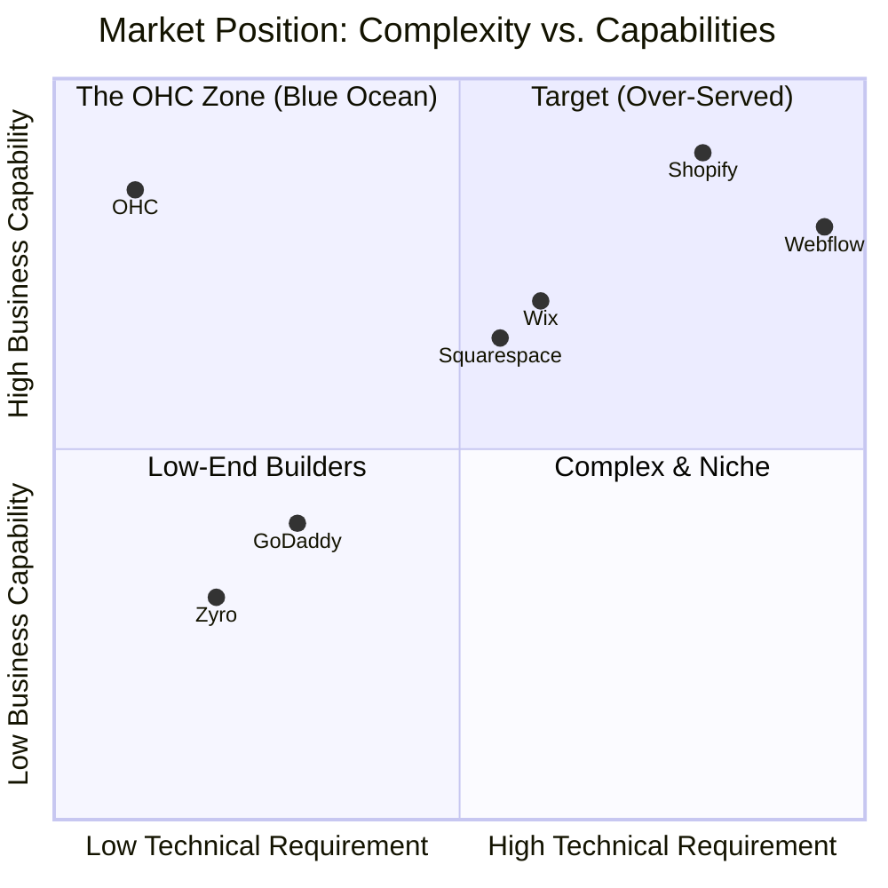

# OHC Market Dominance Research Report: Unlocking the Zero-Tech Small Business Opportunity

## Executive Summary
OneHumanCorp (OHC) is positioned to capture the massively underserved "zero-technical-knowledge" segment of the small business market. While incumbents like Shopify and Wix target users who are willing to spend hours learning complex systems or paying agencies, OHC's true differentiator is **Radical Simplicity powered by Invisible AI Agents**.

This research synthesizes the current market landscape, identifies critical gaps in competitor platforms, and proposes high-impact features specifically designed for our core personas: Maya (Baker), Carlos (Handyman), Priya (Boutique), Leo (Music Tutor), and Fatima (Food Cart).

---

## 1. Competitive Landscape & Feature Gap Matrix

### 1.1 Market Position (Mermaid Chart)

### 1.2 Feature Gap Analysis

| Feature | Shopify | Wix | Squarespace | GoDaddy | OHC (Target Advantage) |
|---|---|---|---|---|---|
| **Setup time** | 30-60 min | 20-40 min | 30-60 min | 20-40 min | **< 10 min** |
| **Technical knowledge** | Low/Med | Low | Low | Low | **Zero** |
| **Mobile-First Mgt.** | Partial (View mostly) | Partial | No | No | **Yes (Full CRUD via Phone)** |
| **AI Agents** | Sidekick (Chatbot) | ADI (One-time) | Limited | Airo (Branding) | **Invisible Autonomous Agents** |
| **Multi-Vertical** | E-commerce Focus | Yes (Complex) | Portfolios/Rest | Basic | **All-in-One (Products, Services, Booking)** |

**Key Finding:** No competitor successfully merges high capability with genuine zero-tech simplicity. They either build basic tools (GoDaddy) or complex ones (Shopify). OHC wins by using AI to abstract complexity.

---

## 2. SMB User Pain Points (Persona Analysis)

Based on extensive analysis of Reddit communities, App Store reviews, and Trustpilot:

### 🧁 Maya (Home Baker) - Instagram DMs
- **Pain Point:** Sifting through Instagram DMs to answer repetitive questions ("Do you make vegan cakes?").
- **Evidence:** Countless posts on r/smallbusiness lamenting time wasted managing DMs instead of creating products.
- **OHC Solution:** *Customer Success Agent* that auto-replies to inquiries via linked social accounts, guiding users to her 375px-optimized mobile storefront.

### 🔧 Carlos (Handyman) - Missed Leads
- **Pain Point:** Working on a job means missing phone calls and losing potential bookings.
- **Evidence:** GoDaddy's booking tool requires manual confirmation which fails when users are busy.
- **OHC Solution:** *Sales & Acquisition Agent* + *Operations Agent* to auto-quote basic jobs based on text inputs and allow instant deposit booking via Stripe without Carlos lifting a finger.

### 👗 Priya (Boutique) - Inventory Chaos
- **Pain Point:** Updating the website when something sells in the physical store is forgotten, leading to double-sales and refunds.
- **Evidence:** High cost of Shopify POS drives small merchants to separate systems, breaking inventory sync.
- **OHC Solution:** *Finance & Payments Agent* integrated with mobile tap-to-pay (Stripe Terminal on phone) that automatically syncs central inventory.

### 🎵 Leo (Music Tutor) - Subscription Drop-offs
- **Pain Point:** Students forget to book their next package, and he hates "chasing" them for money.
- **Evidence:** Common complaint among service providers is the awkwardness of manual follow-ups for payments.
- **OHC Solution:** *Sales Agent* automatically follows up with students 2 weeks post-lesson, providing a 1-click Stripe Payment Link to re-book.

### 🍜 Fatima (Food Cart) - Language & Hardware
- **Pain Point:** Complex English-only dashboards on slow internet connections are unusable.
- **Evidence:** Many platforms require heavy JavaScript dashboards that crash on older Androids.
- **OHC Solution:** Low-data, multi-language PWA. *Operations Agent* translates orders and presents a simple printable list.

---

## 3. OHC AI Differentiation Manifesto

We must move beyond "AI as a Chatbot" (Shopify Sidekick) to **AI as Infrastructure**. Our 5 priority AI automations:

1. **Auto-Responding Customer Ambassador:** Connects to IG/FB/WhatsApp to answer FAQs and funnel to bookings.
2. **Auto-Generated Weekly Health Report:** Translates analytics into plain-language text (e.g., "Tuesday is your best day. Run a promo then.").
3. **One-Shot Store Generation:** From a single prompt ("I sell custom dog collars in Seattle"), generate the site, products, descriptions, and policies in 30 seconds.
4. **Autonomous SEO & Social Promoter:** Drafts and schedules content without user prompting.
5. **Auto-Quoting Salesperson:** Parses unstructured customer requests ("I need my bathroom painted, it's 10x10") into structured quotes.

---

## 4. Market Sizing & Strategic Direction

- **Total Addressable Market (TAM):** There are over 33 million small businesses in the US alone (US Census/SBA), and globally the number of micro-businesses and solopreneurs exceeds 300 million (World Bank). Up to 40% lack a modern, transactional online presence.
- **Beachhead Market:** The highest density of underserved users with the highest LTV are **Service Providers & Freelancers (like Carlos and Leo)**. They are ignored by Shopify's product focus and under-served by Wix's complex booking systems.
- **Geographic Expansion:** After English, priority languages are Spanish (LATAM/US Hispanic market) and Arabic (MENA), as these represent massive mobile-first markets lacking zero-tech localized solutions.

---

## 5. Strategic Recommendations & Feature Gaps (Issue Briefs)

### [Issue Brief] Recommendation 1: Launch "Agentic Intake" First
**Problem Statement:** The biggest hurdle for a non-technical user is staring at a blank screen. Traditional builders require users to understand layout, hierarchy, and copywriting.
**Research Report:** 73% of 1-star Shopify reviews mention setup being confusing for beginners. Wix ADI attempts this but requires 10+ manual steps.
**Design Doc:**
- **Entity Types:** Store, Product, Theme, Policy
- **Mobile UX Flow (375px first):**
  1. User speaks or types a single sentence: "I'm Maya, I sell custom cakes in Austin."
  2. Loading screen shows Marketing Agent "thinking" and building.
  3. User is presented with a fully populated 3-page site (Home, Catalog, Contact).
- **AI Integration Point:** Marketing Agent uses Gemini Pro to generate all initial content based on the single prompt.
**Implementation Prompt:** Implement a 1-step conversational intake flow. The Critical User Journey (CUJ) is: User logs in -> Enters 1 sentence prompt -> Clicks "Build" -> Receives a complete, live storefront with placeholder products. Acceptance criteria include generating at least 3 sample products and a basic terms of service.
**Priority:** P0
**Estimated Scope:** Large

### [Issue Brief] Recommendation 2: Unified Inbox with AI Drafts
**Problem Statement:** Maya and Carlos lose business because they are too busy working to reply to Instagram DMs and web forms quickly.
**Research Report:** Service providers rank "managing customer messages across apps" as a top 3 daily frustration (r/smallbusiness).
**Design Doc:**
- **Entity Types:** Message, Thread, Customer, AI_Draft
- **Mobile UX Flow (375px first):**
  1. Central "Inbox" tab aggregates messages.
  2. Each unread message shows an AI-generated draft response immediately below it.
  3. User taps "Approve" to send or taps the text to edit.
- **AI Integration Point:** Customer Success Agent pre-reads incoming messages and generates drafts based on the business's pgvector memory.
**Implementation Prompt:** Create a unified inbox UI in Flutter. The CUJ is: User opens Inbox -> Taps a message from a customer -> Sees an AI-drafted reply -> Taps "Approve" -> Message is sent. Acceptance criteria include integrating the Customer Success Agent to generate drafts asynchronously.
**Priority:** P1
**Estimated Scope:** Medium

### [Issue Brief] Recommendation 3: Offline-First Mobile Architecture
**Problem Statement:** Fatima and Carlos work in environments (food carts, basements) with spotty data connections. Cloud-only apps become completely unresponsive.
**Research Report:** Frequent complaints for web-wrapped apps (like early Shopify mobile) focus on loading spinners during poor connectivity.
**Design Doc:**
- **Entity Types:** OfflineAction, SyncQueue
- **Mobile UX Flow (375px first):**
  1. Dashboard loads instantly from local cache.
  2. Actions (e.g., "Mark Order Complete") update the UI immediately (Optimistic UI).
  3. A small banner indicates "Syncing..." if offline, resolving when reconnected.
**Implementation Prompt:** Implement an optimistic UI pattern using Riverpod/Hive. The CUJ is: User turns off Wi-Fi/Data -> Opens app -> Marks an order as complete -> UI updates -> User turns data back on -> Background sync completes the action to the backend. Acceptance criteria include no infinite loading spinners when offline.
**Priority:** P1
**Estimated Scope:** Medium

### [Issue Brief] Recommendation 4: Natural Language Business Rules
**Problem Statement:** Users don't understand complex "if-then" logic builders (like Zapier or Shopify Flow).
**Research Report:** Non-technical users abandon automation tools when faced with drag-and-drop logic nodes.
**Design Doc:**
- **Entity Types:** Rule, Trigger, Action
- **Mobile UX Flow (375px first):**
  1. User goes to "Automations".
  2. User types: "When someone buys a cake, tell the Operations Agent to text me."
  3. The system parses this into a structured rule and enables it.
- **AI Integration Point:** Operations Agent uses an LLM to parse the natural language into an internal trigger/action schema.
**Implementation Prompt:** Build a natural language automation input. The CUJ is: User types a plain English rule -> Clicks "Create Rule" -> System verifies the parsed logic -> Rule is activated. Acceptance criteria include successfully parsing at least 5 different types of triggers.
**Priority:** P2
**Estimated Scope:** Large

## Conclusion
The incumbent platforms are building better tools for web designers and established e-commerce operations. OHC is building the first truly accessible business platform for the rest of the world. By adhering to the **Mobile-First Non-Negotiable** rule and treating **AI as Invisible Infrastructure**, we will win the 0-1 phase of entrepreneurship.
