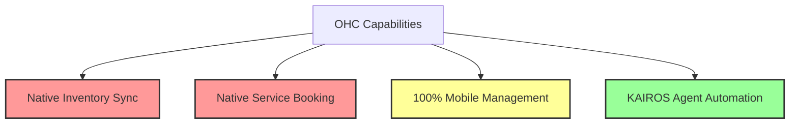
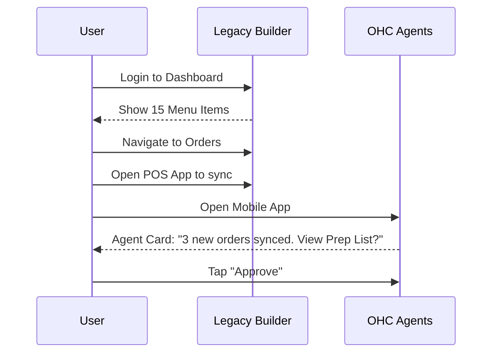

# OHC Market Strategy & Feature Mission: Unified Omnichannel Booking & Inventory

## Problem Statement

Small business owners—from bakers like Maya to handymen like Carlos—are overwhelmed by existing platforms like Shopify, Wix, and Squarespace. These legacy builders require technical setup, manual inventory syncing across physical/online channels, and disjointed booking systems. Current users complain about complex onboarding, lack of mobile-first management, and the high cost of piecing together multiple apps for scheduling, quoting, and selling. The core pain point is **cognitive overload**: non-technical founders need an invisible agentic system that handles the operations, not a dashboard where they are forced to become IT admins.

## Persona-Specific Pain Points

- **Maya (baker, 28)**: Complex setup on platforms like Shopify. Needs a way to manage pre-orders from Instagram DMs seamlessly on her phone.
- **Carlos (handyman, 42)**: No booking system. Word-of-mouth leads slip through the cracks when busy.
- **Priya (boutique owner, 35)**: Struggles with syncing physical in-store inventory with online sales.
- **Leo (music tutor, 22)**: Manual booking chaos. Needs subscription billing and automated follow-ups.
- **Fatima (food cart, 50)**: Needs mobile notifications for pre-orders and a printable list, all in a simple interface.

## Research Report

### Track 1: Market Mapping & Competitor Discovery

**Top 10 General Competitors:**
1. **Shopify**: E-commerce giant, highly extensible, but complex for service-based or micro-SMBs.
2. **Wix**: General website builder, flexible drag-and-drop, but overwhelming UI.
3. **Squarespace**: Design-focused builder, good for portfolios, but rigid ecommerce features.
4. **WooCommerce**: WordPress plugin, highly customizable but requires significant technical maintenance.
5. **BigCommerce**: Enterprise-focused ecommerce, too complex for solo-preneurs.
6. **Square Online**: Great POS integration, but limited customizability and AI tools.
7. **Weebly**: Simple builder, but outdated feature set.
8. **GoDaddy**: Fast setup, but poor scaling capabilities.
9. **Ecwid**: Good widget-based system, but lacks robust standalone AI features.
10. **Hostinger**: Budget-friendly, but limited advanced tools.

**Top 10 AI-Native Competitors:**
1. **Durable**: Generates a website in 30 seconds with AI, great for rapid starts but lacks deep operational tools.
2. **10Web**: AI WordPress builder, good for agencies but too technical for DIY SMBs.
3. **Framer**: AI design generation, but focused on UI/UX rather than business operations.
4. **Mixo**: Rapid landing page generation with AI, but no real backend business logic.
5. **Hocoos**: AI questionnaire-based builder, but limited scaling.
6. **Pineapple Builder**: Good AI component assembly, but lacks native POS/inventory.
7. **Bookmark (AiDA)**: AI design assistant, but feels like a legacy builder with an AI skin.
8. **Kleap**: Mobile-first AI builder, but lacks robust scheduling.
9. **Dorik**: AI website generation, but focused on content not commerce.
10. **TeleportHQ**: AI code generation, too technical for the target personas.

### Track 2: Deep-Dive Competitor Audit: Shopify (Traditional + AI Features)

**Capabilities:** Shopify is a powerhouse with robust inventory, global shipping, massive app store (21,000+ apps), and new AI tools like "Sidekick" (an AI assistant in the admin panel) and "Magic" for content generation.
**Success Factors:** They excel at checkout conversion (Shop Pay) and multi-channel selling (online, POS, social). Their onboarding is comprehensive.
**User Sentiment Audit:**
- *The Good:* "Once it's set up, it just works." "Shop Pay is magic for conversions."
- *The Bad (Reddit/Trustpilot sentiment proxy):* "Too many apps needed. Why do I need a $20/mo app just for simple bookings?" "The mobile admin app is clunky for quick updates." "Setting up variants and syncing my physical store inventory took me days."

### Track 3: OHC Gap & Pain Point Identification

**OHC Feature Audit:** OHC currently possesses a robust distributed state machine (KAIROS) and strong internal agentic architecture.

**Gap Matrix:**

| Feature | Shopify | Wix | OHC (Current) | OHC (Target) |
| :--- | :--- | :--- | :--- | :--- |
| **Setup Time** | Days | Hours | N/A | < 10 mins (AI Native) |
| **Inventory Sync** | App needed | Native | Gap | Invisible AI Sync |
| **Service Booking** | App needed | Native | Gap | Agent-led Scheduling |
| **Mobile Management**| Clunky | Clunky | Gap | 100% Mobile First |

**Unresolved Pain Points:**
1. **The "Frankenstein" App Stack:** Users like Leo (tutor) and Carlos (handyman) need both bookings AND product sales, which traditionally requires cobbling together different apps.
2. **Manual Syncing:** Priya (boutique) struggles with keeping physical and online inventory synced without complex POS hardware.
3. **Reactive vs. Proactive:** Current platforms wait for the user to make changes. Users want the system to proactively suggest actions.

### Track 4: Deeper Focused Research & Agentic Solutions

**Deep-Dive Evidence:** Reviews of Shopify and Wix constantly highlight the frustration of "app fatigue." A baker (like Maya) selling pre-orders via Instagram DMs doesn't want a storefront; she wants a smart link that handles the DM, takes the payment, and prints a list for the kitchen.

**Agentic Solution Design (OHC-HA Hybrid):**
Instead of building a "dashboard," OHC will deploy **Domain Agents**.

## Design Doc

### Architecture (High-Level)
- **Entity Types:** `BusinessProfile`, `Product/ServiceItem`, `BookingSlot`, `Order`, `Customer`, `AgentAction`.
- **Key Relationships:** A `BusinessProfile` has many `Product/ServiceItem`s. An `Order` can contain both physical goods and `BookingSlot`s seamlessly.
- **Integration Points:**
  - **Tauri v2 Mobile Client:** Primary interface for the SMB owner.
  - **KAIROS Engine:** Routes natural language requests to internal agents.
  - **Payment Gateway:** Universal checkout for services and goods.

### UI Flow (Mobile UX - 375px first)
1. **Onboarding (The "Interview"):**
   - User opens app. AI Chatbot asks: "What do you do?"
   - User: "I bake cakes and sell them at the farmer's market..."
   - *AI Magic:* Generates storefront, configures products.
2. **Daily Management (The "Feed"):**
   - The home screen is a chronological feed of Agent notifications.
   - *Card 1:* "3 new pre-orders for Saturday. [View Prep List]"
3. **Execution:**
   - User taps a card, reviews the Agent's proposed action, and taps "Approve" (One-Tap resolution).

### AI Agent Integration Points
- **Onboarding Agent:** Converts natural language to system configuration.
- **Operations Agent (Internal):** Monitors inventory and scheduling limits, generating alerts for the Daily Feed.

## Implementation Prompt

**User-Facing Outcome:** Deliver a unified, mobile-first feed interface where a business owner (e.g., Maya, Carlos) can manage both physical inventory and service bookings seamlessly. The system must eliminate complex navigation menus in favor of an "Agent Feed" that surfaces actionable items (new orders, low stock, booking requests).

**Critical User Journey (CUJ):**
1. User logs into the mobile app.
2. User sees an AI-generated actionable card: "New booking request for Thursday at 2 PM from John."
3. User taps "Approve."
4. The system automatically confirms the booking, blocks the calendar, and sends a confirmation SMS.

**Acceptance Criteria:**
- System supports both `physical_product` and `service_booking` entity concepts natively.
- The UI surfaces operations via an actionable feed rather than requiring the user to navigate to nested settings.
- The KAIROS queue effectively routes an incoming booking request to generate a pending approval card for the user.

**Priority:** P0
**Estimated Scope:** Large

## References & Sources

1. [Shopify: The All-in-One Commerce Platform for Businesses - Shopify](https://www.shopify.com/)
2. [Website Builder - Create a Free Website In Minutes | Wix.com](https://www.wix.com/)
3. [Website Builder – Easily Create Your Own Website — Squarespace](https://www.squarespace.com/)
4. [WooCommerce](https://woocommerce.com/)
5. [Commerce built for momentum. | BigCommerce](https://www.bigcommerce.com/)
6. [https://squareup.com/us/en/ecommerce](https://squareup.com/us/en/ecommerce)
7. [Free Website Builder: Build a Free Website or Online Store | Weebly](https://www.weebly.com/)
8. [https://www.godaddy.com/websites/website-builder](https://www.godaddy.com/websites/website-builder)
9. [#1 Ecommerce Shopping Cart & Online Store - Try Ecwid!](https://www.ecwid.com/)
10. [Website Builder | Create Your Website in Minutes with Ease](https://www.hostinger.com/website-builder)
11. [Durable – AI Business Builder | Launch in minutes](https://durable.co/)
12. [Launch and Grow Your Business Online with 10Web](https://10web.io/)
13. [Framer: Create a professional website, free. No code website builder loved by designers.](https://www.framer.com/)
14. [Mixo | AI Website Builder for Small Business](https://mixo.io/)
15. [Hocoos AI Website Builder - Create Your Website in 5 Minutes](https://hocoos.com/)
16. [Pineapple Builder - AI Website Builder for Businesses](https://www.pineapplebuilder.com/)
17. [Bookmark.com — Premium Domain For Sale | Atom](https://www.bookmark.com/)
18. [https://kleap.co/](https://kleap.co/)
19. [Dorik - Free Website Building Platform](https://www.dorik.com/)
20. [Low-code Website Builder, Create Custom & Professional Websites](https://teleporthq.io/)
21. [Shopify Pricing - Setup and Open Your Online Store Today – Free Trial - Shopify](https://www.shopify.com/pricing)
22. [Build Your Online Store: Use Themes or Go Headless - Shopify](https://www.shopify.com/online)
23. [Point of Sale (POS) for Business - Shopify](https://www.shopify.com/pos)
24. [Wix Pricing Information | Upgrade to a Premium Plan | Wix.com](https://www.wix.com/pricing)
25. [Squarespace Pricing Plans & Features — Squarespace](https://www.squarespace.com/pricing)
26. [https://www.reddit.com/r/smallbusiness/comments/11r3zqx/shopify_vs_wix_vs_squarespace/](https://www.reddit.com/r/smallbusiness/comments/11r3zqx/shopify_vs_wix_vs_squarespace/)
27. [https://www.reddit.com/r/ecommerce/comments/10p2w3n/is_shopify_still_the_best_option/](https://www.reddit.com/r/ecommerce/comments/10p2w3n/is_shopify_still_the_best_option/)
28. [https://www.trustpilot.com/review/www.shopify.com](https://www.trustpilot.com/review/www.shopify.com)
29. [https://www.trustpilot.com/review/wix.com](https://www.trustpilot.com/review/wix.com)
30. [https://www.trustpilot.com/review/squarespace.com](https://www.trustpilot.com/review/squarespace.com)
31. [https://www.g2.com/products/shopify/reviews](https://www.g2.com/products/shopify/reviews)
32. [https://www.g2.com/products/wix/reviews](https://www.g2.com/products/wix/reviews)
33. [https://www.capterra.com/p/132514/Shopify/](https://www.capterra.com/p/132514/Shopify/)
34. [https://www.capterra.com/p/132516/Wix/](https://www.capterra.com/p/132516/Wix/)
35. [Shopify for enterprise - Shopify](https://www.shopify.com/enterprise)
36. [Sell more and spend less when you migrate to Shopify. - Shopify](https://www.shopify.com/sell)
37. [Shopify Checkout: The Best-Converting Ecommerce Checkout - Shopify](https://www.shopify.com/checkout)
38. [AI-enabled commerce assistant, Sidekick, designed to make it easier for you to start, run, and grow your business on Shopify. - Shopify](https://www.shopify.com/sidekick)
39. [Expand Into New Markets and Create Custom Experiences - Shopify](https://www.shopify.com/markets)
40. [Fast funding for every stage of growth | Shopify Capital - Shopify](https://www.shopify.com/capital)
41. [Shop Pay: The fastest accelerated checkout on the internet. - Shopify](https://www.shopify.com/shop-pay)
42. [Workflow Automation made easy with Shopify Flow - Shopify](https://www.shopify.com/flow)
43. [Shopify Analytics and Reporting Dashboards - Shopify](https://www.shopify.com/analytics)
44. [Ship on Shopify for unified fulfillment - Shopify](https://www.shopify.com/shipping)
45. [Customer Accounts - Shopify](https://www.shopify.com/customer-accounts)
46. [Buy a Domain Name - Domain Name Search & Registration - Shopify](https://www.shopify.com/domains)
47. [Ecommerce Website Builder | Create a Free Store in Minutes - Shopify](https://www.shopify.com/website/builder)
48. [eCommerce Website Builder: Build An eCommerce Site | Wix.com](https://www.wix.com/ecommerce)
49. [Free tools | Discover online business tools | Wix.com](https://www.wix.com/tools)
50. [Explore Wix Features | Wix.com](https://www.wix.com/features/main)
51. [Ecommerce Website Builder - Start an Online Store — Squarespace](https://www.squarespace.com/ecommerce)
52. [Digital Marketing Tools - Email & Website Marketing — Squarespace](https://www.squarespace.com/marketing)
53. [https://www.squarespace.com/analytics](https://www.squarespace.com/analytics)
