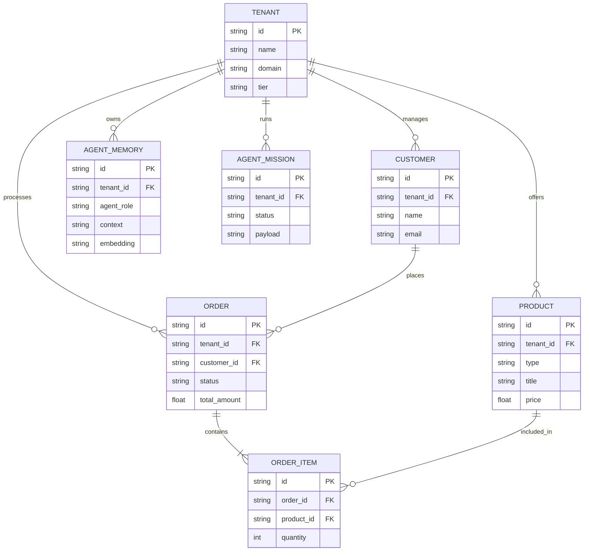

# Title: [architecture] Data Model Evolution and Multi-Tenant Isolation Strategy

## Problem Statement
The platform currently supports a multi-tenant cloud-native mode, but shared-database persistence hardening is still ongoing. A cohesive data model architecture is required to formalize entity relationships across the business domain (Products, Orders, Customers, Agents) while ensuring strict tenant isolation guarantees. The lack of a formalized schema and clear access patterns risks data leakage between tenants and inefficient querying by AI agents.

## Research Report
Based on an analysis of current OHC backend patterns (e.g., PostgreSQL Row-Level Security, Redis Distributed Locks) and competitor platforms (Shopify, Wix):
- Competitors typically use application-level multi-tenancy or logical database separation. OHC leverages PostgreSQL Row-Level Security (RLS) enforcing isolation on the `tenant_id` column.
- Current source code (e.g., `src/server/src/db.rs`, `queue.rs`) uses `organization_id` in tables like `sub_agent_queue`. This inconsistency with the architectural goal of using `tenant_id` poses a risk to unified RLS.
- OHC needs entities mapped accurately to real-world business needs: Business/Tenant, Product/Service, Order/Booking, Customer, and Agent/Mission.
- AI Agents require efficient access to short-term state (active queue) and long-term memory (vector embeddings).

## Design Doc

### Entity-Relationship Architecture

### Key Invariants
1. **Strict Tenant Isolation:** Every single table must contain a `tenant_id` (or `organization_id`) column.
2. **Row-Level Security (RLS):** All data access must pass through PostgreSQL RLS. The backend must enforce `SET LOCAL app.current_tenant = ...` at the start of any transaction or acquired connection.
3. **No Cross-Tenant Read/Write:** A business owner can only ever see their own tenant's data. AI agents operate exclusively within the context of a single tenant and cannot share memories across boundaries.
4. **Agent Memory Segregation:** Long-term vector embeddings must be strictly partitioned by tenant to prevent AI context leakage.

### Access Patterns
- **Mobile App Fetching Orders:** The mobile client requests `/api/orders`. The backend middleware authenticates the JWT, extracts `organization_id`, sets the database session context, and issues `SELECT * FROM orders`. RLS automatically filters results.
- **AI Agent Querying Customer History:** The Customer Success Agent receives a message. It queries the vector DB (`agent_memories`) using semantic search, filtering explicitly by `tenant_id = X` and `customer_id = Y`.

### Migration Strategy
1. **Standardization:** Rename legacy `organization_id` columns to `tenant_id` uniformly across all tables to match the architectural standard.
2. **RLS Enforcement:** Incrementally apply `ENABLE ROW LEVEL SECURITY` and `FORCE ROW LEVEL SECURITY` to all tables. Introduce `CREATE POLICY` statements restricting access based on `current_setting('app.current_tenant')`.
3. **Connection Pooling Hook:** Update the connection logic to mandate setting the session tenant variable immediately upon connection checkout.

## Implementation Prompt
Implement the formalized data model architecture by standardizing all schema definitions to use a `tenant_id` column and enabling PostgreSQL Row-Level Security (RLS) on all core business tables (Customers, Products, Orders, Agent Memories). Configure the backend connection pool to automatically apply `SET LOCAL app.current_tenant` on every transaction. Update relevant database migration queries and ensure that cross-tenant access is securely prevented. Do not alter external API contracts. Ensure E2E tests verify complete tenant isolation.

## Priority
P0

## Estimated Scope
Large
