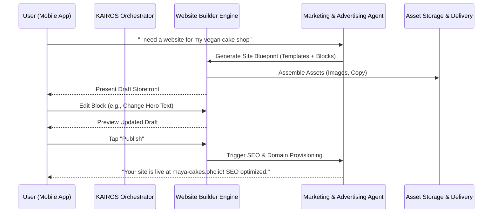

# [architecture] Website & Storefront Builder Architecture

## Problem Statement
Small business owners, like Maya the Baker or Carlos the Handyman, often struggle to build a professional-looking website. Existing website builders (Shopify, Wix, Squarespace) offer a dizzying array of options, complex drag-and-drop interfaces that break on mobile, and technical jargon like "DNS", "SSL", or "SEO." They need a platform that simply asks them about their business and generates a beautiful, functional, premium-looking storefront instantly, which they can then easily tweak from a 375px mobile screen. Publishing should be instant, with zero manual setup for domains, security, or search engine visibility.

## Research Report
- **Competitor Analysis:**
  - **Shopify:** Complex theme editor. Too many settings for a beginner. Desktop-first management.
  - **Wix:** Overwhelming array of templates. "Drag and drop" often results in broken mobile layouts if the user isn't careful.
  - **Squarespace:** Beautiful templates, but rigid. Managing content requires desktop use for best results.
  - **GoDaddy:** Simpler, but lacks deep e-commerce and booking integration.
- **Pain Points:**
  - Non-technical users abandon the setup process when faced with DNS configuration, purchasing an SSL certificate, or filling out SEO meta tags.
  - Mobile editing is usually an afterthought. For users like Maya who run their entire business from an iPhone, the builder must be mobile-native.
- **Opportunity:** Treat website creation not as a "blank canvas," but as an AI-guided generation of a complete, industry-specific storefront with predefined, aesthetically excellent content blocks that are guaranteed to look good on any device.

## Design Doc

### Architecture Diagram

### Content Blocks
The builder uses a restricted set of premium, auto-formatting blocks. No free-form positioning; everything snaps into a responsive grid.
- **Hero:** Main banner, business title, primary call-to-action (CTA), background image (auto-compressed/optimized).
- **Product/Service Grid:** Syncs automatically with the Operations Department inventory. Displays variants, prices, and sold-out badges.
- **Booking Calendar:** For service businesses (Carlos, Leo). Integrates directly with the Finance Department for deposits.
- **Text & Media:** About Us, Mission Statement. AI auto-generates copy based on business profile.
- **Testimonials/Reviews:** Pulls 5-star reviews from the Customer Success Department's follow-ups.
- **Contact Form/Footer:** Business hours, location, links to social media, basic contact fields.

### Mobile UX & UI Wireframes (375px First)
- **Onboarding:** User answers 3 questions: "What's your business name?", "What do you sell?", "Describe your vibe in 3 words."
- **Editor Flow:**
  - The screen displays a live preview of the site.
  - Tapping an element (e.g., Hero image) opens a bottom sheet with simple options: "Change Image," "Rewrite Title (with AI)," "Hide Block."
  - A persistent bottom action bar contains "Add Block", "Preview", and a massive "Publish" button.
- **No Breakage:** Users cannot drag elements outside safe zones. The layout automatically uses Glassmorphism design tokens (20px blur, Outfit/Inter typography, 44x44px touch targets).

### Publishing & Infrastructure (Draft → Live)
- **Drafting:** Changes are saved instantly to a draft state, visible only to the owner in the app.
- **Publishing:** 1-tap "Publish" button. This takes the draft layout and promotes it to the live tenant configuration.
- **Custom Domains & SSL:** Handled invisibly. If on the Starter tier or above, the user types the domain they own. AI agents configure the DNS records in the background and automatically provision SSL. Free tier users get an instant `business-name.ohc.io` subdomain with SSL pre-configured.

### AI Agent Integration Points
- **Marketing & Advertising ("The Promoter"):** Automatically writes SEO meta descriptions, alt text for images, and generates structured data (schema.org) for LLM crawlers. Generates initial layout and copy based on user's industry.
- **Customer Success ("The Ambassador"):** Populates the testimonial blocks automatically when positive feedback is received.
- **Operations ("The Manager"):** Keeps the product grid block up to date with live inventory counts.

### Key Design Decisions
- **Restricted Flexibility:** Free-form drag-and-drop leads to broken mobile experiences. By using structured, pre-designed blocks, we guarantee the "grandmother test" and aesthetic excellence (Glassmorphism).
- **Invisible SEO:** Non-technical users do not know what meta tags are. The AI Promoter agent handles all SEO invisibly behind the scenes during publishing.
- **Mobile-Native Editing:** The builder is designed as a native mobile experience first (bottom sheets, tap-to-edit), rather than a desktop interface crammed onto a phone screen.

## Implementation Prompt
Implement the Website & Storefront Builder engine and mobile UI components. Build a robust system for rendering a site from a set of structured content blocks (Hero, Product Grid, Booking Calendar, Text, Testimonials). Create the mobile-first editor flow allowing users to tap blocks to edit their content via bottom sheets, and integrate with the AI Marketing Agent to auto-generate initial copy and handle SEO upon publishing. Ensure publishing is a 1-tap operation that handles draft-to-live promotion and triggers automatic SSL provisioning for custom domains.

## Priority
P0

## Estimated Scope
Large
