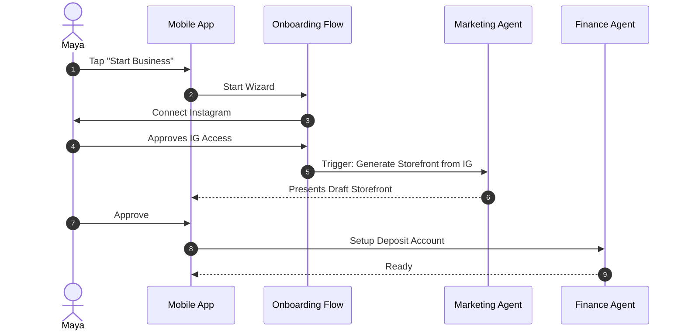
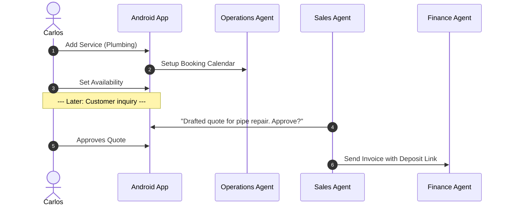
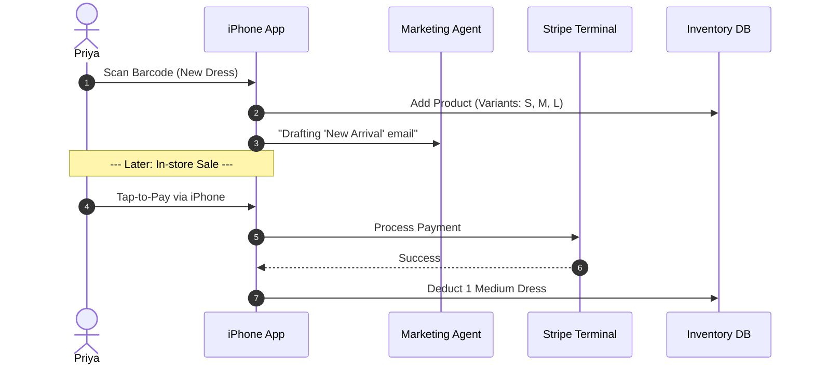
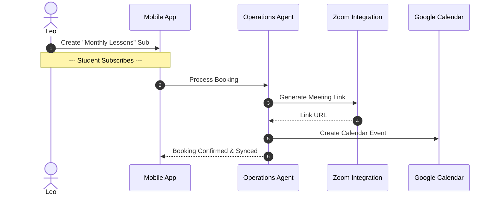
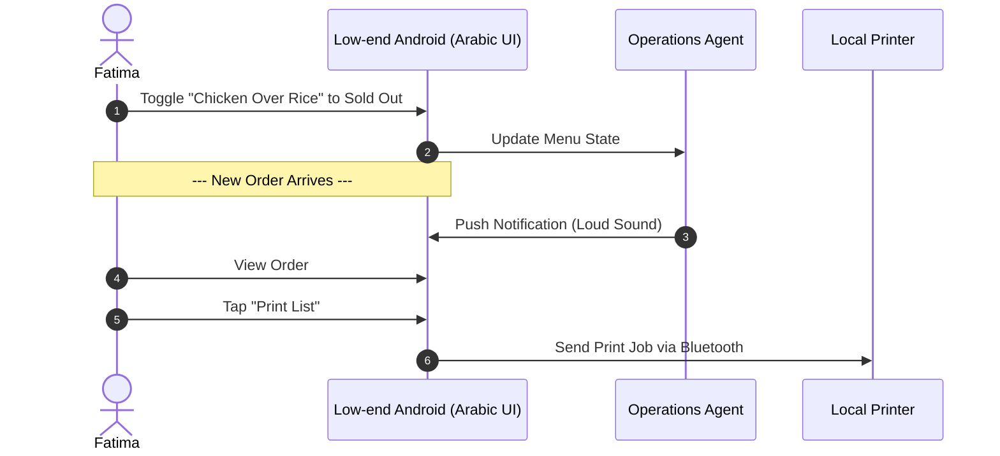

# [architecture] Business Journey Architecture for OneHumanCorp

## Title
Business Journey Architecture: End-to-End User Journeys for Core Personas

## Problem Statement
Small business owners—like Maya the baker, Carlos the handyman, Priya the boutique owner, Leo the music tutor, and Fatima the food cart operator—often abandon traditional website builders (Shopify, Wix) because of overwhelming technical jargon, complex onboarding, and disjointed toolsets. They need a simple, unified platform that guides them from idea to a live business in under 10 minutes from their mobile phones. Without a documented, frictionless, end-to-end business journey, the OHC platform risks introducing the same cognitive overload that causes drop-offs in competitor platforms. A key part of avoiding this is proactively identifying and mitigating friction points where non-technical users typically abandon the flow.

## Research Report
### Market Context
Small business owners desire "done-for-you" over "do-it-yourself."
- **Shopify**: Excellent for pure e-commerce but assumes technical literacy and a desktop setup. Onboarding takes 30-60 minutes and requires manual theme configuration. Friction point: Manual theme setup.
- **Wix**: Flexible but complex drag-and-drop. AI exists but mostly as a sidekick rather than an operational manager. Friction point: Overwhelming editor options.
- **Squarespace**: Great templates but rigid for service-based bookings combined with physical products. Friction point: Multi-type business setup.
- **GoDaddy**: Basic templates, but limited growth features and a confusing upsell structure. Friction point: Early and aggressive upselling.
- **OHC Advantage**: Zero technical knowledge required. Mobile-first management (375px native). AI agents invisibly handle operations, marketing, and customer success. The journey must emphasize rapid activation (first sale/booking) and daily retention.

### Persona Journeys & Friction Points
- **Maya (The Home Baker - 28, non-technical)**
  - *Acquisition*: Discovers OHC via a TikTok ad showing "Launch your custom cake shop on your phone in 5 mins."
  - *Onboarding*: Enters business name and links Instagram. The Marketing Agent automatically pulls photos and creates her storefront.
  - *Activation*: Adds her first custom cake listing with a deposit. Receives her first order within 3 days.
  - *Retention*: Checks the app daily for order notifications and to review AI-drafted Instagram DM replies.
  - *Revenue*: Upgrades to Starter tier when she needs a custom domain.
  - *Referral*: Uses an OHC "Share my setup" link in her bio, bringing other bakers to the platform.
  - *Friction Point Mitigation*: Maya avoids the friction of manual photo uploads because the AI automatically imports from her Instagram.

- **Carlos (The Freelance Handyman - 42, non-technical)**
  - *Acquisition*: Recommended by another contractor (word of mouth viral loop).
  - *Onboarding*: Selects "Services & Bookings". Inputs basic services and pricing. AI generates a professional service listing.
  - *Activation*: Connects Stripe, sets up calendar availability, and receives his first booking with a deposit.
  - *Retention*: Relies on push notifications for new bookings and AI-generated follow-up quotes.
  - *Revenue*: Upgrades to Pro when he exceeds the free tier booking limit and needs unlimited bookings.
  - *Referral*: Shows his booking system to a plumber friend on his Android phone.
  - *Friction Point Mitigation*: Carlos avoids complex calendar setup through a simple visual availability picker optimized for his Android phone.

- **Priya (The Boutique Owner - 35, semi-technical)**
  - *Acquisition*: Searches Google for "sync in-store and online inventory easily".
  - *Onboarding*: Connects her existing inventory list or scans items. Sets up tap-to-pay via Stripe Terminal on her iPhone.
  - *Activation*: Completes her first hybrid sale (in-store tap-to-pay synced with online stock).
  - *Retention*: Views daily mobile analytics (revenue today vs. yesterday) and uses the Marketing Agent for email blasts.
  - *Revenue*: Starts on Starter tier, upgrades to Business tier as volume scales and she needs multiple domains.
  - *Referral*: Refers other local boutique owners via a built-in merchant network.
  - *Friction Point Mitigation*: Priya avoids manual data entry by bulk scanning/importing existing inventory via the mobile app.

- **Leo (The Music Tutor - 22, non-technical)**
  - *Acquisition*: Sees another creator using an OHC link-in-bio.
  - *Onboarding*: Selects "Subscriptions". Sets up monthly guitar lesson packages.
  - *Activation*: A student books a package. OHC auto-generates the Zoom link and adds it to Leo's Google Calendar.
  - *Retention*: Relies on the AI agent following up with students who haven't booked in 2 weeks.
  - *Revenue*: Upgrades to Pro as his student base grows.
  - *Referral*: Shares his attractive link-in-bio on TikTok.
  - *Friction Point Mitigation*: Leo avoids the friction of manually generating meeting links and sending calendar invites because the Operations agent handles it silently.

- **Fatima (The Food Cart Operator - 50, limited English)**
  - *Acquisition*: Local community organization recommendation.
  - *Onboarding*: Selects "Food & Beverage". Uses Arabic language setting. Takes photos of her menu.
  - *Activation*: A customer places a pre-order for pickup. Fatima receives a loud, clear phone notification.
  - *Retention*: Prints daily order lists directly from the app. Toggles items "sold out" with one tap.
  - *Revenue*: Remains on free tier, or upgrades to Starter if menu expands significantly.
  - *Referral*: Tells other food cart vendors in her language.
  - *Friction Point Mitigation*: Fatima avoids language barriers through native multi-language UI and uses simple visual toggles (sold out) instead of complex inventory numbers.

## Design Doc

### Architecture Diagrams

#### Journey 1: Maya (Baker - Physical Products)

#### Journey 2: Carlos (Handyman - Services)

#### Journey 3: Priya (Boutique - Omnichannel)

#### Journey 4: Leo (Tutor - Subscriptions)

#### Journey 5: Fatima (Food Cart - Pre-orders)

### UI Wireframes & Screen Flow (375px Mobile First)
- **Screen 1: The Promise Landing (Acquisition)**: Large "Launch your business in 5 minutes" CTA. Soft blur Glassmorphism background.
- **Screen 2: Conversational Onboarding**: "What do you sell?" (Products / Services / Food). Big, 44x44px touch-friendly tiles.
- **Screen 3: AI Magic State**: Lottie micro-animation showing AI building the site ("The Promoter is designing your storefront...").
- **Screen 4: The Dashboard (Retention)**: A "Morning Briefing" card at the top (plain language, e.g., "Good morning Maya! You have 2 cake orders due tomorrow.") with a single primary action button.
- **Screen 5: Upgrade Nudge (Revenue)**: "Your business is growing! Get your own custom domain to look even more professional. [Upgrade to Starter - $9/mo]"

### AI Agent Integration Points
- **The Promoter (Marketing)**: Hooks into the onboarding wizard to auto-generate the initial site design, copy, and layout based on basic user input.
- **The Accountant (Finance)**: Integrates silently during the first product creation, setting up Stripe Connect underneath and configuring deposit structures.
- **The Advisor (Advisory)**: Activated on Day 7 to deliver the first "Business Health Report" directly to the mobile dashboard, driving retention.

### Key Design Decisions and Why
- **Conversational Onboarding over Forms**: Users are intimidated by long forms. Breaking onboarding into a conversational, one-question-per-screen flow reduces cognitive load and mitigates a major friction point.
- **Deferred Complexity**: Bank details and domain mapping are deferred until *after* the storefront is generated and the user feels invested ("Aha!" moment).
- **Plain-Language Reporting**: Traditional analytics (charts, graphs) are replaced with conversational summaries to pass the "Grandmother Test".

## Implementation Prompt
**Context for Implementer:**
Implement the End-to-End Onboarding and Dashboard Flow for the OHC mobile app (Flutter). The flow must guide a user from initial launch to their first AI-generated storefront and into their daily dashboard.
**User Journey (CUJ):**
1. User opens the app and enters their business name and type.
2. The UI displays a loading state while the Marketing Agent generates the site.
3. User lands on the main Dashboard which displays a plain-language "Morning Briefing" (from the Advisory Agent) and an action to "Add your first product."
**Acceptance Criteria:**
- The flow must be fully functional on a 375px mobile screen.
- All touch targets must be >= 44x44px.
- Use the OHC Premium Token library (Glassmorphism, Outfit/Inter typography).
- Include an E2E test starting from the unauthenticated state, completing the wizard, and verifying the dashboard renders correctly without network mocking.

## Priority
P0

## Estimated Scope
Large
