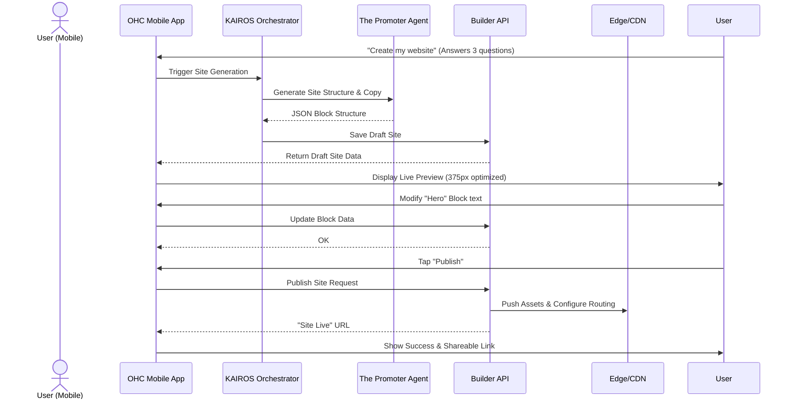

# OHC Architecture Brief: Website & Storefront Builder Architecture

## 1. Title
Implement the Mobile-First Website & Storefront Builder Core Architecture

## 2. Problem Statement
Non-technical business owners like Maya (the baker) and Carlos (the handyman) need to create beautiful, fully-functional websites and storefronts to showcase their products/services and accept orders/bookings. However, existing solutions (Shopify, Wix, Squarespace) require significant configuration, desktop-based design work, and a basic understanding of web design concepts (margins, padding, DNS, SEO). OHC needs a genuinely zero-friction, mobile-first builder where the AI "Promoter" agent can generate a premium, 375px-optimized site instantly, and the user can easily customize it with simple, plain-language controls—all from their phone.

## 3. Research Report
### Competitive Analysis
- **Shopify:** Complex theme editor. Requires desktop for serious customization. High learning curve for non-technical users. Geared heavily toward physical products.
- **Wix:** Has an AI generator (Wix ADI), but the resulting editor is still complex and overwhelming. Mobile editing is often a secondary, frustrating experience.
- **Squarespace:** Beautiful templates, but rigid. Editor is desktop-centric. Not ideal for quick, phone-based updates.
- **GoDaddy/Zyro/Hostinger:** Basic, often resulting in generic-looking sites. Limited integrated functionality (bookings, deposits).

### OHC Opportunity
OHC's differentiation lies in treating AI as infrastructure and enforcing absolute mobile-first simplicity. The builder must:
- Start with a fully functional, AI-generated site based on simple inputs (e.g., "I'm a handyman in Austin").
- Expose customization entirely through pre-designed, premium "blocks" (Glassmorphism, Outfit/Inter typography) that guarantee a beautiful result. No "free-form" drag-and-drop that allows users to create ugly layouts.
- Abstract away all technical details (SEO, CDN, SSL, DNS).
- Be 100% manageable from a 375px phone screen.

## 4. Design Doc
### Key Design Decisions
- **Block-Based Architecture:** The site is composed of predefined, functionally-rich blocks (e.g., Hero, Service List, Product Grid, Booking Calendar, Testimonials, Contact Form). Users cannot arbitrarily position elements; they add, reorder, and configure blocks.
- **Premium Default Theme:** All blocks adhere strictly to the OHC Premium Design Standards (Glassmorphism, backdrop-filter: blur(20px), specific fonts, curated color palettes).
- **AI-Assisted Assembly:** "The Promoter" agent handles the initial generation of the block sequence and populates them with tailored copy and placeholder images (or images from the user's library).
- **Invisible Infrastructure:** Publishing a site automatically provisions SSL, pushes assets to a CDN, and configures SEO meta tags. Custom domains are supported on higher tiers but abstracted to a simple input field.

### Mobile UX Flow (375px First)
1.  **AI Onboarding:** User answers 3 simple questions (Business Name, Type, Vibe).
2.  **Instant Generation:** "The Promoter" generates a live preview.
3.  **Editor View:** A vertical stack of blocks. Each block has simple controls:
    -   *Edit Content:* Change text/images.
    -   *Move Up/Down:* Reorder the block.
    -   *Delete:* Remove the block.
4.  **Add Block:** A simple drawer opens with categorized, visual block previews (e.g., "Add a Booking Calendar").
5.  **Publish:** One big button. "Your site is live!"

### AI Agent Integration Points
-   **The Promoter (Marketing & Advertising):** Generates initial layout, writes copy, suggests SEO optimizations, and auto-generates QR codes for the site.
-   **Operations:** Injects functional blocks (Product Grid for inventory, Booking Calendar for services).

### Architecture Diagram (Mermaid)

## 5. Implementation Prompt
**For the Implementer Agent:**
Implement the core backend data structures and API endpoints for the OHC Website & Storefront Builder. The system must support a block-based architecture where a "Site" is composed of ordered "Blocks" (e.g., Hero, ProductGrid, ContactForm).
-   **User Outcome:** A user can retrieve their generated site structure, update specific blocks, reorder blocks, and trigger a "publish" action.
-   **CUJ:**
    1.  Fetch the draft site for a given tenant.
    2.  Add a new block (e.g., "Testimonials") to the site.
    3.  Update the content of an existing block.
    4.  Publish the site (marking the draft as the active, live version).
-   **Acceptance Criteria:**
    -   API endpoints exist for fetching, updating, and publishing the site structure.
    -   The data model supports storing ordered blocks with associated JSON payloads for content.
    -   The system enforces tenant isolation (a user can only modify their own site).
    -   A "publish" action creates an immutable snapshot of the site state to be served.
    -   **Do not implement the actual CDN or DNS logic, just the internal state management and API.**

## 6. Priority
`P0` (Critical - Core to the "Idea -> Live Business in 10 mins" promise)

## 7. Estimated Scope
Large
