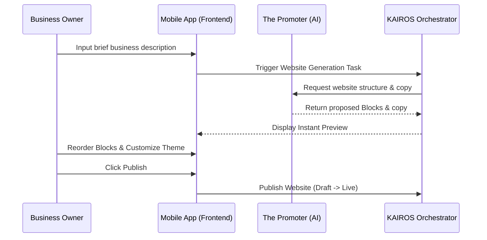

# [architecture] Website & Storefront Builder Architecture

## Title
Website & Storefront Builder Architecture Design

## Problem Statement
Small business owners, such as bakers or freelance handymen, struggle with the complexity of building a website on platforms like Shopify or Wix. They need an instant, no-code, drag-and-drop website builder that works seamlessly on mobile devices (starting at 375px wide). The builder must be capable of generating a storefront using AI in under 10 minutes without requiring the user to touch any technical configuration, HTML, CSS, or SEO metadata.

## Research Report
Current solutions (e.g., Shopify, Wix, Squarespace) have a high barrier to entry and a setup time of 30-60 minutes, which is often overwhelming for non-technical users. They require manual configuration of components, domain names, and SEO metadata. The OHC platform differentiates itself by placing the AI Agent ("The Promoter") at the center of the web generation process. "The Promoter" can synthesize user prompts to draft a full website and storefront catalog.

## Design Doc
The Website Builder relies on a component-based "Blocks" architecture where users can reorder high-level concepts (e.g., Hero, Product Grid, Testimonials) using a simplified drag-and-drop interface optimized for touch devices.

### Architecture Diagram

### UI Wireframes & Screen Flow (375px first)
1. **Initial Prompt Screen:** A single text box asking, "Tell us about your business".
2. **Instant Preview Screen:** The generated storefront rendered inside a mobile frame.
3. **Block Editor Screen:** A vertical list of high-level blocks (Hero, Products, Booking, Footer) with drag handles.
4. **Publish Screen:** A one-tap button to take the site live on an OHC subdomain or custom domain.

### Mobile UX Flow
- The user inputs a brief paragraph describing their business.
- An AI spinner appears while the system generates the storefront preview.
- The user previews the generated site. They can tap on any block to swap out images or edit text.
- The user reorders blocks using large, touch-friendly drag handles.
- Tapping "Publish" instantly provisions the site.

### AI Agent Integration Points
- **The Promoter (Marketing & Advertising):** Synthesizes the user's initial description to select an appropriate template, generate copywriting, and select relevant stock photography.
- **The Promoter (SEO):** Automatically generates meta tags, descriptions, and sitemaps based on the chosen business type and generated content.

### Key Design Decisions
1. **Block-Based Layout:** Rather than free-form dragging (like Wix), the layout is strictly constrained to high-level functional blocks. This prevents users from accidentally breaking the responsive design.
2. **AI-First Draft:** The builder always starts with a fully populated AI draft, eliminating the blank canvas problem.
3. **Draft vs. Live State:** Edits are made in a draft state and only pushed to the public CDN when the user clicks "Publish", ensuring mistakes are not immediately visible to customers.

## Implementation Prompt
Implement the backend orchestration logic to handle the "Website Generation Task". The system should accept a user's business description and return a structured JSON response containing the ordered list of pre-configured website blocks (e.g., Hero, Product Grid) and their associated AI-generated copy. The system must also support transitioning a website from a "Draft" to "Live" state.

## Priority
P0

## Estimated Scope
Large
