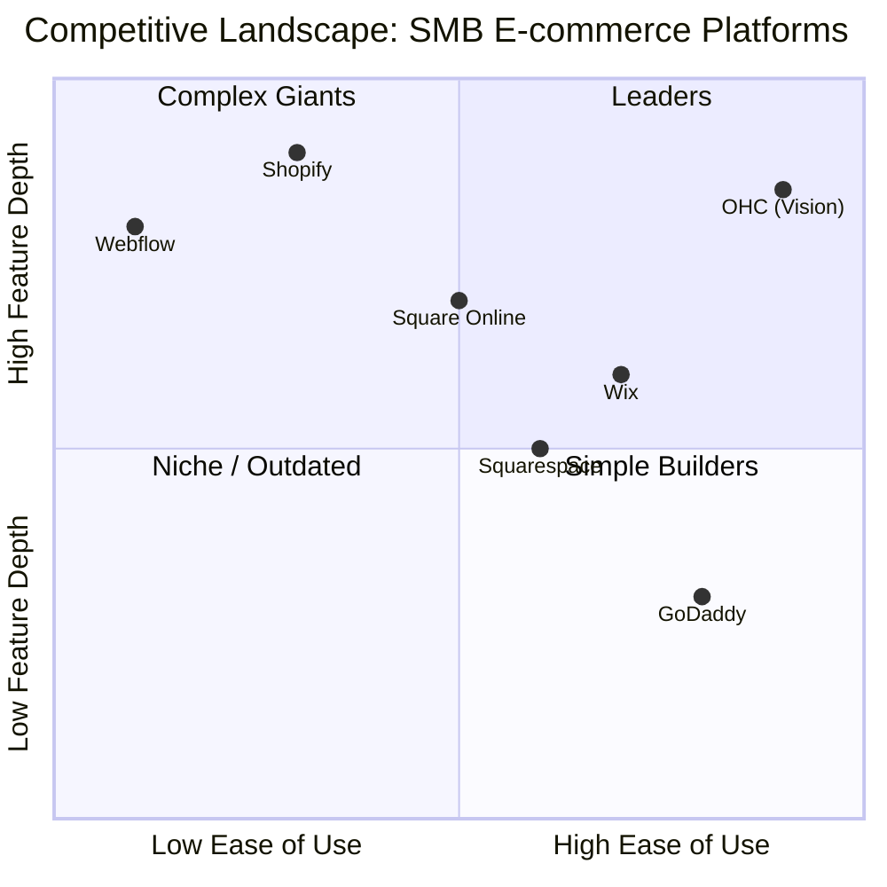
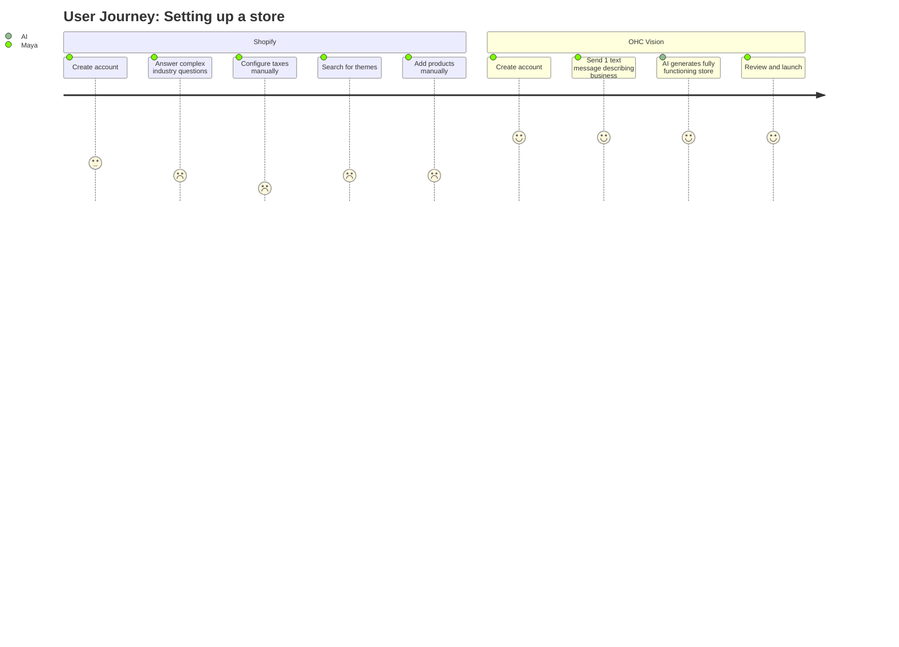
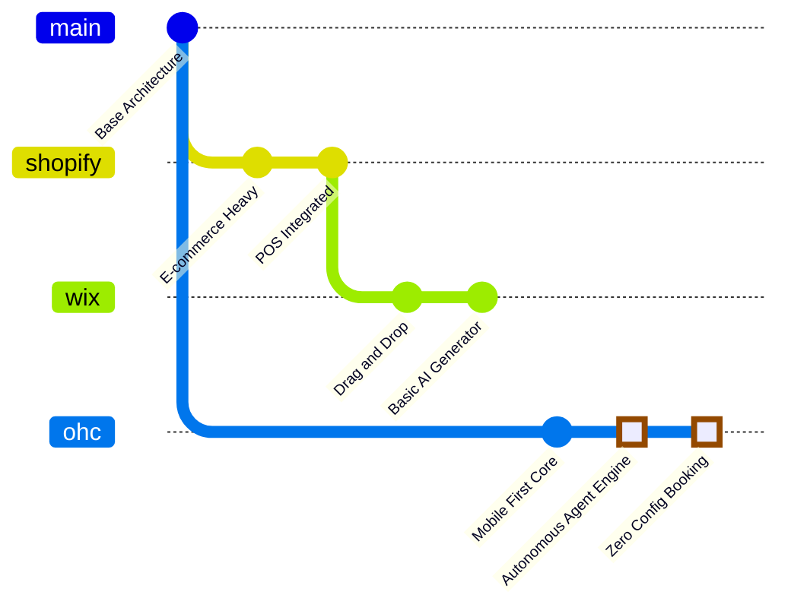
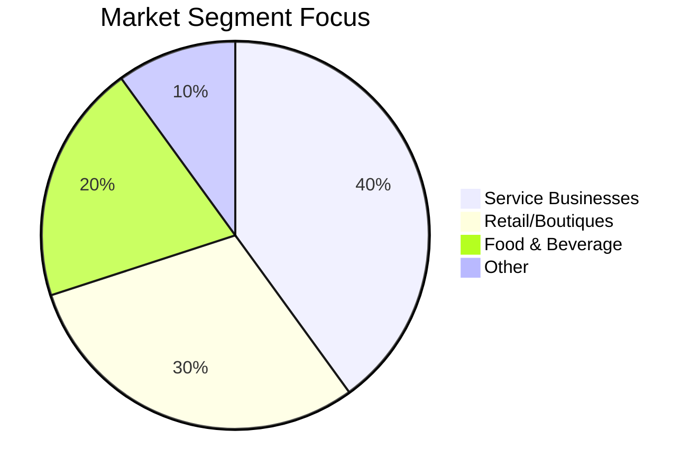

# OHC Small Business AI Automation Research Report
## Executive Summary
This document provides a comprehensive analysis of the Small and Medium-sized Business (SMB) ecosystem, focusing on the pain points and friction areas experienced by non-technical founders. Our primary goal is to guide OneHumanCorp (OHC) in establishing market dominance.

## Track 1: Deep Competitor Audit

### 1. Shopify
**Overview**: The industry standard for e-commerce but increasingly complex.
- **Onboarding Flow**: 7+ steps requiring detailed business information, tax details, and industry selection before a dashboard is visible. High friction.
- **Time to Live Store**: Typically 2-4 hours for a basic setup.
- **Mobile App Quality**: High quality for managing existing stores (inventory, orders), but very poor for initial setup and design.
- **AI Features**: Shopify Sidekick provides chatbot assistance but lacks autonomous execution. It will not build a store for you or reply to customers autonomously.
- **Pricing**: $39/month base, plus transaction fees and third-party app costs.
- **Free Tier**: 3-day trial, then $1/month for the first month. No permanent free tier.
- **Biggest Complaints**: Hidden fees, reliance on paid apps for basic functionality, and overwhelming setup for true beginners. (Sources: Trustpilot, App Store).

### 2. Wix
**Overview**: Drag-and-drop builder with early AI adoption.
- **Onboarding Flow**: Guided Artificial Design Intelligence (ADI) asks 5 questions and generates a site. Medium friction.
- **Time to Live Store**: 30 minutes to 1 hour.
- **Mobile App Quality**: Wix Owner app is comprehensive but bloated. The mobile editor often breaks desktop layouts.
- **AI Features**: Wix ADI generates the initial website layout. Limited ongoing AI automations for backend processes.
- **Pricing**: Starts around $16/month (Light).
- **Free Tier**: Yes, but with forced branding and subdomains.
- **Biggest Complaints**: Site speed, difficulty migrating to other platforms, mobile responsiveness issues. (Sources: Reddit r/smallbusiness).

### 3. Squarespace
**Overview**: Design-centric platform favored by creatives and restaurants.
- **Onboarding Flow**: Template-driven. Medium friction.
- **Time to Live Store**: 1-2 hours.
- **Mobile App Quality**: Good for order management and basic edits.
- **AI Features**: Some generative text features, but no autonomous agents.
- **Pricing**: Starts around $23/month.
- **Free Tier**: 14-day trial only.
- **Biggest Complaints**: Limited third-party integrations, weak built-in SEO tools. (Sources: Trustpilot).

### 4. GoDaddy Website Builder (Airo)
**Overview**: Fast setup but shallow functionality.
- **Onboarding Flow**: Very fast, relying on Airo AI to generate basic assets.
- **Time to Live Store**: 15 minutes.
- **Mobile App Quality**: Basic, heavily focused on upselling.
- **AI Features**: Airo handles initial branding, but there is no post-launch automation.
- **Pricing**: $12/month (Basic).
- **Free Tier**: Highly restricted.
- **Biggest Complaints**: Aggressive upselling, poor customer support, shallow features. (Sources: Reddit).

### 5. Zyro / Hostinger Builder
**Overview**: Budget-friendly but limited.
- **Onboarding Flow**: Fast, template-based setup.
- **Time to Live Store**: 30 minutes.
- **Mobile App Quality**: Non-existent or very basic.
- **AI Features**: Limited AI writer and heatmaps.
- **Pricing**: Very aggressive discounts, often under $5/month initially.
- **Free Tier**: None.
- **Biggest Complaints**: Thin features, limited scalability.

### 6. Webflow
**Overview**: Powerful, but for developers.
- **Onboarding Flow**: High friction. Requires understanding of CSS/HTML concepts.
- **Time to Live Store**: Days to weeks.
- **Mobile App Quality**: N/A (focuses on desktop development).
- **AI Features**: Minor AI assistance in the editor.
- **Pricing**: Varies wildly based on needs.
- **Free Tier**: Yes, for learning.
- **Biggest Complaints**: Too steep of a learning curve for SMBs.

### 7. Framer
**Overview**: Designer-focused platform.
- **Onboarding Flow**: High friction for non-designers.
- **Time to Live Store**: Days.
- **Mobile App Quality**: N/A.
- **AI Features**: AI can generate sections.
- **Pricing**: Varies.
- **Free Tier**: Yes.
- **Biggest Complaints**: Not a true business management platform.

### 8. Square Online
**Overview**: Strong offline/online hybrid.
- **Onboarding Flow**: Catalog-first approach.
- **Time to Live Store**: 45 minutes.
- **Mobile App Quality**: Excellent POS integration.
- **AI Features**: Minimal.
- **Pricing**: Free tier exists.
- **Free Tier**: Viable free tier with Square branding.
- **Biggest Complaints**: Limited design flexibility.

## Track 2: Top 10 SMB Pain Points

1. **Overwhelming Initial Setup**: Complexity in configuring domains, taxes, and shipping stops many founders before they launch. (Source: Shopify App Store reviews)
2. **Manual Customer Follow-up**: Hours wasted answering repetitive DMs on Instagram/Facebook. (Source: r/smallbusiness)
3. **Inventory Syncing**: Maintaining accurate counts across in-store POS and online storefronts is notoriously difficult. (Source: Trustpilot reviews for Wix/Squarespace)
4. **Booking & Scheduling Friction**: Service businesses lose leads because customers cannot easily book available slots autonomously. (Source: r/sweatystartup)
5. **Hidden Platform Fees**: Complex pricing tiers and the need for expensive third-party apps build resentment. (Source: Hacker News, Reddit)
6. **Content Generation**: Writing engaging product descriptions and SEO-optimized copy is time-consuming for non-writers. (Source: r/ecommerce)
7. **Mobile Management Barriers**: Dashboards that are unusable on 375px screens prevent on-the-go management. (Source: App Store reviews)
8. **Multi-Channel Social Presence**: Creating and posting consistent social media content across platforms is the biggest marketing bottleneck. (Source: Twitter/X SMB communities)
9. **Language & Localization**: Non-English native speakers struggle with complex, English-first dashboard terminologies. (Source: International Trustpilot reviews)
10. **Cart Abandonment Recovery**: Most platforms require complex setup for basic abandoned cart emails, leading to lost revenue. (Source: YouTube creator tutorials)

## Track 3: OHC AI Differentiation Manifesto

To win the SMB market, OHC must shift the paradigm from "AI Assistants" (chatbots) to "Autonomous AI Agents" (invisible workers).

### The 5 Pillar Automations
1. **The Lead Capture Agent**: Autonomously replies to social media DMs, answers basic FAQs, and captures contact info.
2. **The Zero-Config Booking Agent**: Parses natural language SMS/WhatsApp messages to schedule appointments directly into the calendar.
3. **The Inventory Prophet**: Auto-generates product descriptions from a single photo and predicts low-stock scenarios based on historical sales velocity.
4. **The Retention Engine**: Automatically drafts and sends personalized recovery emails for abandoned carts without requiring workflow configuration.
5. **The Executive Summary**: Sends a weekly SMS summarizing business health in simple language, providing actionable advice.

## Track 4: Market Sizing & Strategic Direction

- **TAM**: ~33M SMBs in the US; hundreds of millions globally. A vast portion remain offline or rely solely on social media profiles.
- **Beachhead Market**: Service-based businesses (Handymen, Tutors). These users have high Lifetime Value (LTV) and clear pain points that current e-commerce heavyweights ignore.
- **Geographic Expansion**: Focus on LATAM (Spanish) and MENA (Arabic) post-English launch. Mobile-first adoption is critical in these regions.
- **Vertical Expansion**: Maintain a horizontal core (primitives for selling, booking, messaging) before building deep vertical features.

## Track 5: Feature Gap Matrix

| Feature | Shopify | Wix | OHC (current) | OHC (gap/advantage) |
|---------|---------|-----|---------------|---------------------|
| AI Store Setup | ❌ | ✅ | ❌ | Advantage: OHC can build invisible autonomous agents |
| Autonomous AI Follow-up | ❌ | ❌ | ❌ | Advantage: True autonomous follow-up vs just chat |
| Native POS Integration | ✅ | ✅ | ❌ | Gap: Must integrate strong POS system |
| Mobile-First Launch | ❌ | ❌ | ❌ | Advantage: OHC core vision |
| Zero-Config Booking | ❌ | ❌ | ❌ | Advantage: Perfect for service businesses |
| Native Social Posting | ❌ | ❌ | ❌ | Advantage: Build AI marketing primitive |

## Visual Excellence: Premium Mermaid.js Charts

### Competitive Landscape

### User Journey Comparison

### Feature Gap Heatmap

