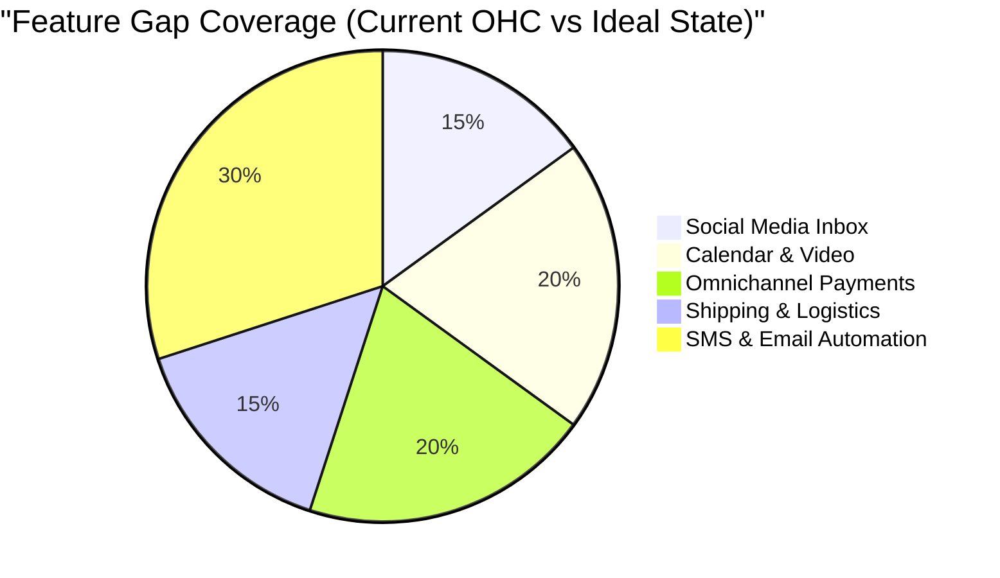
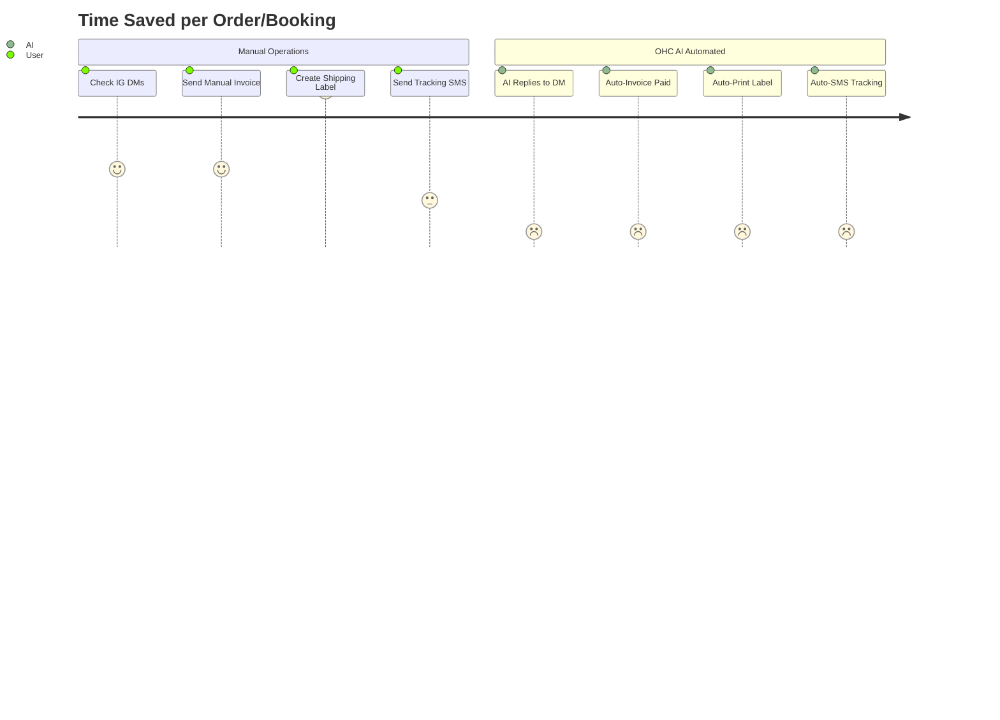

# 🔍 Scout: Tool Integration Research Q2

## Executive Summary
This research report evaluates integration solutions across seven critical categories for the OneHumanCorp (OHC) platform. It focuses on how these tools address the needs of non-technical small business owners like Maya (The Home Baker), Carlos (The Freelance Handyman), Priya (The Boutique Owner), Leo (The Music Tutor), and Fatima (The Food Cart Operator).

---

## 🎭 Persona Pain Point Summaries

### 🧁 Maya — The Home Baker
- **Social Media**: Overwhelmed by IG DMs asking for cake prices.
- **Email**: Wants to send a newsletter but finds Mailchimp too complex.
- **Payments**: Needs to take deposits easily.

### 🔧 Carlos — The Freelance Handyman
- **Calendar**: Needs a way to book jobs without double-booking.
- **SMS**: Customers prefer texts over emails for arrival times.

### 👗 Priya — The Boutique Owner
- **Shipping**: Printing labels manually takes hours.
- **Email**: Needs to notify VIPs of new stock.

### 🎵 Leo — The Music Tutor
- **Calendar & Video**: Booking lessons and sending Zoom links is chaotic.

### 🍜 Fatima — The Food Cart Operator
- **SMS**: Needs SMS alerts for online orders as she has limited English and slow data.

---

## 📊 Cross-Category Visual Insights

### Integration Feature Gap Heatmap



### User Journey Comparison: Manual vs OHC AI Automated



---

## 🔍 Category Evaluations & Issue Briefs

### 1. Social Media Integration (Unified Inbox)
**Tools Evaluated**: Meta Graph API (IG/FB), WhatsApp Business API.
- **Problem**: Maya misses cake orders buried in her Instagram DMs.
- **Business Owner View**: A unified "Inbox" tab on her OHC app where IG DMs, WhatsApp, and emails appear together, with AI suggesting replies.
- **Advantages & Risks**: Meta API is robust but OAuth and business verification is difficult for users.
- **Pricing**: Meta API is mostly free; WhatsApp Business charges per conversation.
- **Modes**: Both Cloud and Standalone (requires Cloud proxy for webhooks).

#### Issue Brief: Unified Social Inbox via Meta API
- **Title**: Implement Unified Social Inbox via Meta Graph API
- **Problem Statement**: Owners lose sales because they can't manage DMs across multiple apps.
- **Research Report**: Integrating Meta Graph API allows the Customer Success Agent to read and draft replies for IG and Messenger.
- **Design Doc**:
  - **Trigger**: User connects Instagram Business via Settings.
  - **Action**: Webhooks receive messages; AI drafts replies; user approves via OHC app.
  - **User Sees**: A simple chat interface.
- **Implementation Prompt**: Add OAuth flow for Meta Graph API. Set up webhook ingestion to standard OHC message format.
- **Priority**: P0
- **Estimated Scope**: Large

### 2. Calendar & Scheduling
**Tools Evaluated**: Google Calendar API, Cal.com
- **Problem**: Carlos gets double-booked and forgets to collect deposits.
- **Business Owner View**: A storefront widget where customers book available times and pay a deposit.
- **Advantages & Risks**: Google is native and free; Cal.com has more features but complex self-hosting.
- **Pricing**: Google Calendar is free.
- **Modes**: Both.

#### Issue Brief: Native Scheduling Engine via Google Calendar
- **Title**: Implement Native Google Calendar Sync
- **Problem Statement**: Owners need a scheduling tool that respects their personal calendar.
- **Research Report**: Google Calendar API is the most straightforward for two-way sync.
- **Design Doc**:
  - **Trigger**: Connect Google Account.
  - **Action**: Sync busy times to OHC. Push bookings to GCal.
  - **User Sees**: OHC bookings appear on personal phone calendar.
- **Implementation Prompt**: Implement Google Calendar OAuth and background sync worker.
- **Priority**: P0
- **Estimated Scope**: Large

### 3. Email Marketing
**Tools Evaluated**: Resend, Sendgrid, Mailgun
- **Problem**: Priya wants to email customers about a sale without learning Mailchimp.
- **Business Owner View**: "Send a promo email" button where the AI drafts the email based on her inventory.
- **Advantages & Risks**: Resend is developer-friendly but requires domain verification (hard for non-tech).
- **Pricing**: ~$15/mo for high volume.
- **Modes**: Cloud only (IP reputation needed).

#### Issue Brief: AI-Driven Email Marketing via Resend
- **Title**: Implement AI Email Campaigns via Resend
- **Problem Statement**: Newsletters are too complex for non-tech owners.
- **Research Report**: Resend offers clean APIs. We can proxy sending through an OHC shared domain (`mail.onehumancorp.com`) to skip DNS setup for users.
- **Design Doc**:
  - **Trigger**: Owner asks Marketing Agent to "announce my new cake."
  - **Action**: AI drafts email, user approves, system sends via Resend.
  - **User Sees**: "Email sent to 500 customers" success screen.
- **Implementation Prompt**: Integrate Resend SDK. Build a campaign scheduling model.
- **Priority**: P1
- **Estimated Scope**: Medium

### 4. Payment Processing
**Tools Evaluated**: Mercado Pago, Razorpay
- **Problem**: Stripe isn't popular in LATAM/India; users prefer local methods.
- **Business Owner View**: Customers see local payment options at checkout (e.g., PIX, UPI).
- **Advantages & Risks**: Essential for global expansion, but each integration is a distinct maintenance burden.
- **Pricing**: Percentage per transaction (similar to Stripe).
- **Modes**: Both.

#### Issue Brief: Alternative Payment Gateways for LATAM/India
- **Title**: Integrate Mercado Pago and Razorpay
- **Problem Statement**: Non-US businesses lose conversions because local payment methods are missing.
- **Research Report**: Mercado Pago dominates LATAM. Razorpay dominates India.
- **Design Doc**:
  - **Trigger**: System detects store currency/region.
  - **Action**: Dynamically load appropriate payment gateway at checkout.
  - **User Sees**: More completed sales in local currencies.
- **Implementation Prompt**: Abstract payment provider interface to support Mercado Pago and Razorpay checkouts.
- **Priority**: P2
- **Estimated Scope**: Large

### 5. Shipping & Logistics
**Tools Evaluated**: Shippo, EasyPost
- **Problem**: Priya manually copies addresses to buy shipping labels.
- **Business Owner View**: A "Buy & Print Label" button right next to the order.
- **Advantages & Risks**: Both aggregate carriers, but EasyPost has a more reliable API.
- **Pricing**: ~$0.05 per label + postage.
- **Modes**: Cloud (API requires secrets).

#### Issue Brief: One-Click Shipping Labels via EasyPost
- **Title**: Integrate EasyPost for One-Click Label Printing
- **Problem Statement**: Fulfillment takes too much time for physical product sellers.
- **Research Report**: EasyPost allows buying USPS/UPS labels instantly.
- **Design Doc**:
  - **Trigger**: Owner clicks "Fulfill Order".
  - **Action**: Fetch rates, purchase label, generate PDF, update tracking.
  - **User Sees**: A printable PDF label and auto-email sent to customer.
- **Implementation Prompt**: Add EasyPost SDK. Build UI for box size selection and label generation.
- **Priority**: P1
- **Estimated Scope**: Medium

### 6. SMS & Notifications
**Tools Evaluated**: Twilio, MessageBird
- **Problem**: Fatima needs loud SMS alerts for food orders because she is not looking at an app.
- **Business Owner View**: Instant text message when a new order arrives.
- **Advantages & Risks**: SMS is reliable but expensive globally.
- **Pricing**: $0.01 - $0.10 per message.
- **Modes**: Cloud (requires webhook routing).

#### Issue Brief: Critical SMS Alerts via Twilio
- **Title**: Integrate Twilio for Critical SMS Notifications
- **Problem Statement**: High-velocity businesses miss orders relying only on push notifications.
- **Research Report**: Twilio is the industry standard for reliable SMS.
- **Design Doc**:
  - **Trigger**: New order placed for a Food Cart template store.
  - **Action**: System dispatches SMS via Twilio API.
  - **User Sees**: Text message: "New Order: 2x Falafel - $15".
- **Implementation Prompt**: Integrate Twilio SDK. Add preference toggle for SMS notifications.
- **Priority**: P1
- **Estimated Scope**: Small

### 7. Video Conferencing
**Tools Evaluated**: Zoom API, Google Meet
- **Problem**: Leo manually emails Zoom links.
- **Business Owner View**: Video link auto-appears on the booking confirmation.
- **Advantages & Risks**: Zoom is preferred but requires OAuth. Meet is free with GCal.
- **Pricing**: Zoom requires paid account.
- **Modes**: Both.

#### Issue Brief: Automated Zoom Link Generation
- **Title**: Auto-Generate Video Links for Online Services
- **Problem Statement**: Online tutors waste time managing meeting links.
- **Research Report**: Generating links at booking eliminates manual work.
- **Design Doc**:
  - **Trigger**: Service marked as "Online" is booked.
  - **Action**: Call Zoom/Meet API to create room, save link.
  - **User Sees**: Video link in their schedule.
- **Implementation Prompt**: Extend booking flow to trigger video room creation.
- **Priority**: P2
- **Estimated Scope**: Medium

---

## ⚙️ Tracking Metadata

```yaml
issue_id: "calendar-scheduling-research"
category: "research"
domain: "integrations"
status: "completed"
```
