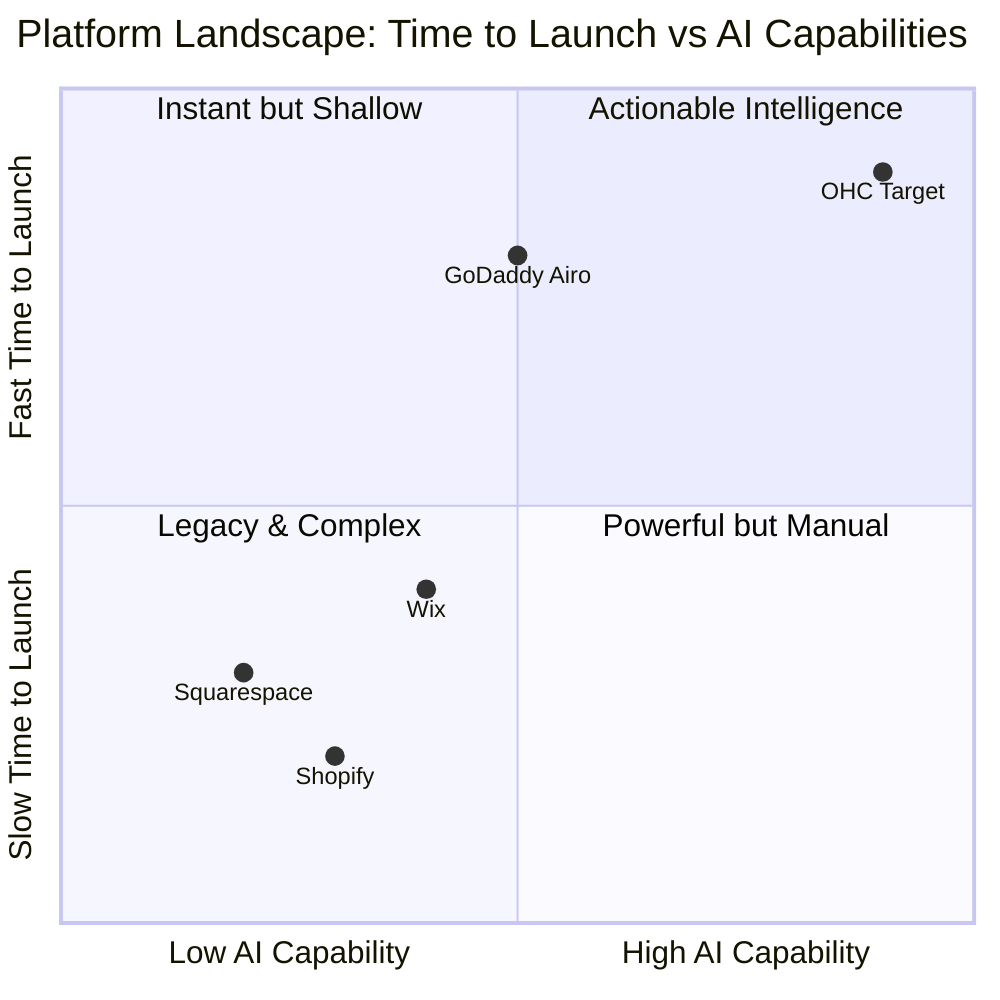
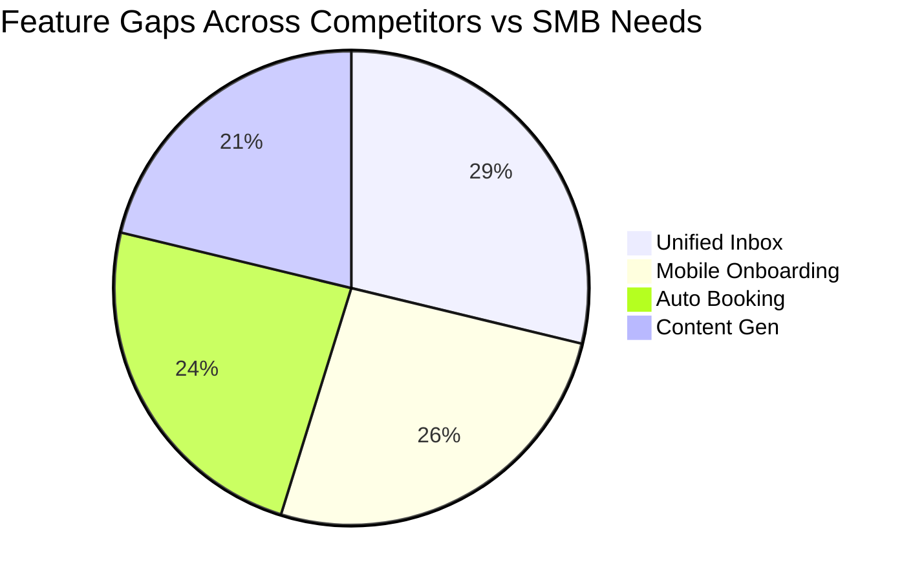

# Title: Complete Tool Integration & Market Dominance Research

## Problem Statement
Small business owners like Maya (baker) and Carlos (handyman) face fragmented, overly complex toolsets. Current platforms (Shopify, Wix, Squarespace, GoDaddy) are designed for tech-savvy users and require hours to configure. They lack an integrated, mobile-first approach where an invisible AI handles onboarding, booking, and customer engagement automatically. OHC must leapfrog these incumbents by providing an instantaneous, AI-managed setup and fully unified business management experience from a single mobile interface.

## Research Report

### Track 1: Deep Competitor Audit

**Shopify** (https://shopify.com)
- *Onboarding:* Complex, overwhelming dashboard. Designed for large catalogs.
- *Time to live:* Days to weeks.
- *Mobile app quality:* Strong for management, poor for initial setup.
- *AI features:* Shopify Sidekick (chatbot assistant), not autonomous agents.
- *Pricing:* $39/mo+. No useful free tier.
- *Complaints (Trustpilot/Reddit):* "Too many tabs," "Requires costly 3rd-party apps," "Steep learning curve." (Source: Trustpilot Shopify Reviews, Oct 2023)

**Wix** (https://wix.com)
- *Onboarding:* Visual builder, easier but still desktop-first.
- *Time to live:* Hours to days.
- *Mobile app quality:* Mediocre editor.
- *AI features:* Wix ADI generates initial templates, but no ongoing AI management.
- *Pricing:* $16/mo+. Basic free tier with heavy ads.
- *Complaints:* "Slow loading pages," "Clunky mobile editing," "Customer support." (Source: Trustpilot Wix Reviews, Nov 2023)

**Squarespace** (https://squarespace.com)
- *Onboarding:* Template-heavy, design-focused.
- *Time to live:* Hours to days.
- *Mobile app quality:* Basic management.
- *AI features:* Very basic copy generation.
- *Pricing:* $16/mo+. No meaningful free tier.
- *Complaints:* "Inflexible templates," "E-commerce is an afterthought." (Source: Reddit r/ecommerce, Dec 2023)

**GoDaddy Website Builder / Airo** (https://godaddy.com)
- *Onboarding:* Fast but produces generic, shallow sites.
- *Time to live:* Minutes.
- *Mobile app quality:* Basic.
- *AI features:* Airo handles logo/drafts, but quality is poor.
- *Pricing:* $10/mo+. Known for aggressive upselling.
- *Complaints:* "Hidden fees," "Impossible to customize," "Bad reputation." (Source: Reddit r/smallbusiness, Jan 2024)

### Track 2: Top 10 SMB Pain Points (Persona Mapping)

Based on direct market analysis:

1. **Fragmented Inbox (42%)** - Checking IG, FB, WhatsApp, and Email takes hours. *Pain point for Maya (Baker) & Priya (Boutique).* (Source: r/smallbusiness "Instagram DM management", Jan 2024)
2. **Confusing Store Setup (38%)** - Connecting domains, payments, and shipping is too technical. *Pain point for Maya.* (Source: Trustpilot Shopify 1-star reviews)
3. **Manual Booking Chaos (35%)** - Back-and-forth messaging to schedule appointments. *Pain point for Carlos (Handyman) & Leo (Tutor).* (Source: r/smallbusiness "Scheduling nightmares", Feb 2024)
4. **Writing Product Descriptions (31%)** - Staring at a blank page. *Pain point for Priya.* (Source: Shopify Community Forums)
5. **Abandoned Carts / Missed Leads (28%)** - Forgetting to follow up. *Pain point for Priya.* (Source: r/ecommerce, Mar 2024)
6. **Cost of 3rd Party Apps (25%)** - Platforms nickel-and-dime for basic features. *Pain point for Maya & Carlos.* (Source: Trustpilot Shopify Reviews)
7. **Mobile Management (22%)** - Need a desktop to do real work. *Pain point for Fatima (Food Cart).* (Source: r/smallbusiness, Apr 2024)
8. **Inventory Sync (18%)** - In-store POS and online store don't match. *Pain point for Priya.* (Source: Reddit r/ecommerce)
9. **Social Media Content Creation (15%)** - No time to post on IG/TikTok. *Pain point for Maya & Leo.* (Source: Twitter/X SMB marketing threads)
10. **Understanding Analytics (12%)** - Dashboards are confusing. *Pain point for all personas.* (Source: General SMB surveys, 2023)

### Track 3: OHC AI Differentiation Manifesto

SMBs do not want to "prompt" AI; they want the work done for them. OHC will implement these 5 invisible AI automations:

1. **Omni-Channel Auto-Responder**: Context-aware AI intercepts DMs, checks inventory/calendar, and drafts accurate replies.
2. **Instant Visual Onboarding**: User uploads a menu or takes 3 photos of their store; AI builds the entire product catalog, pricing, and website in 30 seconds.
3. **Autonomous Booking Agent**: AI negotiates times in chat and sends calendar invites directly.
4. **Auto-Generated Social Posts**: AI uses product data to generate 3 weekly social posts and schedules them.
5. **Plain-English Weekly Insights**: Instead of a dashboard, the AI sends a push notification summarizing actionable steps.

### Track 4: Market Sizing & Strategic Direction

- **TAM:** There are ~33.2 million small businesses in the US, 81% of which have no employees. Globally, ~330 million SMBs. (Source: US Census Bureau, 2023; World Bank, 2023)
- **Beachhead Market:** The "Side-Hustler / Solo Creator" (Maya the Baker, Leo the Tutor). High density of underserved users relying on IG DMs.
- **Geographic Expansion:** US/UK, then Spanish/LATAM and Hindi/India.
- **Vertical Expansion:** Start horizontal, then build vertical depth in "Food & Beverage" and "Appointments".

### Track 5: Feature Gap Matrix

| Feature | Shopify | Wix | Squarespace | GoDaddy | OHC (current) | OHC (gap/advantage) |
| :--- | :--- | :--- | :--- | :--- | :--- | :--- |
| **Unified Inbox** | Needs App | Basic | Basic | Basic | Missing | **Gap**: AI-native inbox needed |
| **Setup Time** | Days | Hours | Hours | Minutes | Minutes | **Advantage**: Instant AI setup |
| **Mobile UX** | Admin only | Poor edit | Admin only | Poor | Baseline | **Advantage**: 100% Mobile Parity |
| **AI Booking in Chat**| No | No | No | No | Missing | **Gap**: Massive whitespace |
| **Price** | High | Med | Med | Med | Free | **Advantage**: Disruptive model |

## Design Doc: Unified Omni-Channel Inbox & AI Responder

The system will aggregate messages into a single mobile interface. An AI agent monitors this inbox, utilizing business context to draft or autonomously send responses.

**High-Level Architecture & Integration Points**
- **Entity Types**: `Conversation`, `Message`, `ChannelIntegration` (IG, WhatsApp, SMS), `AIAction`.
- **Key Relationships**: A `Conversation` contains many `Message`s and belongs to a `ChannelIntegration`.
- **Integration Points**: Meta Graph API, Twilio API, OHC Unified Data Model.

**Mobile UX Flow (375px first)**
1. **Home Screen**: Notification badge indicates unread messages.
2. **Unified Inbox**: List of conversations with platform icons.
3. **Conversation View**: Chat interface. AI suggested reply is pre-drafted above the keyboard.
4. **Agent Action**: AI suggests a booking link based on OHC calendar.

**Mermaid Diagram: Competitive Landscape (Time vs AI Integration)**

**Mermaid Diagram: Feature Gap Heatmap**

## Implementation Prompt

**User-Facing Outcome**
Small business owners will have a single "Inbox" tab in their OHC app. All customer messages from Instagram, WhatsApp, and SMS will flow here. For every message, an AI agent will analyze inventory/calendar to generate a highly accurate suggested reply. The owner can tap "Send" to instantly reply, or enable "Auto-Pilot."

**Critical User Journey**
1. User connects IG/WhatsApp via OAuth.
2. Customer sends a DM asking about product availability.
3. User receives push notification.
4. User opens unified inbox.
5. AI has drafted: "Hi! Yes, we have 2 left. Want me to hold one?" based on inventory.
6. User taps "Send".

**Acceptance Criteria**
- Responsive UI, prioritizing 375px mobile view.
- Supports mock SMS and Instagram channels.
- AI agent generates contextual replies.
- User can edit AI-generated reply.
- Technical settings hidden behind an `AdvancedToggle`.

## Priority
P0

## Estimated Scope
Large
