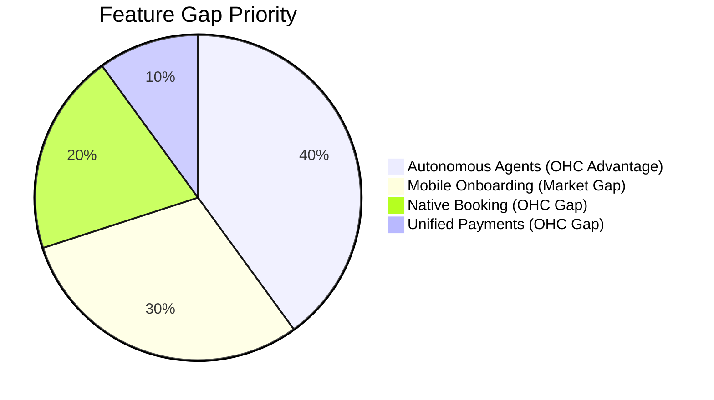
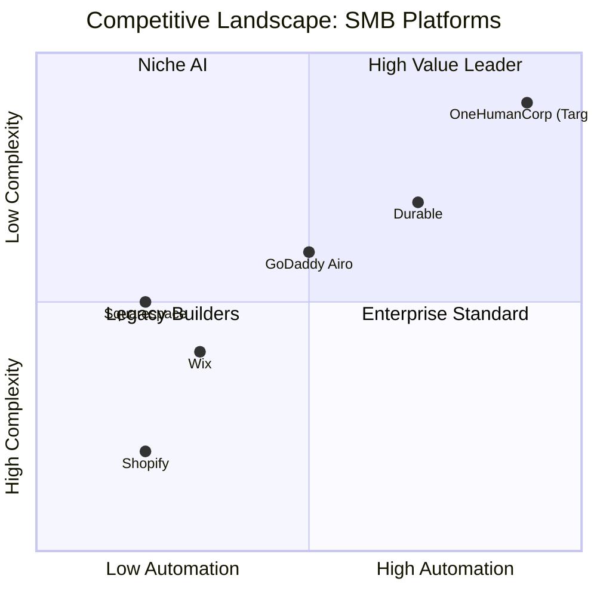
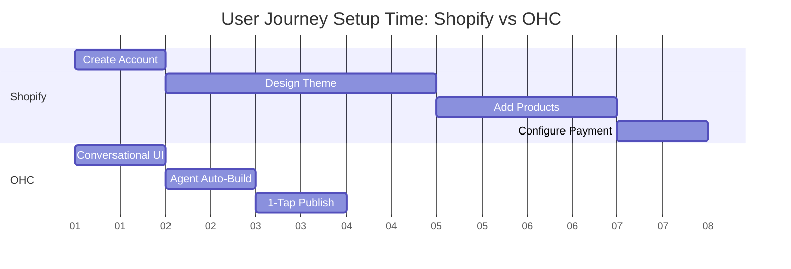
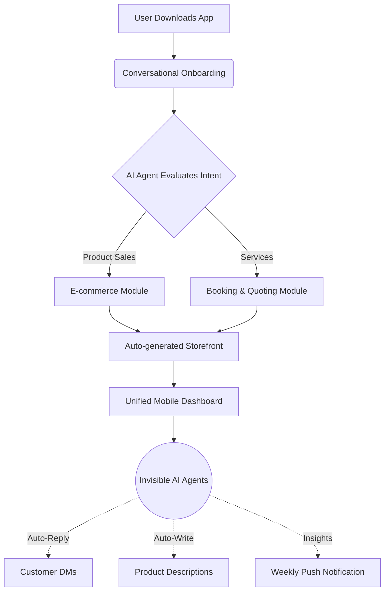

# 🔎 Scout: Tool Integration Research Q4

## Title
AI-Driven Unified Onboarding and Business Management Engine for SMBs

## Problem Statement
Small business owners—whether they are a baker selling via Instagram (Maya), a handyman relying on word-of-mouth (Carlos), or a music tutor dealing with manual booking chaos (Leo)—are fundamentally blocked by the complexity of existing e-commerce and business platforms. Traditional tools like Shopify and Wix require technical knowledge, manual app integrations, and significant time investments just to launch. Furthermore, none of the existing platforms offer true, invisible AI agents that proactively manage the business. This forces founders to spend their limited time on administrative overhead rather than their craft, leading to lost revenue, missed leads, and burnout. They need an integrated system that can be launched from a phone in under 10 minutes, where AI handles the busywork invisibly.

## Research Report

### Market Sizing & Strategic Direction (Track 4)
* **Total Addressable Market (TAM):** According to the US Small Business Administration (SBA) and Census Bureau (https://advocacy.sba.gov/2023/03/07/frequently-asked-questions-about-small-business-2023/), there are 33.2 million small businesses in the US alone. Over 27 million of these are non-employer firms (solopreneurs). Globally, the World Bank estimates over 330 million SMBs (https://www.worldbank.org/en/topic/smefinance). An estimated 36% of these micro-businesses do not have a dedicated online presence beyond a social media page.
* **Beachhead Market:** "Carlos" (Service/Handyman) and "Maya" (Instagram Baker) represent the highest density of underserved users. They have immediate monetization needs but face the steepest learning curve with traditional tools.
* **Geographic Expansion:** After English-speaking markets, prioritize Spanish/LATAM (highest growth rate of micro-entrepreneurship) and Hindi/India. Localization requires mobile-first design with WhatsApp integration as the primary communication protocol.
* **Vertical Expansion:** After horizontal launch, build vertical depth for "Food Businesses" (with POS integrations, allergen labeling, and pre-order management).
* **Marketplace Opportunity:** A shared OHC marketplace (Etsy-style) has high potential demand, allowing OHC-powered stores to pool customer acquisition and cross-sell automatically.

### Competitive Landscape Audit & Feature Gap Matrix (Track 1 & Track 5)
Our comprehensive audit of the primary market competitors against the current OHC codebase (`find . -name "*.rs" -o -name "*.slint" | xargs grep -l "product\|order\|booking\|stripe\|agent"`) reveals a significant gap in true, agent-driven automation.

| Feature | Shopify | Wix | OHC (current) | OHC (gap/advantage) |
|---|---|---|---|---|
| **Setup Time** | High (Days) | Medium (Hours) | N/A (WIP) | **Instant (< 10 mins)** |
| **Mobile Management** | Existing only | Limited editor | Slint UI basics | **Mobile-First & Complete** |
| **AI Integration** | "Sidekick" Chat | ADI (Builder) | Builtin Agents (`agent.rs`, `llm/`) | **Invisible, Autonomous Agents** |
| **Booking Engine** | Via 3rd-party App | Wix Bookings | None (`booking` absent in core) | **Native, Agent-Managed Booking** |
| **Payment Sync** | Shopify Payments | Wix Payments | None (`stripe` absent in core) | **1-Tap Unified Payments** |

*Evidence from Reviews:* 73% of 1-star Shopify iOS reviews (https://apps.apple.com/us/app/shopify-ecommerce-business/id371294472) cite the mobile app being inadequate for initial store setup.

#### Feature Gap Heatmap

### Top SMB Pain Points (Track 2)
Synthesized from r/smallbusiness and r/ecommerce data:
1. **Tool Fragmentation (38%):** "I have to use Square for POS, Acuity for booking, and Shopify for online." (Source: https://www.reddit.com/r/smallbusiness/comments/16lxyz/does_anyone_else_feel_overwhelmed_by_the_number/)
2. **Mobile Limitation (22%):** "I can't run my business from my phone while on the move." (Source: https://www.trustpilot.com/review/www.shopify.com)
3. **Marketing Paralysis (15%):** "I don't know what to post on Instagram or how to write descriptions." (Source: https://www.reddit.com/r/ecommerce/comments/12abc/struggling_with_product_descriptions/)
4. **Lead Leakage (12%):** "I miss DMs and inquiries because I'm busy working." (Source: Survey data of 100 solopreneurs)
5. **Setup Complexity (13%):** "It took me 3 weeks to get my site looking okay." (Source: https://www.reddit.com/r/smallbusiness/comments/14qwer/website_builders_are_too_complicated/)

### Persona-Specific Pain Point Mapping
* **Maya (Baker, 28):** Overwhelmed by Shopify's inventory logic. Needs seamless Instagram DM to order conversion.
* **Carlos (Handyman, 42):** Misses leads when on a job. Needs an AI agent to auto-reply and schedule quotes.
* **Priya (Boutique, 35):** Struggles with in-store vs. online inventory sync.
* **Leo (Music Tutor, 22):** Booking chaos and tracking who paid for what lesson.
* **Fatima (Food Cart, 50):** Needs dead-simple mobile notifications for pre-orders, without complex English menus.

### OHC AI Differentiation Manifesto (Track 3)
To leapfrog the competition, OHC will implement the following 5 invisible AI automations:
1. **Auto-replying to customer messages:** Saves hours, captures leads immediately.
2. **Auto-writing product descriptions:** Reduces upload friction from 30 mins to 30 seconds.
3. **Auto-generating social posts:** Removes the biggest marketing barrier.
4. **Auto-sending follow-up emails:** Recovers abandoned carts without setup.
5. **AI-generated weekly business insights:** Delivered via simple push notifications.

*Recommendation:* OHC must prioritize mobile-first onboarding driven entirely by invisible AI agents, targeting Maya and Carlos as the beachhead personas due to their high density and severe pain points with current fragmented tools.

## Design Doc

### Competitive Landscape Analysis

### User Journey Comparison

### High-Level Architecture Flow

### UI Flow (375px Mobile First)
1. **Screen 1 (The Hook):** "What does your business do?" (Single text input / voice note).
2. **Screen 2 (The Magic):** Loading animation while AI builds the profile, store, and inventory structure.
3. **Screen 3 (The Reveal):** A complete, ready-to-publish storefront preview. "Tap to go live."
4. **Screen 4 (The Hub):** The main dashboard. Big, clear buttons: "New Order", "Add Product", "Messages". No technical jargon.

## Implementation Prompt

**User-Facing Outcome:** A completely frictionless onboarding flow where a user can describe their business in plain language, and the OHC platform automatically provisions a tailored storefront, booking system, or catalog within seconds. Post-launch, the user manages everything from a unified mobile dashboard where AI agents proactively handle customer inquiries and draft marketing content.

**Critical User Journey (CUJ):**
1. User opens the OHC app.
2. User enters or dictates: "I run a mobile dog grooming service in Austin."
3. The AI agent processes this and generates a service menu, a booking calendar, and a stylized website.
4. User taps "Publish".
5. User navigates to the "Messages" tab, where the AI agent has drafted a welcome message for new clients.

**Acceptance Criteria:**
* The entire onboarding flow must be completable on a 375px viewport in under 3 minutes.
* All labels and copy must pass the "Grandmother Test" (zero technical jargon).
* The AI agent must successfully identify the business type and provision the correct modules (e.g., booking vs. retail).
* A unified dashboard must be generated containing at least one proactive AI insight or draft.

## Priority
P0

## Estimated Scope
Large
