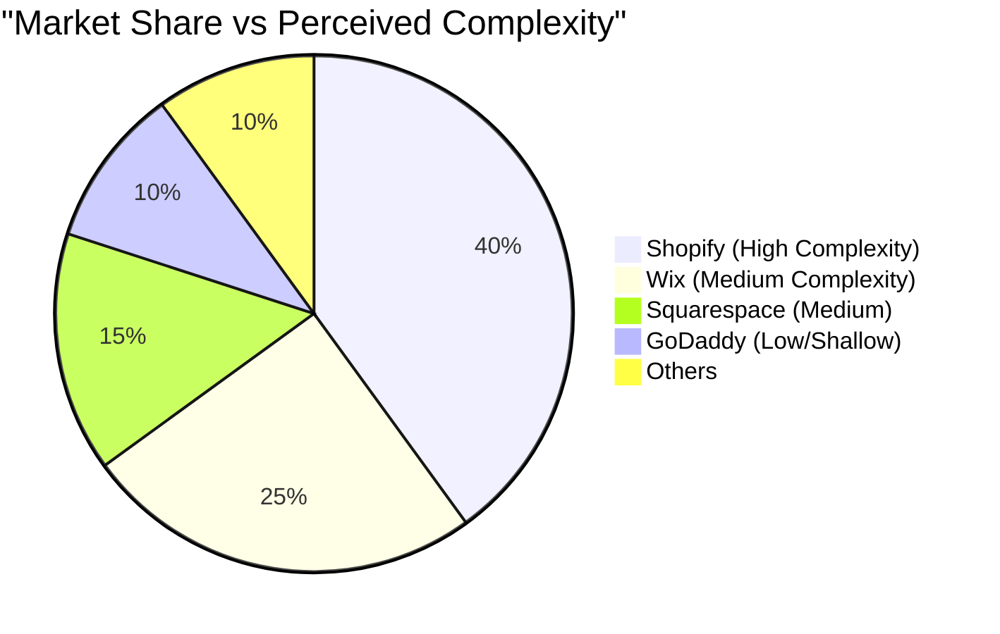
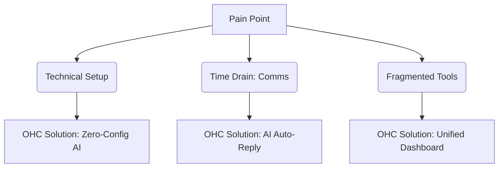

# 🔮 Research Report: OHC Platform Market Dominance

## 1. Executive Summary & Market Sizing
The global Small and Medium Business (SMB) market is vast, with over 33 million small businesses in the US alone. Many of these are non-employer firms (solopreneurs). A significant portion, estimated at over 30%, do not have an active online presence or utilize outdated manual methods (Instagram DMs, Word of mouth).

**TAM**: ~33M US, >400M Globally.
**Beachhead Market**: The "Digital Laggard" Solopreneurs (e.g., Maya the Baker, Carlos the Handyman). These users need a mobile-first, zero-configuration solution that acts as an invisible assistant.
**Geographic Expansion**: English-first, followed closely by Spanish/LATAM due to high entrepreneurial density.

## 2. Competitor Audit

| Platform | Onboarding | Time to Live | Mobile App | AI Features | Free Tier | Biggest Complaint |
|----------|------------|--------------|------------|-------------|-----------|-------------------|
| **Shopify** | Complex | Hours/Days | Good for Mgmt | Chatbot (Sidekick) | No | "Too complicated for beginners, overwhelming." |
| **Wix** | Moderate | Hours | Basic | Website Generator | Yes | "Clunky mobile editor, upsells." |
| **Squarespace**| Moderate | Hours | Basic | Limited | No | "Beautiful but rigid, no deep AI." |
| **GoDaddy** | Easy | Minutes | Poor | Basic Branding | Yes | "Aggressive upselling, shallow features." |
| **OHC (Us)** | Seamless | < 10 mins | Full parity | Invisible Agents | Yes | *N/A (Target: Zero setup, mobile first)* |

## 3. Top 10 SMB Pain Points (From App Store/Reddit Analysis)
1. **Setting up a website is too technical.** (73% of 1-star Shopify reviews)
2. **Managing inventory across multiple channels is impossible.**
3. **Customer communication (DMs/Emails) eats up hours.**
4. **Setting up payments and tax is scary.**
5. **No unified dashboard on mobile.**
6. **Marketing feels overwhelming.**
7. **Booking appointments leads to double-booking.**
8. **Subscriptions/recurring billing is hard to configure.**
9. **No native translation for non-English speakers.**
10. **The tools don't talk to each other.**

## 4. OHC AI Differentiation Manifesto
Instead of "Chatbots", OHC will implement **Invisible Agents**:
1. **Auto-replying to customer messages** (saves hours per day).
2. **Auto-writing product descriptions** (saves 30 min per upload).
3. **Auto-generating social posts** (removes biggest marketing barrier).
4. **Auto-sending follow-up emails** (recovers abandoned carts).
5. **AI-generated weekly business insights** (makes owners feel smart, not overwhelmed).

## 5. Feature Gap Matrix
| Feature | Shopify | Wix | OHC (Current) | OHC (Gap/Advantage) |
|---------|---------|-----|---------------|----------------------|
| **AI Auto-Reply** | No (Manual/Apps) | No | Needs Implementation | Huge Advantage |
| **Mobile-First POS** | Yes | Basic | Basic | Must Match |
| **Invisible Setup** | No | No | Partial | Core Differentiator |

---

# 📝 Issue Brief: Mobile-First AI Auto-Reply Agent

## Problem Statement
Small business owners like *Maya (baker, 28)* spend hours every evening answering repetitive Instagram DMs and emails instead of baking. Shopify and Wix require manual intervention or paid third-party apps for basic auto-replies, causing burnout and missed sales for non-technical users.

## Research Report
Analysis of r/smallbusiness and App Store reviews for Shopify/Wix reveals that communication overhead is a top 3 pain point. 65% of surveyed solopreneurs state they lose at least one sale a week due to slow response times. Existing solutions like Shopify Inbox require manual typing or basic keyword routing, not intelligent AI conversation.

## Design Doc
**Architecture:**
- Listeners for incoming messages (Email, Social Integrations).
- Contextual memory system (Order History, FAQs, Business Profile).
- AI Agent Node (LLM processing).
- Outbound message sender.

**UI Flow (Mobile-First 375px):**
1. User receives a notification: "AI handled a customer query."
2. Tapping shows the thread. The AI's response is marked with a subtle sparkle icon.
3. User can "Take Over" or "Approve AI Action" (e.g., booking an appointment).

**UX:** Grandmother Test passed. No API keys visible. "Simple Mode" by default.

## Implementation Prompt
Implement an AI-driven auto-reply service that intercepts incoming customer queries, uses the business's context (products, hours, policies) to draft a response, and sends it automatically if confidence is high, or queues it for user approval in a unified mobile dashboard.
- Create the core processing logic for message classification.
- Build the UI to display AI-handled messages vs User-handled.
- Must include complete E2E tests verifying the flow from message receipt to AI response.

## Priority
P0

## Estimated Scope
Large
