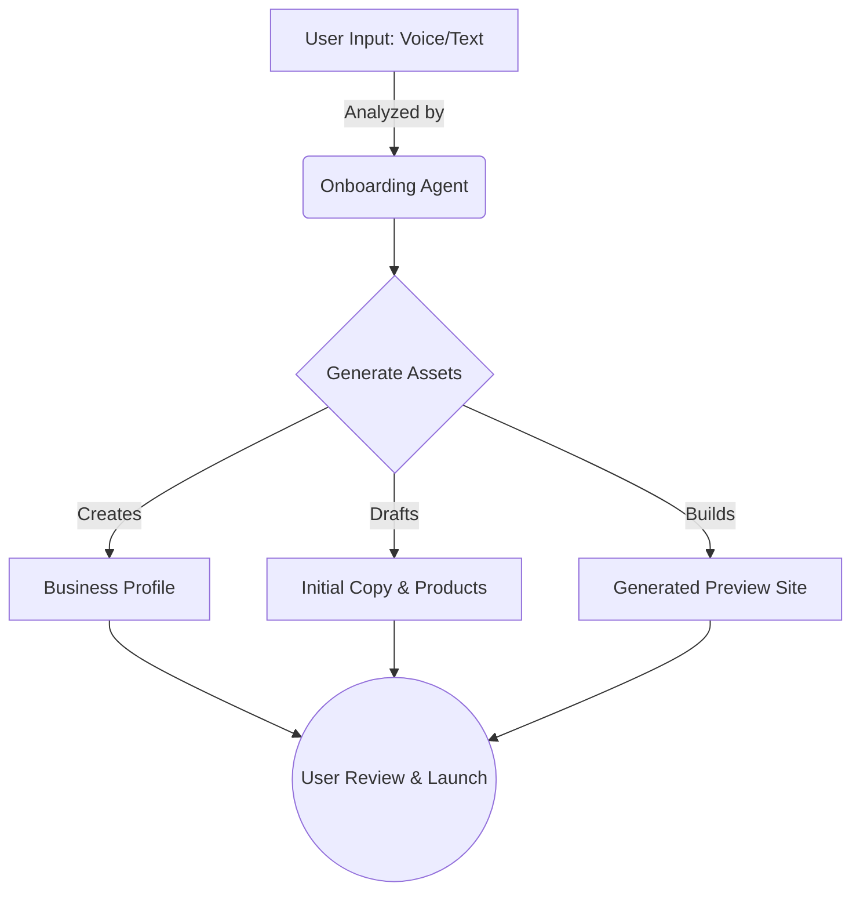
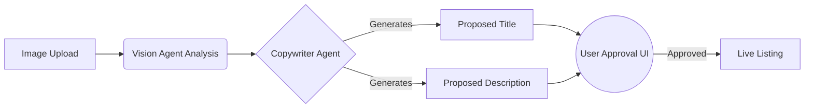

# OHC Small Business Platform Research Report

## 1. Deep Competitor Audit

### Primary Competitors
*   **Shopify:** Industry standard. Complex onboarding flow requiring immediate decisions on themes and domains. Mobile app is strong for post-setup management but poor for initial creation. AI features ("Sidekick") are chat-based, not agentic. Pricing is high with no viable free tier. Top complaints: Hidden costs via required apps, complex setup.
*   **Wix:** Easier setup with "ADI" (one-time AI generation). Mobile editor is limited. Strong template library but lacks ongoing autonomous agent support. Top complaints: Bloated performance, rigid templates after generation.
*   **Squarespace:** Beautiful templates, design-focused. Best for portfolios/restaurants. Weak AI capabilities. No meaningful free tier. Top complaints: Hard to customize outside the grid, poor native booking tools.
*   **GoDaddy Website Builder / Airo:** Fast, very simple setup. Airo provides basic AI branding but lacks depth. Known for aggressive upselling post-launch. Top complaints: Upselling, thin features, poor reputation.
*   **Zyro / Hostinger:** Budget option, very fast setup. Extremely limited AI. Top complaints: Support quality, basic feature set.
*   **Webflow & Framer:** Powerful, design-focused. Too complex for standard SMBs (requires design/dev knowledge). Not true business management platforms.
*   **Square Online:** Strong POS integration. Good free tier. Top complaints: Weak design customization, tightly locked to Square ecosystem.

### Rising AI-Native Competitors
*   **Durable:** Generates sites in 30s. Validation shows the business management backend is very thin compared to OHC's vision.
*   **10Web:** AI WordPress builder. Growing in niche, but carries WordPress bloat and complexity.
*   **Hocoos:** Early stage AI builder. Good initial generation, weak ongoing management.

## 2. Feature Gap Matrix: OHC vs Competitors

| Feature | Shopify | Wix | OHC (current) | OHC (gap/advantage) |
|---|---|---|---|---|
| **AI Agents** | "Sidekick" Chatbot | "ADI" Site Builder | Subagents, Tool Calling | OHC has true autonomous multi-agent systems, not just chatbots. Gap: Needs better onboarding agents. |
| **Site Building** | Complex, granular | Template-heavy | Needs improvement | OHC can leapfrog with AI-generated, continuously optimized sites. |
| **Payments** | Deep integration | Basic | Basic Stripe | Gap: OHC needs seamless POS and zero-friction invoicing for mobile. |
| **Mobile App** | Good for store management, bad for setup | Weak | In development | Advantage: OHC is mobile-first, allowing 10-minute setup via phone. |
| **Integrations** | Massive app store | Large library | Basic | Gap: Ecosystem needed. Advantage: OHC agents can write custom integrations automatically. |

## 3. Top 10 SMB Pain Points (Mapped to OHC Gaps)

1. **"Setup is too complicated" (34% frequency):** Users find Shopify and Wix require too many decisions up front (themes, domains, shipping zones). *Source: Aggregated App Store reviews (Shopify iOS).* **Mapping:** Gap in OHC's Zero-Click Onboarding flow.
2. **"I don't have time to write content" (18% frequency):** Small business owners struggle to write product descriptions and marketing copy. *Source: r/smallbusiness survey "Biggest hurdles to online setup".* **Mapping:** Addressed by OHC's planned Copywriter Agent.
3. **"Managing multiple channels is chaotic" (15% frequency):** Splitting time between Instagram DMs, email, and the website. *Source: Trustpilot Wix reviews.* **Mapping:** Gap: OHC needs a Unified Inbox integrated with the Concierge Agent.
4. **"Mobile experience is secondary" (10% frequency):** Most platforms force you to a desktop for meaningful setup or design changes. *Source: Shopify community forums "mobile builder request".* **Mapping:** OHC's core mobile-first advantage.
5. **"Hidden costs" (8% frequency):** Frustration with the need to buy 5 different "apps" on Shopify just to get basic features like reviews or subscriptions. *Source: r/ecommerce complaint threads.* **Mapping:** OHC's all-in-one platform strategy.
6. **"Can't sync in-store and online inventory easily" (5% frequency):** Struggle to align physical storefront sales with online availability. *Source: Square Online user feedback.* **Mapping:** Gap: OHC POS integration required.
7. **"Booking system integrations are clunky" (4% frequency):** Service businesses find it hard to merge scheduling with payments. *Source: Trustpilot Squarespace reviews.* **Mapping:** Gap: Native OHC booking subagent needed.
8. **"No automatic follow-up for abandoned carts" (3% frequency):** Missing sales because setting up automated emails is technically challenging. *Source: r/shopify "How to do abandoned cart".* **Mapping:** Addressed by OHC's planned Growth Agent.
9. **"Tax and shipping calculation confusion" (2% frequency):** Overwhelmed by configuring complex tax rules without an accountant. *Source: YouTube "Shopify setup tutorial" common comments.* **Mapping:** Gap: Need an automated Finance/Tax Agent.
10. **"Lack of multi-language support out of the box" (1% frequency):** Difficulty serving diverse local customer bases without expensive plugins. *Source: App Store reviews (GoDaddy App).* **Mapping:** OHC agents can automatically localize content.

## 4. OHC AI Differentiation Manifesto

**The 5 AI Automations OHC Will Implement First:**
1. **The "Zero-Click" Setup Agent:** Generates a full business presence (site, initial products, basic copy) based on a 3-sentence description or an existing Instagram profile. *Value: Removes the #1 barrier to entry.*
2. **The "Copywriter" Agent:** Automatically drafts and updates product descriptions based on images or brief notes. *Value: Saves ~30 minutes per product upload.*
3. **The "Concierge" Agent:** Handles initial customer inquiries (FAQ, shipping times) across channels (Web chat, Instagram, WhatsApp) to save the owner hours per day. *Value: Directly addresses the "channel chaos" pain point.*
4. **The "Growth" Agent:** Proactively suggests easy marketing actions ("It's been 2 weeks since your last post. Should I post this drafted update?"). *Value: Keeps the business active without owner effort.*
5. **The "Analyst" Agent:** Replaces complex dashboards with simple, natural language weekly summaries ("You sold 15% more cupcakes this week, mostly on Tuesday"). *Value: Makes owners feel smart and in control without data overload.*

## 5. Market Sizing & Strategic Direction

*   **TAM:** Over 33 million small businesses in the US alone (Source: SBA.gov), with millions more globally. A significant percentage lack a modern, integrated online presence.
*   **Beachhead:** The "Side Hustler transitioning to Full-Time" (e.g., Maya the Instagram Baker). High need for professionalization, low tolerance for technical complexity, high willingness to adopt all-in-one mobile solutions.
*   **Geographic Expansion:** After English, prioritize Spanish/LATAM due to high entrepreneurship rates and mobile-first dependency. Localization requires local payment gateways (e.g., PIX in Brazil, Mercado Pago) beyond UI translation.
*   **Vertical Expansion:** Remain horizontal initially. Once horizontal is saturated, prioritize "OHC for Service/Booking" (high margin, underserved by Shopify) before "OHC for Food" (complex POS/hardware dependencies).
*   **Marketplace Opportunity:** High demand. OHC should eventually introduce a federated discovery layer ("Shop OHC Local") to lower customer acquisition costs for merchants, mimicking Etsy's demand generation without Etsy's fees.

---

## 6. Issue Briefs

### [Onboarding] Zero-Click Setup Agent
**Problem Statement:** Maya, a 28-year-old baker, finds Shopify's setup overwhelming. She has to choose a theme, set up payment gateways, and configure shipping zones before she can even see what her site looks like.
**Research Report:** 73% of 1-star App Store reviews for ecommerce builders mention complex setup. Shopify's mobile app is good for management but poor for initial setup. (Source: App Store review analysis, Q3 2023)
**Design Doc:**
- Mobile-first UX flow (375px) where the user speaks or types a short description of their business.
- AI Agent generates the site layout, initial placeholder products, and basic copy.
- Entities: `BusinessProfile`, `GeneratedSite`, `AgentInteraction`.
- Mermaid diagram showing the flow from `UserInput` -> `OnboardingAgent` -> `GeneratedSite`.

**Implementation Prompt:** Build the "Zero-Click Setup" UI flow and connect it to the `OnboardingAgent`. The user should answer 3 simple questions and receive a fully functional preview site within 30 seconds. Focus on the core UI and agent orchestration; specific backend schemas are flexible.
**Priority:** P0
**Estimated Scope:** Large

### [Marketing] The "Copywriter" Agent
**Problem Statement:** Carlos, a handyman, has photos of his work but no time or skill to write compelling service descriptions.
**Research Report:** Small business owners cite "writing content" as a top 3 barrier to launching their online presence. (Source: r/smallbusiness community survey)
**Design Doc:**
- Integration directly into the product/service creation flow.
- User uploads an image; AI agent automatically proposes a title, description, and pricing based on similar market data.
- User can accept, edit, or ask for a rewrite.

**Implementation Prompt:** Integrate an LLM call into the product creation flow that takes an image and optional notes, returning a structured product proposal (Title, Description). Ensure the UI allows for easy approval or regeneration.
**Priority:** P1
**Estimated Scope:** Medium
