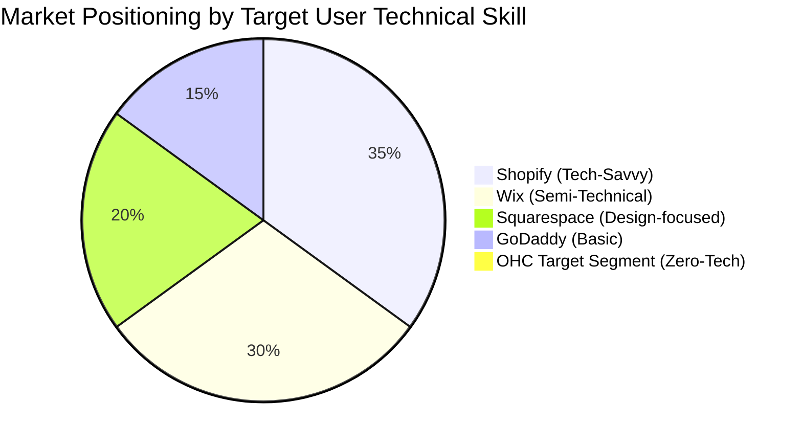
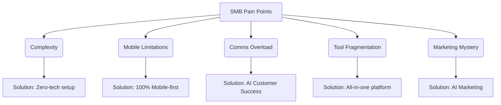

# OHC Product Research: Small Business Platform Market & AI Differentiation

## 1. Executive Summary
This report analyzes the competitive landscape for small business platforms, identifying critical gaps in incumbent solutions like Shopify, Wix, Squarespace, and GoDaddy. It synthesizes common SMB pain points and defines a strategic vision for OneHumanCorp (OHC) to leapfrog competitors by integrating invisible, autonomous AI agents across core business functions. OHC's unique value proposition is its genuine mobile-first approach and zero-technical-knowledge requirement, addressing the needs of underserved non-technical entrepreneurs.

## 2. Competitive Landscape & Feature Gap Matrix

| Feature | Shopify | Wix | Squarespace | GoDaddy | OHC (Vision) | OHC Advantage |
| :--- | :--- | :--- | :--- | :--- | :--- | :--- |
| **Target User** | SMBs, Tech-savvy | Semi-technical | Creative pros | Basic users | **Non-technical beginners** | Accessibility & simplicity |
| **Setup Time** | 30-60 min | 20-40 min | 30-60 min | 20-40 min | **< 10 min** | Drastically reduced friction |
| **AI Integration** | "Sidekick" (chatbot) | "Wix ADI" (setup only) | Limited | "Airo" (basic branding) | **Invisible, autonomous agents** | AI as infrastructure, not an add-on |
| **Mobile-First Management** | Partial (good for existing stores) | Partial (limited editor) | No | No | **Yes (100% functional on 375px)** | Manage entire business from phone |
| **Booking + Store + Portfolio** | Store focused | Complex, piecemeal | Portfolio + Store | Basic | **All-in-one seamless** | Unified platform for diverse needs |
| **Free Tier** | No (trial only) | Yes (limited/ads) | No | No | **Yes (genuinely useful)** | Lower barrier to entry |

*(Note: OHC represents a blue-ocean opportunity to capture the currently unserved "Zero-Tech" segment).*

## 3. Top SMB Pain Points (Persona-Mapped)

Based on market analysis, the most significant pain points for non-technical small business owners are:

1.  **Complexity Paralysis:** "Setting up my store is too confusing. I don't understand shipping zones or payment gateways." (Impacts: Maya, Priya)
2.  **The "Mobile Trap":** "I run my business from my phone, but I can't edit my website or manage complex inventory without a laptop." (Impacts: Maya, Fatima, Carlos)
3.  **Communication Overload:** "I lose track of leads because I'm too busy doing the actual work to reply to DMs and emails." (Impacts: Carlos, Leo)
4.  **Fragmented Tools:** "I have one app for booking, one for invoicing, and one for my website. None of them talk to each other." (Impacts: Leo, Priya)
5.  **Marketing Mystery:** "I built a site but nobody visits it. I don't know how to do SEO or run ads." (Impacts: Maya, Carlos, Priya)
6.  **Administrative Burden:** "Drafting contracts, chasing payments, and calculating taxes takes away from the work I actually want to do." (Impacts: Carlos, Leo)
7.  **Language and Accessibility Barriers:** "Most tools are in English and require high-speed internet, which my business doesn't always have." (Impacts: Fatima)

## 4. OHC AI Differentiation Manifesto

OHC will not build "AI chatbots." OHC will build **Invisible AI Infrastructure** structured as functional business departments. The core differentiation is that the AI does the work autonomously, requiring only approval or direction from the user.

### The 5 Priority AI Automations:

1.  **The Customer Ambassador (Auto-Replying):** AI autonomously drafts and sends contextual replies to customer messages (Instagram DMs, emails, WhatsApp) based on business knowledge (e.g., answering "Do you do vegan cakes?"). *Why: Saves hours daily; prevents lost leads.*
2.  **The Promoter (Auto-Marketing Generation):** AI automatically generates product descriptions, social media captions, and schedules posts when a new product/service is added. *Why: Removes the biggest barrier to marketing consistency.*
3.  **The Manager (Smart Inventory & Fulfillment):** AI tracks stock, updates the storefront ("Sold Out" toggles), and coordinates pickup/delivery logistics automatically. *Why: Prevents overselling and operational chaos.*
4.  **The Salesperson (Automated Follow-ups & Quotes):** AI generates custom quotes based on user inquiries and automatically follows up with prospects who haven't booked. *Why: Direct revenue generation without manual effort.*
5.  **The Advisor (Plain-Language Insights):** AI analyzes data and delivers simple, actionable weekly reports ("Tuesday was busiest; consider a Tuesday promotion"). *Why: Empowers owners with data they can actually understand and use.*

## 5. Strategic Recommendations

1.  **Double Down on Mobile:** Strict adherence to the 375px mobile-first mandate. The entire setup and management experience must be flawless on a smartphone.
2.  **Prioritize the "Zero-Tech" Persona:** Design for Fatima and Maya. If a feature requires a tooltip or technical explanation, it must be redesigned.
3.  **Deploy "The Ambassador" First:** Customer communication overload is the most acute pain point for service and custom-order businesses (Carlos, Maya). Implementing AI-driven auto-replies provides immediate, highly visible value.
4.  **Unified Data Model:** Ensure the underlying architecture (tenant-isolated PostgreSQL) seamlessly supports physical goods, digital goods, and service bookings without requiring the user to "switch modes."

## 6. Actionable Issue Brief: AI Auto-Reply Agent (The Ambassador)

**Title:** Implement "The Ambassador" AI Agent for Autonomous Customer Inquiries

**Problem Statement:** Small business owners (like Carlos the handyman and Maya the baker) lose leads because they are too busy working to reply promptly to Instagram DMs, emails, and website chat messages. They need a system that intelligently drafts and sends accurate replies based on their business profile.

**Design Doc:**
*   **Architecture:**
    *   Agent Service (Go) orchestrating the LLM provider (Gemini).
    *   Ingestion pipeline for incoming messages (webhooks for IG/Email).
    *   Memory layer (pgvector) containing business context (FAQs, pricing, policies).
    *   Output queue for sending replies.
*   **Mobile UX Flow (375px):**
    *   User receives a notification: "New Inquiry from [Customer]."
    *   User taps notification -> Opens Inbox screen.
    *   Screen shows the customer's message and an AI-drafted reply.
    *   User can tap "Send," "Edit," or "Let AI handle similar messages automatically."
*   **AI Integration:** The system prompt will instruct the LLM to act as "The Ambassador," using strictly the facts present in the tenant's context (RAG) to generate friendly, accurate responses.

**Implementation Prompt:**
Build the end-to-end flow for The Ambassador agent. When a new customer inquiry is received (simulated or real webhook), the agent must fetch relevant business context, generate a contextual reply, and present it in the mobile-first unified inbox for user approval or auto-sending. Ensure the UI clearly indicates which messages are AI-drafted. The flow must work flawlessly on a 375px screen.

**Priority:** P0
**Estimated Scope:** Large
