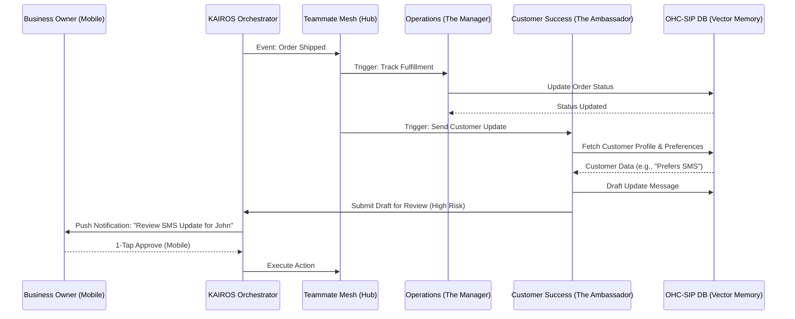

# [architecture] AI Agent Department Architecture

## Problem Statement
Small business owners—whether a baker like Maya, a handyman like Carlos, or a food cart operator like Fatima—are overwhelmed by the operational complexity of running a business. They lack the time, technical skills, and resources to build and manage automated workflows for marketing, sales, customer success, and operations. Currently, they are forced to either pay expensive agencies or manually string together disconnected tools (e.g., Shopify, Mailchimp, Calendly). They need a unified platform where AI agents act as an invisible, intelligent workforce, taking over these functional departments and operating them autonomously, yet transparently, with simple 1-tap mobile approvals.

## Research Report
### Current Market Landscape
- **Shopify & Wix**: Provide basic rule-based automations (e.g., "abandoned cart emails") but require the user to configure triggers, write the email copy, and test the flows.
- **GoDaddy**: Offers simple website generation but lacks deep operational integrations or proactive agentic workflows.
- **Standalone AI Agents (e.g., AutoGPT, Replit Agent)**: Too technical for non-developers. They require complex prompting, lack business-specific context, and do not integrate out-of-the-box with a unified business data model.

### OHC Advantage
OHC reimagines the business software stack by embedding AI directly into the data layer. Instead of a business owner "using an AI tool," the AI operates functional departments (Operations, Sales, Customer Success, etc.) that monitor the central `OHC-SIP DB` memory.

### User Research & Insights
1. **The "Grandmother Test"**: Users abandon flows if they take more than 30 seconds to understand. Approvals must be binary (Approve / Reject) with plain language summaries.
2. **Context is King**: Maya needs the AI to know that a specific customer always asks for vegan options, without her explicitly telling it every time.
3. **Control vs. Autonomy**: High-risk actions (e.g., sending an email, issuing a refund) must use a "Draft-for-Review" model, while low-risk tasks (e.g., updating internal tags) can "Auto-Execute."

## Design Doc

### Architecture Diagram

### UI Wireframes & Mobile UX Flow
**Target Breakpoint**: 375px (Mobile First)

1. **The Briefing Screen (Home)**
   - **Header**: "Good Morning, Maya. Here's what your team did while you slept."
   - **Feed**: Glassmorphism cards showing recent agent actions.
     - *Card 1*: "The Ambassador replied to 3 Instagram DMs." (Auto-Execute)
     - *Card 2*: "The Promoter drafted a new Instagram post for Vegan Cakes. [Review]" (Draft-for-Review)

2. **The 1-Tap Approval Modal**
   - **Trigger**: Tapping "Review" on Card 2.
   - **Content**: A preview of the Instagram post image and caption.
   - **Actions**: Large, easy-to-tap buttons: `Approve & Publish` (Primary, green) | `Reject` (Secondary, outlined) | `Edit` (Tertiary text link).

### AI Agent Integration Points
- **Event Mesh Triggers**: Agents subscribe to `tenant.*` domain events via the Teammate Mesh (e.g., `tenant.order.created`, `tenant.inventory.low`).
- **Memory Ingestion**: All interactions, orders, and messages are continuously embedded into `autodream_memories` via `pgvector` for RAG capabilities.
- **Approval Queue**: High-risk actions generate an `ApprovalTask` record in the OHC-SIP DB, surfacing immediately on the mobile dashboard.

### Key Design Decisions
1. **Departmental Personas**: Organizing agents into relatable departments ("The Manager", "The Ambassador") reduces cognitive load. Users don't manage "LLMs"; they manage a "team."
2. **Draft-for-Review as Default**: To build trust, all external communications default to requiring a 1-tap approval until the user explicitly grants full autonomy.
3. **Mobile-First Approvals**: The approval queue is optimized for quick, binary decisions on a smartphone, catering to owners who run their business on the go.

## Implementation Prompt
Implement the "Draft-for-Review" approval engine in the KAIROS Orchestrator.

**User-Facing Outcome:** When an AI agent (e.g., Customer Success) attempts a high-risk action like sending an email or issuing a refund, the action must be paused and placed into an approval queue. The business owner must see a notification on their mobile dashboard summarizing the proposed action in plain language, with "Approve" or "Reject" buttons.

**Acceptance Criteria:**
1. The orchestrator intercepts actions flagged with `ActionRisk::High`.
2. A pending approval task is created in the database, viewable via the dashboard API.
3. The dashboard UI (375px mobile-first) displays the pending action clearly.
4. Approving the task executes the action; rejecting it dismisses it and provides feedback to the agent's memory.
5. All data access must be strictly scoped by `tenant_id`.

## Priority
P0

## Estimated Scope
Medium
